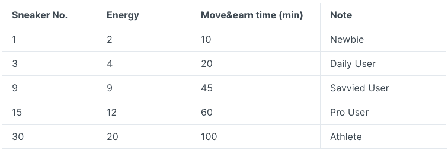

# 如何在移动赚取平台 STEPN 上获取加密

> 原文：<https://web.archive.org/web/https://dappradar.com/blog/how-to-get-crypto-on-move-to-earn-platform-stepn>

## 从来没有比这更好的时机将健康和赚钱结合起来了

通过锻炼和保持健康来赚取加密货币是 move-to-earn 和 STEPN 背后的新概念。STEPN 是一款结合了区块链技术和 GPS 追踪的应用程序，可以用真金白银奖励社区成员进入真实世界健身。

**总结**

*   [***STEPN***](https://web.archive.org/web/20220929111809/https://dappradar.com/multichain/social/stepn)***免费下载，易于上手。游戏中的 NFT 运动鞋并不便宜，新用户应该做彻底的研究，决定哪种最适合自己。***
*   ***赚取*** [***代币***](https://web.archive.org/web/20220929111809/https://dappradar.com/hub/tokens/ethereum/all/1) ***在 STEPN 上移动赚取很简单，已经有一个健康的二级市场，用户在那里交易底价为 12.29***[***SOL***](https://web.archive.org/web/20220929111809/https://dappradar.com/rankings/protocol/solana)***的运动鞋。***
*   移动挣钱是一个在 2022 年变得突出的想法。但是许多公司已经开发这项技术有一段时间了。STEPN 和 Genopets 都始于 2021 年 8 月。

STEPN 是移动挣钱革命的旗舰平台，建立在索拉纳和币安智能连锁店区块链之上。这个游戏鼓励人们从电脑前站起来，走进现实世界。通过锻炼和变得健康，人们可以赚取代币和真钱。

## 如何使用 STEPN

每个人都需要遵循几个基本步骤来设置 STEPN。

*   **下载 STEPN 应用**——可在苹果应用商店和 Google Play 上下载。它也是免费下载的，你甚至不需要拥有运动鞋 NFTs 就可以开始赚钱(稍后将详细介绍)。

*   **用你的电子邮件地址**注册——这部分可能有点棘手。你需要加入 STEPN Discord 服务器或 Telegram 来获得一个其他用户生成并发布到群组中的八位数代码。但是你需要快一点:密码只能使用一次，如果你磨蹭的话，其他人会先注册。

*   **买双运动鞋，开始行动**——现在你需要花点钱了。您需要将[索尔](https://web.archive.org/web/20220929111809/https://dappradar.com/rankings/protocol/solana)或 [BNB](https://web.archive.org/web/20220929111809/https://dappradar.com/hub/tokens/bsc/all/1) 从您的个人钱包转入您的 STEPN 消费账户。目前 STEPN 本地市场上最便宜的运动鞋售价为 12.29 索尔(撰写本文时为 872.47 美元)。这并不便宜，但随着加密价格的变化，等待几天购买一些 SOL 并以较低的价格进入游戏可能是值得的。

STEPN 将很快提供一个租赁系统，使新用户无需支付超过 850 美元就可以开始参与。租赁者将是免费的，但运动鞋的所有者将获得 70%的奖励，而租赁者将获得 30%。

## 如何在 STEPN 中赢取代币

使用 STEPN 赚钱很简单:在现实世界中移动，在应用程序上记录你的锻炼，并为此获得代币。活动结束后，这些代币将进入您的钱包，您可以用它们兑换现实世界的现金。平台中有不同的游戏模式，每种模式都提供不同的挑战:

*   **单人模式**–四处走动赚取代币。简单。
*   **马拉松模式**——进入每周和每月的比赛。你需要在每场比赛开始前 24 小时登记。
*   **后台模式**–关闭应用程序，让钱积累起来。只要你有一个计步设备来记录你的步数，你就可以将这些信息上传到 STEPN，你将获得代币奖励。

## 代币和运动鞋

用户在 STEPN 中完成练习挑战后将获得绿色 Satoshi 代币(GST)奖励。为了提供初始流动性，铸造了 6000 万英镑。但是，为了保持稳定的价格水平，当用户执行以下操作时，GST 将被消耗:

*   运动鞋铸造
*   运动鞋修理
*   调平运动鞋
*   宝石升级
*   解锁插座

绿色元宇宙令牌(GMT)是 STEPN 的治理令牌。一旦用户的运动鞋达到 30 级，并且他们的能量水平至少为 3，他们就可以使用 GMT。

在 STEPN 生态系统中，有一个内置于游戏中的时间门控机制，一旦玩家的能量降至零，它就会阻止玩家赚取更多的令牌。用户可以继续赚取商品及服务税，直到他们没有能源，但 GMT 奖励上限较高。

能量以每六小时 25%的速度恢复，用户可以随着持有更多运动鞋而增加最大能量。这是计算结果:

Energy allowance in STEPN

通过球鞋效率和更高的能量津贴体系，拥有更好的球鞋能让球员赚更多的钱。用户的移动速度也增加了他们赚钱的能力。因此，你跑得越快，你得到的钱就越多，这对于一个移动赚钱的健身应用程序来说非常有意义。

更高级的宝石类型和更高级的 NFT 徽章也增加了用户的收入潜力。有了 STEPN，你投入的时间和精力越多，收获就越多。

## 移动赚钱产业和游戏中的其他玩家

自 2022 年初以来，移动赚取越来越受欢迎。这是区块链技术和元宇宙概念的进一步发展，因为它将现实世界和数字世界更紧密地联系在一起。

随着 Web3 社区的不断创新，我们将会看到更多真实世界的行为对虚拟空间产生影响的场景，反之亦然。

尽管移动赚取并不是一个全新的概念，为用户保持活跃提供奖励的平台只是最近才开始引人注目。DappRadar 的文章列出了五大赚钱游戏，如果你想了解更多，这是一个很好的起点。

但是这里有一个简短的分类信息，告诉你如果你想开始通过锻炼赚钱，你应该注意的一些名字:

*   [**geno pets**](https://web.archive.org/web/20220929111809/https://dappradar.com/binance-smart-chain/games/genopets)——NFT 收藏和战斗竞技场游戏，以移动赚取机制为基础。运动越多，你的头像就越强大。化身越强大，你赢得的战斗就越多。
*   **[步应用](https://web.archive.org/web/20220929111809/https://dappradar.com/avalanche/social/step-app)**—[雪崩](https://web.archive.org/web/20220929111809/https://dappradar.com/rankings/protocol/avalanche)区块链上的这个应用允许玩家下注，并在迷你运动比赛中与朋友和陌生人竞争奖金。FITFI 是治理令牌，KCAL 令牌在游戏中使用。点击阅读关于平台[的更长的文章。](https://web.archive.org/web/20220929111809/https://dappradar.com/blog/how-to-get-crypto-with-fitfis-move-to-earn-app)
*   **——这个游戏是 OliveX 的区块链健康和健身生态系统的一部分。参与现实世界的锻炼，看着你的游戏角色变得更加强壮和健康。**

** NewsletterUnsubscribe at any time. [T&Cs](https://web.archive.org/web/20220929111809/https://dappradar.com/terms) and [Privacy Policy](https://web.archive.org/web/20220929111809/https://dappradar.com/privacy-policy)**