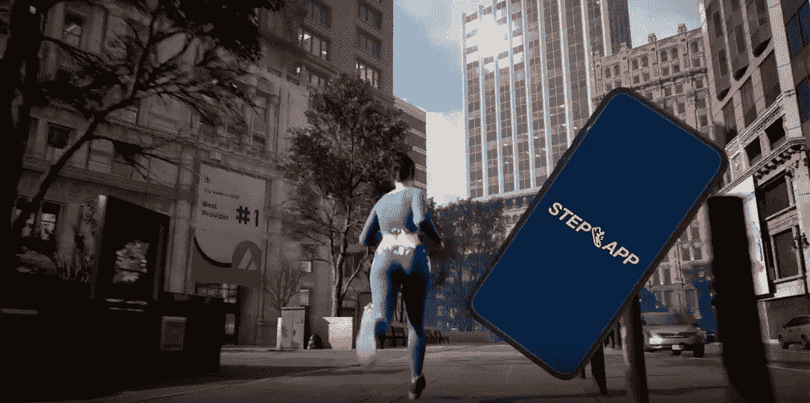

# 如何使用 FitFi 的移动赚取应用程序获得加密

> 原文：<https://web.archive.org/web/https://dappradar.com/blog/how-to-get-crypto-with-fitfis-move-to-earn-app>

## 新玩家将提供丰厚的财务奖励

FitFi 通过其创新的移动赚钱平台，让人们更容易赚钱，同时保持健康。当 Step 应用程序推出时，它将使用户能够适应现实世界，并与更广泛的加密社区接触。对于任何过着匆忙生活的人来说，FitFi 正在帮助他们尽可能多地安排他们的一天。

**总结**

*   ***FitFi 团队 2021 年第四季度才走到一起。但是，经验丰富的区块链专家和退伍军人小组已经有了一个象征性的赌注计划，并将很快推出他们的步骤应用程序。***
*   FitFi 能让你在区块链享受到所有正常的东西，比如社交、种植庄稼、玩耍和赚钱。但它也鼓励人们在现实世界中变得健康。
*   它伴随着一系列其他的移动挣钱平台，如 [STEPN](https://web.archive.org/web/20220930101956/https://dappradar.com/multichain/social/stepn) 、 [Genopets](https://web.archive.org/web/20220930101956/https://dappradar.com/binance-smart-chain/games/genopets) 和 OliveX，这些平台正在彻底改变数字和物理世界的互动方式。

FitFi 及其即将推出的 [Step 应用](https://web.archive.org/web/20220930101956/https://dappradar.com/avalanche/social/step-app)是移动挣钱领域的新玩家。FitFi 作为一个生态系统形成于 2021 年第四季度。从那时起，他们推出了一个有回报的赌注项目，并将很快推出他们在雪崩区块链上的 Step 应用程序。他们的目标是统治元宇宙的健康和健身部门。

## 什么是 FitFi？

FitFi 或健身金融是健康、健身和 web3 的交汇点。它提供了一种人们可以通过锻炼赚钱的方式，激励人们照顾好自己。

仅在美国，健康和健身已经发展成为一个价值 1000 亿美元的产业。随着现代社会越来越意识到久坐不动的生活方式的危险，离开屏幕开始在人行道上行走的动力变得越来越强。

但是也有障碍。人们会变得忙碌，他们会变得疲惫，他们会找借口不去碰他们的跑鞋，而是呆在沙发上。

这就是 FitFi 进入市场的原因。它看到了价值 1000 亿美元的健身产业，并认真思考如何将其与价值 2000 亿美元的游戏产业结合起来。

但是，尽管区块链游戏完全是玩到赚到的，FitFi 正在帮助开拓移动到赚到的领域。用户将获得代币，他们可以通过外出走动来兑换真钱。

Step App 将成为 FitFi 生态系统中的第一款应用，该公司称之为“FitFi 市场的基础”。它将基于币安智能链，允许用户跟踪他们的活动，为他们的锻炼赚取密码，并鼓励人们在现实世界中保持健康。

Still from [Step App trailer](https://web.archive.org/web/20220930101956/https://dayarko.ru/run-run-run.mp4)

## 如何在 FitFi 生态系统中盈利

在 FitFi 的经济中，有一些有趣的特征使其有别于竞争对手。值得注意的是，SNEAKs 是用户需要购买的游戏内 NFTs 运动鞋，才可以开始赚取。

玩家可以通过以下三种方式在“移动赚钱”协议中赚钱:

*   **微交易**——玩家可以使用信用卡或加密货币进行非潜行购买的微支付，如地图风格、角色皮肤和潜行皮肤。
*   **Staked play**–FitFi 计划建立一个社区，让他们互相对战。玩家可以挑战他们的朋友，把他们的钱放在他们的嘴上，并在赢家身上下注。
*   **锦标赛游戏**–FitFi 有地区性和全球性的锦标赛，为那些最终在排行榜上名列前茅的人提供奖金池。参与者还可以赢得其他奖品，如独特的皮肤和地图设计。

## 令牌组学

与区块链领域的所有新市场参与者一样，FitFi 有大量的金钱激励来吸引新用户为社区做出贡献。该公司概述了它将如何保持治理标志 FITFI 的价值，以及人们如何从中赚钱:

1.  **回购**–50%的游戏收入用于在市场上购买代币。
2.  **Burns**–治理可以投票烧掉回购令牌的 50%。
3.  **赌注奖励**–高达 50%的市场购买代币被分配给赌注者。
4.  **锁**–下注的代币需要 10 天的冷却时间才能退出，绕过这个冷却时间需要支付本金的 12%的费用。

在应用程序中，玩家还可以通过下注 FITFI 解锁某些潜行和头像皮肤。他们还可以获得版税折扣，记住高达 50%的 NFT 交易费可以作为赌注奖励。

KCAL 是游戏中的代币，玩家需要它来铸造运动鞋。他们可以在潜行者被标桩时通过跑步来获得，潜行者需要被标桩 10 天才能要求获得 KCAL。

## The Step App 等移动挣钱平台

FitFi 生态系统相对来说是移动赚取领域的新来者。虽然从锻炼中赚钱的概念只是在 2022 年初才变得突出，但有几个更知名的名字在这个领域的发展时间比你想象的要长。

DappRadar 在本文中有更深入的分析，但这里有一个简短的总结，列出了 move-to-earn 中值得关注的最大的名字:

*   [**STEPN**](https://web.archive.org/web/20220930101956/https://dappradar.com/multichain/social/stepn)–STEPN 于 2021 年 8 月启动，自那时起，其社区已运行超过 13，450，000 km。它建立在 BNB 和索拉纳区块链之上，让人们在锻炼的同时也能赚钱。DappRadar 有一篇更长的文章介绍如何开始和 STEPN [一起赚钱。](https://web.archive.org/web/20220930101956/https://dappradar.com/blog/how-to-get-crypto-on-move-to-earn-platform-stepn)
*   **——这款游戏提供了一种不同的移动赚取方式。通过在现实世界中锻炼，你可以提升你的化身。通过升级你的角色，你有更好的机会赢得游戏中的战斗。最近推出的[基因宠物栖息地](https://web.archive.org/web/20220930101956/https://dappradar.com/blog/genopets-habitat-trading-surges-as-solana-minting-period-begins)位于索拉纳区块链。**
*   ****——这个游戏在[多边形区块链](https://web.archive.org/web/20220930101956/https://dappradar.com/rankings/protocol/polygon)上，是更大的 OliveX 生态系统的一部分。OliveX 正在沙盒中建立一个新的互动世界，并提供一个具有社会和健康效益的整体生态系统，同时奖励其贡献者。****

**** NewsletterUnsubscribe at any time. [T&Cs](https://web.archive.org/web/20220930101956/https://dappradar.com/terms) and [Privacy Policy](https://web.archive.org/web/20220930101956/https://dappradar.com/privacy-policy)****