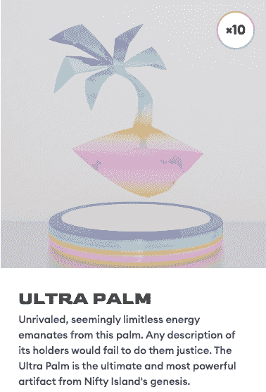
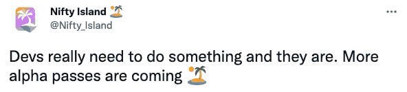

# 如何提前到达 Nifty 岛

> 原文：<https://web.archive.org/web/https://dappradar.com/blog/how-to-get-early-access-for-nifty-island>

## 尽管封闭阿尔法已经活跃，仍然有机会进入新生的元宇宙在其早期阶段

知道如何提前获得 Nifty Island 可能意味着在现场版本发布时平台上已经有了最好的情节。请继续阅读，了解这个由社区为社区创建的新的虚拟世界。并阅读到最后，了解如何尽快加入。

俏皮岛是一个新的元宇宙平台，有着宏伟的计划。开发者将该产品描述为一个提升其社区重要性的游戏世界。他们接着说:

> Nifty Island 是一个开放的社交游戏中心和画廊，围绕 NFTs 和 crypto 构建。用户将能够玩游戏，展示他们的 NFT 收藏，交易 NFT，建立一个社区，并通过玩游戏和向游戏世界贡献内容来获得密码。

尽管上周开始了封闭的 alpha 测试，Nifty Island 的团队已经表示，随着其公开测试版的推出，他们“打算在 alpha 测试过程中向越来越多的 web3 社区开放游戏”。

[https://web.archive.org/web/20230111183944if_/https://www.youtube.com/embed/ab6DFittkG4?feature=oembed](https://web.archive.org/web/20230111183944if_/https://www.youtube.com/embed/ab6DFittkG4?feature=oembed)

## 现在如何进入 Nifty 岛

目前，只有传奇棕榈(游戏中的资产)的持有者和早期支持者和 NFT 收藏家的精选队列，才能参加封闭的阿尔法。因此，购买传说中的棕榈是立即进入尼菲岛的一种方式。你可以花 3.54 ETH(撰写本文时为 9919 美元)买到最便宜的一款——铁掌。

开发团队还在 Twitter 上宣布，更多的 alpha 通行证正在路上。因此，关注 Nifty Island 的 Twitter 页面和 T2 的不和是确保你第一时间了解任何新版本或 alpha 更新的两种方式。

Source: Nifty Island / Twitter

最后，如果你不是有幸在封闭的 alpha 中享受 Nifty Island 的人，那么不要害怕。现在你知道了新的虚拟世界，你可以确保你在那里的测试版发布。他们称这一发展阶段为定居时代。你所需要做的就是关注 Nifty Island 的社交媒体频道，了解如何参与的新闻。当然，请继续关注 DappRadar，获取您所有的元宇宙新闻和分析。

NB。路线图的展示通常不值得评论，但是动画在这一点上得了高分。点击查看[。](https://web.archive.org/web/20230111183944/https://www.niftyisland.com/roadmap)