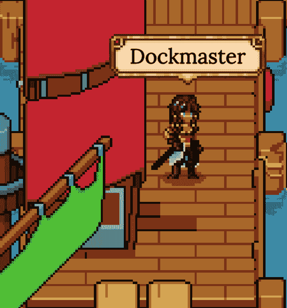
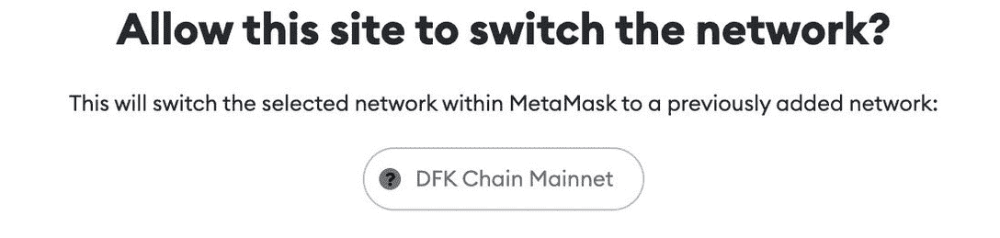
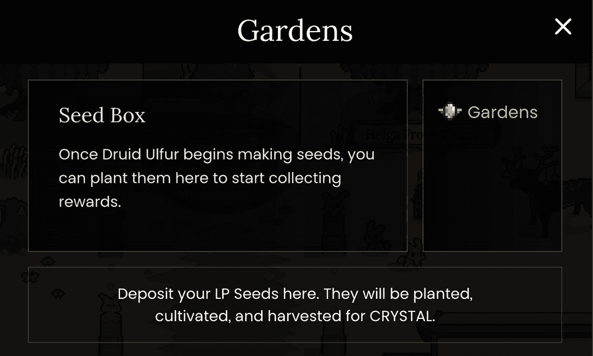

# 如何开始在 DeFi 王国水晶

> 原文：<https://web.archive.org/web/https://dappradar.com/blog/how-to-get-started-in-defi-kingdoms-crystalvale>

## 针对当前和 AVAX 用户以及新玩家的完整指南

领先的 GameFi 项目 DeFi Kingdoms 最初在“和谐区块链”上推出并获得巨大成功，现在已经大获成功。子网技术允许项目划分一组验证器，并委托他们验证额外的区块链。有效地为 DeFi Kingdom 的 Crystalvale 扩展创建了一个独立的网络。

*假设你已经和[德菲王国](https://web.archive.org/web/20221006041149/https://dappradar.com/harmony/games/defi-kingdoms)在和声上有合作，现在需要了解的一件重要事情是如何开始在[德菲王国水晶](https://web.archive.org/web/20221006041149/https://dappradar.com/avalanche/games/defi-kingdoms)上 DFK 链。此外，如果您已经是 AVAX 用户或完全是新手，请了解如何开始。*

## 跳转到相关部分

*   [如何从塞伦代尔到达水晶谷](https://web.archive.org/web/20221006041149/https://dappradar.com/blog/how-to-get-started-in-defi-kingdoms-crystalvale/#How-to-get-from-Serendale-to-Crystalvale)
*   [如果我已经是 AVAX 用户，我该如何开始？](https://web.archive.org/web/20221006041149/https://dappradar.com/blog/how-to-get-started-in-defi-kingdoms-crystalvale/#How-do-I-get-started-if-I-am-already-an-AVAX-user?)
*   [DFK 链新用户入门](https://web.archive.org/web/20221006041149/https://dappradar.com/blog/how-to-get-started-in-defi-kingdoms-crystalvale/#Getting-Started-on-DFK-Chain-for-new-users)

## 如何从塞伦代尔到水晶谷

那些已经在 Harmony 上玩 [DeFi 王国的玩家将会知道，当你需要桥接资产时，码头大师 Maria 是一个可以访问的人，而 Serendale 码头将会主持一个游戏内的 DFK 链桥。DFK 链的汽油费需要珠宝，所以首先你必须过渡一些](https://web.archive.org/web/20221006041149/https://dappradar.com/avalanche/games/defi-kingdoms)[珠宝代币](https://web.archive.org/web/20221006041149/https://www.coingecko.com/en/coins/defi-kingdoms)。有一个协议可以自动将 DFK 链上的宝石换成天然气体令牌晶体。最重要的是，玩家不需要特别的动作来完成交易。

在 3 月 30 日的发行日，唯一可用的激励性流动性池将是 JEWEL / xJEWEL。如果你想入股 CRYSTAL，你还需要在一个单独的交易中桥接 xJEWEL。如果您还没有任何 xJEWEL，或者想要更多，您将首先需要访问珠宝商并存入适当数量的 JEWEL，这将交换 xJEWEL。

请记住，LP 对必须由每个代币的等值组成，因此您可以决定想要下注的珠宝数量，并将该值的 50%存入银行，以获得等值的 xJEWEL。如果您尚未将 xJEWEL token 添加到您的钱包中，并且想要查看您的可用金额，官方 token 地址如下:

**0x a9 ce 83507d 872 C5 e 1273 e 745 ABC FDA 849 DAA 654 f**

确保你有足够的珠宝来和你的 xJEWEL 进行等量配对，同时留下一些作为费用。一旦你连接了你的珠宝和 xJEWEL，点击“前往 Crystalvale”为 DFK 链配置你的钱包。

一旦你连接了资产，你就可以通过码头前往水晶谷。下注资产的过程与在 Serendale 的过程相同。拜访市场上的德鲁伊乌尔夫，将你的宝石和 xJEWEL 配对，然后将它们存放在冰园。

## 如果我已经是 AVAX 用户，该如何开始？

如果你的钱包配置了雪崩，你首先需要去[game.defikingdoms.com](https://web.archive.org/web/20221006041149/http://game.defikingdoms.com/)进入哨站。使用者在前哨站受到雪圣埃利娅的欢迎。你会找到一个和她沟通的桥梁，让你把你的 AVAX 移动到 DFK 链。

前哨站也有一个 DEX，以防你需要交换桥不支持的其他资产，或者交换到 AVAX 或者直接交换到 JEWEL。点击“开始”，Ellia 将指导您完成不同的选项，并帮助您为 DFK 连锁店配置您的钱包。一旦搭桥，玩家将免费获得少量汽油，以使 AVAX 与 JEWEL 的交换能够用于未来的汽油费和 CRYSTAL 的股份。

启动日唯一可用的激励性流动性池将是 JEWEL / xJEWEL。拜访市场上的德鲁伊乌尔夫，将你的宝石和 xJEWEL 配对，然后将它们存放在冰园，开始赚取水晶。

## 新用户开始使用 DFK 链

对于那些新的加密，DeFi 王国和 DFK 链将首先需要去 https://game.defikingdoms.com。您将看到创建比特币基地钱包或元掩码钱包的提示。在这里，你可以找到一个完整的分步指南来设置一个 MetaMask 钱包[这里](/web/20221006041149/https://dappradar.com/blog/explained-how-to-use-metamask-for-exchanging-tokens/)。

成功安装钱包后，您可以选择访问 Serendale 或 Crystalvale。如果您选择进入 Serendale，您的钱包将被配置为 [Harmony 区块链](https://web.archive.org/web/20221006041149/https://dappradar.com/rankings/protocol/harmony)并允许您购买一个。对于那些更渴望进入 Crystalvale 的人，你将被带到前哨站，这样你就可以在雪崩时购买 AVAX [。在前哨站，你会遇到雪之贤者艾莉亚，并找到一座可以让你移动你的 AVAX 到 DFK 链的桥梁。](https://web.archive.org/web/20221006041149/https://dappradar.com/rankings/protocol/avalanche)

这里提供的机会没有区别，所以也许选择你过去已经使用过的网络来平滑这个过程。前哨站也有一个 DEX，以防你需要交换桥不支持的其他资产，或者交换到 AVAX 或者直接交换到 JEWEL。点击“开始”，她将引导您通过不同的选项前往 Crystalvale，并帮助您为 DFK 链配置您的钱包。

一旦搭桥，玩家将免费获得少量汽油，以使 AVAX 与 JEWEL 的交换能够用于未来的汽油费，以及 CRYSTAL 的股份。值得注意的是，启动日唯一可用的激励性流动性池将是 JEWEL / xJEWEL。拜访市场上的德鲁伊乌尔夫，将你的宝石和 xJEWEL 配对，然后将它们存放在冰园，开始赚取水晶。

## 把它包起来

到目前为止，DeFi 王国的成功有几个关键因素。至关重要的是，时机就是一切，这个团队不可能在一个更合适的时间发布这个平台。随着天然气价格飙升，用户开始在其他地方寻找机会，DeFi 王国发现自己处于有利位置。随着雪崩和 DFK 链的进一步扩展，我们希望看到该平台进一步发展，并继续吸引和保留渴望寻找游戏化方式参与 DeFi 的投资者社区。

[<picture></picture>](https://web.archive.org/web/20221006041149/https://dappradar.com/rankings/protocol/harmony)[<picture></picture>](https://web.archive.org/web/20221006041149/https://dappradar.com/harmony/games/defi-kingdoms)[<picture></picture>](https://web.archive.org/web/20221006041149/https://dappradar.com/blog/tag/harmony)

***以上不构成投资建议。此处给出的信息仅供参考。请行使尽职调查，做你的研究。作者持有多种加密货币的头寸，包括 BTC、瑞士法郎和雷达。***