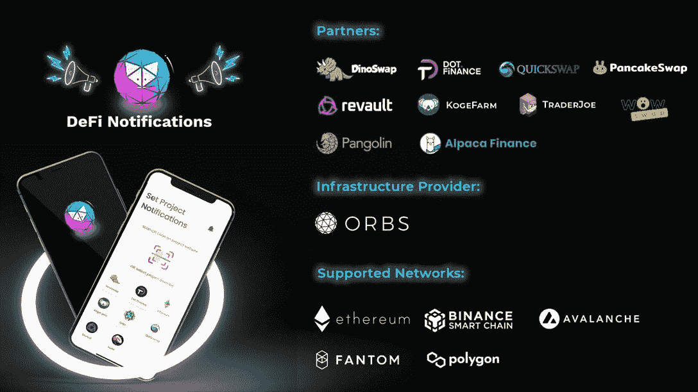
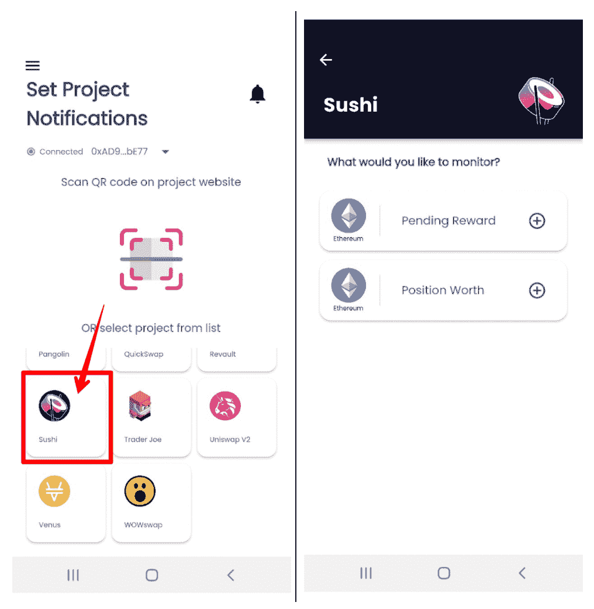
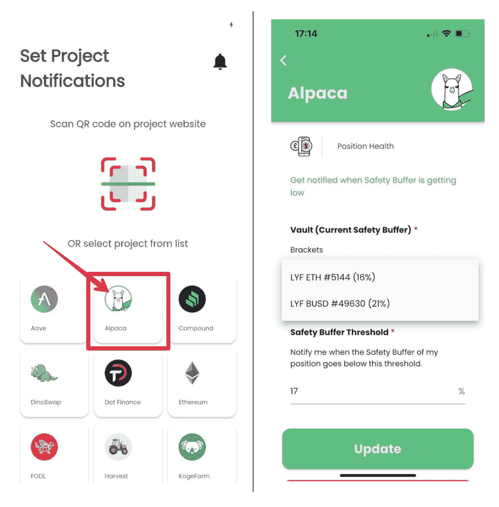

# 如何将开放式 DeFi 通知协议整合到您的 DeFi 项目中

> 原文：<https://web.archive.org/web/https://dappradar.com/blog/how-to-integrate-the-open-defi-notification-protocol-into-your-defi-project>

## 该协议允许用户总是被告知他们的定义链上活动。

**Open DeFi Notification Protocol 是一个免费使用的、社区驱动的项目，由**[**【DeFi.org】**](https://web.archive.org/web/20220814185846/https://defi.org/)**开发，由**[**Orbs network**](https://web.archive.org/web/20220814185846/https://www.orbs.com/)**提供支持。它为 DeFi 爱好者提供了各种链上事件的用户友好的移动通知。**

**概要:**

*   Open DeFi 通知协议支持跨五个网络的 20 个 dapps，包括[以太坊](https://web.archive.org/web/20220814185846/https://dappradar.com/rankings/protocol/ethereum)、[币安智能链](https://web.archive.org/web/20220814185846/https://dappradar.com/rankings/protocol/binance-smart-chain)、[多边形](https://web.archive.org/web/20220814185846/https://dappradar.com/rankings/protocol/polygon)、 [Fantom](https://web.archive.org/web/20220814185846/https://dappradar.com/rankings/protocol/fantom) 和[雪崩](https://web.archive.org/web/20220814185846/https://dappradar.com/rankings/protocol/avalanche)。
*   用户可以从 [AppStore](https://web.archive.org/web/20220814185846/https://apps.apple.com/il/app/defi-notifications/id1588243632) 和 [Google Play](https://web.archive.org/web/20220814185846/https://play.google.com/store/apps/details?id=com.orbs.openDefiNotificationsApp) 下载手机应用。
*   DeFi dapps，如 [SushiSwap](https://web.archive.org/web/20220814185846/https://medium.com/@defiorg/the-open-defi-notification-protocol-now-supports-sushiswap-5f62c8341ff0) 和[羊驼金融](https://web.archive.org/web/20220814185846/https://medium.com/@defiorg/the-open-defi-notification-protocol-now-supports-alpaca-finance-c99213c5f72d)，利用开放的 DeFi 通知协议来通知用户关键的 DeFi 时刻。
*   像以太坊和 Orbs 这样的区块链网络也可以受益于该协议。
*   DeFi.org 最近启动了一项 10 万美元的发展赠款计划，用于对该议定书的新贡献。

## 为什么开放 DeFi 通知协议很重要？

随着 DeFi 变得越来越受欢迎，许多 DeFi 团队现在在其平台的 UI 上为用户提供更多定制服务，如风险提醒、价格提醒等。尽管如此，用户并不总是停留在那些 dapp 界面上，太多的邮件通知很容易被忽略。

这就是开放式 DeFi 通知协议集成发挥作用的地方。Open DeFi Notification Protocol 是一个社区驱动的项目，由 Orbs 提供支持，为用户提供任何链上事件的免费分散移动通知。

Defi 通知协议引入了一个开放的协作网络，任何人都可以贡献新的通知。值得注意的是，这可以使 DeFi 开发人员和团队能够更好地为他们的用户服务，并让用户了解他们的加密产品组合的最新状态。目前，来自五个网络的 20 个 dapps 的用户可以从该协议中受益。

如果您想了解如何向 Open DeFi 通知协议添加新通知，并使用它来优化您的用户体验，请继续阅读。

## DEX-AMMs 的通知

为了通知用户他们的实时链上 DeFi 事件，许多 DEX-AMMs 集成了开放式 DeFi 通知协议，包括 [SushiSwap](https://web.archive.org/web/20220814185846/https://dappradar.com/multichain/defi/sushi) 、 [Quickswap](https://web.archive.org/web/20220814185846/https://dappradar.com/polygon/exchanges/quickswap) 、 [Trader Joe](https://web.archive.org/web/20220814185846/https://dappradar.com/avalanche/defi/trader-joe) 等等。

在 DeFi 领域，分散式交易所(DEX)利用自动化做市商，通过使用加密流动性池作为交易对手而不是传统做市商来实现资产交易。

那么，开放 DeFi 通知协议对这些 DEX-AMMs 有什么好处呢？我们以寿司为例。

### SushiSwap 如何增强通知系统

根据 DappRadar 单一 dapp 跟踪，SushiSwap 拥有 15 亿美元的通胀调整锁定总价值(ATVL)和 3.61 亿美元的市值，同时支持十多家连锁店。

SushiSwap 用户现在有两种类型的通知来优化 DeFi 操作。一个是待定奖励通知。有了这个功能，用户将知道他们的奖励累积状态，并在他们准备好的时候要求奖励。

另一个是位置值。此功能跟踪用户下注头寸的总值。它帮助用户在任何损失发生之前采取行动。

## 贷款平台的通知

DeFi 贷款平台向个人和企业提供贷款，无需中介机构的参与。此外，这些 dapps 和协议使每个人都能在加密货币中获得利益。

借出协议也可以受益于开放 DeFi 通知协议，以更好地通知用户关于关键 DeFi 时刻。让我们看看羊驼金融的用例，了解它是如何工作的。

开立借贷头寸具有一定的风险，基本上是平仓的风险。因此，借款人必须确保他们不会跌破清算门槛。幸运的是，羊驼在你的头寸仪表板中计算安全缓冲，以通知用户他们离潜在的清算有多近。

集成开放 DeFi 通知协议后，羊驼用户可以获得“位置健康”通知，当安全缓冲降至指定阈值以下时，会向他们发送警报。

## PoS 标记的通知

由于基于 PoS 区块链比基于 power 的更具可扩展性、效率和成本效益，它们正在成为主流。PoS 共识模型允许加密货币所有者下注硬币并创建验证器节点来验证交易。

为了让赌注登记者有效地跟踪他们的赌注登记活动，Orbs 使用开放 DeFi 通知协议实现了 PoS 赌注登记通知。它目前向 Orbs stakers 提供两种类型的通知。

第一个是待定奖励，通知用户他们待定的 ORBS 奖励。另一个是解锁冷却，当 14 天的冷却期结束时，它会告诉用户。

## 网络通知

区块链网络作为一个整体也可以使用 Open DeFi 通知协议来升级其通知系统。例如，该协议使用户能够及时获得以太坊燃气费的最新更新。对于以太坊用户来说，高昂的燃气费将可能影响他们的交易决策。所以，对于 DeFi 用户来说，快速了解以太坊燃气费是至关重要的。

## 开发者对新贡献的资助

DeFi.org[最近与](https://web.archive.org/web/20220814185846/https://medium.com/@defiorg/defi-org-dappradar-launch-100k-developers-grant-for-the-open-defi-notification-protocol-c584afacea62) [DappRadar](https://web.archive.org/web/20220814185846/https://dappradar.com/) 合作推出了一个新的 10 万美元开发者资助计划，用于开放 DeFi 通知协议。

Open DeFi 通知协议是一个开源项目，允许任何人贡献和集成通知。通过快速简单地集成到 Github 上，开发人员可以为任何 DeFi 项目的重要事件提供免费的移动通知，如累积未决奖励、价格波动、接近清算、止损、合同升级、新治理投票等。

开发者可以在这里找到更多信息。

积极参与并做出贡献:

[https://github.com/open-defi-notification-protocol](https://web.archive.org/web/20220814185846/https://github.com/open-defi-notification-protocol)

## 最后的想法

本文涵盖的用例仅代表了健壮协议的一小部分。Open DeFi 通知协议团队邀请开发团队用他们的想法来丰富这个开放、协作的生态系统。

开发人员可以将现有的通知作为参考，并在他们的 DeFi 项目中实现它。或者，他们可以参与已经与协议集成的现有项目，并创建新的通知类型。

找到更多关于 Orbs 和开放 DeFi 通知协议:

[DeFi.org 网站](https://web.archive.org/web/20220814185846/https://defi.org/)

[宝珠网站](https://web.archive.org/web/20220814185846/https://www.orbs.com/)

[开放 DeFi 通知协议](https://web.archive.org/web/20220814185846/https://defi.org/notifications/)

[推特](https://web.archive.org/web/20220814185846/https://t.me/defiorg)

[电报](https://web.archive.org/web/20220814185846/https://t.me/defiorg)

**免责声明** —这是一篇赞助文章。DappRadar 不认可本页面上的任何内容或产品。DappRadar 旨在提供准确的信息，但读者应该在采取行动之前总是自己做研究。DappRadar 的文章不能被认为是投资建议。