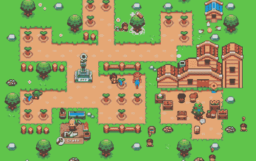
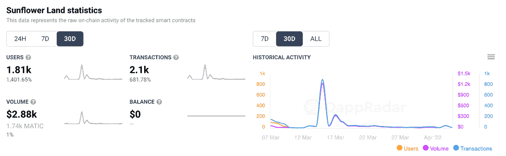

# 如何加入向日葵地公测

> 原文：<https://web.archive.org/web/https://dappradar.com/blog/how-to-join-sunflower-land-open-beta>

## 玩到自己的多边形区块链农业模拟继续复出与公开测试

**向日葵地公测将于 4 月 7 日开始。在 DappRadar 报道了这款游戏最近的复兴之后，现在有消息称，随着它继续从近乎完全灭绝的状态中复苏，它将向更广泛的观众开放。**

**总结**

*   ***训练有素的机器人滥用平台的开放原则***
*   [***【向日葵地复兴】***](https://web.archive.org/web/20221127154718/https://dappradar.com/blog/sunflower-land-revived-from-the-ashes-of-sunflower-farmers) ***继续与 4 月 7 日公测一同推出***
*   ***[只有 10 万用户可以加入公测](https://web.archive.org/web/20221127154718/https://dappradar.com/blog/how-to-join-sunflower-land-open-beta/#upcoming-beta)***
*   [***DappRadar 数据***](https://web.archive.org/web/20221127154718/https://dappradar.com/polygon/games/sunflower-land) ***显示过去一周的链上活动不均衡***

## 在火中诞生

从灰烬中，向日葵地诞生了。当它的前身向日葵农民在恶意攻击和滥用智能合同的轰炸下陷入困境时，这个社区被遗弃和迷失了。但随着焦土允许新的增长，这种游戏的烧焦的尸体给了新的希望。

或许有点矫情？我同意。但是如果你读了向日葵地生活者的叙述，你很难不为失去一个对他们真正有意义的游戏而感到些许伤感。

农业模拟是建立在平等和开放的原则之上的。游戏的开发者和其他人一样，从零开始了他们的农业生涯。早期采用者似乎没有想到流动性池、投机、利润和小把戏。

Screenshot of Sunflower Farmers

但游戏成为了自身成功的受害者，一旦秃鹫们看到平台固有的漏洞，他们就开始蠢蠢欲动。人们可以建立的农场数量没有限制。因此，机器人很快就启动了数以千计的机器人，并以不可持续的速度获取资产。然后有人在代码中发现了一个缺陷，允许他们创建无限数量的镐。

在很短的时间内，经济陷入谷底，游戏暂停。这是在今年一月。

## 即将到来的测试信号继续复苏

现在，这款游戏被重新命名为《向日葵之地》,开发者重新思考了他们激进开放的哲学。似乎不是每个人都值得信任。

据这款游戏的开发者和目前测试早期发布版本的精选人群称，“没有一个人玩过这个测试版，没有一个人不被吹走”。现在向日葵地已经准备好进入下一个阶段，向更多的观众开放。测试版将于 4 月 7 日开始，为玩家提供 10 万个名额。

一些需要知道的事情:

*   该游戏目前处于私人测试阶段，大约有 1000 名玩家进行测试。
*   游戏在多边形区块链上进行，花费 1 T2 马克。在撰写本文时，这大约相当于 1.63 美元。
*   象征性稳定和社区教育将成为新的重点。目标是创造一个可持续的生态系统，而不是一个投机的。
*   你需要执行一些步骤来为公开测试做准备。因此，距离发布还有两天时间，请确保给自己足够的时间来整理钱包、代币和访问权限。
*   该平台将于 4 月 15 日推出其原生 SFL 令牌。玩家可以通过制作物品并在二级 NFT 市场出售来获得 SFL。然后，他们可以保留他们的 SFL 或将其兑换成法定货币。
*   《向日葵之地》的官方路线图对今年的前景进行了深入的概述，并计划确保游戏继续以社区为中心。

要加入测试版，请访问[向日葵之地的不和谐服务器](https://web.archive.org/web/20221127154718/https://discord.gg/bw2ZAmcyPn)，在那里团队有关于如何开始的明确指示。

## DappRadar 数据显示向日葵地的坎坷历程

尽管在比赛中普遍存在积极和希望的情绪，但没有什么是完全顺利的。看一看 [DappRadar 对向日葵地的链上分析](https://web.archive.org/web/20221127154718/https://dappradar.com/polygon/games/sunflower-land)，我们可以看到过去 30 天略有波动。

[DappRadar’s on-chain analytics for Sunflower Lands](https://web.archive.org/web/20221127154718/https://dappradar.com/polygon/games/sunflower-land)

我们可以看到的峰值大约发生在向日葵地在 Twitter 上宣布游戏“有史以来第一次寻宝”的同时。第一个解决难题的 1000 人将提前获得游戏，并有机会制造一些农场 NFT。这是一个很好的迹象，表明尽管经历了困难时期，游戏仍然可以依靠其忠实的粉丝支持。

向日葵地目前在 DappRadar 的多边形游戏排行榜上排名第 13，你可以在这里跟踪它的进展。随着公测版的上线，预计排名会有所上升。你也可以通过关注 DappRadar 的[博客](https://web.archive.org/web/20221127154718/https://dappradar.com/blog/)和[推特](https://web.archive.org/web/20221127154718/https://twitter.com/DappRadar)来了解游戏的最新进展。一旦向日葵土地代币 SFL 推出，您将能够通过使用我们的[代币浏览器](https://web.archive.org/web/20221127154718/https://dappradar.com/hub/tokens/ethereum/all/1)来了解它的表现，它拥有大量的信息和数据，可以帮助您了解数百种加密货币。