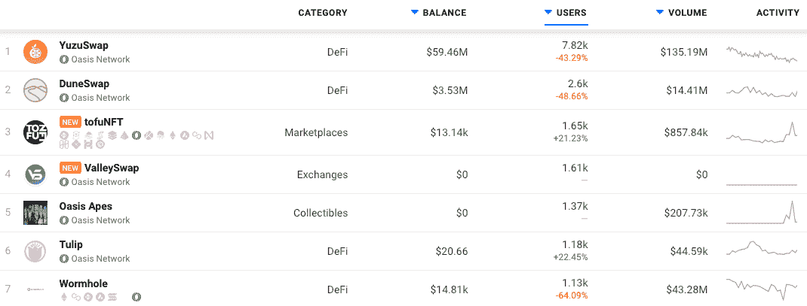
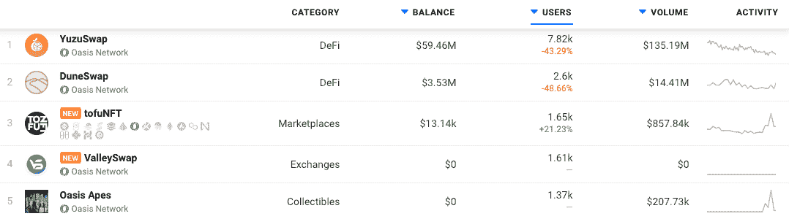
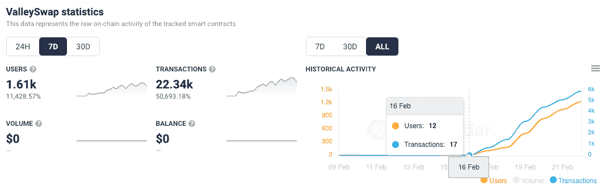
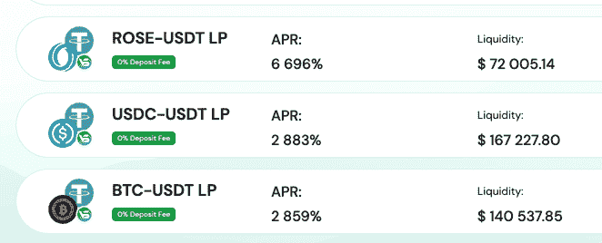
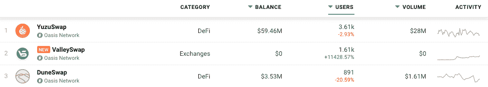
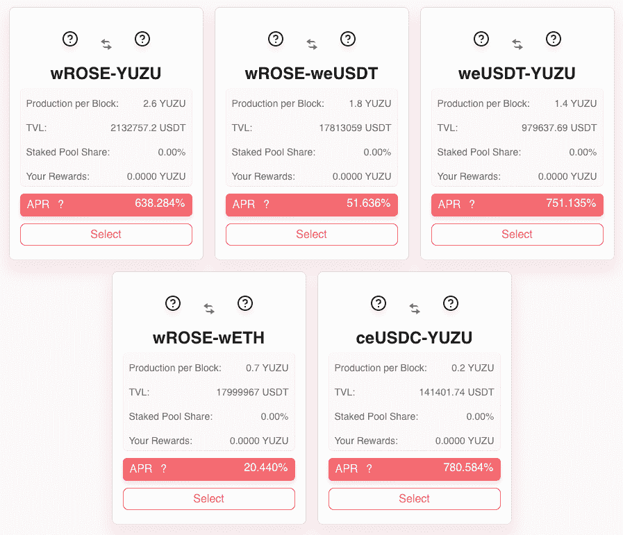

# 如何在 Oasis Network 上推出成功的 Dapp

> 原文：<https://web.archive.org/web/https://dappradar.com/blog/how-to-launch-a-successful-dapp-on-oasis-network>

## 在 Oasis 上创建 dapp 的便利性和好处

**Oasis Network 为 dapp 开发者提供了一个 EVM 兼容的基础来启动 dapp。此外，将想法变为现实所需的资金和技术支持。此外，一旦建立，所有类别的 Oasis dapps 都会向 DappRadar 每月超过 100 万的参与用户观众展示。**

使用 Oasis 网络上的 dapp 作为指南，我们可以为希望在 Oasis 上构建下一个 Web3 unicorn 的 dapp 开发者绘制一条成功之路。这包括开发、支持和将产品投放市场。

Emerald 是 Oasis 网络上兼容 Oasis EVM 的 ParaTime，允许完全兼容 EVM，并易于集成 EVM 的 dapps。这包括来自 DeFi、NFT、元宇宙和游戏等产品类别的 dapps。此外，该生态系统还提供了一个跨链桥来实现互操作性。因此，这使得网络可扩展，是 DeFi 的理想选择。Oasis 凭借其即时终结性、比以太坊低 99%的燃气费、高吞吐量、隐私保护以及对矿工可提取价值(MEV)的综合防御脱颖而出。

对于希望构建易于使用、高安全性和可伸缩性的 dapps 的开发人员来说，Oasis Network 是一个不错的选择。绿洲区块链生态系统可以提供所需的支持和资源，将一个项目从想法阶段变成完全可操作的分散应用。此外，Oasis 已经有了几个跨链平台，如 TofuNFT、WePiggy 和 Wormhole。它欢迎希望通过在 Oasis Network 上发布来扩大其当前项目受众的开发人员。

## 全球受众

自 2022 年 2 月 8 日整合绿洲网络 dapps，到全球 dapp 商店，DappRadar 的用户登陆绿洲网络 Dapp 排行榜几乎 7000 次。这意味着每天有近 500 名用户开始熟悉 Oasis dapps，并有可能将他们的钱包与 Oasis dapps 联系起来。

该网络领先的代币交换和收益农业平台 YuzuSwap 在过去 30 天内已经有近 8，000 个钱包连接到它，并完成了超过 182，000 笔交易，在 TVL 收集了超过 5，200 万美元。因此，尽管 DeFi dapps 无疑在 Oasis 上获得了最多的关注，但其他类别如 NFTs 和收藏品也在显著增长，在过去 30 天里获得了牵引力。

## 完成不竞争

区块链要求特定 dapps 蓬勃发展，以创造一个可持续发展的环境。例如，如果早期没有 Uniswap，ERC-20 代币持有者就无法使用代币。如果没有像戴和马克道这样的项目在以太坊上开拓 stablecoin 的想法，今天的情况会非常不同。此外，如果没有 OpenSea，所有这些 NFT 收藏都不会有市场。

在 Web3 中，dapps 为了更大的利益而互补和合作的理念远远胜过了面对面的竞争。一个完整的生态系统，如果不是比成千上万的复制和粘贴 dapps 竞争相同的眼球更重要的话，也是同样重要的。这是我们在 2021 年看到的趋势，因为无数几乎相同的指数和产量农业平台出现了。这些提供了令人垂涎的奖励，然而，这些项目会在几周内消失。

因此，对于希望在 Oasis 上构建的 dapp 开发人员来说，有几个核心问题要问:

1.  dapp 将如何为用户增加价值和效用？
2.  像我们这样的项目已经启动并获得了成功吗？
3.  我们能做他们做的，但更好吗？
4.  我们能称赞一项已经存在并受欢迎的服务吗？

从一开始就回答这些问题将有助于完善一个想法。除了 Oasis 和 DappRadar 通过其 500，000 美元的加速器基金提供的帮助，dapp 开发人员可以开始工作，因为他们知道他们有支持来实现他们的想法。

## 类别问题

考虑到 Oasis Network 社区的用户统计数据，金融应用程序将最适合成功推出并获得关注，同时还可能为网络添加另一层，如 stablecoins 或杠杆交易。请记住，财务 dapp 可以包括玩赚和 GameFi dapps，它们采用相同的机制。

## 绿洲上谁赢了？

以下是 Oasis 网络上表现最好的 dapps，按照过去 30 天内连接它们的唯一活动钱包数量进行排名。该指标与交易量一起可以为 dapp 提供强劲的增长指标。

## TofuNFT:先发优势

TofuNFT 很有趣，因为他们在 Oasis 上获得了先发优势，成为该网络唯一的交易 Oasis 收藏品的 NFT 市场。在过去的 30 天里，有 1650 个钱包连接到了 Oasis 上的市场。这也是 OasisApes NFT 系列排名上升的原因，因为人们可以购买和交易豆腐。这与之前关于协作和完整生态系统的评论相呼应。

## 瓦莱斯瓦普的案例

ValleySwap 是最新的进入者，它于 2 月 9 日在 Oasis 上推出了智能合约，并已经获得了巨大的吸引力。直到 2 月 17 日正式发布一周后，活动才开始。那一天[他们推出了](https://web.archive.org/web/20220925013335/https://twitter.com/ValleySwap/status/1494326571905126411/photo/1)几个流动性池，并宣布了[与 EVODeFI](https://web.archive.org/web/20220925013335/https://twitter.com/ValleySwap/status/1494227981895667718/photo/1) 的合作关系。EVODeFi 至关重要，因为它是一种桥接服务，允许用户将 USDC、USDT、ETH 和 BTC 从 BSC、Polygon、Fantom、Avalanche、Cronos、Solana、Ethereum 等迁移到 Oasis。

这两项举措帮助 TVL 在 ValleySwap 上的收入在发布后的 24 小时内超过了 450 万美元，在撰写本文时超过了 2000 万美元。

## 奖励带给用户

与所有代币交易所 dapps 一样，流动性至关重要。例如，dapp 需要足够的储备资金来促进代币交易。DeFi dapps 建立了流动性池，提供奖励来吸引用户填满它们，并提供分散交易所运行所需的流动性。作为回报，流动性提供者获得回报。再加上用户使用 EVODeFi 桥从其他网络引入令牌的能力，成功的秘诀似乎已经创造出来了。

ValleySwap 上的流动性池非常诱人，为用户提供了罗斯/USDT 的巨额年利率，以及 USDT/USDC 和 BTC/USDT 的可观收益。值得注意的是，双边 stablecoin 池是最具流动性的，这意味着在 Oasis，特别是 ValleySwap 上交易 stable coin 变得更加容易和便宜。

此外，ValleySwap 在过去几周的表现使其在 DuneSwap 的第二名之后牢牢占据了一席之地。然而，随着农场、游泳池和赌注奖励上线，DeFi dapps 可能会遭受最初的活动爆发。过了这段时间，用户除了收获奖励之外，几乎不需要再回来，因此整体活动可能会下降。

因此，任何 DeFi 平台都需要用更多的优惠和坚实的令牌组学来吸引用户。因此，在一些 DeFi 平台上，我们看到 ido 和白名单令牌销售，因为它们可以定期吸引大量受众，有助于支持 dapp 的长期增长。

在撰写本文时，我们看到通过七天的镜头来看，ValleySwap 在活跃用户方面已经超过了 DuneSwap。更能说明问题的是他们能否在接下来的 30 天里保持住这个位置。

## YuzuSwap 帮助 TVL 在 Oasis 上突破 1 亿美元

看看 YuzuSwap，它允许用户增加流动性并获得奖励，交换进出代币，以及交易激励对来获得奖励。我们看到了之前描述的典型的用户热潮，这是 DeFi 平台的潜在衰落。发布后用户数量激增，此后用户活动减少。尽管如此，该平台最初的表现足以让它领先。像所有事情一样，用户倾向于被赢家吸引。

连接到 YuzuSwap 的活跃钱包在 1 月 12 日达到 6800 个的峰值，另一个较小的峰值出现在 1 月 19 日，与 2 月 11 日的正式发布完美吻合。事情进展顺利，该平台仅在 3 小时内就达到了 2000 万美元的 TVL。由于 YuzaSwap 的推出，绿洲网络的总 TVL 超过了 1 亿美元，YuzuSwap 的推出甚至成为头条新闻。玫瑰，绿洲网络的本土标志，尽管不利的市场条件下继续攀升。

YuzuSwap 锁定价值的快速上升可以用该平台最初较高的年收益率(APY)来解释。在推出时，流动性矿工可以通过四个激励性的令牌对获得 800%至 21，000%的收益。像往常一样，随着更多流动性的到来，这些数字有所下降。

此外，玫瑰价格的上涨以及 YuzuSwap 平台上利润丰厚的支持性奖励的可用性并不是在真空中宣布的，这有助于吸引更多的注意力到 Oasis Network，其 dapps 和玫瑰令牌，因为饥饿的投资者遇到了一个新的机会。

与 ValleySwap 不同，YuzuSwap 形成为一个 DAO，并拥有自己的 YUZA 治理令牌。YUZA 令牌为投资者增加了另一层吸引力，他们知道如果交易所成为网络上的领导者或重要参与者，交易所令牌可以带来丰厚的回报。例如， [Uniswap 的原生令牌 UNI 以大约 3.50 美元](https://web.archive.org/web/20220925013335/https://www.coingecko.com/en/coins/uniswap)的价格首次亮相，然后在推出后的六个月内攀升至近 40 美元。

## 在 Oasis 网络上构建 dapps 的 500，000 个理由

[DappRadar x Oasis 加速器项目的](https://web.archive.org/web/20220925013335/https://dappradar.com/blog/introducing-the-500000-dappradar-x-oasis-accelerator-program/)任务是从 DappRadar 开发者社区中寻找有抱负的团队，并支持他们在 Oasis 网络上进行建设。感兴趣的主要领域是 DeFi、P2E 博彩和隐私解决方案。在该计划期间，团队将获得支持，以确保成功的整合、社区参与和筹款。

每个被选中的团队将获得高达 50，000 美元的 ROSE 奖励，这是 Oasis Network 的本地令牌。此外，他们将有机会在绿洲基金会和 DappRadar 的直接支持下启动他们的项目。

评选委员会由来自 Oasis Foundation 和 DappRadar 的团队成员组成，将根据团队的业绩记录、团队组成、想法、发展阶段和路线图对团队进行评估，然后为 2022 年 4 月开始的项目[选出最佳的 10 个团队。](https://web.archive.org/web/20220925013335/https://dappradar.com/blog/introducing-the-500000-dappradar-x-oasis-accelerator-program/)

该计划在所有领域为团队提供辅导和指导，如开发人员支持、营销和筹款活动、培训研讨会、通过合作伙伴提供的法律和业务咨询以及办公时间。被选中的团队将加入 Oasis 社区，并在 DappRadar Oasis 跟踪页面上获得一个有保证的列表。在计划结束时，他们还将有机会向广泛的投资者网络推销他们的 dapps，并从绿洲 2 亿美元的生态系统基金获得额外资金。

## 关键日期:

*   开放申请时间:2022 年 2 月 9 日至 4 月 3 日
*   加速器启动:2022 年 4 月 11 日
*   研讨会、指导和 Dapp 开发:2022 年 4 月 11 日至 7 月 10 日
*   对团队的筹款和网络支持:2022 年 7 月 11 日至 9 月 30 日
*   演示日:2022 年 9 月 2 日

## 如何申请

[在 2022 年 4 月 3 日欧洲中部时间午夜前提交您的申请](https://web.archive.org/web/20220925013335/https://airtable.com/shreZAEcjcrTFpwT0)。如果您是 DappRadar 社区的成员，并且正在从事 DeFi、P2E 游戏或数据隐私解决方案等项目，我们希望为您提供支持。

 NewsletterUnsubscribe at any time. [T&Cs](https://web.archive.org/web/20220925013335/https://dappradar.com/terms) and [Privacy Policy](https://web.archive.org/web/20220925013335/https://dappradar.com/privacy-policy)

***以上不构成投资建议。此处给出的信息仅供参考。请行使尽职调查，做你的研究。作者持有 ETH、BTC、AGIX、HEX、LINK、GRT、CRO、OMI、不可变 X、GALA、AVASTR、GMEE、CUBE、RADAR、FLOW、FTM、BNB、SPS、WRLD、ATOM 和 ADA。***