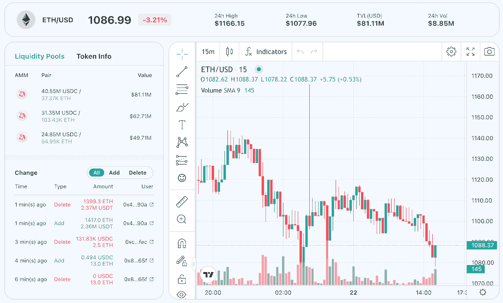

# 如何利用中转互换优化跨链 DeFi 回报

> 原文：<https://web.archive.org/web/https://dappradar.com/blog/how-to-leverage-transit-swap-to-optimize-cross-chain-defi-return>

## Transit Swap 是一个跨链 DeFi 平台，将不同的 dex 集成到一个全方位的体验中。

**Transit Swap 是一个整合多个区块链的 DeFi 平台。它使 DeFi 用户能够轻松地在各种网络和 dex 之间转移资产，从而让他们的生活变得更加轻松。它以智能合约为动力，支持用户高效、安全地实现最佳投资回报。**

**目录**

*   [什么是中转互换？](https://web.archive.org/web/20221206090706/https://dappradar.com/blog/how-to-leverage-transit-swap-to-optimize-cross-chain-defi-return/#what)
*   [公交换购有什么好处？](https://web.archive.org/web/20221206090706/https://dappradar.com/blog/how-to-leverage-transit-swap-to-optimize-cross-chain-defi-return/#benefits)
    *   所有的事情，所有的地方，所有的时间
    *   [超过 30 种指标供用户选择](https://web.archive.org/web/20221206090706/https://dappradar.com/blog/how-to-leverage-transit-swap-to-optimize-cross-chain-defi-return/#over)
    *   [支持决策的直观界面](https://web.archive.org/web/20221206090706/https://dappradar.com/blog/how-to-leverage-transit-swap-to-optimize-cross-chain-defi-return/#intuitive)
    *   [安全永远是第一位的](https://web.archive.org/web/20221206090706/https://dappradar.com/blog/how-to-leverage-transit-swap-to-optimize-cross-chain-defi-return/#secutiry)
*   [公交换购有更多让用户期待的](https://web.archive.org/web/20221206090706/https://dappradar.com/blog/how-to-leverage-transit-swap-to-optimize-cross-chain-defi-return/#more)

## 什么是中转互换？

Transit Swap 是一个一站式的跨链交换平台，在不同的网络中聚合不同的 dex。它允许用户通过网络实时、安全地进行分散交易。

其强大的 API 可以为各种网络上任意代币之间的互换提供实时报价。此外，它利用应用程序二进制接口(ABI)数据与这些网络上的智能合约进行交互。

这为用户体验去中心化交易所提供了一种新的方式，提供了更好的流动性，产生了更好的回报。最重要的是，不需要复杂的操作；一切都发生在一个地方。

[Find more about Transit Swap](https://web.archive.org/web/20221206090706/https://www.transit.finance/en/)

## 公交换购有什么好处？

Transit Swap 意在为 DeFi 用户提供最便捷高效的交易平台和工具。因此，让我们探索一下它能提供什么。

### 所有的事情，所有的地方，所有的时间

Transit Swap 集成了公共链上最流行的 DEX，并采用多种策略来智能地选择交易路线。因此，它使用户能够在一个页面上交易来自不同的第一层和第二层网络的代币，同时享受最佳的交易深度和流动性。

此外，用户可以指定某些钱包地址作为接收地址，以满足他们的特定需求。

[Join Transit Swap](https://web.archive.org/web/20221206090706/https://www.transit.finance/en/)

### 超过 30 种 dex 供用户选择

目前，Transit Swap 已经集成了十多家公共链，如以太坊、BNB 链、Solana、Polygon、Tron、Aptos、Klaytn、Avalanche 等。此外，超过 30 个指数，包括 Uniswap，Curve，1inch，PancakeSwap，Raydium，DODO 等，可供用户选择，以组合最佳的交易策略。

Transit Swap 的智能合约是完全开源的，并且经过了 SlowMist 的审计。

### 支持决策的直观界面

Transit Swap 的 web 和移动版本支持查看关键交易信息，如 k 线、流动性池等。更重要的是，它为用户提供全面的链上交易数据，帮助他们做出更好的交易决策。

[Use Transit Swap to maximize return](https://web.archive.org/web/20221206090706/https://www.transit.finance/en/)

### 安全总是第一位的

Transit Swap 于 2022 年 10 月推出 bug 赏金，为发现 Transit Swap 安全漏洞的用户或开发者提供高达 100 万美元的奖励。同时，Transit Swap 还引入了 Transit Security Fund，将 Transit Swap 每月收入的 10%注入安全基金，以有效防止安全漏洞。

## 过境交换有更多的用户期待

Transit Swap 将很快推出链上订单预订服务，这意味着用户在区块链上交换时将无需一直关注价格。他们只需要以理想的价格下单买入或卖出。

Transit Swap 还为用户提供了一个 NFT 集合交易市场，允许用户在最短的时间内找到并购买一个或多个他们想要的 NFT，从而节省时间和汽油。同时，NFT 公交还将为用户配备一些必要的 NFT 数据，使他们能够快速准确地做出交易决策。

**了解更多关于中转交换的信息**

*   [网站](https://web.archive.org/web/20221206090706/https://www.transit.finance/en/)
*   [推特](https://web.archive.org/web/20221206090706/https://twitter.com/TransitFinance)
*   [电报](https://web.archive.org/web/20221206090706/https://t.me/Transit_Finance)

**免责声明** —这是一篇赞助文章。DappRadar 不认可本页面上的任何内容或产品。DappRadar 旨在提供准确的信息，但读者应该在采取行动之前总是自己做研究。DappRadar 的文章不能被认为是投资建议。