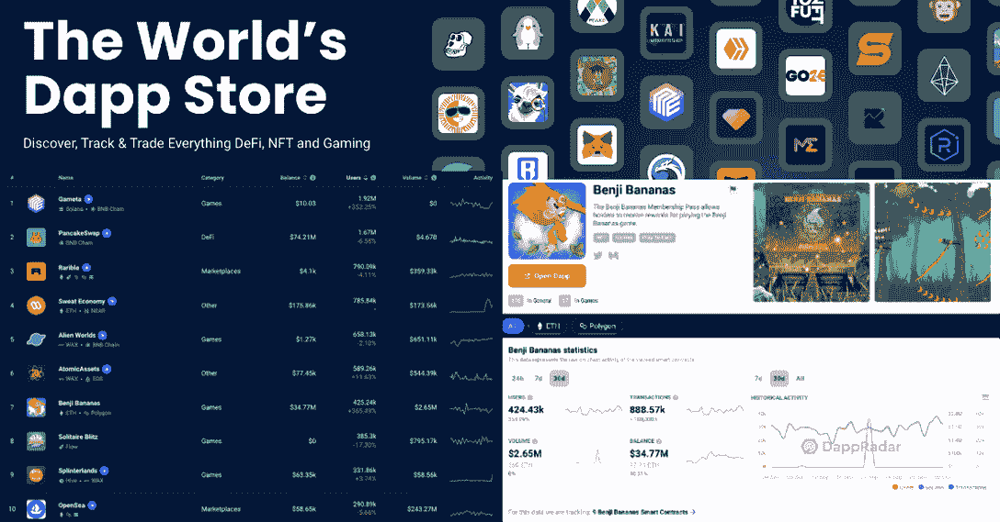
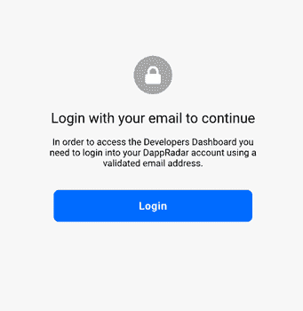
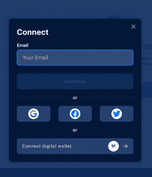
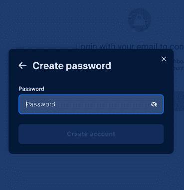
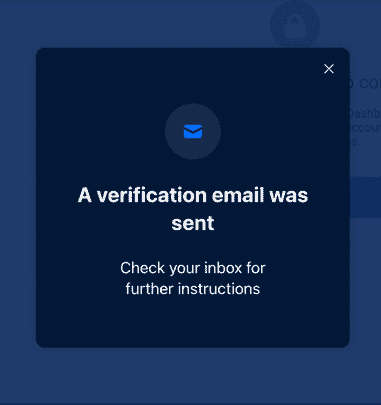
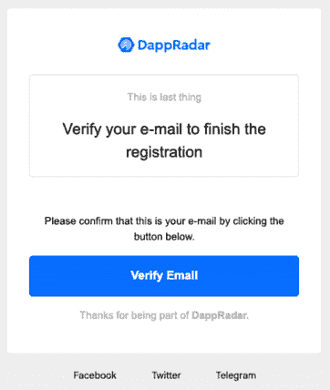
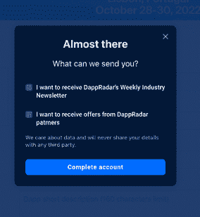
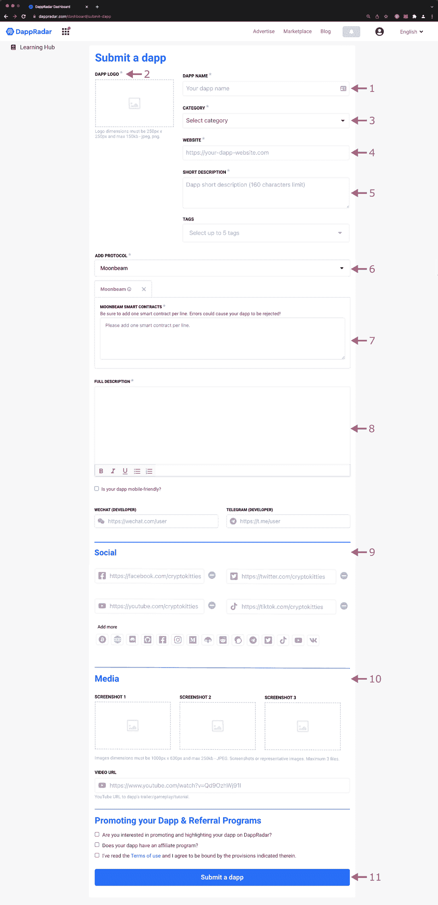

# 如何免费在 DappRadar 上列出您的 Dapps

> 原文：<https://web.archive.org/web/https://dappradar.com/blog/how-to-list-your-dapps-on-dappradar-for-free>

## 在世界 Dapp 商店上市的一步一步指南

DappRadar 是世界上的 Dapp 商店，也是让你的 Dapp 出现在全球数百万区块链用户面前的起点。通过 DappRadar 排名，每月 100 万的网站访问者可以跟踪最受欢迎的游戏、DeFi dapps、NFT 市场等的表现！

通过在 DappRadar 上列表，dapp 的建设者们确保了尽可能多的眼球看到他们的项目。每个 dapp 将在排名中列出，同时获得一个单独的 Dapp 页面。

Rankings Left, Single Dapp Page Right

Dapp 开发者可以[通过提供项目背景，包括描述、网站和徽标，向 DappRadar 提交](https://web.archive.org/web/20230105140146/https://dappradar.com/dashboard/submit-dapp)dapp。只有特定的字段是必填的，但我们鼓励您尽可能多地填写，以使您的 dapp 最有可能获得关注。

任何人都可以上传 dapp 到 DappRadar，包括社区成员和 dapp 开发者。创建一个帐户并列出你喜欢的 dapps 有助于 DappRadar 和生态系统的发展，为你喜欢的 dapps 带来更多关注。

[Submit Dapp](https://web.archive.org/web/20230105140146/https://dappradar.com/submit-dapp)

## 在 DappRadar 上列出 dapp 的指南

任何人都可以按照我们的指南在 DappRadar 上列出 dapp。高质量的提交将受益于额外的努力，吸引更多的用户到 dapp 的生态系统。使用下面的指南准备资产和基本要求，列出 dapp，并添加智能合同。

*   [确保你已经准备好了](https://web.archive.org/web/20230105140146/https://dappradar.com/blog/how-to-list-your-dapps-on-dappradar-for-free/#Make-sure-you-have-this-ready-)
*   [创建 DappRadar 帐户](https://web.archive.org/web/20230105140146/https://dappradar.com/blog/how-to-list-your-dapps-on-dappradar-for-free/#Create-a-DappRadar-account-)
*   [向 DappRadar 提交 dapp](https://web.archive.org/web/20230105140146/https://dappradar.com/blog/how-to-list-your-dapps-on-dappradar-for-free/#Submit-a-Dapp-to-DappRadar)
*   [几个小技巧](https://web.archive.org/web/20230105140146/https://dappradar.com/blog/how-to-list-your-dapps-on-dappradar-for-free/#A-few-tips-)
*   [Dapp 页面优化指南](https://web.archive.org/web/20230105140146/http://check-out-this-complete-guide-to-optimizing-your-dapp-listing-on-dappradar./)
*   [雷达助力](https://web.archive.org/web/20230105140146/https://dappradar.com/blog/how-to-list-your-dapps-on-dappradar-for-free/#RADAR-boost-power)

## 确保你已经准备好了

在开始任何 dapp 列表之前，请确保满足最低要求。

*   Dapp 名称
*   徽标(250 x 250 像素巴布亚新几内亚或 JPG)
*   类别(即定义、游戏、收藏品)
*   网站 URL
*   简短描述(160 个字符或更少)
*   完整描述

## 创建 DappRadar 帐户

第一步是创建一个 DappRadar 帐户并验证电子邮件地址。按照以下步骤完成该过程，并开始在 DappRadar 上列出 dapps。

1.  前往[dappradar.com/dashboard](https://web.archive.org/web/20230105140146/https://www.dappradar.com/dashboard)
2.  按登录创建一个新帐户。

3.输入您的电子邮件地址

4.选择一个密码。

5.你可能需要通过验证码。

6.继续并检查您的收件箱中的验证电子邮件。

7.打开并确认电子邮件。

8.最后，选择你希望收到的 DappRadar 的来信。我们建议注册每周简讯，以获取最新的行业提示。

现在您在 DappRadar 上有了一个帐户，您可以连接 MetaMask、比特币基地或 Wallet Connect 等钱包来访问我们的全套服务，如投资组合跟踪、雷达跟踪、NFT 价值评估等。

要了解更多关于 DappRadar 工具的信息，[点击此处](https://web.archive.org/web/20230105140146/https://dappradar.com/blog/what-is-dappradar)，继续阅读，了解如何在 DappRadar 上列出您的 dapps。

## 向 DappRadar 提交 Dapp

1.  输入您的项目名称。
2.  上传您的 dapp 徽标(250 x250 像素 PNG 或 JPG，最大 150KB)
3.  为您的 dapp 选择相关类别。
4.  包括您的 dapp 的 URL。
5.  写一个简短的描述(160 个字符或更少)
6.  指定部署 dapp 的区块链。您可以选择多个协议。
7.  选择至少一个区块链后，系统会提示您输入每个网络的 dapp 合同地址。
8.  为你的 dapp 项目写一份完整的描述。
9.  提供社交媒体链接。
10.  这是可选的，但建议您提供 dapp 的屏幕截图。您还可以提供一个 YouTube URL 来演示您的 dapp。
11.  查看条款和条件，然后按提交 dapp。

提交的材料由 DappRadar 团队审查，如果 dapp 被认为适合上市，将予以公布。对于 DappRadar 问题，可以在 [DappRadar Discord](https://web.archive.org/web/20230105140146/https://discord.com/invite/4ybbssrHkm) 中获得支持，或者您可以联系 [【电子邮件保护】](/web/20230105140146/https://dappradar.com/cdn-cgi/l/email-protection#3450514251585b44514647745055444446555055461a575b59) 。

开发人员通过分配正确的类别、刷新和上传新的智能合同来对他们的项目进行全面控制，以确保我们跟踪准确的数据。通过输入引人注目的描述和视觉资产，以确保该项目能够在人群中闪耀。

[Submit Dapp](https://web.archive.org/web/20230105140146/https://dappradar.com/submit-dapp)

## 一些提示

你在 DappRadar 上的 dapp 列表是你的橱窗，任何人都可以更好地了解你的项目是什么和做什么。花时间精心制作引人注目的简短和长篇描述，添加视频和吸引人的图片，将有助于你脱颖而出。

查看此[完整指南，优化](https://web.archive.org/web/20230105140146/https://dappradar.com/blog/how-dapp-developers-can-optimize-their-product-page-on-dappradar)您在 DappRadar 上的 dapp 列表。

视频是在短时间内传达复杂信息的强大媒体，我们鼓励 dapp 开发人员使用它来尝试和解决任何入职或 UX 问题。视频应该简短扼要。

最后，记住 DappRadar 拥有超过 10，000 个 dappss，为了让你的 dapp 被看到，它必须首先看起来有吸引力。图标和描述是强大的营销工具。你越认真对待你的上市，被发现的几率就越高。

## 雷达增强功率

如果你曾经使用过 DappRadar，你会知道它是业内跟踪数据的最佳场所——每月有超过 100 万用户访问。例如，在 [DappRadar 排名](https://web.archive.org/web/20230105140146/https://dappradar.com/rankings)上，你可以浏览不同类别和网络中排名靠前的区块链 dapps，按照日用户数、流量等指标进行排名。

通过[锁定雷达](https://web.archive.org/web/20230105140146/https://dappradar.com/token/staking)，开发者和用户可以使用 Boost Power 在 DappRadar 排名中显示对 dapp 的支持。任何雷达跟踪者都可以对 DappRadar 上列出的任何 dapp 进行此操作。

使用 RADAR staking，您的 dapp 将跳出来给 DappRadar 用户，同时展示它从社区获得的支持。了解你的项目的人越多，你可能获得的用户就越多。

如果有兴趣，你可以从今天开始使用雷达令牌。只需按照下面视频中的逐步说明进行操作。

[https://web.archive.org/web/20230105140146if_/https://www.youtube.com/embed/pThbMD_ceXs?feature=oembed](https://web.archive.org/web/20230105140146if_/https://www.youtube.com/embed/pThbMD_ceXs?feature=oembed)

 NewsletterUnsubscribe at any time. [T&Cs](https://web.archive.org/web/20230105140146/https://dappradar.com/terms) and [Privacy Policy](https://web.archive.org/web/20230105140146/https://dappradar.com/privacy-policy)