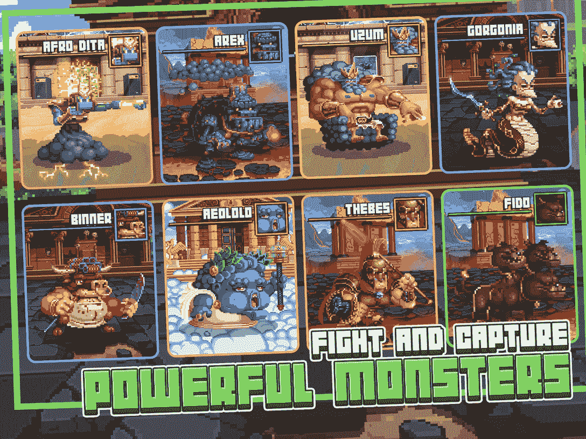
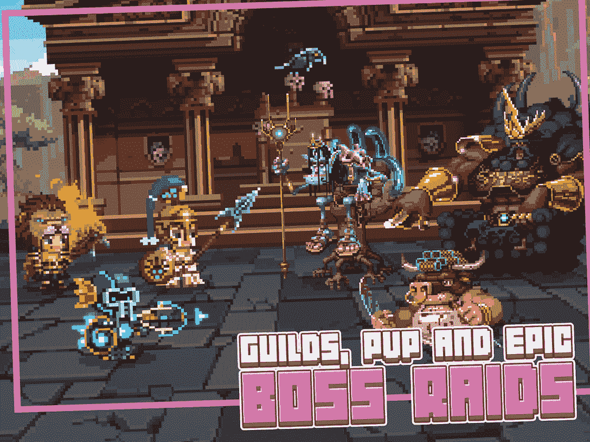
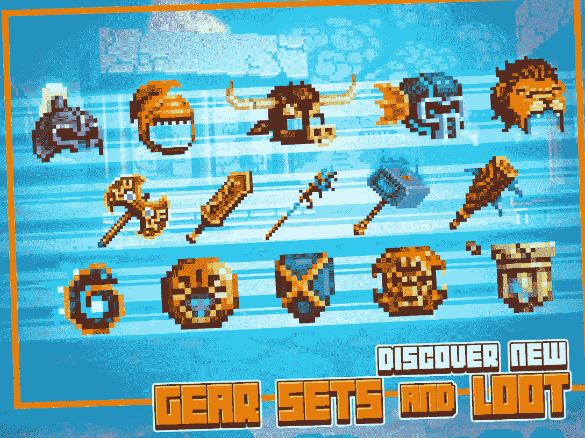
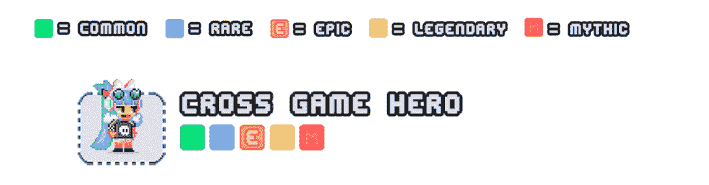
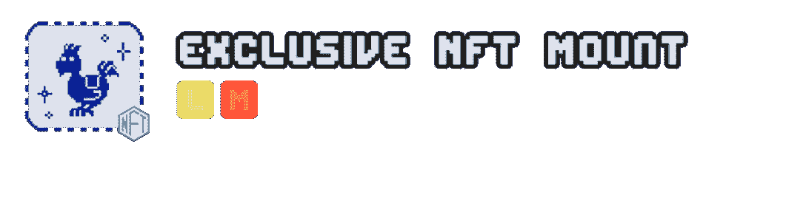
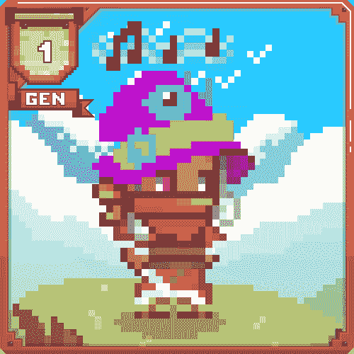

# 如何用你的 NFTs 掌握比特英雄任务

> 原文：<https://web.archive.org/web/https://dappradar.com/blog/how-to-master-bit-heroes-quest-with-your-nfts-2>

## 经典的 8 位地牢爬虫在这个最新版本中遇到了创新的 Web3 技术

Bit Heroes Quest 是一个像素化的地牢爬行器，玩家可以使用不同的 NFT 英雄角色来增强他们的游戏体验。这款游戏是由著名游戏公司 Kongregate 为您带来的 Bitverse(一个不同类型游戏的集合)中的众多游戏之一。

Kongregate 推出了 Bitverse，邀请所有游戏爱好者探索由最新的 Web3 创新驱动的独特游戏化世界。去年 12 月，第二代 Bitverse 英雄推出，目前仅在 [thebitverse.io](https://web.archive.org/web/20230203180716/http://thebitverse.io/) 上提供。

值得一提的是，玩家仍然可以获得前几代 Bitverse 英雄。GEN 1 目前仅在 [thebitverse.io](https://web.archive.org/web/20230203180716/http://thebitverse.io/) 提供。对于 GEN 0 入口和英雄，你可以在下面列出的外部市场中找到它们。

*   稀有:比特大陆英雄
*   [稀有:比特大陆入口](https://web.archive.org/web/20230203180716/https://rarible.com/bitverseportals/items)
*   [Gamestop NFT:比特大陆英雄](https://web.archive.org/web/20230203180716/https://nft.gamestop.com/collection/kongregatebitverse)
*   [Tokentrove:比特大陆英雄](https://web.archive.org/web/20230203180716/https://tokentrove.com/collection/BitverseHeroes)
*   [Tokentrove: Bitverse 门户](https://web.archive.org/web/20230203180716/https://tokentrove.com/collection/BitversePortals)
*   [open ea:成为英雄](https://web.archive.org/web/20230203180716/https://opensea.io/collection/bitverse-heroes)

[https://web.archive.org/web/20230203180716if_/https://www.youtube.com/embed/5b8YbUofaXA?feature=oembed](https://web.archive.org/web/20230203180716if_/https://www.youtube.com/embed/5b8YbUofaXA?feature=oembed)

在 Bitverse 中，玩家可以享受各种各样的游戏，每个游戏都有独特的像素风格的 8 位图形，复古的配乐和迷人的游戏。在最近的版本中，Bitverse 允许玩家使用他们独特的 1 对 1 NFT 英雄，将他们的体验提升到一个新的水平。

我们之前的文章[介绍了比特英雄竞技场公测和比特英雄跑垒员。](https://web.archive.org/web/20230203180716/https://dappradar.com/blog/get-ready-for-retro-gaming-with-the-bit-heroes-arena-open-beta)现在，是时候了解如何掌握比特英雄任务了！

**目录**

*   *[什么是比特英雄任务？](https://web.archive.org/web/20230203180716/https://dappradar.com/blog/how-to-master-bit-heroes-quest-with-your-nfts-2/#what)*
*   *[拥有一个比特大陆英雄是成功的关键](https://web.archive.org/web/20230203180716/https://dappradar.com/blog/how-to-master-bit-heroes-quest-with-your-nfts-2/#own)*
*   [*与 Bitverse 一起踏上光荣的冒险之旅！*](https://web.archive.org/web/20230203180716/https://dappradar.com/blog/how-to-master-bit-heroes-quest-with-your-nfts-2/#embark)
*   *[更多有用链接](https://web.archive.org/web/20230203180716/https://dappradar.com/blog/how-to-master-bit-heroes-quest-with-your-nfts-2/#links)*

## 什么是比特英雄任务？

地牢爬虫通常充满掠夺、攻击和探索深层世界。所以如果你在寻找具有如此经典元素的东西，那么比特英雄任务就是你需要尝试的游戏。

Quest 允许玩家在一个巨大的开放的像素化世界中冒险、掠夺和战斗，这个世界的灵感来自于历史幻想英雄和怪物。

在这些环境的深处，玩家参与到老派的回合制战斗中，生物可以凭空出现，消灭任何挡路的人。只有真正的英雄才能战胜挑战！

尽管比特英雄任务的游戏性以战役(任务)为中心，但游戏在地牢爬虫类中有几个有趣的转折。玩家可以与其他在线参与者组队突袭老板并收集他们的传奇装备，或者组成公会争夺专属奖励。或者，他们可以在 PvP 竞技场中一决雌雄，成为最后的英雄。英雄可以获得坐骑，在战斗中帮助他们的特殊宠物，以及大量的装备和宝石来帮助改善他们的性格。

[Check out a full list of Bit Heroes Quests game mode](https://web.archive.org/web/20230203180716/https://www.thebitverse.io/)

## 拥有一个比特大陆英雄是成功的关键

每个玩家在加入游戏时都可以定制他们的角色，但是现在，比特大陆引入了可玩的 NFT 英雄和 F2P 角色。Bitverse 英雄(NFT)拥有独特的艺术特质，并根据其稀有程度给予游戏内外的额外津贴。你也可以在比特大陆的所有游戏中使用你的英雄！在 NFT 上追踪进度，它会随着你从一个游戏转移到另一个游戏。

在玩比特大陆英雄时，角色进展、获得的物品和冒险能力将受英雄约束，并与 NFT 在一起，不管其所有者是谁。因此，你可以把你已经装备精良、久经沙场的比特大陆英雄带到比特大陆的新游戏中，从而大大加快你的进度。

这变得更加吸引人了！在比特英雄任务中与比特世界英雄一起冒险的玩家可以访问额外的游戏内容，从专属比特世界英雄锦标赛到跨越比特世界的日常任务。更多的行动，更多的乐趣，更多的奖励！

值得注意的是，用户可以享受的好处取决于英雄的稀有程度，范围在普通、稀有、史诗、传奇和神话之间。例如，只有史诗、传奇和神话英雄可以拥有专属 NFT 宠物，而奖金赌注奖励只适用于那些

传奇的和神话的。

[Learn how to make the most of NFT heroes in Bit Hero Ques](https://web.archive.org/web/20230203180716/https://medium.com/@the-bitverse/more-heroes-for-the-bitverse-a4279671120)

## 与 Bitverse 一起踏上光荣的冒险之旅！

Bitverse 是一个完全资助的项目，因此它不依赖销售来保持其游戏内生态系统的健康和可持续发展。这对玩家来说是个好消息，因为这意味着团队可以完全专注于提供高质量的体验，而不是让用户花更多的钱。

现在，你仍然有机会获得游戏中的英雄 NFT 来增强你的游戏体验，因为它们提供了大量的实用工具。Bitverse Heroes (NFTs)第 1 代可以在 [thebitverse.io](https://web.archive.org/web/20230203180716/http://thebitverse.io/) 买到，但是限量供应。更多信息，请访问他们的[博客](https://web.archive.org/web/20230203180716/https://medium.com/@the-bitverse/a-new-generation-is-born-d8c2e9198dc4)。

准备好深入世界，用最好的道具装备自己，揭开比特大陆为你准备的秘密！加入官方 [Twitter](https://web.archive.org/web/20230203180716/https://twitter.com/BHBitverse) 和 [Discord](https://web.archive.org/web/20230203180716/https://discord.gg/bitverse) 成为第一个体验乐趣的人。

## 更多有用的链接:

*   [Kongregate 网站](https://web.archive.org/web/20230203180716/https://www.kongregate.com/)
*   [Bitverse 网站](https://web.archive.org/web/20230203180716/https://www.thebitverse.io/)
*   [白皮书](https://web.archive.org/web/20230203180716/https://kongregate.gitbook.io/bitverse/)

**免责声明** —这是一篇赞助文章。DappRadar 不认可本页面上的任何内容或产品。DappRadar 旨在提供准确的信息，但读者应该在采取行动之前总是自己做研究。DappRadar 的文章不能被认为是投资建议。