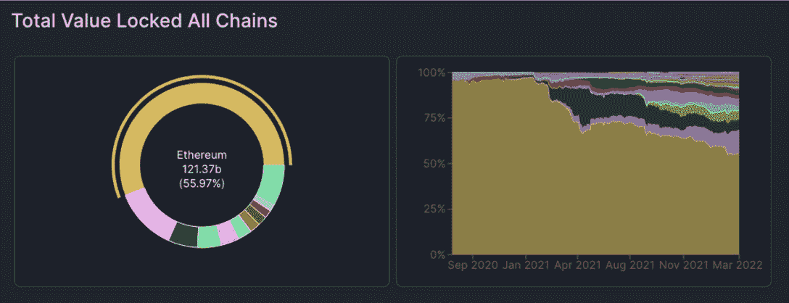
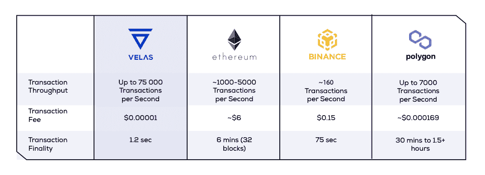
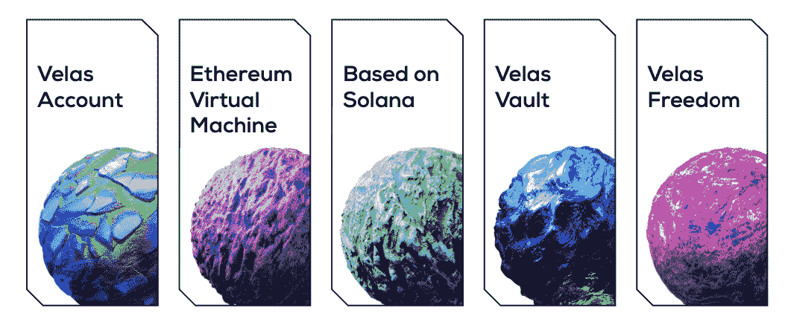
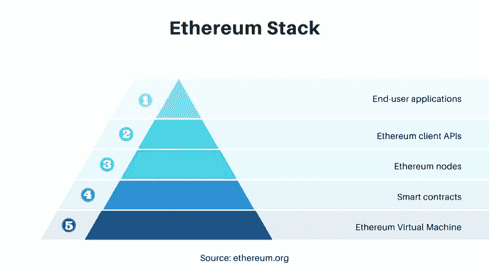
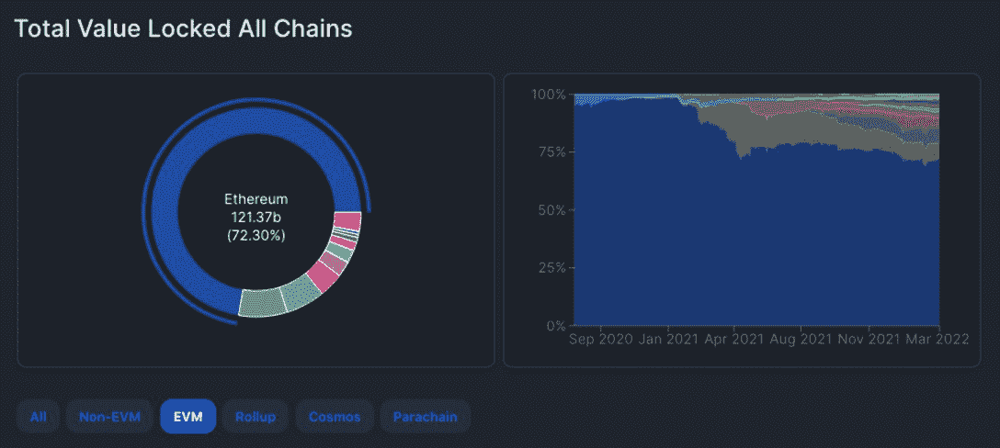

# 如何将你的 Dapps 从以太坊转移到 Velas，闪电般的 EVM 连锁店

> 原文：<https://web.archive.org/web/https://dappradar.com/blog/how-to-move-your-dapps-from-ethereum-to-velas-the-lightning-fast-evm-chain>

## 通过更改一行代码，迁移到 Velas EVM

为了将您的 dapps 从以太坊转移到 Velas，闪电般快速的 EVM 链旨在解决可扩展性问题。区块链技术的大规模采用很大程度上取决于技术团队如何解决可伸缩性问题。Velas 继承了 Solana 的优势，并提供了 EVM 兼容的解决方案，使开发人员能够更好、更便宜地为用户服务。

公共区块链无法扩展，这减缓了该技术为企业和行业提供最佳解决方案的速度。简而言之，当节点和事务的数量达到导致拥塞的水平时，可伸缩性问题就出现了。这个问题严重限制了先驱公众区块链以太坊的大规模采用。

## 以太坊及其可扩展性问题

以太坊是一个分散的开源区块链系统。这是加密货币以太网(ETH)背后的一项社区建设技术。以太坊的优势包括:点对点的网络，可以让你自由移动资金；抵制审查使得任何人都不可能阻止你使用以太坊上的服务；数以千计的 dapps 利用智能合同，您可以享受。

截至本文撰写之时，[根据 DappRadar Token Explorer 的数据，以太坊的实时价格为 3，394.02 美元，24 小时交易量为 18.09 亿美元。凭借其本地令牌在市值上排名第二，以太坊是目前市场上最广泛使用的 dapps 网络。](https://web.archive.org/web/20221025173754/https://dappradar.com/hub/token/eth/ETH)

然而，过去一年，以太坊的市场主导地位正逐渐让位于竞争对手。据 DeFi Llama 称，在 DeFi 领域，以太坊在 2021 年初曾占 locked (TVL)总价值的 97%,但现在降至 55%。

以太坊失去统治地位是因为它的可扩展性问题和网络拥塞期间的高交易费。更新、更快、更便宜的替代品开始分一杯羹。

目前的以太网平均每秒只能处理 15 笔交易。用户一直在抱怨以太坊的延迟和拥塞。以太坊 2.0 承诺将其网络升级到每秒处理 100，000 笔交易的能力。这种增加将通过碎片链的实现来实现，这是以太坊共识层升级的最后阶段。

在以太坊共识层到来之前，业界仍然需要切实可行的解决方案，为当前用户解决眼前的痛点。解决方案之一是提供一个更高效、更廉价的公链，作为以太坊生态系统的补充。在所有解决方案提供商中，Velas 在创新方面处于领先地位。

## Velas EVM 公司以用户为中心的区块链可扩展性方法

### 谁是维拉斯？

[Velas](https://web.archive.org/web/20221025173754/https://dappradar.com/blog/introducing-velas-the-high-performance-blockchain) 通过为分散式项目和应用创建一个闪电般快速的 EVM 区块链和开源平台，解决了区块链的可扩展性问题。Velas 的解决方案继承了 Solana 技术的最佳 DNA，并补充了支持与 EVM 兼容的附加功能。因此，Velas 可以通过即时终结、极低的费用和可靠性支持来维持巨大的交易吞吐量。下表显示，Velas 每秒可以处理高达 75，000 笔交易，价格为 0.00001 美元，交易结束时间为 1.2 秒。

值得注意的是，Velas 的每一项服务都建立在以用户为中心的理念之上。Velas 团队正试图结合集中式和分散式解决方案的最佳品质。为了实现这一目标，它涉及研究最先进的加密技术，开发共识协议，并设计直观的用户界面。最终，Velas 将提供一个全面的生态系统，通过单一平台从根本上优化用户体验。Velas 革命性的技术有五大核心亮点:Velas 账号、以太坊虚拟机、基于 Solana、Velas Vault、Velas Freedom。

### 近距离观察 Velas 的技术

Velas 帐户

Velas 提供了自己的无密码认证系统，允许用户仅使用他们的 Velas 帐户安全地访问各种服务，而无需密码，同时引入了独特的授权配额，以最大限度地降低风险。

#### 以太坊虚拟机

为了使世界各地的许多开发者能够在短时间内成为广阔的以太坊生态系统的一部分，Velas 提出了一个 EVM 兼容的解决方案，具有极致的简单性和闪电般的速度。在正常情况下，应用程序和客户端可能会在大约 1.2 秒内得到[乐观确认](https://web.archive.org/web/20221025173754/https://docs.velas.com/terminology/#confirmed-block)。在后面的部分，我们将深入探讨在当前的区块链生态系统中，Velas EVM 如何让开发者和用户受益。

#### 基于索拉纳

通过 GPU 利用、事务处理并行化以及 PoH 和 Golfstream 等其他创新，索拉纳区块链可以达到每秒 60，000 个事务的速度。这种技术在框架中的出现大大提高了竞争对手的门槛，Velas 团队决定利用这一出色的框架，而不是开发竞争性的解决方案。此外，这种方法使 Velas 能够专注于充分开发其生态系统的其余部分。

#### 保险库蜡烛

Velas Vault 是一种新颖的解决方案，通过将用户密码、密钥或种子短语的安全性委托给对数据安全性感兴趣的分段算法和验证器来存储秘密和私钥。这支持各种使用案例，如其他区块链(BTC、联邦理工学院、ERC-20 等)本地资产的分散托管解决方案。此外，值得注意的是，该系统足够分散，并实施各种保护机制，以防止旨在收集用户数据和获取用户余额的攻击。

#### 自由之帆

Velas 努力带回免费使用互联网的时代。在 Velas 上构建您的项目，用户可能甚至没有意识到他们正在利用区块链服务，因为事务是在后端过程中执行的。你可以在不影响用户体验的情况下，自动无缝地在你的项目中收取费用。

### 委拉斯开邦的 EVM 及其重要性

EVM 是以太坊区块链的重要组成部分，因为它为智能合约提供了基本的执行环境。我们可以通过下面一个简化的以太坊栈的图形来了解 EVM 的重要性。

由于以太坊的先发优势，主要竞争对手正在使用或连接到 EVM，而不是试图进行正面竞争。因此，EVM 以超过 70%的市场份额统治着 TVL。来自 [DeFi Llma](https://web.archive.org/web/20221025173754/https://defillama.com/chains/EVM) 的下图显示，EVM 已经通过其网络效应巩固了自己。

考虑到这一点，Velas 构建了一个高效且价格合理的区块链，并实现了在其中编写以太坊智能合约的能力。因此，所有基于以太坊的去中心化应用和去中心化金融协议(DeFis)都可以在 Velas 上无缝运行。

## 迁移到 EVM 大草原

迁移到 Velas EVM 将给用户带来许多好处。首先，由于内置 EVM，Velas 与以太坊 100%兼容。这从根本上降低了开发者在 Velas 上部署现有智能合约的门槛。同时，它消除了对昂贵且耗时的智能合同审计的需求。因此，用户可以访问部署在 Velas 上的 EVM 项目，同时享受更低的天然气费用和交易终结。此外，开发人员可以在两个区块链之间无缝迁移资产。例如，您可以轻松地将 VLX(Velas 本地令牌)从本地空间转移到 EVM 空间，反之亦然。

在技术方面，Velas chain 支持 EVM 事务的执行，方法是通过一条调用 EVM 程序的指令将它封装到一个常规的本地事务中。此外，为了完全兼容 EVM dapp、钱包和其他构建在以太坊堆栈上的工具，Velas node 支持以太坊 JSON-RPC API。因此，节点创建虚拟 EVM 块，其中包含网络处理的所有 EVM 事务，并可通过 ETH RPC 方法(eth_getBlockByNumber 等)获得。

除此之外，当进行本地交易时，用户应该以本地令牌支付费用。维拉斯·EVM 桥通过将 EVM 交易包装成本地交易，支付本地费用，并收取 EVM 费用(汽油)来管理日常事务。这一机制将激励开发商建设独立的 EVM 大桥。

幸运的是，开始使用 Velas EVM 一点也不困难。只需修改一行代码(如下面的代码所示)，开发人员就可以开始享受 Velas EVM 的好处，并为用户提供他们自己的 dapps。

改一下这个:web3 = new Web3(new Web3。*提供者*。http provider(' https://other-区块链-RPC ')；

到此:web3 =新 web3(新 Web3。*提供者*。http provider(' https://EVM explorer . velas . com/RPC ')；

## 结论

对分散式应用程序不断增长的需求导致了严重的可伸缩性问题。用户和交易数量的增加可能会导致网络拥塞，并大幅推高天然气价格。并且最终会损害用户体验。以太坊是迄今为止第二大区块链，在过去几年里一直受到这些问题的困扰。

为了让用户能够从 Web 3.0 中获得最大收益，技术团队正在探索各种选项来实现这一目标。因此，它导致了更年轻，更快，更便宜的区块链的出现，如 Velas 和 Solana。许多人认为区块链不需要竞争，而是应该相互合作以获得完美的用户体验。的确，在用户数量不断增长的同时，用户的需求也越来越多样化。

总而言之，业界需要的解决方案不仅能为以太坊等区块链提供急需的救济，还能满足各种特定用户的需求。考虑到这一点，Velas 采用了最以用户为中心和最敏捷的方法，通过其 EVM 链提供强大的可扩展性解决方案。这一切都归功于 Velas 对区块链用户偏好的深刻理解和一支技术娴熟的技术团队。

**关于 Velas 的更多信息**

[**网站**](https://web.archive.org/web/20221025173754/https://velas.com/?utm_source=dappradar&utm_medium=about_velas)
[**白皮书**](https://web.archive.org/web/20221025173754/https://velas.com/pdf/whitepaper.pdf)
[**资助计划**](https://web.archive.org/web/20221025173754/https://docs.velas.com/grants/?utm_source=dappradar&utm_medium=about_velas)
[**脸书**](https://web.archive.org/web/20221025173754/https://www.facebook.com/velasblockchain)
[**LinkedIn**](https://web.archive.org/web/20221025173754/https://www.linkedin.com/company/velas-ag)
[**推特**](https://web.archive.org/web/20221025173754/https://twitter.com/VelasBlockchain)
[**电报公告**](https://web.archive.org/web/20221025173754/https://t.me/VelasOfficial)
[**电报社区**](https://web.archive.org/web/20221025173754/https://t.me/velascommunity)

**免责声明** —这是一篇赞助文章。DappRadar 不认可本页面上的任何内容或产品。DappRadar 旨在提供准确的信息，但读者应该在采取行动之前总是自己做研究。DappRadar 的文章不能被认为是投资建议。