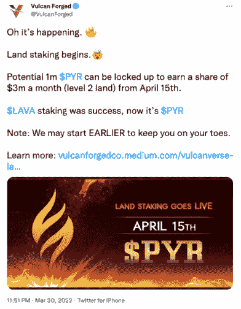
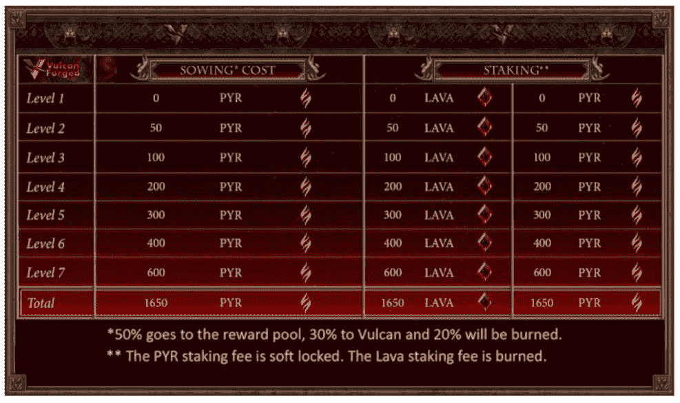
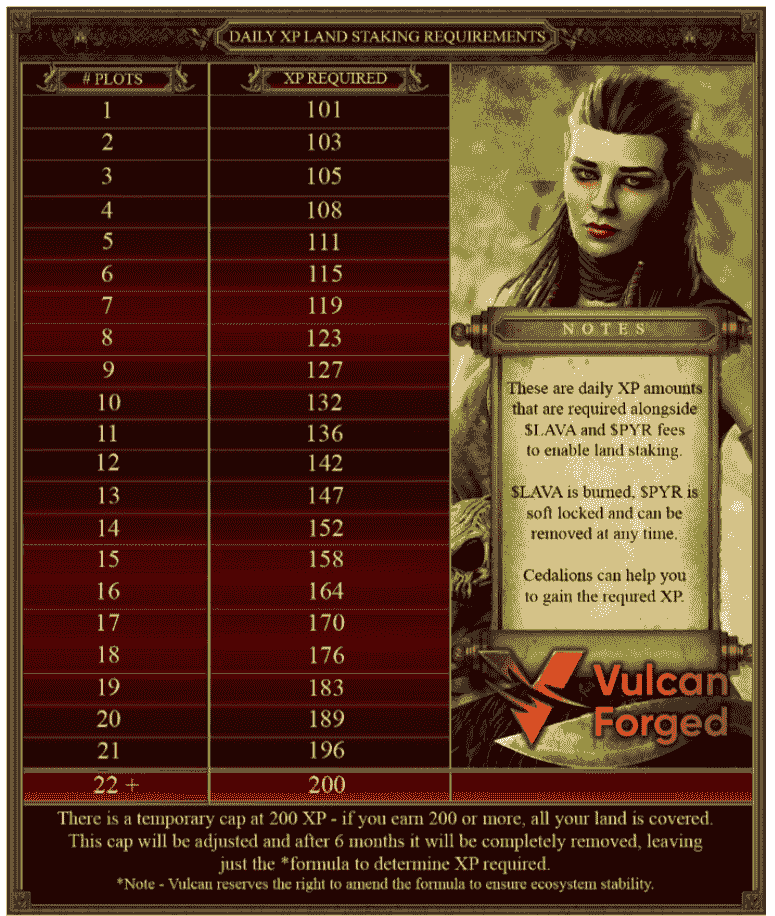
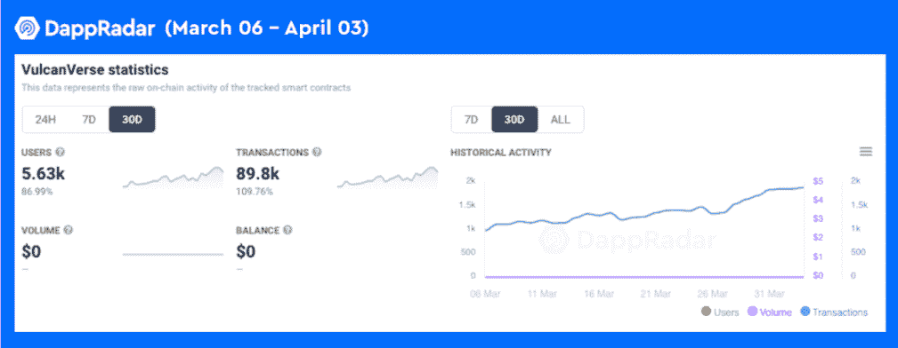

# 如何参与 300 万美元的 VulcanVerse Land 赌注

> 原文：<https://web.archive.org/web/https://dappradar.com/blog/how-to-participate-in-the-3m-vulcanverse-land-staking>

## 在 vulcanverse 用你的土地收获饥饿奖励

VulcanVerse 推出了土地赌注功能，玩家可以从 300 万美元的赌注中分得一杯羹。要加入赌注奖励池，用户需要下注他们的 PYR 令牌，确保他们有足够的经验值，并将他们的土地升级到至少 2 级。

《火神锻造生态系统》的旗舰游戏《元宇宙世界》和《MMORPG》将于 2022 年 4 月 15 日发布《登陆游戏》。参与者将有能力要求分享团队锁定的最高 100 万 PYR。那就是每月 300 万美元的奖励。

VulcanVerse 是一款以希腊罗马时代为背景的元宇宙游戏。游戏有一个令人难以置信的有趣的故事，古代神和火神建造了一个梦幻般的虚拟世界。与此同时，VulcanVerse 为玩家提供了一个可持续的游戏经济，玩家可以在 PYR 被动地获得奖励。为了成功地获得好处，你必须了解土地(NFT)和 PYR(游戏中的令牌)的性质。此外，玩家需要知道如何利用这两种资产来获得经济利益。土地赌注是玩家从游戏赚钱机制中获益的重要方式之一。

## 什么是土地标桩，如何参与？

如果你是 VulcanVerse 的土地所有者，你可以通过锁定你的 PYR 获得赌注奖励来参与土地赌注过程。参与土地标桩相当简单。首先，你需要拥有至少一块土地，并将其提升至二级。然后你需要燃烧一些熔岩令牌来开始这个过程。任何参与土地赌注的人都有资格获得赌注奖励池的一部分。

### 循序渐进的指南

*   开一个[我的伪造账户](https://web.archive.org/web/20221206231322/https://auth.vulcanforged.com/)
*   拥有土地并通过播种来改良它([点击这里了解更多信息](https://web.archive.org/web/20221206231322/https://vulcanforgedco.medium.com/vulcanverse-what-is-land-cf1eda9ff440)
*   在开始下注之前，确保你在游戏中获得了足够的经验值(XP)。否则可以定期玩火神锻造生态系统游戏，收集需要的 XP。
*   然后你将需要燃烧一些熔岩和“软锁”你的 PYR，这意味着你可以在任何时候转移标桩 PYR，但这将结束在那个水平。

下表显示了土地桩水平和播种成本结构。

### 如何维持星际奖励

值得注意的是，你需要保持你的土地“肥沃”,这样赌注的回报才会源源不断。这意味着每天和每块土地都需要获得一定数量的经验值。下表解释了土地桩的每日 XP 要求。如前所述，与火神锻造游戏互动会增加你的 XP。你可以自己完成这项任务，也可以在你的雪松的帮助下完成，雪松是借用你的 NFT 资产的人。

值得注意的是，如果你没有达到每日 XP 阈值，你只会错过一天的赌注。最初，每天 200 经验值将覆盖钱包中的所有地块，尽管这将在未来六个月内逐步取消。Vulcan 保留修改公式的权利，以确保生态系统的稳定性，因为新的 XP 收入路线被引入到 VulcanVerse。

## 你的神会帮助你赢得奖金

在 VulcanVerse，你的神会永远支持你，包括在赌注过程中。11 位奥林匹斯山神中的 10 位和 12 位泰坦神中的 11 位会给你 10%到 70%的额外赌注奖励，只要你与上帝有关联。奖金看你神的水平；级别越高，奖励越多。

对于主神，奥林匹斯山的宙斯和泰坦的克洛诺斯，你还可以根据他们的等级获得 10%到 70%的额外赌注奖励。但是他们可以启动你选择的三块相连的土地来获得奖励，而不是连接一块土地。更重要的是，有一个神分配给一个情节，使这些情节优先赌注。在这里阅读更多关于神以及如何获得神的信息[。](https://web.archive.org/web/20221206231322/https://vulcanforgedco.medium.com/the-gods-101-a-guide-to-titans-and-olympians-d4ef96d6851c)

## VulcanVerse 的牵引力越来越大

最近，NFT 逐渐恢复了人气， [OpenSea](https://web.archive.org/web/20221206231322/https://dappradar.com/ethereum/marketplaces/opensea) 和 [LooksRare](https://web.archive.org/web/20221206231322/https://dappradar.com/ethereum/marketplaces/looksrare) 的交易量在过去七天里分别增长了 26%和 29%。[区块链游戏的领导者 VulcanVerse](https://web.archive.org/web/20221206231322/https://dappradar.com/vulcanforged/games/vulcanverse) 也出现了数据增长，30 天用户增长了 87%，交易增长了 109%。最重要的是，土地赌注的推出将进一步升级 VulcanVerse 的游戏赚取机制，为其用户带来更丰厚的利益。达普拉达将继续关注火神星的最新进展。

要了解瓦肯锻造的最新消息，请查看以下频道:

不和:[https://discord.gg/vulcanverse
推特:](https://web.archive.org/web/20221206231322/https://discord.gg/vulcanverse)[twitter.com/vulcanforged
中:](https://web.archive.org/web/20221206231322/http://twitter.com/vulcanforged)[vulcanforgedco.medium.com
电报:](https://web.archive.org/web/20221206231322/https://vulcanforgedco.medium.com/)[tg.me/veriarti](https://web.archive.org/web/20221206231322/http://tg.me/veriarti)