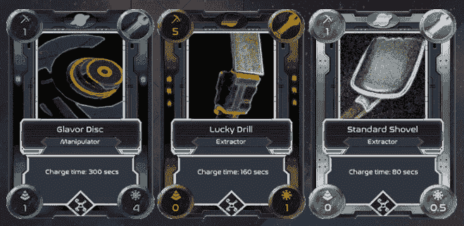
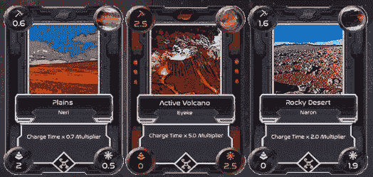

# 如何像专业玩家一样玩外星世界

> 原文：<https://web.archive.org/web/https://dappradar.com/blog/how-to-play-alien-worlds-like-a-pro>

## 在这个星际虚拟世界中采矿、获取、交易和赚取奖励

《外星世界》经常出现在 DappRadar 的排行榜上。粉丝们继续涌向这个平台，蜡市场也在忙于用户交易游戏中的资产。现在是了解如何像职业玩家一样玩外星世界的好时机。

**内容**

*   ***[什么是外星世界？](https://web.archive.org/web/20220813150601/https://dappradar.com/blog/how-to-play-alien-worlds-like-a-pro/#what-is)***
*   ***[如何开始玩外星世界](https://web.archive.org/web/20220813150601/https://dappradar.com/blog/how-to-play-alien-worlds-like-a-pro/#start-playing)***
*   ***[如何挑选合适的工具](https://web.archive.org/web/20220813150601/https://dappradar.com/blog/how-to-play-alien-worlds-like-a-pro/#right-tools)***
    *   ***[充电时间](https://web.archive.org/web/20220813150601/https://dappradar.com/blog/how-to-play-alien-worlds-like-a-pro/#charge-time)***
    *   ***[NFT](https://web.archive.org/web/20220813150601/https://dappradar.com/blog/how-to-play-alien-worlds-like-a-pro/#luck-multiplier)***
    *   ***[异能乘数](https://web.archive.org/web/20220813150601/https://dappradar.com/blog/how-to-play-alien-worlds-like-a-pro/#pow-multiplier)***
    *   ***[TLM 法器](https://web.archive.org/web/20220813150601/https://dappradar.com/blog/how-to-play-alien-worlds-like-a-pro/#tlm-multiplier)***
    *   ***[获得最佳投资回报率](https://web.archive.org/web/20220813150601/https://dappradar.com/blog/how-to-play-alien-worlds-like-a-pro/#best-roi)***
*   ***[成为行星道员掌握权力](https://web.archive.org/web/20220813150601/https://dappradar.com/blog/how-to-play-alien-worlds-like-a-pro/#planet-dao)***
*   ***[土地赚你佣金](https://web.archive.org/web/20220813150601/https://dappradar.com/blog/how-to-play-alien-worlds-like-a-pro/#land-commission)***
*   ***[救命！将弹出一条警告消息。CPU 不够用！](https://web.archive.org/web/20220813150601/https://dappradar.com/blog/how-to-play-alien-worlds-like-a-pro/#warning-message)***

DappRadar 是您获取 dapp 数据和 web3 见解的一站式商店。我们拥有所有的工具来帮助您找到市场上最受欢迎的游戏。我们已经有一个[指南告诉你什么是](https://web.archive.org/web/20220813150601/https://dappradar.com/blog/what-is-alien-worlds)外星世界。

现在你需要知道怎么玩。本指南包含了你如何像专业玩家一样玩外星世界所需的一切。

## 什么是外星世界？

外来世界是一个 NFT 元宇宙的以太坊，蜡，和 BNB 智能链游戏。在《异形世界》的模拟经济中，玩家争夺稀缺资源，包括 NFT 和游戏内代币。

《异形世界》拥有一个四支柱驱动的游戏生态系统，玩家或探险家通过收购和租赁土地进行采矿，并投票支持行星治理，以影响万亿美元的支出。

这些支柱是 Trilium (TLM) token、NFT 工具、lands 和行星分散自治组织(行星 DAOs)。现在，让我们仔细看看每个支柱如何影响玩家的成功。

[https://web.archive.org/web/20220813150601if_/https://www.youtube.com/embed/lETB0bGmQ1U?feature=oembed](https://web.archive.org/web/20220813150601if_/https://www.youtube.com/embed/lETB0bGmQ1U?feature=oembed)

DappRadar Meets WAX

## 如何开始玩外星世界

现在有几个简单的步骤可以开始了解外星世界:

*   去[外星世界 dapp](https://web.archive.org/web/20220813150601/https://dappradar.com/deeplink/5314) 。
*   创建一个 WAX web3 钱包。您可以[免费创建一个](https://web.archive.org/web/20220813150601/https://all-access.wax.io/)。
*   为自己设置一些登录信息。
*   选择你的第一个头像。
*   接受条款和条件，然后单击“我准备好了”。
*   选择你想开采的星球。仔细想想这个。采矿锅显示当前可供开采的 TLM 数量。而填充速率显示了其再填充的速度。
*   选择一块你想开采的土地。请记住，每一个是不同的，采矿费用将有所不同。所以慎重选择。
*   选择铲子作为你的工具。随着你在外星世界的进步，你将获得更好的工具。

现在你可以开始玩了。尽情享受吧！

Source: [Alien Worlds](https://web.archive.org/web/20220813150601/https://alienworlds.io/)

## 如何选择合适的工具

玩家使用工具从外星世界的土地上开采 TLM。这些是 NFT，以扑克牌的形式出现，就像在[夹板岛](https://web.archive.org/web/20220813150601/https://dappradar.com/multichain/games/splinterlands)或神奇宝贝中一样。玩家最多可以同时使用三种工具。

由于每个工具 NFT 都有唯一的统计数据，不同的工具 NFT 组合会产生不同的挖掘结果。工具越稀有、越闪亮，它们的挖掘力就越大。

用户可以通过挖掘或从各种 NFT 市场购买工具，如币安、BitYard 和 AtomicHub。此外，如果玩家足够幸运地通过采矿获得稀有工具，他们还可以在市场上进行交易，以换取令牌，如蜡。

In-game Tools

现在我们知道了什么是工具以及在哪里可以找到它们，重要的是学习获得和使用它们背后的策略。每个工具都有四个重要的属性，所有玩家都应该知道:

### 充电时间

你可以在你的外星世界卡片的文字部分找到充电时间。它以秒为单位显示了您使用工具后需要等待充电的时间。一旦充好电，你就可以再次使用它。

### NFT 运气乘数

你的运气越好，你在采矿时找到最好的 NFT 的机会就越大。你可以在卡片的右下角找到这个号码。

### 功率乘法器

这也可以被称为工作证明减速器。它加快了你的采矿时间，如果你不是用蜡钱包玩游戏的话，它特别有用。这个号码在卡片的左下角。

### TLM 乘数

该数字表示您的工具将乘以多少采矿输出。您可以在工具卡的左上角找到它，数字越大越好。

Land cards

### 获得最佳投资回报

除了这四个数字，你还需要知道工具的市场价格。一旦你有了所有这些信息，你就可以决定哪一个能给你最好的投资回报率。

幸运的是，互联网就是互联网，[有人写了一篇很长的文章](https://web.archive.org/web/20220813150601/https://metahub.info/2021/218-alien-world-tools-ultimate-guide/),详细介绍了该买什么才能获得最大利润。

## 成为掌握权力的行星刀成员

外星世界的所有活动都发生在行星上，一共有七颗行星。值得一提的是，外星世界的行星是行星分散自治组织(Dao)。

[如何参与道的治理？](https://web.archive.org/web/20220813150601/https://alienworlds.zendesk.com/hc/en-us/articles/1500007805602-How-does-someone-become-a-member-of-a-planet-)通过下注 TLM，玩家可以成为这个星球的投票成员。应用了股权加权投票机制；一个人的股份越多，他的投票权就越多。投票会员可以拥有的一项基本特权是影响 TLM 的支出。

## 成为一个星球道成员，以影响游戏内的治理

所有外星世界的活动都发生在行星上，最初有 6 个行星。值得一提的是，外星世界的行星是行星分散自治社区(Dao)。

[如何参与道的治理？](https://web.archive.org/web/20220813150601/https://alienworlds.zendesk.com/hc/en-us/articles/1500007805602-How-does-someone-become-a-member-of-a-planet-)通过下注 TLM，玩家可以成为这个星球的投票成员。应用了股权加权投票机制；一个人的股份越多，他的投票权就越多。投票会员可以拥有的一项基本特权是影响 TLM 的支出。

我们最近采访了《异形世界》的商业主管兼合作伙伴负责人 Ed Evans，以了解这款热门游戏的最新进展。

[https://web.archive.org/web/20220813150601if_/https://www.youtube.com/embed/DCTJXJnzsvE?feature=oembed](https://web.archive.org/web/20220813150601if_/https://www.youtube.com/embed/DCTJXJnzsvE?feature=oembed)

DappRadar Meets Alien Worlds

## 土地帮助玩家赚取佣金

在外星世界中有三种不可替代的标记:土地、工具和化身。要开始采矿，玩家需要拥有一块土地或在其他玩家拥有的土地上采矿。

每个 NFT 都有影响游戏性的独特属性，比如它产生的 TLM 数量，用户获得 NFT 的概率等等。

土地所有者与其他参与者的区别在于，当其他人在他们的土地上采矿时，土地所有者可以获得佣金。因此，拥有土地可以给使用者带来被动收入。

## 救命啊！将弹出一条警告消息。CPU 不够用！

主动潜入外星世界的玩家有时不得不处理警告信息，比如说他们没有足够的 CPU。

任何控制一个账户的人，如果在短时间内做了太多的交易，就需要持有蜡制代币。只需[转到蜡云钱包仪表盘](https://web.archive.org/web/20220813150601/https://wallet.wax.io/dashboard)，点击屏幕右侧的资源，并下注一些蜡币。

达普拉达将继续监测外星世界的最新发展。在 [Twitter](https://web.archive.org/web/20220813150601/https://twitter.com/dappradar) 、 [Discord](https://web.archive.org/web/20220813150601/https://discord.gg/4ybbssrHkm) 和 [Youtube](https://web.archive.org/web/20220813150601/https://www.youtube.com/c/DappRadar) 上关注我们，跟上区块链世界的动态。

 NewsletterUnsubscribe at any time. [T&Cs](https://web.archive.org/web/20220813150601/https://dappradar.com/terms) and [Privacy Policy](https://web.archive.org/web/20220813150601/https://dappradar.com/privacy-policy)