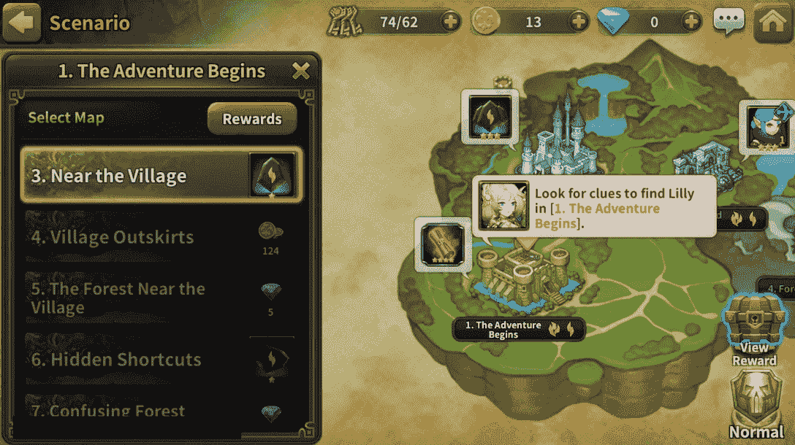
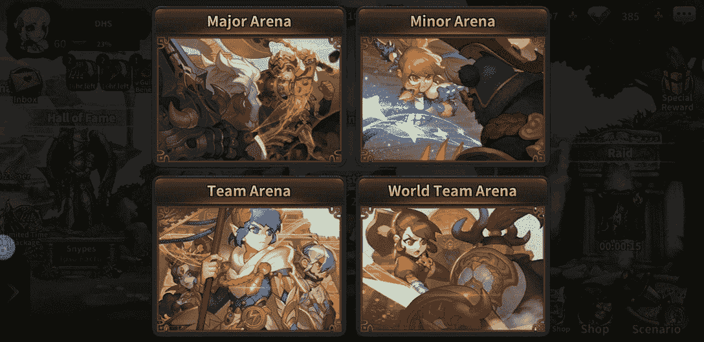
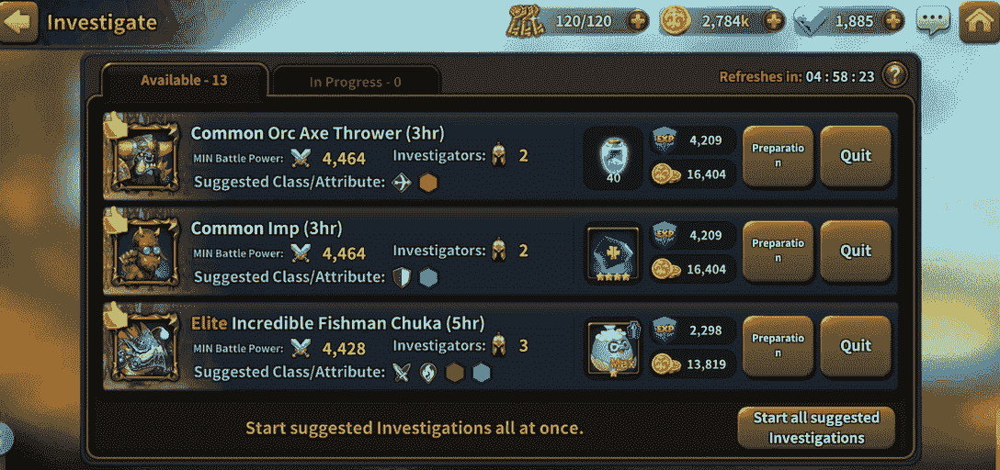
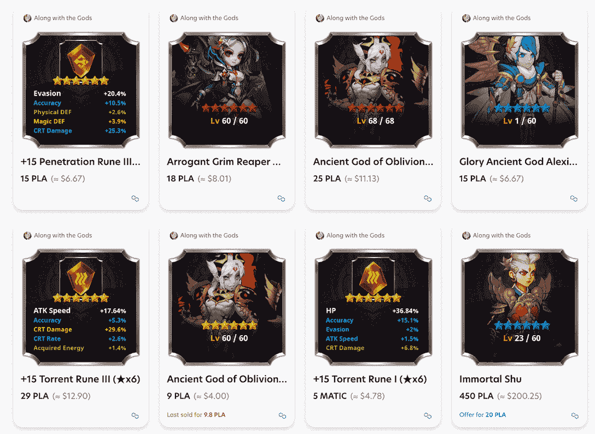
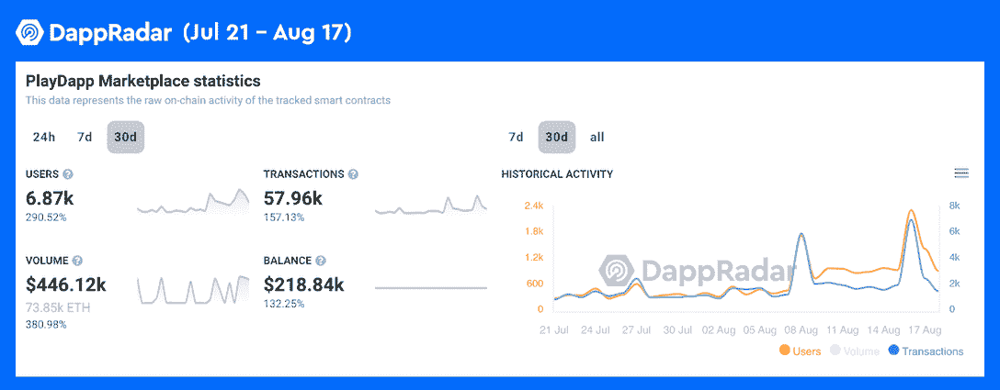

# 如何玩和赢:与神同行

> 原文：<https://web.archive.org/web/https://dappradar.com/blog/how-to-play-and-win-along-with-the-gods>

## 达普拉达的终极指南，以解开与神同行的真正价值

**与神同行是 PlayDapp 游戏平台上的一款策略角色扮演游戏(RPG)。该游戏具有各种游戏模式和精心设计的游戏赚取机制。然而，如果用户想在这个游戏中最大化他们的赚钱能力，他们需要获得一种特殊类型的 NFT，称为 PLAYZ NFTs。**

**内容:**

*   [什么是与神同行？](https://web.archive.org/web/20220926010828/https://dappradar.com/blog/how-to-play-and-win-along-with-the-gods/#what-is)
*   [主要的游戏模式有哪些，怎么玩？](https://web.archive.org/web/20220926010828/https://dappradar.com/blog/how-to-play-and-win-along-with-the-gods/#modes)
    *   [场景](https://web.archive.org/web/20220926010828/https://dappradar.com/blog/how-to-play-and-win-along-with-the-gods/#scenario)
    *   [竞技场](https://web.archive.org/web/20220926010828/https://dappradar.com/blog/how-to-play-and-win-along-with-the-gods/#arena)
    *   [调查](https://web.archive.org/web/20220926010828/https://dappradar.com/blog/how-to-play-and-win-along-with-the-gods/#investigate)
*   [从游戏到收入的机制是如何与神一起工作的？](https://web.archive.org/web/20220926010828/https://dappradar.com/blog/how-to-play-and-win-along-with-the-gods/#p2e)
    *   如何在 PLAYZ NFT 下注并赢取奖励？
    *   [如何出售英雄和符文 NFT 获利？](https://web.archive.org/web/20220926010828/https://dappradar.com/blog/how-to-play-and-win-along-with-the-gods/#sell)
*   [什么是解放军？](https://web.archive.org/web/20220926010828/https://dappradar.com/blog/how-to-play-and-win-along-with-the-gods/#pla)
*   [关于 PlayDapp 的更多信息](https://web.archive.org/web/20220926010828/https://dappradar.com/blog/how-to-play-and-win-along-with-the-gods/#playdapp)

Web3 游戏可以提供很多东西，包括资产所有权、玩家驱动的经济等等。但它仍处于起步阶段。所以看看目前的游戏赚取市场，很明显大多数游戏的特点是相对静态的图形和简单的游戏控制。此外，他们中的许多人不提供移动应用程序。

在 web2 中，手机游戏已经为用户提供了无与伦比的游戏体验。这些游戏可以为用户提供梦幻般的视觉效果、动态的游戏控制和令人窒息的氛围。因此，当问及 web2 游戏玩家是否准备好迎接新时代时，很难回答，因为他们有太多东西可以放弃。

但是有没有什么产品可以结合两代游戏的精华呢？答案是肯定的，游戏与神同行(AWTG)。该游戏邀请用户在不放弃 web2 游戏所提供的任何优势的情况下，开始一场边玩边赚的冒险。

[https://web.archive.org/web/20220926010828if_/https://www.youtube.com/embed/OGNdW1p2dXA?feature=oembed](https://web.archive.org/web/20220926010828if_/https://www.youtube.com/embed/OGNdW1p2dXA?feature=oembed)

## 众神是怎么回事？

与诸神同行的是一款战略角色扮演游戏(RPG)，在以太坊和多边形上的区块链游戏平台 [PlayDapp](https://web.archive.org/web/20220926010828/https://dappradar.com/multichain/marketplaces/playdapp-marketplace) 上运行。该游戏具有多种游戏模式，四种类型的竞技场战斗，五个角色类别，超过 100 个英雄。

此外，玩家可以通过组合多种效果的符文来增加英雄的属性。最后，值得注意的是，当英雄和符文达到一定等级时，玩家可以将其转换为 NFT，并在 PlayDapp 的市场上进行交易。

AWTG 是手机友好型的，用户可以从 Google Play 下载该应用，iOS 版本也将很快推出。

## 主要的游戏模式有哪些，怎么玩？

该游戏为玩家提供了丰富的游戏玩法和多种游戏模式，包括场景、竞技场、调查模式等。AWTG 的核心玩法是利用玩家的角色来完成任务，参与战斗，并在系统内执行其他任务。

### 方案

随着故事的展开，场景模式允许玩家开始冒险。在这种模式下，玩家将在故事和游戏中前进，这意味着这是一次提升用户英雄和物品的旅程。

那么它是如何工作的呢？清除关卡将帮助玩家获得奖励，如代币、召唤物、符文和英雄。

### 竞技场

竞技场模式和众神游戏是游戏的核心。它允许玩家爬上梯子，进入名人堂。

玩家可以进入四种竞技场战斗，每一种都需要特定的策略。首先是主竞技场，玩家可以不受限制地带领 5 个英雄组成的队伍进入战斗。第二，小竞技场限制玩家只能使用默认 4 星或更低等级的英雄。

接下来，在团队竞技场中，玩家可以选择 15 个英雄，以三局两胜的形式分成三队，每队 5 人。最后一个是世界团队竞技场。值得注意的是，只有顶尖选手才有特权进入，竞争更加激烈。

如果你想要更多关于如何在竞技场模式中获胜的建议，请查看这篇文章。

### 研究

调查是一个让用户放置他们的英雄来完成任务和收集奖励的地方。如下图所示，玩家将他们的英雄送上各种各样的任务来获得奖励。这种模式最神奇的地方在于，它不会干扰玩家在场景中的体验，这意味着即使玩家将其置于调查模式，他们仍然可以使用那些英雄。

用户可以查看这篇文章，了解如何在游戏中获胜的技巧。

## 游戏赚钱机制是如何与神一起工作的？

AWTG 有各种各样的赚取游戏收入的机制，无缝地编织到它的游戏中。

[此处随神下载。](https://web.archive.org/web/20220926010828/https://go.playdapp.com/DappRadar)

### 如何下注 PLAYZ NFT 并获得奖励？

PlayDapp Town PLAYZ NFTs 是促进 PlayDapp 的生态系统更具互操作性的平台 NFT。玩家可以使用这些 NFT 在 PlayDapp 上解锁更多精彩的游戏玩法和游戏体验。

普拉达普镇 NFT 预售将看到三个稀有级别的 NFT，从最稀有到最稀有:R，SR 和 SSR。要获得 PLAYZ，用户可以去[PlayDapp 市场](https://web.archive.org/web/20220926010828/https://playdapp.com/collection/polygon/1)。

只需在物品管理器中下注这些 NFT，玩家就可以从玩游戏中获得 PLA 令牌奖励。PLA 是 PlayDapp 的平台令牌。AWTG 目前为玩家提供了三种赢得 PLA 奖励的方式:

*   r 级 NFTs:赌注和接收随机解放军下降。
*   高级 NFTs:完成每日任务后，获得每日 PLA 奖励。
*   SSR 级 NFTs: staked 将获得 PvP 服务器的入场券，在 PvP 战斗中赢得更高的奖励。

查看 AWTG [从玩到赢赌注指南](https://web.archive.org/web/20220926010828/https://coinmarketcap.com/community/articles/32457)了解更多关于 PLAYZ NFT 赌注的信息。

### 如何出售英雄和符文 NFT 获利？

AWTG 的游戏是精心设计的，让玩家在没有意识到的情况下获得可以给他们带来财富的资产。例如，在玩 AWTG 时，玩家可以收集和升级他们的英雄和符文，然后在市场上出售以获取利润。

想开始玩“与神同行”游戏，简单的[点击此链接下载。](https://web.archive.org/web/20220926010828/https://go.playdapp.com/DappRadar)

但是在 PlayDapp marketplace 上列出这些物品之前，用户需要使用密封卷轴来转换它们。下面的视频将提供这个过程的详细教程。

[https://web.archive.org/web/20220926010828if_/https://www.youtube.com/embed/-NukXXA22UQ?feature=oembed](https://web.archive.org/web/20220926010828if_/https://www.youtube.com/embed/-NukXXA22UQ?feature=oembed)

## 什么是 PLA？

PLA 是一个 ERC-20 令牌，用作 PlayDapp 的本机实用程序令牌。它的最大象征供应量为 700，000，000 解放军。值得一提的是，用户可以从比特币基地获得解放军令牌。

PLA 令牌以各种方式促进 PlayDapp 的生态系统。例如，它可以用于处理用户事务。PLA 的另一个主要用途是促进用户活动，因为奖励是从平台的从玩到赚机制中提取的。

[下载并立即开始你的游戏赚取冒险，与神一起](https://web.archive.org/web/20220926010828/https://go.playdapp.com/DappRadar)。

## 关于 PlayDapp 的更多信息

PlayDapp 是一个区块链驱动的游戏和娱乐生态系统。该平台致力于带来终极游戏体验，将非加密游戏消费者转化为区块链游戏用户。

PlayDapp 设想了一个 web3 游戏生态系统，玩家对他们的游戏内资产拥有真正的所有权，并因他们在游戏参与中花费的时间和资源而获得奖励。

根据 DappRadar 的单个 dapp 页面，PlayDapp 在过去 30 天里见证了令人印象深刻的指标表现。例如，dapp 已经吸引了大约 6870 个独立用户，增长了 290%，交易量增长了 157%，交易量增长了 380%。

有一些帮助用户跟踪 PlayDapps 最新发展的链接。

*   [PlayDapp 单个 Dapp 页面排名](https://web.archive.org/web/20220926010828/https://dappradar.com/multichain/marketplaces/playdapp-marketplace)
*   [PLA Token](https://web.archive.org/web/20220926010828/https://dappradar.com/hub/token/eth/PLA/ETH?from=0x3a4f40631a4f906c2bad353ed06de7a5d3fcb430)

**了解更多关于《与神同行》和 PlayDapp 的信息。**

[随神下载](https://web.archive.org/web/20220926010828/https://go.playdapp.com/DappRadar)

[网站](https://web.archive.org/web/20220926010828/https://playdapp.com/)

[中等](https://web.archive.org/web/20220926010828/https://medium.com/playdappgames)

[推特](https://web.archive.org/web/20220926010828/https://twitter.com/playdapp_io)

[不和](https://web.archive.org/web/20220926010828/https://discord.gg/aT5YFW7)

[电报](https://web.archive.org/web/20220926010828/https://t.me/cryptodozer_io)

**免责声明** —这是一篇赞助文章。DappRadar 不认可本页面上的任何内容或产品。DappRadar 旨在提供准确的信息，但读者应该在采取行动之前总是自己做研究。DappRadar 的文章不能被认为是投资建议。