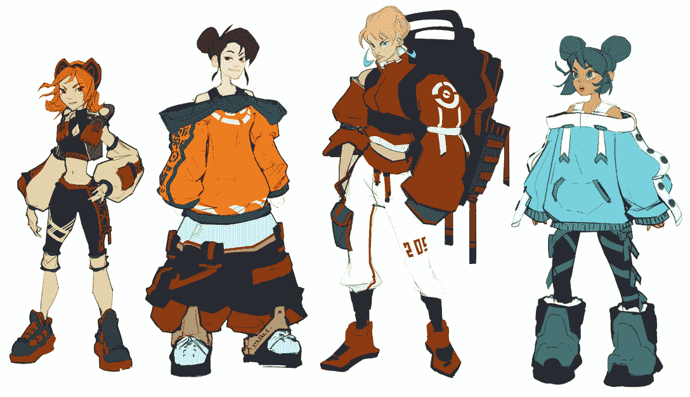
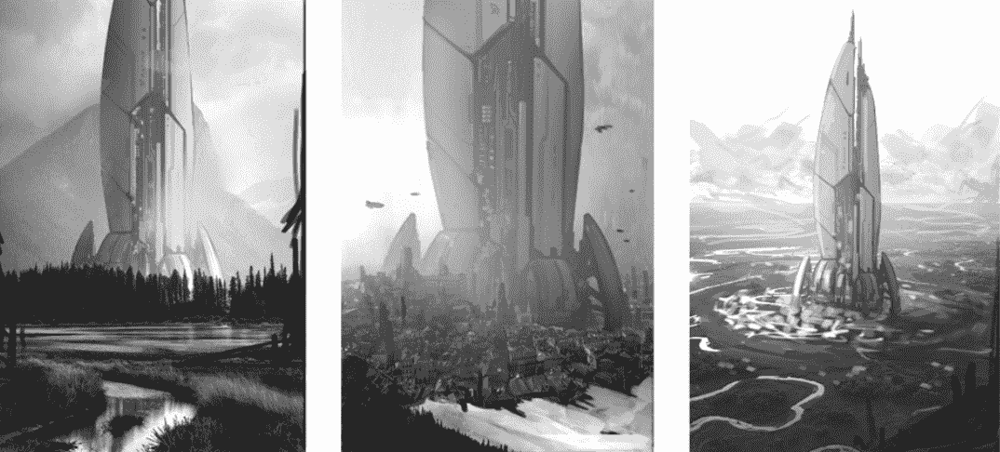
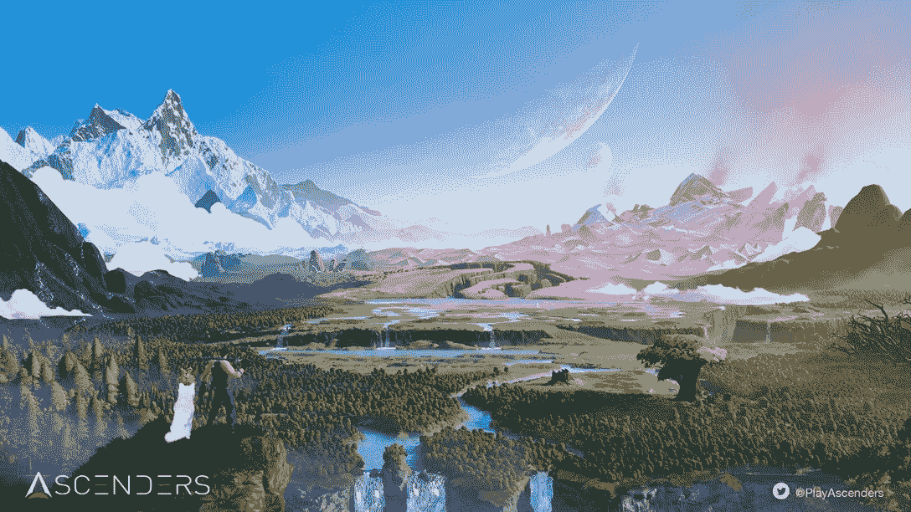
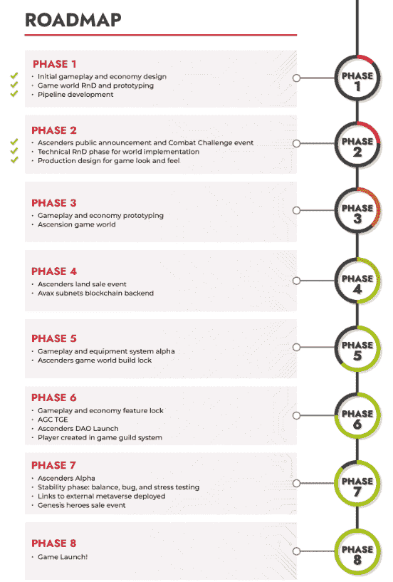

# 如何玩和赢:上升者

> 原文：<https://web.archive.org/web/https://dappradar.com/blog/how-to-play-and-win-ascenders>

## 备受期待的开放世界 MMO 在雪崩中启动

Ascenders 是一款自由漫游、开放世界的 RPG 游戏，将于 2023 年在 Avalanche 网络上逐步推出。游戏没有链上指标，因为还没有用户连接到 dapp。但是 DappRadar 一直在播放可下载的演示，我们已经对提供的内容感到非常兴奋。

**内容**

*   *[什么是上升器？](https://web.archive.org/web/20221228201345/https://dappradar.com/blog/how-to-play-and-win-ascenders/#what-is)*
*   *[关于游戏要知道的重要事情](https://web.archive.org/web/20221228201345/https://dappradar.com/blog/how-to-play-and-win-ascenders/#important-to-know)*
*   *[如何玩赢上升者](https://web.archive.org/web/20221228201345/https://dappradar.com/blog/how-to-play-and-win-ascenders/#play-and-win)*
*   *[是什么让上升者创新？](https://web.archive.org/web/20221228201345/https://dappradar.com/blog/how-to-play-and-win-ascenders/#what-innovative)*
    *   *[发光宝石](https://web.archive.org/web/20221228201345/https://dappradar.com/blog/how-to-play-and-win-ascenders/#glow-gems)*
    *   *上升者治理议会令牌*
    *   *[陆地](https://web.archive.org/web/20221228201345/https://dappradar.com/blog/how-to-play-and-win-ascenders/#land)*
    *   *[游戏物品和资源](https://web.archive.org/web/20221228201345/https://dappradar.com/blog/how-to-play-and-win-ascenders/#items-and-resources)*
*   *[ascender 什么时候下水？](https://web.archive.org/web/20221228201345/https://dappradar.com/blog/how-to-play-and-win-ascenders/#wen-launch)*
*   *[有用链接](https://web.archive.org/web/20221228201345/https://dappradar.com/blog/how-to-play-and-win-ascenders/#useful-links)*

Ascenders 是下一代 Web3 游戏的一部分，它提供的不仅仅是休闲娱乐和短暂的分心。游戏将有 AAA 级的图形，深刻的背景故事和知识，以及一个开放的世界，让玩家自由创造自己的故事。

今天是最后一天抓住你的提升者问题的白名单。在页面底部可以找到相关链接。

[https://web.archive.org/web/20221228201345if_/https://www.youtube.com/embed/suPwZ_LQrfM?feature=oembed](https://web.archive.org/web/20221228201345if_/https://www.youtube.com/embed/suPwZ_LQrfM?feature=oembed)

Ascenders trailer

[Explore Avalanche Games](https://web.archive.org/web/20221228201345/https://dappradar.com/rankings/protocol/avalanche/category/games)

## 什么是上升器？

Ascenders 是一款科幻、开放世界的动作 RPG 游戏，拥有完全去中心化的玩家驱动经济，由雪崩区块链驱动。玩家很快就可以自由探索地下城，发现地下世界的资源，制作 NFT，拥有土地，并为胜利而战。

当游戏推出时，用户将能够漫游幻想景观，并建立自己的社区。还将有一个排行榜来攀登，排名每个用户的表现。你的级别越高，获得的奖励就越多。

## 关于游戏需要知道的重要事情

### 英雄

这些是 Ascenders 中主要的游戏角色。玩家可以通过游戏性和升级来提高英雄的属性。你也可以通过在公开市场上获得最好的英雄来建立你的英雄团队。

Ascender Heroes assemble!

### 种子船

种子船是你新城市的中心。一旦你和你的飞船在阿森松岛着陆，你将需要认识其他玩家，制造物品，了解这个世界并开始你的旅程。

The gigantic Seedships will take you to Ascension

### 过度劳累

当你到达阿森松岛时，你不一定会降落在一个安全的天堂。它经常看起来像一幅奇异的风景，但是危险在每个角落等着你。

种子船降落在孤立的地方，所以当你找到新的战友时，你需要建造彼此之间的传送门。残余和前哨是充满外星敌人的危险区域。小心他们。

Ascension in all its glory

### 敌人

像任何好游戏一样，Ascenders 也有自己的坏人阵容。敌对的外星人，争夺腐朽社会的残片，以各种形状和大小出现。每一类外星敌人都有不同的特点，你需要使用不同的技能和武器来战斗。

Alien enemies

## 如何玩并赢得 Ascenders

Ascenders 试图将“塞尔达:野性的呼吸”与“夏娃:在线”MMO 经济结合起来，这要归功于游戏的四个关键元素。

探索:ascender 拥有丰富的开放世界环境，玩家可以自由探索，发现新的土地、隐藏的地下城和稀有资源。

战斗:在这片土地上横行的地下城充满了敌人，在足够安全让社区开始建设之前，需要清除它们。战斗将考验玩家，以换取丰厚的回报，甚至有机会赢得土地。

建筑:建筑物建在自己的土地上。筒仓和精炼厂可以提高生产力，而铁匠和马厩可以让玩家制造新的物品。此外，医院和商店提供服务，会馆创造社区。有许多结构可供选择，但建造的空间有限。玩家必须观察市场，明智地决定创造什么。

分散经济:玩家可以完全控制供给和需求，并可以从世界各地寻找和交易资源来制造新的物品。所有的物品都是由玩家制造和分发的，并有玩家设计的特性。

## 是什么让 Ascenders 具有创新性？

### 发光宝石

这些是作为游戏中货币的实用代币，用于建筑、物品铸造、工艺升级、从市场购买物品等活动。这些有一个无上限的供应。

### Ascenders 治理委员会令牌

ASG 是玩家用来参与重要游戏决策投票的治理令牌。AGC 的供给将被封顶，而押 AGC 将给玩家带来奖励。

### 陆地

地块是巨大的提升者世界的可拥有的部分，并且在大小上有很大的不同，从适度的地产到广阔的土地。此外，玩家可以合并相邻的土地，以创造更大的区域。

地块所有者收取被动资源收入，也可以在他们拥有的土地上建造建筑物。

### 游戏物品和资源

游戏物品以 NFT 代币的形式出现，由玩家利用资源制作而成。这些 NFT 可以升级并在市场上出售。

公共资源是在扬升者宇宙中容易获得的非区块链材料。优质资源是具有特殊功能的符号化资产。他们被要求制作 NFT 装备或化妆品。

[https://web.archive.org/web/20221228201345if_/https://www.youtube.com/embed/o71ROauqvOY?feature=oembed](https://web.archive.org/web/20221228201345if_/https://www.youtube.com/embed/o71ROauqvOY?feature=oembed)

DappRadar explains NFT

### 玩家公会

公会是 Ascenders 生态系统的核心。他们提供了一个平台，让玩家可以一起工作，在游戏中进步。他们可以通过许多不同的方式做到这一点，要么通过共同探索和建立社区。或者他们可以在地图上分享经济资源、见解和空间。

[View Avalanche NFTs](https://web.archive.org/web/20221228201345/https://dappradar.com/nft/protocol/avalanche)

## Ascenders 什么时候发射？

看看 Ascenders 的路线图，完整的游戏发布还有一段路要走。直到 2023 年第四季度，粉丝才有机会享受完整的体验。下表显示了我们将在未来 12 个月内获得原型、测试环境和有限的游戏性。

Ascenders roadmap

到目前为止，Ascenders 开发团队已经设计了游戏和经济。他们还实施了总体设计，并有一个战斗挑战，一直持续到 2022 年 4 月底。

接下来，他们将发布原型，所以我们很快就会对游戏中的世界有一个很好的了解。拐角处还有一个土地出售，所以对于任何有兴趣成为 Ascenders 社区一员的人来说，请继续关注 DappRadar，了解何时会有更新。

用户可以通过去[ascender 网站](https://web.archive.org/web/20221228201345/https://www.ascenders.gg/game.html)下载来玩游戏的试玩版。

## 有用的链接

*   [雪崩游戏排名](https://web.archive.org/web/20221228201345/https://dappradar.com/rankings/protocol/avalanche/category/games)
*   [雪崩 NFTs 概述](https://web.archive.org/web/20221228201345/https://dappradar.com/nft/protocol/avalanche)
*   [玩 Ascenders 试玩版](https://web.archive.org/web/20221228201345/https://www.ascenders.gg/game.html)
*   [认领 QOTD 白名单点](https://web.archive.org/web/20221228201345/https://gleam.io/RGlWq/question-of-the-day-1111)

## 随身携带您的 Web3 之旅

使用 DappRadar 移动应用程序，再也不会错过 Web3。查看最受欢迎的 dapps 的性能，并关注您投资组合中的 NFT。您在 DappRadar 上的帐户会与我们的移动应用程序同步，这样您很快就可以选择实时接收提醒。

[Download the DappRadar app now](https://web.archive.org/web/20221228201345/https://dappradar.app.link/blog)[<picture></picture>](https://web.archive.org/web/20221228201345/https://play.google.com/store/apps/details?id=com.portfolio.dappradar)