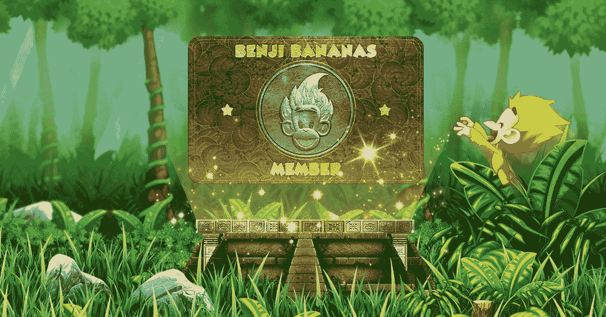

# 如何玩和赢:班吉香蕉

> 原文：<https://web.archive.org/web/https://dappradar.com/blog/how-to-play-and-win-benji-bananas>

## 玩石基香蕉，赚取灵长类动物代币！

近十年前，《石基香蕉》作为一款手机游戏首次推出。今年，它的创作者增加了一个区块链支持的游戏赚取元素。本周，超过 70，000 名用户连接到他们的 dapp，从几个月的游戏中获得灵长类动物令牌奖励。了解以下如何玩并赢得 Benji 香蕉，这样您就可以加入到乐趣中来。

**总结**

*   ***[石磊香蕉是什么？](https://web.archive.org/web/20221014121829/https://dappradar.com/blog/how-to-play-and-win-benji-bananas/#what-is)***
*   ***[如何玩石磊香蕉](https://web.archive.org/web/20221014121829/https://dappradar.com/blog/how-to-play-and-win-benji-bananas/#how-play)***
*   ***[玩赚在石基香蕉里是怎么工作的？](https://web.archive.org/web/20221014121829/https://dappradar.com/blog/how-to-play-and-win-benji-bananas/#play-to-earn)***
*   ***[什么是灵长目令牌？](https://web.archive.org/web/20221014121829/https://dappradar.com/blog/how-to-play-and-win-benji-bananas/#primate-token)***
*   ***[什么是石基关？](https://web.archive.org/web/20221014121829/https://dappradar.com/blog/how-to-play-and-win-benji-bananas/#benji-pass)***
*   ***[石基香蕉](https://web.archive.org/web/20221014121829/https://dappradar.com/blog/how-to-play-and-win-benji-bananas/#meteoric-rise)* 异军突起**

游戏很简单，简直让人上瘾。在树间荡来荡去，不要碰到地板。与上周的本周游戏类似，Benji Bananas 是一款“老式”的手机游戏，对 Web3 进行了改版。成千上万的玩家正在享受它，让他们赚取灵长类动物代币。

[Benji Bananas Single Dapp Page](https://web.archive.org/web/20221014121829/https://dappradar.com/multichain/games/benji-bananas)

## 石基香蕉是什么？

班吉香蕉早在 2013 年就作为一款手机游戏推出了。这是一个简单、令人上瘾的荡绳冒险，用户可以下载到手机上玩玩。2022 年 3 月，游戏背后的公司 Animoca Brands 宣布推出一种游戏赚取机制，将班吉香蕉带入 Web3 的世界。

建造在[以太坊区块链](https://web.archive.org/web/20221014121829/https://dappradar.com/rankings/protocol/ethereum/category/games)和[多边形第二层侧链](https://web.archive.org/web/20221014121829/https://dappradar.com/rankings/protocol/polygon/category/games)上，用户仍然可以在树上荡秋千并收集奖励。但是现在，这些奖励可以兑换成现实世界的金钱。

它仍然是免费下载和玩的，用户仍然可以享受游戏，而无需参与到游戏中来。但是通过引入一种特殊的 NFT(稍后会有更多介绍)，Animoca Brands 让那些想玩加密货币的玩家可以这样做。他们可以赚取的加密货币是灵长类动物代币。

你可以从[苹果应用商店](https://web.archive.org/web/20221014121829/https://apps.apple.com/us/app/benji-bananas-run-jump-win/id622511748)或者 [Google Play](https://web.archive.org/web/20221014121829/https://play.google.com/store/apps/details?id=com.fingersoft.benjibananas&hl=en_GB&gl=US) 下载游戏。

## 石基香蕉怎么玩

这是一个简单的游戏设置和发挥。前往本吉香蕉网站或点击上面的链接。下载游戏，选择你的角色并开始游戏。

你在树上荡来荡去，一路上收集香蕉。要在藤上荡秋千，你要按住手指。当你松开手指时，你的猴子会松开手，你会在空中荡到下一棵藤蔓上。除此之外就没什么了。

你荡得越久，你收集的香蕉就越多，你的分数就越高。当你通过这些关卡时，它们会变得越来越难。这是一个非常直接的游戏，任何人都不会太投入感情。但是这很有趣，而且很容易上瘾。

虽然从树上收集水果是本吉香蕉的主要目标，玩家也可以解锁升级。这些包括化妆品，如新皮肤。你也可以升级你的角色的物理能力，并获得动力，如喷气背包，速度提升和鹰骑。

## “游戏赚”在石基香蕉中是如何工作的？

要获得可以兑换真钱的代币，你需要通过一个 KYC 过程，包括用你的 Web3 钱包连接到平台。你可以从网站的[首页进行操作。](https://web.archive.org/web/20221014121829/https://dappradar.com/deeplink/14556)

连接钱包后，您需要验证您的会员通行证。这是本吉通行证 NFT，使您能够通过游戏赚取灵长类动物代币。然后，你需要将你的 Apple ID 或 Google Play 帐户链接到你的 Web3 钱包。

之后，您需要完成 Blockpass KYC 验证流程。一切完成后，你就可以玩石磊香蕉游戏获得现实生活中的奖励了。

Animoca Brands 在 3 月份宣布，Benji Bananas 将采用一种游戏赚取系统。从那以后，玩家通过使用他们的班吉通行证玩游戏来积累灵长类动物代币。Animoca Brands 还举办了季节性奖励活动，Benji 通行证持有者可以获得空投的灵长类动物代币。

通过游戏获得的实际收入基于五个因素:

*   距离——这是球员挥杆的最远距离。
*   总距离——这是特定时间段内累计的总距离。
*   香蕉总数——玩家累积了多少香蕉。
*   游戏总数——玩游戏的次数。
*   世界——这是玩家达到的最高水平。

对于每个在 2022 年建立灵长类动物标志的人来说，好消息是他们现在可以解锁它们了。

> 1/等待结束了！得知你可以索赔多少美元，你兴奋吗？🙊来看看 https://t.co/7ynuGLdBHG 的！为了获得最佳体验，请在桌面浏览器上访问该网站。[#如火如荼](https://web.archive.org/web/20221014121829/https://twitter.com/hashtag/FullSwing?src=hash&ref_src=twsrc%5Etfw) [#PlayandEarn](https://web.archive.org/web/20221014121829/https://twitter.com/hashtag/PlayandEarn?src=hash&ref_src=twsrc%5Etfw)
> 
> — Benji Bananas (@BenjiBananas) [August 25, 2022](https://web.archive.org/web/20221014121829/https://twitter.com/BenjiBananas/status/1562827794954223619?ref_src=twsrc%5Etfw)

Release the PRIMATE!

玩家需要[访问 Benji Bananas 网站上的申领页面](https://web.archive.org/web/20221014121829/https://benjibananas.com/claim)才能获得奖励。

## 灵长目令牌是什么？

建于以太坊区块链，灵长类动物令牌于 2022 年 4 月推出，是班吉香蕉玩赚系统的核心。这是一个 ERC-20 令牌，可与 Animoca 品牌生态系统中的其他可替换令牌交换。这些是:

*   [沙子](https://web.archive.org/web/20221014121829/https://dappradar.com/hub/token/eth/SAND?from=0x3845badade8e6dff049820680d1f14bd3903a5d0)
*   [REVV](https://web.archive.org/web/20221014121829/https://dappradar.com/hub/token/eth/REVV?from=0x557b933a7c2c45672b610f8954a3deb39a51a8ca)
*   [塔](https://web.archive.org/web/20221014121829/https://dappradar.com/hub/token/eth/TOWER?from=0x1c9922314ed1415c95b9fd453c3818fd41867d0b)
*   [GMEE](https://web.archive.org/web/20221014121829/https://dappradar.com/hub/token/eth/GMEE?from=0xd9016a907dc0ecfa3ca425ab20b6b785b42f2373)
*   [引导](https://web.archive.org/web/20221014121829/https://dappradar.com/hub/token/eth/QUIDD?from=0xda9fdab21bc4a5811134a6e0ba6ca06624e67c07)
*   [优点](https://web.archive.org/web/20221014121829/https://dappradar.com/hub/token/eth/PROS?from=0x8642a849d0dcb7a15a974794668adcfbe4794b56)
*   [结合地](https://web.archive.org/web/20221014121829/https://dappradar.com/hub/token/eth/BONDLY_1?from=0xd2dda223b2617cb616c1580db421e4cfae6a8a85)

[Discover More Tokens](https://web.archive.org/web/20221014121829/https://dappradar.com/hub/tokens/ethereum/all/1)

总共有 20.6 亿个灵长类代币，并且有大量的流动性池配对，在撰写本文时有 15 个。主要的令牌配对是与宇迦实验室的 ApeCoin。ApeCoin，或 [APE](https://web.archive.org/web/20221014121829/https://dappradar.com/hub/token/eth/APE?from=0x4d224452801aced8b2f0aebe155379bb5d594381) ，由 ApeCoin DAO 发行，作为[无聊猿游艇俱乐部](https://web.archive.org/web/20221014121829/https://dappradar.com/blog/what-is-bored-ape-yacht-club)元宇宙平台[彼岸](https://web.archive.org/web/20221014121829/https://dappradar.com/blog/what-is-the-otherside-metaverse-how-does-it-work)的主要加密货币。

使用 DappRadar 令牌浏览器，您可以用其他加密货币交换灵长类动物，包括 APE、ETH 和 USDC。[你可以在这里看到灵长类目前的价值](https://web.archive.org/web/20221014121829/https://dappradar.com/hub/token/eth/PRIMATE/APE?from=0x46e98FFE40E408bA6412bEb670507e083C8B95ff)，然后决定买卖代币。

## 石基关是什么？

班吉香蕉会员通行证，又名班吉通行证，是一个建于以太坊的 ERC-1155 代币。这意味着它是一个不可替代的令牌，或 NFT。只有持有本吉通行证，用户才能享受本吉香蕉的玩赚功能。

在首次销售活动中，有 5000 张第一版石磊通行证可供购买。买家可以购买的唯一加密货币是硬币。累积的 APE 随后被用来建立我们今天拥有的流动性池。

The Benji Pass

你可以在二级市场上买到它们，如[looks are](https://web.archive.org/web/20221014121829/https://dappradar.com/ethereum/marketplaces/looksrare)或 [Rarible](https://web.archive.org/web/20221014121829/https://dappradar.com/multichain/marketplaces/rarible) 。

## 石基香蕉的迅速崛起

正如我们在文章的顶部看到的，当游戏开放其灵长类动物奖励时，Benji Bananas 的用户增加了 37，616%。即使现在活动稍微平静下来， [Benji Bananas](https://web.archive.org/web/20221014121829/https://dappradar.com/multichain/games/benji-bananas) 仍然每天吸引数万个独特的活跃钱包。

在编写猴子摇摆区块链游戏时[看到 28，000 到 30，000 个独特的活动钱包](https://web.archive.org/web/20221014121829/https://dappradar.com/multichain/games/benji-bananas)与它们的智能合同交互。这些只是在区块链领取奖励的玩家，这意味着实际玩家人数要高得多。

## 随身携带您的 Web3 之旅

有了 DappRadar 移动应用程序，再也不要错过 Web3。查看最受欢迎的 dapps 的性能，并关注您投资组合中的 NFT。您在 DappRadar 上的帐户与我们的移动应用程序同步，很快您就可以选择实时接收提醒！

[<picture></picture>](https://web.archive.org/web/20221014121829/https://play.google.com/store/apps/details?id=com.portfolio.dappradar)[Download for Android](https://web.archive.org/web/20221014121829/https://play.google.com/store/apps/details?id=com.portfolio.dappradar) NewsletterUnsubscribe at any time. [T&Cs](https://web.archive.org/web/20221014121829/https://dappradar.com/terms) and [Privacy Policy](https://web.archive.org/web/20221014121829/https://dappradar.com/privacy-policy)