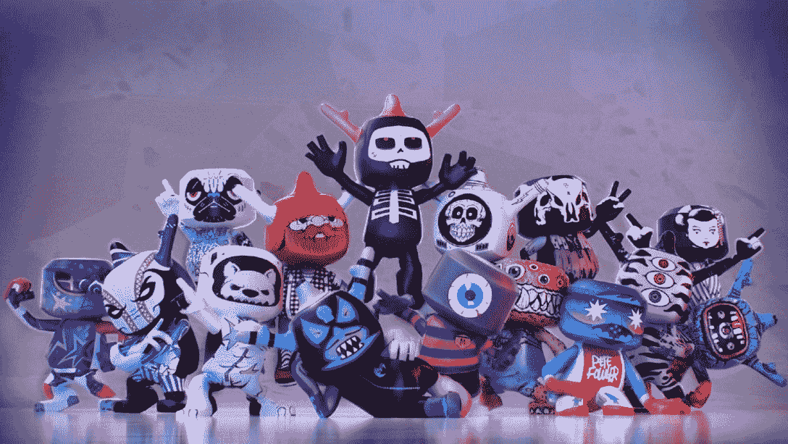

# 如何玩和赢:布兰科斯街区派对

> 原文：<https://web.archive.org/web/https://dappradar.com/blog/how-to-play-and-win-blankos-block-party>

## 充满活力的开放世界游戏基于乐趣，创造力和聚会

布兰科斯街区派对已经建立了近两年。在此期间，Web3 已经经历了许多阶段，但 Blankos 的开发人员一直坚持他们的愿景，即创造一个玩家至上的引人入胜的游戏。一种新的 Groove Party 通行证最近开始销售，并向玩家承诺更多奖励，更重要的是，更多乐趣。

**亮点**

*   *[什么是 Blankos Block Party？](https://web.archive.org/web/20221129213451/https://dappradar.com/blog/how-to-play-and-win-blankos-block-party/#what-is)*
*   *[如何在 Blankos 街区派对上入门](https://web.archive.org/web/20221129213451/https://dappradar.com/blog/how-to-play-and-win-blankos-block-party/#get-started)*
*   *[怎么玩怎么赢？](https://web.archive.org/web/20221129213451/https://dappradar.com/blog/how-to-play-and-win-blankos-block-party/#how-play-win)*
*   *[是什么让游戏具有创新性？](https://web.archive.org/web/20221129213451/https://dappradar.com/blog/how-to-play-and-win-blankos-block-party/#game-innovative)*
    *   *[Blankos](https://web.archive.org/web/20221129213451/https://dappradar.com/blog/how-to-play-and-win-blankos-block-party/#blankos)*

    *   *[创建各方和创意伙伴关系](https://web.archive.org/web/20221129213451/https://dappradar.com/blog/how-to-play-and-win-blankos-block-party/#parties-partnerships)*
*   *[聚会传递消息](https://web.archive.org/web/20221129213451/https://dappradar.com/blog/how-to-play-and-win-blankos-block-party/#pass-news)*
*   *[有用链接](https://web.archive.org/web/20221129213451/https://dappradar.com/blog/how-to-play-and-win-blankos-block-party/#useful-links)*

正如许多最近推出或计划很快推出的新区块链游戏一样，Blankos 是一款游戏优先的游戏。这意味着即使没有赢得奖励的机会，游戏玩家仍然应该认为这是值得一玩的。

布兰科斯派对通行证:对不起，我们的灰尘于 11 月 23 日开始出售。持有者可以赢得特别的奖品和奖励。通行证有效期至 12 月 7 日，届时主宇宙槽党通行证掉落。这将持续到 2023 年 1 月 18 日，费用为 15 美元。

[Explore Web3 Games](https://web.archive.org/web/20221129213451/https://dappradar.com/rankings/category/games)

## 什么是布兰科斯街区派对？

Blankos 是一款免费的大型开放世界游戏，用户可以四处漫游并收集 Blankos，这是一种数字乙烯基玩具。这款游戏专注于艺术、美学和活力，这意味着它是一个令人惊叹的奇观。在开放世界中，其他用户创建小的迷你游戏，你们可以一起玩。

游戏由神话游戏和第三类游戏开发，最初于 2020 年 12 月发售。近两年后，它成为第一个出现在 Epic 游戏商店的游戏。

[https://web.archive.org/web/20221129213451if_/https://www.youtube.com/embed/dhkx6g2EED8?feature=oembed](https://web.archive.org/web/20221129213451if_/https://www.youtube.com/embed/dhkx6g2EED8?feature=oembed)

Blankos Block Party trailer

Blankos 建立在神话平台上，这个平台本身就是一个私人区块链。这个区块链是基于 EOSIO 的，EOS io 是支持 EOS 网络的相同技术。神话有一个通往以太坊的桥梁，所以虽然区块链是私有的，但它可以连接到 Web3 生态系统的其他领域。

## 如何开始布兰科街区派对

### KYC

用电子邮件地址和密码注册。输入你的角色名，指定你的国家或居住地和出生日期。

### 安装 blancos 块党

点击“创建我的帐户”后，你会看到一个在线游戏启动，并根据你的操作系统选择安装到你的电脑上。

### 按照说明来玩

从这里，你可以按照指示到游戏区。一旦你加入，你就可以决定你想怎么玩。选择权在你。

## 怎么玩怎么赢？

布兰科斯并不是真的想“赢”。是玩的问题。这是一个自由的世界，在这里你可以漫游，认识新的人，发现新的创造。虽然游戏中没有最终目标，也没有任何支配性的叙述，但还是有奖励可以赢取。

玩家可以在 Blankos 中通过做两件事来获得奖励:持有一张聚会通行证和完成挑战。派对通行证是季节性的，持有一张通行证会在你完成相关挑战时奖励你。每天、每周和定期都有挑战，当你完成它们，你就离 NFT 奖励更近了。

[https://web.archive.org/web/20221129213451if_/https://www.youtube.com/embed/lZL8wUjHu10?feature=oembed](https://web.archive.org/web/20221129213451if_/https://www.youtube.com/embed/lZL8wUjHu10?feature=oembed)

Blankos does Godzilla

在 Blankos，建立挑战是另一种获得奖励的有趣方式。创造一个神奇的世界或者做一个大家都想玩的游戏。如果你这样做了，你将会赢得 NFT，你可以在神话市场中持有或出售。

## 是什么让游戏具有创新性？

### Blankos

每个布兰科斯都是 NFT。这意味着当你得到一个，你就拥有了它。没有人，甚至是游戏的创造者，能够把它从你这里拿走。此外，一旦你有了一个 Blanko，你可以把它卖掉，有可能获利。这些可玩的 NFT 可以升级和合并来创建新的。

Blankos looking scary AF

### 神话市场

这是本地市场，玩家可以在这里交易游戏中的物品。这些可以是配件，也可以是 Blankos，玩家可以用 Blankos Bucks(可以购买)或者 Moola(可以赚取)来支付。神话中的市场是基于点对点交易的二级市场。

## 创建政党和创造性的伙伴关系

游戏玩家可以积极塑造布兰科斯街区派对环境。因此，玩家可以参与进来，让这个空间变得更有趣、更有活力，而不是被动地在预设的环境中玩耍。

玩家可以使用一系列的物品、玩具和配件来组织聚会。然后，根据聚会的类型，其他玩家可以通过一起比赛、射击和收集来参与进来。这是一个将在未来几年内打造一个忠诚社区的模式。

Deadmau5 in Blankos

除了玩家能够塑造布兰科斯世界之外，神话游戏还与顶级品牌建立了合作伙伴关系，以便他们能够将自己的创意才华带到这个世界。博柏利、Deadmau5 和马拉松服装公司都已签约将他们的愿景带到布兰科斯。

## 派对通行证新闻

如前所述，布兰科斯派对通行证:请原谅我们在 11 月 23 日落下的灰尘。这是最新的季节性通行证，让玩家可以选择赢得奖品和奖励。Cosmic Groove Party Pass 原定于 11 月 23 日发布，但被推迟了两周。

在 12 月 7 日之前,“宽恕我们的灰尘”将作为一个占位符，届时主要的宇宙凹槽通行证将下降，并给玩家提供全方位的奖励机会。神话游戏表示，延迟是由于“相当多的错误…导致不太棒的体验”。

重复一遍，宇宙沟通行证将从 12 月 7 日运行到 2023 年 1 月 23 日。它将花费 15 美元，玩家将获得游戏中的货币，全新的项目和有趣的新挑战。

## 有用的链接

*   [探索区块链游戏](https://web.archive.org/web/20221129213451/https://dappradar.com/rankings/category/games)
*   [阅读 Blankos 文章](https://web.archive.org/web/20221129213451/https://dappradar.com/blog/search/?q=blankos%20)
*   [发现 EOS 游戏](https://web.archive.org/web/20221129213451/https://dappradar.com/rankings/protocol/eos)

## 随身携带您的 Web3 之旅

使用 DappRadar 移动应用程序，再也不会错过 Web3。查看最受欢迎的 dapps 的性能，并关注您投资组合中的 NFT。您在 DappRadar 上的帐户会与我们的移动应用程序同步，这样您很快就可以选择实时接收提醒。

[Download the DappRadar app now](https://web.archive.org/web/20221129213451/https://dappradar.app.link/blog)[<picture></picture>](https://web.archive.org/web/20221129213451/https://play.google.com/store/apps/details?id=com.portfolio.dappradar)