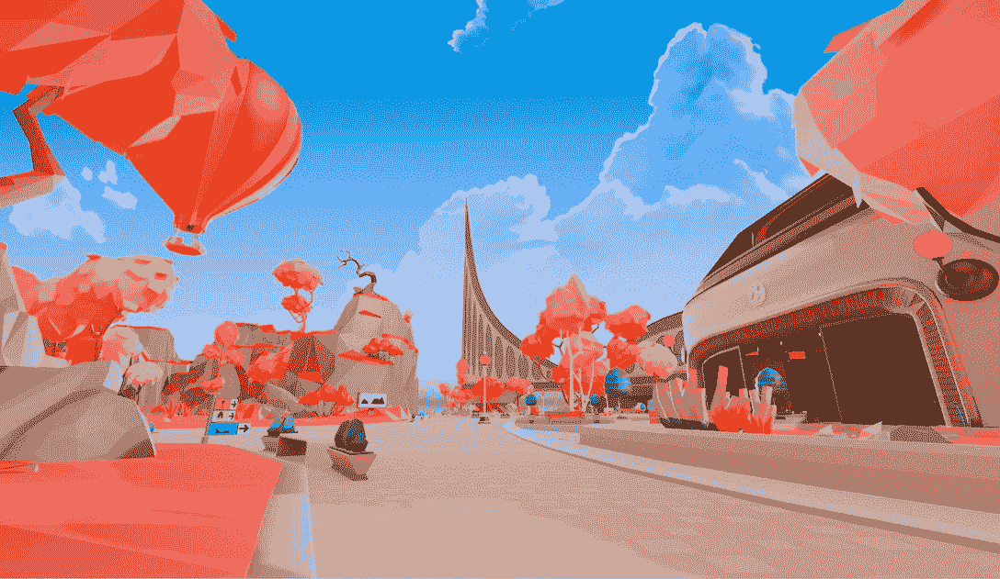
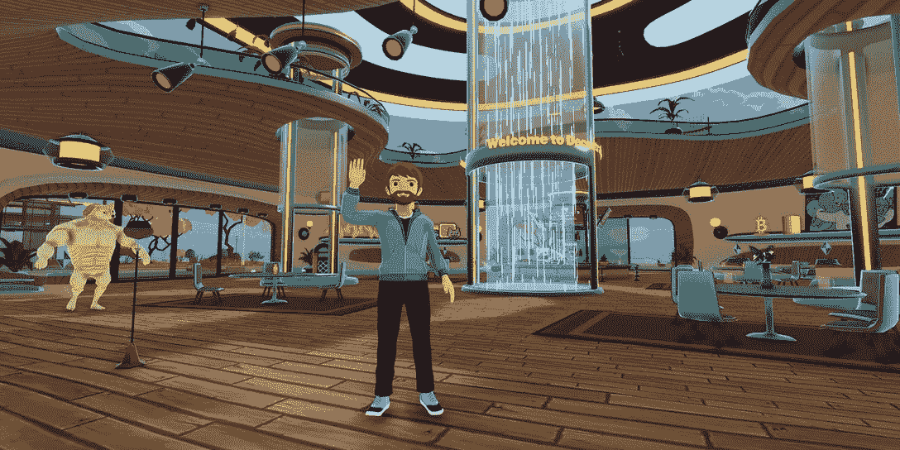

# 如何玩和赢:分散的世界

> 原文：<https://web.archive.org/web/https://dappradar.com/blog/how-to-play-and-win-decentraland-worlds>

## 在元宇宙为每个人创造空间

分散世界是 Web3 领域最著名的虚拟世界平台之一。现在，任何拥有分散土地名称的人都可以通过分散土地世界访问其生态系统。虽然你不能拥有土地，但你可以在上面创造，吸引人们，甚至可以赚钱。

**亮点**

*   *[什么是分散世界？](https://web.archive.org/web/20221231001456/https://dappradar.com/blog/how-to-play-and-win-decentraland-worlds/#what-is)*
*   *[如何涉足](https://web.archive.org/web/20221231001456/https://dappradar.com/blog/how-to-play-and-win-decentraland-worlds/#get-involved)*
*   *[什么是分散地？](https://web.archive.org/web/20221231001456/https://dappradar.com/blog/how-to-play-and-win-decentraland-worlds/#what-is-dcl)*
*   *[如何开始玩 Decentrland](https://web.archive.org/web/20221231001456/https://dappradar.com/blog/how-to-play-and-win-decentraland-worlds/#start-playing)*
*   *[能否赢得比赛？](https://web.archive.org/web/20221231001456/https://dappradar.com/blog/how-to-play-and-win-decentraland-worlds/#can-you-win)*
*   [*是什么让去中心化创新？*](https://web.archive.org/web/20221231001456/https://dappradar.com/blog/how-to-play-and-win-decentraland-worlds/#what-makes-innovative)
    *   *[分权](https://web.archive.org/web/20221231001456/https://dappradar.com/blog/how-to-play-and-win-decentraland-worlds/#decentralization)*
    *   *[数字资产所有权](https://web.archive.org/web/20221231001456/https://dappradar.com/blog/how-to-play-and-win-decentraland-worlds/#ownership)*
    *   [MANA](https://web.archive.org/web/20221231001456/https://dappradar.com/blog/how-to-play-and-win-decentraland-worlds/#mana)
    *   *[互通](https://web.archive.org/web/20221231001456/https://dappradar.com/blog/how-to-play-and-win-decentraland-worlds/#interoperability)*
    *   *[定制与创意](https://web.archive.org/web/20221231001456/https://dappradar.com/blog/how-to-play-and-win-decentraland-worlds/#custom-create)*
*   *[2022 年最大土地销售额](https://web.archive.org/web/20221231001456/https://dappradar.com/blog/how-to-play-and-win-decentraland-worlds/#biggest-land)*
*   *[良好数据的重要性](https://web.archive.org/web/20221231001456/https://dappradar.com/blog/how-to-play-and-win-decentraland-worlds/#important-data)*
*   *[有用链接](https://web.archive.org/web/20221231001456/https://dappradar.com/blog/how-to-play-and-win-decentraland-worlds/#useful-links)*

分散的土地价格(见下文)会让许多人负担不起建造虚拟世界的费用。现在，用户可以建立一个属于自己的空间，而不需要真正拥有或出售它。分散土地世界是一种创新的新方式，吸引创造性人才将分散土地带入 2023 年。

[https://web.archive.org/web/20221231001456if_/https://www.youtube.com/embed/CPcOk2sKzCM?feature=oembed](https://web.archive.org/web/20221231001456if_/https://www.youtube.com/embed/CPcOk2sKzCM?feature=oembed)

[Explore Decentraland Data](https://web.archive.org/web/20221231001456/https://dappradar.com/multichain/social/decentraland)

## 什么是分散世界？

分散之地世界是个人的，四个与分散之地名称相关的小块土地，独立于分散之地的创世城及其相关土地。如果你还没有名字，你需要购买一个 100 法力点的名字。世界是一个个人空间，用户可以探索整个游戏是如何工作的，以及如何在里面进行创作。

虽然世界是开放的，人们可以在上面建造和创造，但它们不能被出售。如前所述，分散世界目前正处于测试阶段，并开放加入。

## 如何参与

### 如何激活自己的世界

如果你在分散地拥有一个名字，你可以使用 [SDK 命令行工具(CLI)](https://web.archive.org/web/20221231001456/https://docs.decentraland.org/creator/development-guide/publishing/) 访问 Worlds beta。要激活与您的名字相关联的世界，只需遵循部署场景的正常过程，但要确保指定正确的内容服务器。

**第一步**

修改 scene.json 文件以添加以下代码片段:

{

"世界配置":{

" dclName:" " NAME . DCL . eth "

  }

}

**第二步**

部署，使用命令:

DCL deploy–target-content[https://worlds-content-server . decoupled land . or](https://web.archive.org/web/20221231001456/https://worlds-content-server.decentraland.org/)g

**第三步**

在世界聊天框中使用 play.decentraland.org/world/NAME 或/change realm name . DCL . eth * *输入世界。

### 如何参观一个世界

有两种方法可以进入已经部署的场景。您可以使用特定的 URL，也可以在世界聊天框中输入命令:

*   要使用该 URL，请转到您的浏览器并输入“play .分散的土地. org/world/NAME”，用与您想要输入的世界相关联的分散的土地名称替换“NAME”。
*   要使用世界聊天框进入一个世界，请按“enter”打开聊天框，然后键入:“/changerealm NAME.dcl.eth”。再次按“回车”执行命令。

注意:在上面的指示中，你应该将“名称”替换为与你试图进入的世界相关的分散名称。

## 什么是分权制？

分散王国是一个建立在以太坊区块链上的虚拟现实平台。它允许用户在虚拟世界中创建、体验和货币化内容和应用。分散的土地是由一个相互连接的 3D 场景或“地块”组成的网络，用户可以与之互动。

Decentraland is a full-sized virutal world

每个包裹都拥有一个唯一的以太坊地址，可以使用加密货币进行买卖或租赁。用户可以定制自己的头像，探索虚拟世界，参与平台内的各种活动和事件。

分散土地是一个开放的平台，因此任何人都可以创建和发布内容，以及举办活动和体验。

## 如何开始玩分散游戏

1.  创建一个以太坊钱包。

分散土地使用以太坊区块链存储和转移虚拟资产，如地块。为了与这些资产进行交互，您需要创建一个以太坊钱包，如 MetaMask 或 MyEtherWallet。

2.  安装分散应用程序。

要访问分散的虚拟世界，你需要在电脑上安装分散的应用程序。您可以从分散网站或 GitHub 资源库下载该应用程序。分散的土地也可以通过你的网页浏览器，但这将妨碍加载时间和性能。

3.  获取一些法力。

MANA 是一种加密货币，用于购买、出售和租赁分散土地内的地块。你需要购买一些法力来与虚拟世界互动。在这里，你可以通过我们的代币交换功能购买法力。

[Live MANA Price](https://web.archive.org/web/20221231001456/https://dappradar.com/hub/token/eth/MANA/ETH?from=0x0f5d2fb29fb7d3cfee444a200298f468908cc942)

4.  探索并开始享受乐趣。

一旦你设置了以太坊钱包，安装了分散的应用程序，并购买了一些法力，你就可以开始探索虚拟世界，并与其他用户和虚拟资产互动。您可以自定义您的头像，访问不同的 3D 场景，或在平台内创建自己的内容。

## 你能赢得比赛吗？

说到权力下放，win 这个词可能用错了。你可以在虚拟世界中不断地玩耍、探索和体验。作为一个虚拟现实平台，用户可以在分散的网络中创建 3D 场景或“世界”，并与之交互。你可以定制他们的头像，漫游数字街道，参与平台内的各种活动和事件。

这么说吧，有几种方法可以让你在“分散的土地”中获得成功:

### 创建和发布高质量的内容

用户可以通过在分散平台内创建和发布内容来赚取加密货币。这包括创建 3D 场景、举办活动或开发互动体验。

### 买卖地块

分散土地内的地块可以使用加密货币进行买卖和租赁。能够以低价购买地块，然后以更高价格出售的用户可能会获得利润。

### 参与活动和体验

分散用户可以参与平台内的各种活动和体验，如音乐会、游戏比赛或艺术展览。

## 是什么让分散的土地具有创新性？

### 分散

分散平台是一个分散的平台，这意味着它不是由单一实体拥有或控制的。相反，它是由分布式计算机网络来操作的，这允许更大的透明性、安全性和自主性。

### 数字资产的所有权

在分散土地中，用户可以使用加密货币拥有虚拟资产，如地块。这些资产存储在以太坊区块链上，它允许这些资产的安全和透明的所有权和转移。

[https://web.archive.org/web/20221231001456if_/https://www.youtube.com/embed/fkEaXYLOW-s?start=2&feature=oembed](https://web.archive.org/web/20221231001456if_/https://www.youtube.com/embed/fkEaXYLOW-s?start=2&feature=oembed)

DappRadar’s NFT Explorer

### 威望

法力令牌是分散平台的原生加密货币。人们可以使用它在分散的虚拟现实平台中购买、出售和租赁地块。您还需要它来在平台内创建和发布内容。法力是建立在以太坊区块链上的，持有者需要一个基于以太坊的钱包来存放它。

### 互用性

分散之地建立在以太坊区块链之上，这允许它与其他基于以太坊的平台和 dapps 进行交互。这允许为分散土地创建新的和创新的用例。你的虚拟角色的大多数数码时尚物品都存在于多边形区块链上。

### 定制和创意

分散的土地是一个开放的平台，这意味着任何人都可以在平台内创建和定制自己的 3D 场景，或“世界”。这允许在平台内开发广泛的创造性和创新性内容和体验。

Create your own space in the ecosystem

## 2022 年最大的土地销售

土地是分散土地的核心资产之一。因此，我们总结了 2022 年最大的五个销售额:

*   [龙城庄园](https://web.archive.org/web/20221231001456/https://dappradar.com/hub/assets/eth/0x959e104e1a4db6317fa58f8295f586e1a978c297/1747)–31.5 万[法力](https://web.archive.org/web/20221231001456/https://dappradar.com/hub/token/eth/MANA/ETH?from=0x0f5d2fb29fb7d3cfee444a200298f468908cc942)(93.87 万美元)–2 月 18 日
*   [包裹-39，8](https://web.archive.org/web/20221231001456/https://dappradar.com/hub/assets/eth/0xf87e31492faf9a91b02ee0deaad50d51d56d5d4d/115792089237316195423570985008687907839998972355723963964385974318074169393160)–112，000 法力值(280，000 美元)–3 月 16 日
*   [包裹-129，22](https://web.archive.org/web/20221231001456/https://dappradar.com/hub/assets/eth/0xf87e31492faf9a91b02ee0deaad50d51d56d5d4d/115792089237316195423570985008687907809373559332839502252682259649215030362134)–112，000 法力值(271，040 美元)–3 月 16 日
*   [包裹-71，98](https://web.archive.org/web/20221231001456/https://dappradar.com/hub/assets/eth/0xf87e31492faf9a91b02ee0deaad50d51d56d5d4d/115792089237316195423570985008687907829109936614253933133557986880257586626658)-60 ETH(187，770 美元)-2 月 16 日
*   [非常集中，售价为](https://web.archive.org/web/20221231001456/https://dappradar.com/hub/assets/eth/0xf87e31492faf9a91b02ee0deaad50d51d56d5d4d/1361129467683753853853498429727072845803#tradingHistory)–51.85 瑞士法郎(160，740 美元)——4 月 19 日

从上面的价格可以看出，即使在 2022 年的经济低迷时期，分散土地内的庄园和地块仍在获得高价。

[Explore Land Sales](https://web.archive.org/web/20221231001456/https://dappradar.com/multichain/social/decentraland/nfts)

## 良好数据的重要性

今年，当媒体 Coindesk 注意到连接到分散式智能合同的独特活动钱包(UAW)数量非常少时，DappRadar 和分散式智能合同出现在新闻中。

当 DappRadar 数据显示只有 38 人在一个月内玩过这款游戏时，混乱出现了。实际发生的情况是 38 个 Web3 钱包连接到了游戏，但在所有交易被批量加载到区块链之前，许多分散的活动发生在链外。使用该方法来处理活动可以为人们节省资金，并使体验更加顺畅。

在新闻报道的背后，我们与分散公司密切合作，指导他们手动更新智能合同。他们使用[我们专用的开发人员仪表板](https://web.archive.org/web/20221231001456/https://dappradar.com/dashboard/submit-dapp)来确保他们所有的智能合同都被我们的工具跟踪。

当分散土地更新他们的智能合同时，它显示一个月内有 775 架独特的无人机与分散土地智能合同相关联。和分散地发布了他们自己的数据，显示在同一时期有 6 万名玩家玩这款游戏。

[Learn About UAW](https://web.archive.org/web/20221231001456/https://dappradar.com/blog/dappradar-tracks-unique-active-wallets-but-what-does-that-mean)

## 有用的链接

*   [分散数据](https://web.archive.org/web/20221231001456/https://dappradar.com/multichain/social/decentraland)
*   [探索 Web3 游戏](https://web.archive.org/web/20221231001456/https://dappradar.com/rankings/category/games)
*   [探索以太坊游戏](https://web.archive.org/web/20221231001456/https://dappradar.com/rankings/protocol/ethereum/category/games)
*   [发现多边形游戏](https://web.archive.org/web/20221231001456/https://dappradar.com/rankings/protocol/polygon/category/games)
*   [查看活体法力价格](https://web.archive.org/web/20221231001456/https://dappradar.com/hub/token/eth/MANA/ETH?from=0x0f5d2fb29fb7d3cfee444a200298f468908cc942)
*   [阅读分散的文章](https://web.archive.org/web/20221231001456/https://dappradar.com/blog/search/?q=decentraland)