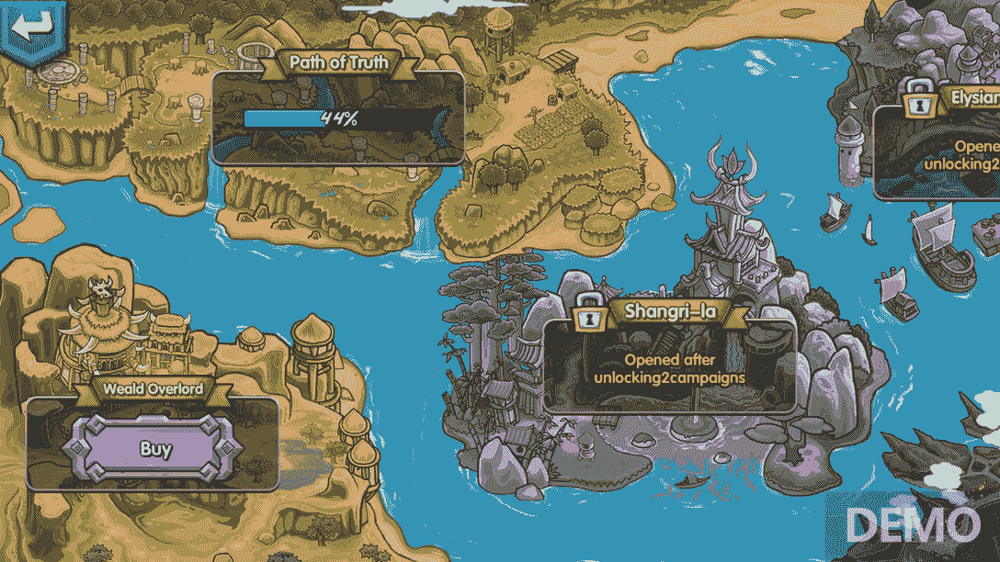
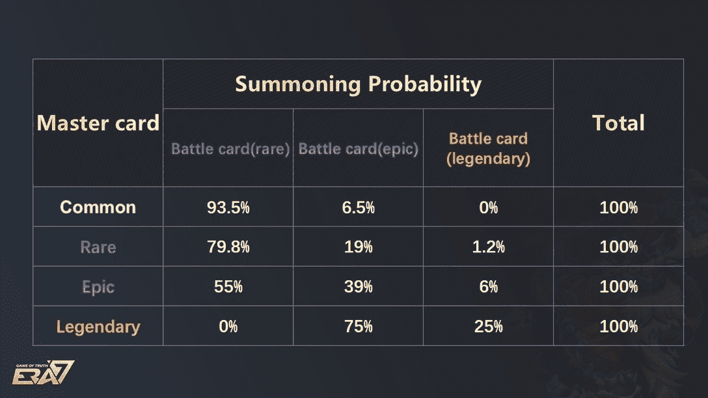
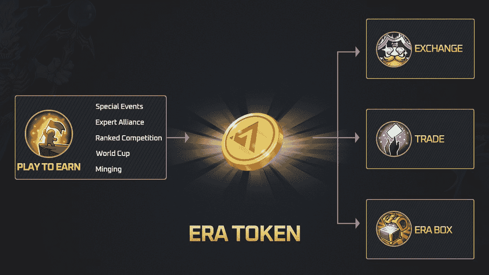
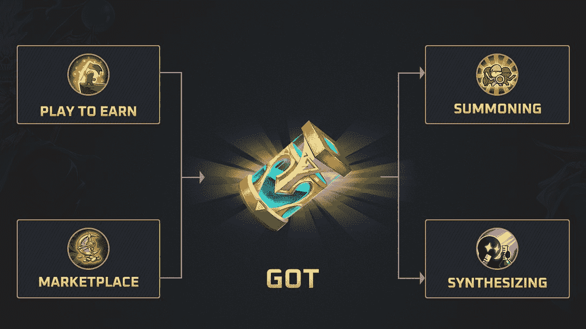
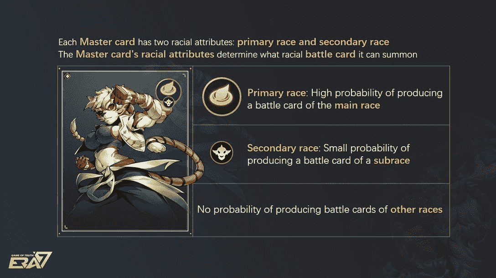

# 如何玩和赢:Era7:真实的游戏

> 原文：<https://web.archive.org/web/https://dappradar.com/blog/how-to-play-and-win-era7-game-of-truth>

## Era7:《真实的游戏》排在第 13 位，这是 DappRadar 的游戏排名

Era7:真实游戏于 2022 年在 Q1 推出，已经在区块链顶级纸牌交易游戏中占有一席之地。和所有的 Web3 游戏一样，用户可以获得代币来兑换现实生活中的金钱。有很多方法可以做到这一点，所以知道如何玩并赢得 Era7:真理游戏是值得的。

**总结**

*   ***[什么是 Era7:真理的游戏？](https://web.archive.org/web/20221202021932/https://dappradar.com/blog/how-to-play-and-win-era7-game-of-truth/#what-is)***
*   ***[如何玩 Era7:真相游戏](https://web.archive.org/web/20221202021932/https://dappradar.com/blog/how-to-play-and-win-era7-game-of-truth/#how-to)***
    *   ***[收卡](https://web.archive.org/web/20221202021932/https://dappradar.com/blog/how-to-play-and-win-era7-game-of-truth/#acquiring-cards)***

*   ***[游戏内代币](https://web.archive.org/web/20221202021932/https://dappradar.com/blog/how-to-play-and-win-era7-game-of-truth/#in-game-tokens)***
*   ***[游戏内 NFTs](https://web.archive.org/web/20221202021932/https://dappradar.com/blog/how-to-play-and-win-era7-game-of-truth/#in-game-nfts)***
*   ***[如何用 Era7 赚取:游戏的真相](https://web.archive.org/web/20221202021932/https://dappradar.com/blog/how-to-play-and-win-era7-game-of-truth/#earn-in-game)***
    *   ***[玩法](https://web.archive.org/web/20221202021932/https://dappradar.com/blog/how-to-play-and-win-era7-game-of-truth/#gameplay)***

    *   ***[交易](https://web.archive.org/web/20221202021932/https://dappradar.com/blog/how-to-play-and-win-era7-game-of-truth/#trading)***
    *   ***[下线](https://web.archive.org/web/20221202021932/https://dappradar.com/blog/how-to-play-and-win-era7-game-of-truth/#referrals)***
*   **[有用链接](https://web.archive.org/web/20221202021932/https://dappradar.com/blog/how-to-play-and-win-era7-game-of-truth/#useful-links)**

在过去的一周，超过 32，000 名用户将他们的钱包连接到 Era7:真理游戏 dapp。这相当于每周增长 11.3%。玩家通过游戏进行了超过 20.3 万次交易，比上周增长了 28.73%。交易量也在上升。

[Explore Era7 On-Chain Analytics](https://web.archive.org/web/20221202021932/https://dappradar.com/binance-smart-chain/games/era7-game-of-truth)

## 什么是 Era7:真理的游戏？

Era7:真实游戏是一个虚拟的交易卡和战斗游戏。它建立在[币安智能链](https://web.archive.org/web/20221202021932/https://dappradar.com/rankings/protocol/binance-smart-chain)的基础上，于 2022 年 3 月推出，并一直占据 [DappRadar 游戏排名](https://web.archive.org/web/20221202021932/https://dappradar.com/rankings/category/games)的前 20 名。

Era7 由 TruthGame PTE LTD .开发。该游戏明显从炉石和魔法:聚会等其他交易卡游戏中获得了“艺术灵感”，因此这些游戏的粉丝也应该喜欢这款游戏。

游戏也有自己的绝杀。它的特点是七个种族在真理大陆上竞争真理之王。这些种族中有天赋的人会进入召唤师学院，在那里他们会获得召唤卡片的能力。

一旦他们磨练了这些技能，他们就可以在 Era7 世界中与其他有特殊技能的玩家建立召唤契约。这些盟友为权力和成为真理之王的权利而战。授予这些胜利者的不仅仅是荣誉。奖励也以代币的形式出现。

建立在区块链之上的 Era7 不仅仅是一款交易卡牌游戏。有一个推荐系统，奖励玩家与他们的朋友签约加入。并且玩家可以通过耕作机制赚取代币。

## 如何玩 Era7:真相游戏

和其他交易卡牌游戏类似，Era7 靠的是好的策略。用户需要了解如何构建他们的卡片组。他们在战斗中部署资产时需要仔细考虑。

Era7 是一个虚拟世界，用户可以通过它来进行战斗。新的领域提供了不同的挑战，玩家的目标是征服他们面前的一切。未来，土地销售和所有权将成为 Era7 的一个重要特征。

土地所有者将能够从他们的土地资源中获得代币。持有者也可以在自己的土地上建造房屋，并向来访的其他玩家收费。

Era7 map

Era7 中的战斗每场大约持续三分钟。因此，这个平台非常适合那些想玩游戏但又不能投入太多时间的人。

#### 收卡

有两种方法可以得到 Era7 卡。你可以在公开市场上购买或者召唤他们。在公开市场上购买它们很容易:为自己准备一个币安兼容的 Web3 钱包，去 Era7 的本地市场购买你想要的卡。

另一种获得交易卡的方式是通过召唤。为此，您需要:

*   首先购买一张 NFT 万事达卡。每张主卡都有两个种族属性，这决定了你游戏中战斗卡的特征。主卡来自神秘盒子，玩家可以从市场上购买。
*   打开主卡。现在你可以用它来召唤战斗卡。下表显示了获得不同战斗卡类型的概率，取决于你的主卡。
*   玩家需要至少 30 张战斗卡才能进入对抗对手的比赛。有多达 1000 种不同的战斗卡可供选择。

How likely will you be to Summon a Legendary Battle Card?

#### 斗争

一旦你有了战斗卡，你就可以真正开始玩 Era7 了。正如我们已经看到的，你需要 30 张牌来参与战斗。从这个预置的 30 张中，电脑随机抽取卡片给你玩。

一旦你选择了你最好的一副牌，你进入竞技场，它由两个 3×3 的格子组成。你战略性地将你选择的牌放在战场上。所有 1000 张战斗卡都有不同的属性。有些适合进攻，而有些则是用来防守的。

[Explore Era7 Card Lore](https://web.archive.org/web/20221202021932/https://www.era7.io/#/HowToPlayPage)

Era7 的诀窍是去除游戏中的随机因素。如果你预先准备好的 30 张牌一直很强，那么在战斗中你将拥有一手强大而平衡的牌。

卡片的摆放和卡片的选择一样重要。牺牲较弱的牌来防御较强的进攻牌。短期内不要怕输牌来赢得整体战役。

[https://web.archive.org/web/20221202021932if_/https://www.youtube.com/embed/OL-kmViFsZY?feature=oembed](https://web.archive.org/web/20221202021932if_/https://www.youtube.com/embed/OL-kmViFsZY?feature=oembed)

Era7 gameplay in action

有两种战斗模式:玩家对环境(PvE)和玩家对玩家(PvP)。

*   **PvE**——通过关卡，收集 Era7:真相游戏(GOT)代币。部署你的卡战斗由计算机控制的敌人。
*   你可以通过访问 PvP 竞技场来对抗活着的对手。电脑会让你和真人比赛。有几种游戏模式:专家联盟(每日)，排名赛(每月)，单词杯(每两周)。您不仅可以赢得 GOT 和 Era 代币，还可以获得排名积分。

## 游戏中的代币

Era7 有两种游戏内货币:Era 和 GOT。

#### 时代

时代是游戏中的货币，是保持经济运转的润滑剂。这是游戏的治理令牌，市场货币，以及 PvP 战斗的注册令牌。

您可以通过赢得 PvP 战斗、流动性挖掘、游戏内奖励或空投来赢得时代令牌。或者，你可以在集中和分散的交易所购买。

Era token utility

[Check Era Price](https://web.archive.org/web/20221202021932/https://dappradar.com/hub/token/bsc/ERA?from=0x6f9F0c4ad9Af7EbD61Ac5A1D4e0F2227F7B0E5f9)

#### 得到

GOT 只有在战斗中取得胜利时才可用。玩家用它来召唤和合成卡片。合成卡片意味着将两张卡片加在一起，形成一张更强的卡片。

GOT token utility

[Check GOT Price](https://web.archive.org/web/20221202021932/https://dappradar.com/hub/token/bsc/GOT)

## 游戏内 NFTs

Era7 的主要 NFT 是卡。无论是主卡还是战斗卡，这些都是玩家用来赢得战斗的资产。它们有不同等级的力量和稀有度:普通、稀有、史诗、传奇。

如你所料，战斗卡越稀有，战斗能力越强。主卡越稀有，玩家可以召唤的战斗卡就越多。如果更好、更稀有的信用卡不是最贵的，它就不会是一个真正的动态市场。

传说中的万事达卡可以卖到 1000 美元以上，但出售的并不多。传奇战斗卡的价格从 20 美元到 1500 美元不等。这种差异的原因是一些特征比其他特征更受重视。造成严重伤害的攻击卡是最贵的。

如上所述，土地将很快成为游戏内的 NFTs。在游戏中，这些将被称为大陆，将会有“无尽的土地供‘持有者’建造和经营他们自己的家园。”

Era7 的路线图还没有提供土地出售的日期。因此，如果你将来想购买一些，你需要关注 DappRadar 的博客和 Era7 的社交媒体以获取更新。

 NewsletterUnsubscribe at any time. [T&Cs](https://web.archive.org/web/20221202021932/https://dappradar.com/terms) and [Privacy Policy](https://web.archive.org/web/20221202021932/https://dappradar.com/privacy-policy)

## 如何在 Era7:真实游戏中赚钱

#### 游戏部分

这很简单:打败对手，赚到钱。正如我们在上面已经看到的，你可以从 PvE 游戏模式中获得 GOT。而且你可以从 PvP 游戏模式中赚取 Era 和 GOT。

#### 农业

Era7 农场是该平台将 DeFi 整合到其产品中的方式。要获得 ERA-BNB LP 令牌，您需要向 [PancakeSwap](https://web.archive.org/web/20221202021932/https://dappradar.com/binance-smart-chain/defi/pancakeswap) 上的 [ERA-BNB](https://web.archive.org/web/20221202021932/https://pancakeswap.finance/add/BNB/0x6f9F0c4ad9Af7EbD61Ac5A1D4e0F2227F7B0E5f9) 池提供流动性。您将获得 LP 代币，比例与您对整个资金池的贡献成正比。

例如，如果您贡献了 1%的 LP 代币，您将从资金池中获得 1%的奖励。

#### 贸易

你可以交易代币，也可以交易 NFT。现货交易时代还是能给你带来一些利润的。或者，如果价值下降并保持在低位，你会赔钱。这是一种高度投机的实践，在从事之前最好先做些研究。

在防范大损失方面，交易游戏内卡 NFT 稍微安全一些。获得一张可以用来召唤传奇战斗卡的传奇主卡是创造利润的好方法。

但请记住，Era7 NFTs 的价值来自两个地方:一是它们在游戏中的实力。更强大的卡帮助玩家赢得比赛，这本身就是一件好事。但是很多玩家玩游戏是为了挣钱。所以更高的时代和得到的价格增加了卡的价值。

#### 参考

Referral+是 Era7 的系统，用于奖励将其他玩家带入游戏的玩家。只有拥有 Era7 帐户并将其钱包连接到 dapp 的人才能使用它。

玩家每有一个朋友注册游戏并声称从游戏中获得 20 个时代代币。每次被推荐的朋友声称得到，推荐人得到 5%的声称得到的令牌。

## 有用的链接

*   [Era7:真相游戏单人 dapp 页面](https://web.archive.org/web/20221202021932/https://dappradar.com/binance-smart-chain/games/era7-game-of-truth)
*   [达普拉达的 BNB 连锁博彩排名](https://web.archive.org/web/20221202021932/https://dappradar.com/rankings/protocol/binance-smart-chain/category/games)
*   [召唤战斗卡的完整说明](https://web.archive.org/web/20221202021932/https://whitepaper.era7.io/era7-game-of-truth/game-play/summoning)
*   [你可能错过的 BNB 连锁最热门的 5 款游戏](https://web.archive.org/web/20221202021932/https://dappradar.com/blog/the-5-hottest-games-on-bnb-chain-you-probably-missed)