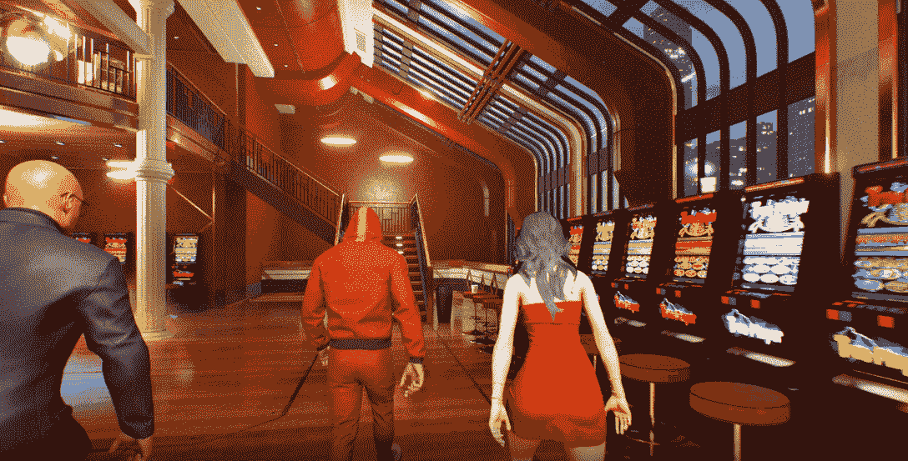

# 如何玩和赢:螺旋

> 原文：<https://web.archive.org/web/https://dappradar.com/blog/how-to-play-and-win-helix>

## 新的 GTA 风格的开放世界游戏，玩家创造故事

在 HELIX 等游戏的引领下，区块链游戏将在 2023 年进入一个新阶段。《MMORPG》加入了将于明年退出的一长串游戏名单，希望兑现业界谈论已久的 AAA 游戏承诺。早期迹象表明，HELIX 已经为 Web3 游戏的可能性设定了新的期望。准备好迎接尖端的图形和引人注目的故事情节，以及安全的所有权和真正的奖励。

**内容**

*   *[什么是螺旋线？](https://web.archive.org/web/20230113152249/https://dappradar.com/blog/how-to-play-and-win-helix/#what-is)*
*   *[如何玩游戏](https://web.archive.org/web/20230113152249/https://dappradar.com/blog/how-to-play-and-win-helix/#how-to)*
    *   *[角色扮演](https://web.archive.org/web/20230113152249/https://dappradar.com/blog/how-to-play-and-win-helix/#role-playing)*
    *   *[游戏模式](https://web.archive.org/web/20230113152249/https://dappradar.com/blog/how-to-play-and-win-helix/#gameplay-modes)*
*   *[是什么让 HELIX 具有创新性？](https://web.archive.org/web/20230113152249/https://dappradar.com/blog/how-to-play-and-win-helix/#innovative)*
    *   *[数字项](https://web.archive.org/web/20230113152249/https://dappradar.com/blog/how-to-play-and-win-helix/#digital-items)*
    *   *[陆地](https://web.archive.org/web/20230113152249/https://dappradar.com/blog/how-to-play-and-win-helix/#land)*
    *   *[候机室](https://web.archive.org/web/20230113152249/https://dappradar.com/blog/how-to-play-and-win-helix/#lounges)*
*   *[螺旋线路线图里有什么？](https://web.archive.org/web/20230113152249/https://dappradar.com/blog/how-to-play-and-win-helix/#wen-roadmap)*
*   *[有用链接](https://web.archive.org/web/20230113152249/https://dappradar.com/blog/how-to-play-and-win-helix/#useful-links)*

HELIX 本周占据了头条，因为其创始人通行证的价值在二级市场上飙升。有 5000 个 Founder Pass NFTs 给它们的所有者三个月的早期访问 HELIX 的机会。

创始人通行证持有者还可以享受专属空投、免费土地、专属设计师服装、超级跑车等。

[https://web.archive.org/web/20230113152249if_/https://www.youtube.com/embed/laakRbfWy_E?start=1&feature=oembed](https://web.archive.org/web/20230113152249if_/https://www.youtube.com/embed/laakRbfWy_E?start=1&feature=oembed)

The trailer looks incredible

[View HELIX Data](https://web.archive.org/web/20230113152249/https://dappradar.com/ethereum/games/helix/)

## 什么是螺旋？

HELIX 代表超膨胀逼真的互操作体验。这是一个高保真的虚拟世界平台，基于 1:1 比例的纽约市。这是对蓬勃发展的元宇宙的进一步补充，看起来令人惊叹。

用户可以在开放世界的平行城市中漫游，从事各种活动来赚取地位、资产和权力。有各种各样的游戏模式来满足那些想要完成任务和挑战的传统玩家。但是这个游戏也有社交的一面，人们可以在这里闲逛、交流和交朋友。

HELIX 是由位于洛杉矶的初创公司高超音速实验室开发的。该游戏是建立在虚幻引擎 5，游戏图形的黄金标准，和以太坊区块链。

Discover New Games

## 游戏怎么玩

在螺旋生态系统中有各种游戏模式可以玩。但在我们讨论这些之前，你需要一个 Web3 钱包来连接 dapp。如果你不确定如何设置其中一个，请阅读 DappRadar 的指南来找到答案。

一旦你做到了这一点，你就可以用你创建的头像进入平行城了。每个玩家以相同数量的虚拟货币开始游戏。从这里开始，每个人都可以决定他们想在游戏中如何进步。

玩家可以通过两条主要路线在 HELIX 中前进:

### 角色扮演

HELIX 允许玩家创建和托管服务器，以及他们自己定制的脚本，以在平行城开发无限数量的场景。创世纪 RP 服务器将在游戏发布时可用，并将只对白名单中的玩家和流玩家开放。

随着游戏的发展，HELIX 将逐渐向更多用户开放更多工作，以便每个人都能以这种方式玩游戏。以下是本机 RP 作业的当前列表:

*   犯罪的
*   警官
*   救护车/紧急医疗服务
*   汽车经销商/汽车店老板
*   酒保
*   律师
*   出租车司机

> 在城市里巡游！[pic.twitter.com/bGcPJyzWX4](https://web.archive.org/web/20230113152249/https://t.co/bGcPJyzWX4)
> 
> — HELIX Metaverse (@HELIX_Metaverse) [November 16, 2022](https://web.archive.org/web/20230113152249/https://twitter.com/HELIX_Metaverse/status/1592715022190669826?ref_src=twsrc%5Etfw)

### 游戏模式

除了能够自由探索平行城市和在世界范围内创建自己的利基产业，玩家还可以享受更传统风格的游戏。用户可以相互竞争并获得奖励。

随着 HELIX 路线图的推进，越来越多的游戏模式将会加入。以下是目前人们可以玩的模式:

*   射手(团队死斗，夺旗等。)
*   大逃杀游戏
*   存活率(日/锈)
*   冒名顶替者(在我们中间)

> 店面！[pic.twitter.com/mFsZ4IF0z2](https://web.archive.org/web/20230113152249/https://t.co/mFsZ4IF0z2)
> 
> — HELIX Metaverse (@HELIX_Metaverse) [November 16, 2022](https://web.archive.org/web/20230113152249/https://twitter.com/HELIX_Metaverse/status/1592714882478395392?ref_src=twsrc%5Etfw)

Property interior in HELIX

大约有 25，000 块土地可供造币厂使用。目前还没有宣布日期或价格，但持有创始人通行证将使所有者获得免费土地和独家机会。

### 休息室

HELIX 的休息室充当会议场所、交易场所或娱乐和教育中心。他们可以在室内或室外，他们位于整个平行城市。

A Lounge in Helix

正如在真实的城市中一样，这些聚会场所有各种各样的形式:咖啡馆、酒吧、餐馆或夜总会。休息室也是 HELIX 超越传统游戏的精神支柱。它们为用户提供了一个真正社交的地方，意味着你不需要玩叙事故事情节就能享受成为这个生态系统的一部分。

HELIX 是新区块链元宇宙的开放世界部分。因此，用户可以进入它，创建自己的内容并将其货币化。休息室是老派论坛的 3D 渲染。谁在休息室里主导文化，谁就可能控制平行城的重要部分。

## HELIX 路线图中有什么？

HELIX 没有公开的路线图，所以关于即将到来的细节并不容易获得。通过浏览社交媒体和与合适的人交谈，我们发现以下内容正在酝酿中:

*   本月，11 月，HELIX 将向创始人通行证持有者开放其服务器。他们可以提前收集永远不会公开的独家物品。
*   **空投**——团队已经为持有者进行了两次空投，两次空投都包含了游戏中使用的物品。
*   **交叉兼容**–HELIX 将是一款 Web3 游戏。但这并不意味着 Web2 社区不受欢迎。该团队计划为其 Web2 合作伙伴构建游戏内结构。
*   **土地拍卖细节**–这些将在 alpha 发布后不久公布，因此预计土地拍卖的信息将于 12 月公布。

还有更多即将到来的里程碑尚未确定日期。游戏爱好者应注意以下更多公告:

*   伙伴关系的延续
*   创始人通行证持有者的秘密 IRL 实用程序
*   推荐计划
*   “难忘”发布会

## 有用的链接

*   [螺旋单 Dapp 页面](https://web.archive.org/web/20230113152249/https://dappradar.com/ethereum/games/helix/)
*   [区块链游戏排行榜](https://web.archive.org/web/20230113152249/https://dappradar.com/rankings/category/games)
*   [了解 HELIX 投资者](https://web.archive.org/web/20230113152249/https://finance.yahoo.com/cryptocurrencies/hypersonic-laboratories-creator-helix-metaverse-234827385.html?guccounter=1&guce_referrer=aHR0cHM6Ly90LmNvLw&guce_referrer_sig=AQAAADIY6grvNFOzo0rWokfg-KYRPyprE_5T68zhu4uvdhOrSdQfnzwTLa8F9UmCFQrIoFP2B_qYWQzmXHTylTPdVdHk4lQojbsCwsYoNGVPevwuAx5UHks4wBHVndLv7zCtTkYI-aZr-XEVyyd7_xQECIVLvWbLDC7_E-71PpiUxb9d)
*   [螺旋主站点](https://web.archive.org/web/20230113152249/https://helixmetaverse.com/#main)

## 随身携带您的 Web3 之旅

使用 DappRadar 移动应用程序，再也不会错过 Web3。查看最受欢迎的 dapps 的性能，并关注您投资组合中的 NFT。您在 DappRadar 上的帐户会与我们的移动应用程序同步，这样您很快就可以选择实时接收提醒。

[Download the DappRadar app now](https://web.archive.org/web/20230113152249/https://dappradar.app.link/blog)[<picture></picture>](https://web.archive.org/web/20230113152249/https://play.google.com/store/apps/details?id=com.portfolio.dappradar)