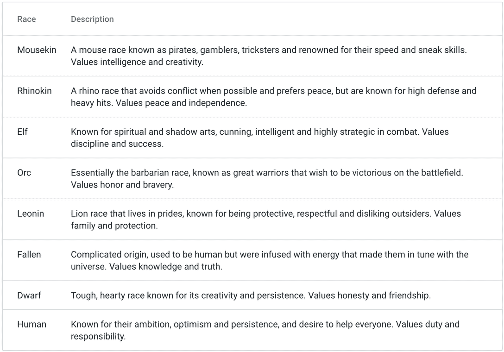

# 如何玩和赢:薄雾

> 原文：<https://web.archive.org/web/https://dappradar.com/blog/how-to-play-and-win-mist>

## 幻想元宇宙游戏世界，社区和任务相结合

Mist 是一款大型多人在线角色扮演游戏，玩家可以在一个开放的幻想世界中漫游，进行奇幻的叙事冒险。这款游戏基于区块链，但这并不是它的主要特色。知识、角色、图形和游戏性使 Mist 成为我们本周的游戏。

**亮点**

*   *[雾是什么？](https://web.archive.org/web/20221210121036/https://dappradar.com/blog/how-to-play-and-win-mist/#what-is)*
*   *[如何入门 Mist？](https://web.archive.org/web/20221210121036/https://dappradar.com/blog/how-to-play-and-win-mist/#how-started)*
*   *[游戏怎么玩怎么赢？](https://web.archive.org/web/20221210121036/https://dappradar.com/blog/how-to-play-and-win-mist/#play-and-win)*
*   *[是什么让 Mist 具有创新性？](https://web.archive.org/web/20221210121036/https://dappradar.com/blog/how-to-play-and-win-mist/#what-innovative)*

    *   *[代币和收藏品](https://web.archive.org/web/20221210121036/https://dappradar.com/blog/how-to-play-and-win-mist/#token-collectibles)*
    *   *元宇宙*
*   *[迷雾路线图上有什么？](https://web.archive.org/web/20221210121036/https://dappradar.com/blog/how-to-play-and-win-mist/#mist-roadmap)*
*   *[有用链接](https://web.archive.org/web/20221210121036/https://dappradar.com/blog/how-to-play-and-win-mist/#useful-links)*

随着 Mist pre-alpha 今天的发布，我们认为这是一个给这个领域带来真正质量的 Web3 游戏带来一些光芒的正确时间。这款游戏离它的首次亮相还有一段距离，但是画面和故事看起来已经令人难以置信了。

玩家可以通过 Mist Launcher Hub 下载游戏，他们还需要一个 Web3 钱包才能玩。要进入前阿尔法，玩家必须持有 3 级+ NFT 或 100，000+雾令牌。

[https://web.archive.org/web/20221210121036if_/https://www.youtube.com/embed/RPEbHmqfJYM?start=3&feature=oembed](https://web.archive.org/web/20221210121036if_/https://www.youtube.com/embed/RPEbHmqfJYM?start=3&feature=oembed)

Mist gameplay

[Explore Mist Data](https://web.archive.org/web/20221210121036/https://dappradar.com/binance-smart-chain/games/mist-metaverse)

## 雾是什么？

Mist 是新一代开放世界 MMORPGs 的一部分，它将 Web3 游戏带入了未来。在迷雾世界中，有两个派别，八个种族的幻想生物，和九类人物。

这款游戏利用了 [BNB 链](https://web.archive.org/web/20221210121036/https://dappradar.com/rankings/protocol/binance-smart-chain/category/games)的能力，让用户不仅有机会玩游戏，还可以拥有物品并登陆其中。玩家可以自由漫游或跟随叙事故事情节。

当它发布时，完整的游戏将可以从 Steam 下载。然而，Mist 框架并不依赖于 Steamworks，开发团队也计划在其他平台上推出这款游戏。

## 如何开始使用 Mist？

完整的迷雾游戏还没有发布，但是已经开放了测试。你可以为 Windows 下载它，并开始探索这个巨大的开放世界。

1.  去 Mist 网站。

向下滚动到“立即下载并播放”，然后单击 Windows 按钮。

2.  同意这些条款

这些术语涵盖了用户对 Mist 处于测试阶段的认可。

3.  下载 Mist

一旦你下载了启动程序，打开应用程序，同意一些进一步的条款。选择离您最近的服务器。

4.  使用您的钱包登录

你需要一个 Web3 钱包([比如 MetaMask](https://web.archive.org/web/20221210121036/https://dappradar.com/blog/what-is-metamask) )来连接游戏。一旦你做到了这一点，你就可以开始玩了。创建你的角色并点击回车。现在去探索吧。

如上所述，前阿尔法有一个付费墙，以保持玩家低，并奖励长期社区成员。

要加入 playtest，您需要使用 Web wallet 和以下两样东西之一:

*   三级或更高级别薄雾 NFT
*   100，000+雾币

## 你如何玩并赢得游戏？

与其他 Web3 MMORPGs 一样，玩家可以自由漫游，不一定需要遵循预设的叙事，在 Mist 中有许多成功的方法。其中一些包括完成任务。但是还有其他的路可以走

*   您可以建立一个强大的派系，并在地图位置夺取权力。
*   你可以交易游戏中的资产来获利，这是一些玩家玩游戏的方式。
*   你可以在游戏中获得奖励，创造有用的物品，然后在公开市场上出售。
*   你可以建立关系网，交朋友，一起享受任务。

Web3 基础设施为用户利用 Mist 构建自己的故事情节和空间创造了机会。

就实际参与叙事任务而言，你应该知道如何在迷雾中获得奖励。你也应该知道游戏中的角色和职业。

### 在迷雾中赚钱的选择

有几种方法可以在游戏中赢得迷雾代币:

1.  如前所述，**在游戏市场上交易物品获利**。
2.  创建沙盒地牢，其他玩家可以在其中与怪物战斗并获得奖励。一定比例的奖励归地下城制造者所有。建造地下城的土地的所有者也得到他们那份迷雾令牌。所以拥有土地并在上面建造一个地牢可以成为一个巨大的摇钱树。
3.  **在游戏的智能合约中下注迷雾**回报收益率。这是获得被动收入的一种简单方法。
4.  完成叙事任务以获得物品和迷雾。这是获得奖励最有趣的方式。杀死怪物并取得胜利本身就是一种奖励。获得代币是额外的奖励。

### 人物、阶级和收入选择

共有八个角色种族，每个种族都有不同的性格类型和力量。选择你的角色种族将取决于你想如何玩这个游戏。

The nine character races

有八门课可供选择。作为这些职业中的一员，你需要购买相关的 NFT 来解锁它的角色。例如，要扮演十字军，你需要持有十字军 NFT。

这八个类别是:

*   冒险家
*   诗人
*   狂战士
*   改革者
*   行妖术的人
*   牧师
*   看守人
*   异型男魔
*   猎巫人

[https://web.archive.org/web/20221210121036if_/https://www.youtube.com/embed/Gv4uIf4-wMc?feature=oembed](https://web.archive.org/web/20221210121036if_/https://www.youtube.com/embed/Gv4uIf4-wMc?feature=oembed)

The Crusader class

你可以升级你的职业，每次升级都会给你的角色增加 3%的伤害力。课程从第 1 层开始，一直上到第 5 层。升级花费薄雾令牌。

## 是什么让 Mist 具有创新性？

### 行会和派系

在迷雾生态系统中，有公会和派系，独立的玩家可以结合力量和资源。这使得玩家可以建造一个大于各部分总和的单位。但是游戏公会并不新鲜。是什么让它们在迷雾中显得特别？

游戏中的公会和派系可以为了奖励和资源一起交易和战斗。所有权、购买和销售都是通过区块链技术实现的。此外，Mist 正在创建预制的、叙事一致的公会，玩家可以加入并开始合作。

### 代币和收藏品

迷雾令牌是游戏中的货币。游戏世界中的交易是通过这个令牌进行的。正如在现实世界中一样，薄雾世界的价格因供求关系而异。有有限数量的薄雾标记。

An Elf

收藏品以 NFT 的形式出现，可以在主要城市的拍卖行买到。这些是游戏中的薄雾市场。玩家完全拥有他们的 NFT 收藏品，并可以用它们交换迷雾令牌。

### 虚拟空间

元宇宙是身临其境的 3D 交互式互联网版本，用户可以在精心渲染的环境中移动。Mist 是这个巨型基础设施的一小部分，游戏使玩家能够自由漫游，跟随任务，交易物品，结识新朋友，结交新朋友。这是下一代游戏。

## Mist 路线图上有什么？

12 月 2 日星期五，alpha 测试正式启动。现在下载薄雾中心发射器，开始玩吧。下面的推文显示了前阿尔法的细节。发布日期从最初的 11 月 30 日稍微推迟到今天。

> Mist 的第二阶段 Pre-Alpha 将于 11 月 30 日开始！
> 
> 一些新功能包括:
> 
> 【🪙token 奖励(testnet)】
> 📥桌面钱包/信息应用
> ❔Quests
> 🏇安装座
> 🎮新角色控制器
> 🌽Web 3 掉落
> 🪄Limited 法术(定期更新)
> 🏔️Updated 环境！[pic.twitter.com/fLkuFebwVv](https://web.archive.org/web/20221210121036/https://t.co/fLkuFebwVv)
> 
> — Mist Metaverse 〽️ (@MistNft) [November 24, 2022](https://web.archive.org/web/20221210121036/https://twitter.com/MistNft/status/1595855825872068608?ref_src=twsrc%5Etfw)

当它最终完全启动时，Mist 将可以自由游戏。但是到目前为止，还没有关于我们什么时候能看到完整版本的消息。

[Explore Web3 Games](https://web.archive.org/web/20221210121036/https://dappradar.com/rankings/category/games)

## 有用的链接

*   [探索薄雾数据](https://web.archive.org/web/20221210121036/https://dappradar.com/binance-smart-chain/games/mist-metaverse)
*   [探索 BNB 链上的 Web3 游戏](https://web.archive.org/web/20221210121036/https://dappradar.com/rankings/protocol/binance-smart-chain/category/games)
*   [DappRadar 的终极游戏指南](https://web.archive.org/web/20221210121036/https://dappradar.com/blog/gaming-dappradars-ultimate-guide)
*   [薄雾市场](https://web.archive.org/web/20221210121036/https://mist.game/nft-marketplace/auction)
*   [薄雾网站](https://web.archive.org/web/20221210121036/https://mist.game/#home)

## 随身携带您的 Web3 之旅

使用 DappRadar 移动应用程序，再也不会错过 Web3。查看最受欢迎的 dapps 的性能，并关注您投资组合中的 NFT。您在 DappRadar 上的帐户会与我们的移动应用程序同步，这样您很快就可以选择实时接收提醒。

[Download the DappRadar app now](https://web.archive.org/web/20221210121036/https://dappradar.app.link/blog)[<picture></picture>](https://web.archive.org/web/20221210121036/https://play.google.com/store/apps/details?id=com.portfolio.dappradar)