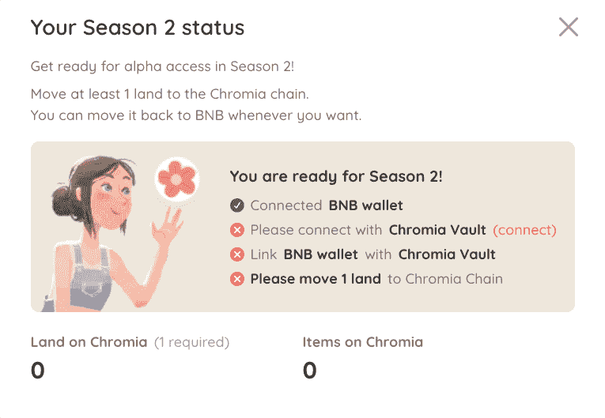
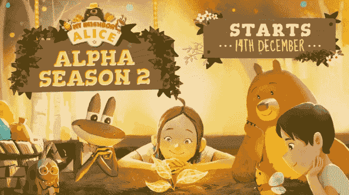

# 如何玩和赢:我的邻居爱丽丝

> 原文：<https://web.archive.org/web/https://dappradar.com/blog/how-to-play-and-win-my-neighbor-alice>

## 为所有级别的 Web3 专业知识创建的虚拟岛屿天堂

****我的邻居爱丽丝(My Neighbor Alice)是一款面向所有人的社交农耕冒险游戏，玩家可以在游戏中获胜、制作、购买和赚取数字物品、资源和土地。随着即将到来的阿尔法第二季，游戏的粉丝将获得一个新的机会来玩游戏，并得到一个完整的发布会是什么样子的一瞥。****

**内容**

*   *[我的邻居爱丽丝是什么？](https://web.archive.org/web/20221220023227/https://dappradar.com/blog/how-to-play-and-win-my-neighbor-alice/#what-is)*
*   *[如何上手游戏](https://web.archive.org/web/20221220023227/https://dappradar.com/blog/how-to-play-and-win-my-neighbor-alice/#get-started)*
*   *[如何玩赢邻居爱丽丝](https://web.archive.org/web/20221220023227/https://dappradar.com/blog/how-to-play-and-win-my-neighbor-alice/#play-and-win)*
*   *[是什么让游戏具有创新性？](https://web.archive.org/web/20221220023227/https://dappradar.com/blog/how-to-play-and-win-my-neighbor-alice/#what-innovative)*
    *   *[陆地](https://web.archive.org/web/20221220023227/https://dappradar.com/blog/how-to-play-and-win-my-neighbor-alice/#land)*
    *   *[令牌](https://web.archive.org/web/20221220023227/https://dappradar.com/blog/how-to-play-and-win-my-neighbor-alice/#token)*
    *   *[商场](https://web.archive.org/web/20221220023227/https://dappradar.com/blog/how-to-play-and-win-my-neighbor-alice/#marketplace)*
*   *[邻居爱丽丝的路线图上有什么？](https://web.archive.org/web/20221220023227/https://dappradar.com/blog/how-to-play-and-win-my-neighbor-alice/#what-roadmap)*
*   *[有用链接](https://web.archive.org/web/20221220023227/https://dappradar.com/blog/how-to-play-and-win-my-neighbor-alice/#useful-links)*

随着正在进行的土地出售和阿尔法第二季即将下降，我的邻居爱丽丝现在非常兴奋。该项目最初于 2021 年 1 月启动，并持续为粉丝提供价值。他们已经达到了路线图的里程碑，保持了相对较高的土地价格(与其他类似的游戏相比)，并保留了一个忠诚的社区。

[https://web.archive.org/web/20221220023227if_/https://www.youtube.com/embed/75FNsrrqejw?feature=oembed](https://web.archive.org/web/20221220023227if_/https://www.youtube.com/embed/75FNsrrqejw?feature=oembed)

Trailer for Alpha Season 1

[Explore My Neighbor Alice Info](https://web.archive.org/web/20221220023227/https://dappradar.com/other/games/my-neighbor-alice)

## 我的邻居爱丽丝是什么？

《我的邻居爱丽丝》是一款 Web3 游戏，用户可以拥有虚拟土地，在上面建造，并从中获利。故事发生在“位于 Lummelunda 群岛的一个大岛群”中。这个游戏既是关于游戏的，也是关于社区的。所以准备好认识新的人，交新的朋友。

玩这个游戏有两种方法。第一种方式是传统风格的叙事冒险，适合想要追求预定故事情节的普通游戏玩家。第二种方式更像是一种开放的风格，玩家可以漫游，互相交流，收集游戏中的物品。

这个游戏是建立在克劳莉娅的基础上的，它是一个第一层的区块链，作用类似于第二层，因为它是 EVM 兼容的，所以它可以与以太坊和 BNB 链一起工作。因此，我的邻居爱丽丝已经开发了跨链游戏的想法。

## 如何开始游戏

我的邻居爱丽丝还没有启动，所以你现在不能玩。它已经通过了播放测试阶段，用户可以检查错误，并感受一下当它全面亮相时我的邻居爱丽丝会是什么样子。

目前，你可以参加 2022 年 12 月的土地出售。土地所有者可以在 12 月 14 日 Alpha 第二季开始时开始测试游戏。请访问我的邻居爱丽丝网站，按照说明进行操作。你需要拥有 **1 土地**并将其移动到克劳莉娅链才能加入阿尔法第二季。

Alpha Season 2 requirements

当游戏完全启动时，你需要 Windows 7 或更高版本，以及支持 1，024MB / 1 GB 视频内存的显卡。你的电脑硬盘至少需要 4GB 的存储空间。

## 如何玩赢我的邻居爱丽丝

和往常一样，Web3 游戏有多种玩法和赢法，我的邻居爱丽丝也是如此。

享受我的邻居爱丽丝的一个方法是把它当作一个正常的游戏来玩。即将到来的阿尔法季节的故事将跟随一个叫罗宾的男孩，他来自瑞典南部海岸的一个渔村。玩家基于这种叙事弧线完成冒险，并经常与其他游戏玩家联手，共同取得胜利。

另一种方式是过岛上生活:

*   交易物品，如动物、房屋和栅栏。
*   申请游戏内的其他工作，获得劳动报酬。
*   成为出口商，在一个地方找到更便宜的商品，在另一个地方卖出更高的价格。
*   种植庄稼并在市场上出售。
*   成为独家和昂贵物品的交易商。

[https://web.archive.org/web/20221220023227if_/https://www.youtube.com/embed/_iPaFPnAO_w?feature=oembed](https://web.archive.org/web/20221220023227if_/https://www.youtube.com/embed/_iPaFPnAO_w?feature=oembed)

Fishing tips for all the anglers out there

### Lummelunda 群岛地区

**雪花岛**:顾名思义，这里是游戏中寒冷、结霜的区域。玩家可以找到神秘的冰雕和仙境景观。这也是你发现童话魔法和奇迹的地方。

中世纪平原:这些是古代的土地。场景全是庄稼，低矮的植被和石头搭建的结构。是个农牧业的好地方。

**大自然的休息**:茂密的森林，郁郁葱葱的绿色植物和树木。昏暗的灯光营造出一种忧郁的气氛。

Lummestad(城镇):这是游戏的中心点，在这里你会发现商店、活动和许多其他人。来这里交流，参与文化活动，了解游戏中发生的事情。

沙滩海岸(Sandy Coast):这个海岛度假胜地的外观与马尔代夫相似，全是阳光、沙滩和休闲。如果你是一个喜欢放松和慢慢生活的人，这是你的地方。

**淹没的岛屿**:淹没的岛屿波涛之下，蕴藏着奥秘和宝藏。但是请注意，闪亮的奖品会吸引盗版者。沉船和箱子提供了慷慨的机会，但也存在危险的风险。

## 是什么让游戏具有创新性？

### 陆地

土地是我邻居爱丽丝的主要特征。你可以拥有它，在它上面建造，在它上面生活，用它和住在附近的人交朋友。你可以从游戏市场购买虚拟土地，并且需要爱丽丝代币来购买。

### 代币

爱丽丝代币是游戏的本地货币。有一个固定的供应，你可以通过购买它，赚取它作为奖励，或通过买卖物品获利。这是一个镜像的 ERC-20 令牌，这意味着它与以太坊兼容。

持有爱丽丝让人们有能力赢得奖励，参与赌注活动，并对游戏的管理有发言权。

[Check ALICE Price](https://web.archive.org/web/20221220023227/https://dappradar.com/hub/token/eth/ALICE/ETH?from=0xac51066d7bec65dc4589368da368b212745d63e8)

### 市场

虚拟市场是玩家可以买卖自己土地的地方。他们还可以出售游戏中的物品，如栅栏、动物、行星和房子。你可以在市场上交易土地，购买阿尔法第二季需要的所有东西。

## 我的邻居爱丽丝的路线图上有什么？

首先要知道的是，阿尔法第二季开始于 2022 年 12 月 14 日。这将是一个机会，让用户玩游戏，并测试它，以消除错误和问题。

Alpha Season 2 poster

我的邻居 Alice 正在考虑的其他事情包括:

*   **2022 年第四季度**–目前正在进行土地出售，并将引入新的土地资源。
*   **2023 年 TBD**——更多的土地出售和阿尔法季节将继续。我的邻居爱丽丝将引入游戏内的伙伴关系和一个全新的测试季节。

## 有用的链接

*   [我的邻居爱丽丝信息](https://web.archive.org/web/20221220023227/https://dappradar.com/other/games/my-neighbor-alice)
*   [探索 Web3 游戏](https://web.archive.org/web/20221220023227/https://dappradar.com/rankings/category/games)
*   [搜索 NFT 收藏](https://web.archive.org/web/20221220023227/https://dappradar.com/nft/collections)
*   [我的邻居爱丽丝网站](https://web.archive.org/web/20221220023227/https://www.myneighboralice.com/?utm_source=DappRadar&utm_medium=deeplink&utm_campaign=visit-website)
*   [我的邻居爱丽丝市场](https://web.archive.org/web/20221220023227/https://play.myneighboralice.com/market/?filter%5Bprimary%5D=false&filter%5Bstatus%5D%5B0%5D=onAuction&filter%5Bstatus%5D%5B1%5D=reservePrice&filter%5Btype%5D%5B0%5D=land&meta%5Border%5D=endingSoon)

## 随身携带您的 Web3 之旅

使用 DappRadar 移动应用程序，再也不会错过 Web3。查看最受欢迎的 dapps 的性能，并关注您投资组合中的 NFT。您在 DappRadar 上的帐户会与我们的移动应用程序同步，这样您很快就可以选择实时接收提醒。

[Download the DappRadar app now](https://web.archive.org/web/20221220023227/https://dappradar.app.link/blog)[<picture></picture>](https://web.archive.org/web/20221220023227/https://play.google.com/store/apps/details?id=com.portfolio.dappradar)