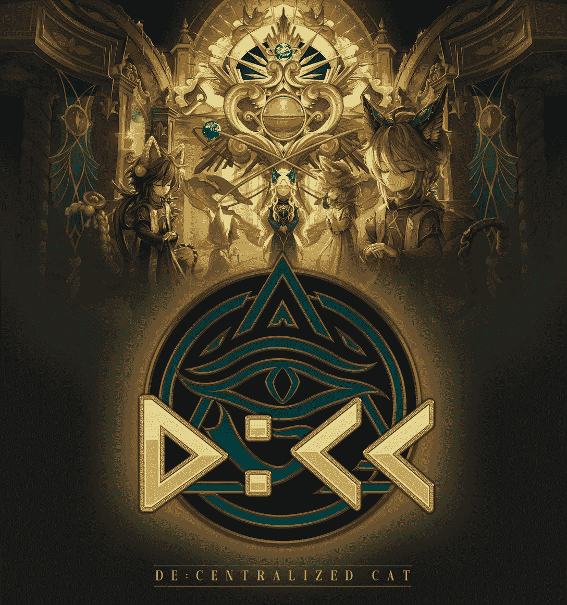

# 如何玩和赢:九编年史

> 原文：<https://web.archive.org/web/https://dappradar.com/blog/how-to-play-and-win-nine-chronicles>

## 《九世纪》本周在 DappRadar 的游戏排行榜上排名第 17

****《九历记》是 Web3 世界中最去中心化的游戏之一。用户通过他们的集体计算能力为游戏提供动力，充当确认交易和保护区块链的节点。出于这个原因，它有一个忠诚的社区，他们不仅对平台的文化至关重要，而且对其维护也至关重要。了解如何玩并赢得下面的九个编年史。****

**内容**

*   ***[什么是九历记？](https://web.archive.org/web/20221130044904/https://dappradar.com/blog/how-to-play-and-win-nine-chronicles/#what-is)***
*   ***[怎么玩的？](https://web.archive.org/web/20221130044904/https://dappradar.com/blog/how-to-play-and-win-nine-chronicles/#how-play)***
*   ***[令牌](https://web.archive.org/web/20221130044904/https://dappradar.com/blog/how-to-play-and-win-nine-chronicles/#tokens)***

*   ***[如何赚打九历记](https://web.archive.org/web/20221130044904/https://dappradar.com/blog/how-to-play-and-win-nine-chronicles/#how-earn)***
*   ***[九历记中的节点是什么？](https://web.archive.org/web/20221130044904/https://dappradar.com/blog/how-to-play-and-win-nine-chronicles/#what-nodes)***
*   ***[路线图](https://web.archive.org/web/20221130044904/https://dappradar.com/blog/how-to-play-and-win-nine-chronicles/#roadmap)***
*   ***[有用链接](https://web.archive.org/web/20221130044904/https://dappradar.com/blog/how-to-play-and-win-nine-chronicles/#useful-links)***

《九宫格》的用户数量本周增长了 3.41%，达到 19330 人。这种相对温和的上升需要放在该平台自 2020 年 11 月以来的旅程背景下看待。

[https://web.archive.org/web/20221130044904if_/https://www.youtube.com/embed/WHL_uYv8riA?list=PL0L1ZfahiAoONP23pJzV-bJvb2GSLQHuk](https://web.archive.org/web/20221130044904if_/https://www.youtube.com/embed/WHL_uYv8riA?list=PL0L1ZfahiAoONP23pJzV-bJvb2GSLQHuk)

如果我们看看游戏的历史数据，我们可以看到它一直在增加和保留用户，即使其他区块链游戏已经下降。出于这个原因，我们把九部编年史作为我们本周的游戏。

[Explore NC On-Chain Data](https://web.archive.org/web/20221130044904/https://dappradar.com/other/games/nine-chronicles)

## 九编年史是什么？

《九历记》是一款完全去中心化的闲置 RPG。它建立在区块链天文馆上，专门从事点对点游戏，它是完全开源的，没有服务器。像比特币一样，这个网络是由其用户——分布在世界各地的游戏玩家和矿工——驱动的。

游戏的目标是探索世界，与敌人战斗，制作和交易物品，并制定策略来战胜敌人。它可以通过 Steam 免费播放，也可以下载到你的电脑上。这款游戏是完全可修改的，能够“设计关卡和功能，通过 Github、fork 发送投稿，以及与朋友一起推出新的网络。”

从其他游戏的错误中吸取教训，九历记已经内置了游戏限制来限制用户可以玩的时间。这有助于在生态系统中保持一个公平的竞争环境。从长远来看，这也是阻止通缩经济影响平台的一种方式。

[https://web.archive.org/web/20221130044904if_/https://www.youtube.com/embed/Q_c-oT1FyaU?feature=oembed](https://web.archive.org/web/20221130044904if_/https://www.youtube.com/embed/Q_c-oT1FyaU?feature=oembed)

Nine Chronicles teaser

## 你怎么玩它？

九历记的玩法有很多种。用户可以选择去冒险或开采环境来提取资源。或者，人们可以成为商人，开始在游戏中买卖物品。最后，还有政治家的角色:用户可以在游戏中提出建议，并获得社区的支持。

要开始，你需要去[九历记 dapp](https://web.archive.org/web/20221130044904/https://nine-chronicles.com/?utm_source=DappRadar&utm_medium=deeplink&utm_campaign=visit-website) 并按照一步一步的注册说明。你需要创建一个账号和一个角色。然后，游戏将带你通过一个简单的教程，让你开始你的冒险。

一旦你开始运行，你将开始做运动。这些是九历记游戏的核心，也是游戏经济的基础。有 250 个独特的阶段，玩家需要通过每一个阶段来赢得胜利。

《九历记》是一个闲置的角色扮演游戏，玩家在战斗中不需要任何动作。用户的工作是通过特性升级和获得最好的物品，使他们的化身尽可能强大。然后你需要制定最佳策略来战胜你面对的对手。一旦你的角色进入战斗，结果就不在你的掌控之中了。

## 代币

九历记游戏内代币是九历记黄金(NCG)。玩家将它用于游戏内支付、下注和管理目的。该平台确实有一个入职门户，持有人可以用 NCG 交换包装 NCG (WNCG)。每日掉期限额为 5000 NCG，并将扣除 1%的手续费作为过渡费。

目前没有办法直接购买 NCG 代币。但是购买 WNCG 是可能的，任何人都可以通过分散的交易所这样做，例如[平衡器](https://web.archive.org/web/20221130044904/https://dappradar.com/multichain/exchanges/balancer)和[寿司](https://web.archive.org/web/20221130044904/https://dappradar.com/multichain/defi/sushi)。比特币基地也有，这是一个集中的交易所。

[Check WNCG Price](https://web.archive.org/web/20221130044904/https://www.coingecko.com/en/coins/wrapped-ncg)

## WindowsNT 文件系统（NTFileSystem 的缩写）

九历记中主要的 NFT 是以游戏道具的形式出现的。它们都存在于区块链上，代表了玩家在游戏中真正的所有权。项目分为四种类型。

#### 装备

这些是玩家在战斗中用来增强力量的物品。它们可以被制作、升级并在公开市场上交易。在游戏中的不同点获得不同类型的装备会给玩家带来战略优势。装备的例子有:盔甲、武器和戒指。

#### 消耗品

这些物品可以增加玩家单场战斗的属性。它们非常适合帮助你的角色越过一个特别难对付的对手。选择吃哪些消耗品需要深思熟虑的策略。它们可以买卖或制作。

#### 材料

材料是制造装备和消耗品的基础。玩家获得它们是因为在战役或竞技场中获胜。它们不能买卖，只能赢。

#### 服装和头衔

有各种可用的服装和标题供玩家赢取。这些纯粹是装饰性的物品，并不能提升属性。它们可以在市场上交易，对于任何想在《九历记》中灵活运用的人来说都是完美的。

#### De:集中式卡特彼勒非功能性测试

Nine Chronicles 于 9 月 21 日启动了 De:Centralized Cat(D:CC)NFT 的铸造过程。他们可能看起来像 PFPs，但他们不仅仅是。他们给玩家一个在九历记生态系统中的身份，并给持有者奖励，如游戏内津贴和投票权。

De:Centralized Cat NFT Poster

## 如何赚取玩九编年史

有各种方法来赚取 NCG 代币玩九编年史。下面四个是主要的，但是随着游戏的发展，可能会有新的方式。

#### 手工制作

收集你赢得的原材料，寻找，购买和获取。一旦你做到了这一点，你就可以把它们加工成一件商品，在 NCG 的公开市场上出售。

#### 贸易

访问市场，列出你要出售的物品。或者，你可以购买物品，并希望通过转手获利。或者，你可以用它们来帮助你的角色更上一层楼。一旦你升级了，你应该有更好的，更有价值的游戏物品可以在市场上出售。

#### 采矿

《九历记》里面的挖掘往往是纯粹运气的案例。但是有几个因素可以增加你获胜的机会:

*   **良好的互联网稳定性**帮助矿工快速与区块链同步。
*   CPU 能力有助于矿工更快地完成工作，这意味着他们可以更快地开始下一项工作。
*   **开采难度**告诉我们成功开采一个东西会有多难。难度越低越有利于获得奖励。

#### 竞技场比赛

竞技场里每天都有奖励。与其他玩家战斗以获得奖品和代币。竞技场的参与是有限的，所以玩家不能一直去那里赚取越来越多的 NCG。

## 路标

#### 下弦

世界老板是第三季度最大的更新。是九纪年的第一个合作内容。该平台还对其赌注功能进行了彻底改革，为玩家提供了新的方式来获得奖励并与网络互动。

如上所述，九编年史推出了 D:CC NFT 收集，并推出了第一个季度竞技场，为玩家赚取额外的奖励。

#### 第四季度

九编年史将举办大型万圣节和圣诞节活动，发放本季度最大的奖励。他们还将在年底推出这款游戏的新手机版。

该平台将引入一种新的利害关系验证机制，以减少网络延迟并提高性能。

## 九编年史中的节点是什么？

九历记中的一切都是在链上完成的。这使得用户对他们的项目的所有权在 Web3 平台中是最强的。他们这样做的方式是让每个玩家充当一个区块链节点。这意味着每个将计算机连接到网络的人都有助于保护网络。

这是通过 Launcher 来实现的，Launcher 是一个在用户开始玩《九连环》时就启动的程序。它无缝地发生，不需要专业知识或复杂的设置。虽然每个玩九编年史的人都使用他们的计算机来存储区块链数据，但也有一些用户充当特殊的挖掘节点。

这些采矿节点设置在游戏的起源时期。他们在区块链每 50 个完工的街区设置一个检查站。这种方法使九编年史成为一个工作证明系统，类似于比特币。未来，该平台希望引入一个类似于[合并后以太坊](https://web.archive.org/web/20221130044904/https://dappradar.com/blog/what-is-the-ethereum-merge)的利益证明网络。

## 有用的链接

*   [九历记单人 Dapp 页面](https://web.archive.org/web/20221130044904/https://dappradar.com/other/games/nine-chronicles)
*   [DappRadar 游戏排名](https://web.archive.org/web/20221130044904/https://dappradar.com/rankings/category/games)
*   [九历记网站](https://web.archive.org/web/20221130044904/https://dappradar.com/deeplink/6969)
*   [dappar Dar 文章特色九编年史](https://web.archive.org/web/20221130044904/https://dappradar.com/blog/search/?q=nine%20chronic)

 NewsletterUnsubscribe at any time. [T&Cs](https://web.archive.org/web/20221130044904/https://dappradar.com/terms) and [Privacy Policy](https://web.archive.org/web/20221130044904/https://dappradar.com/privacy-policy)