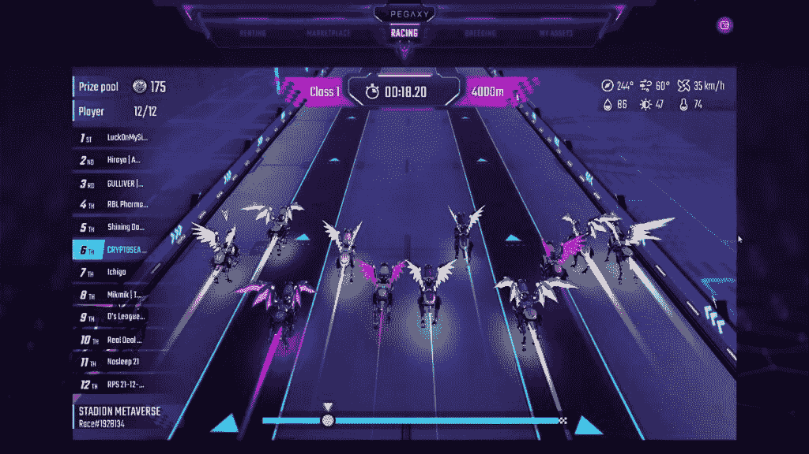
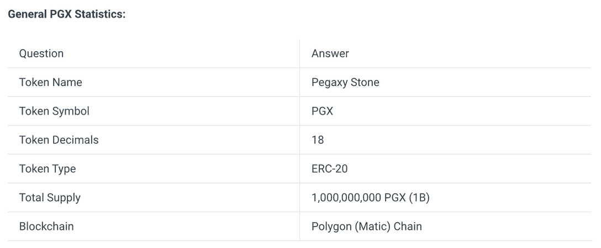
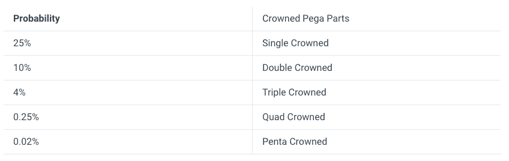
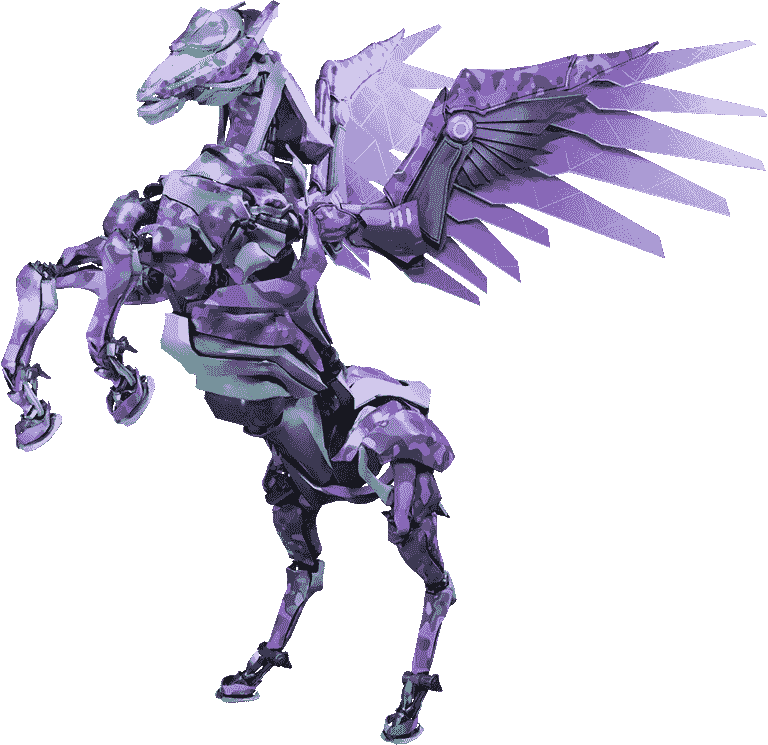
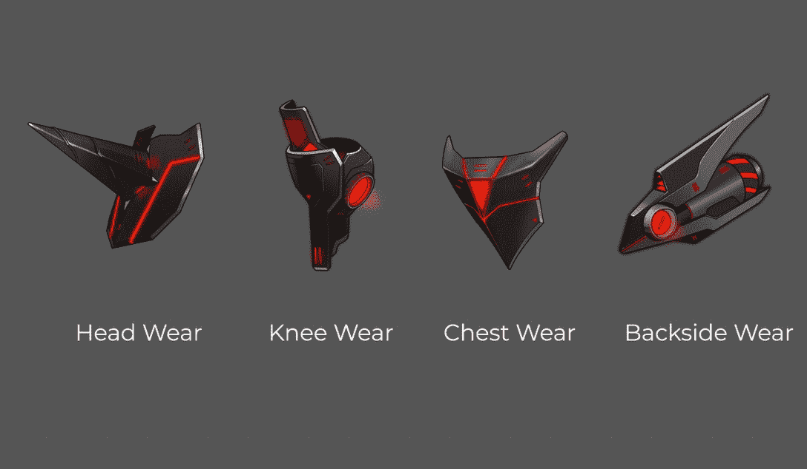
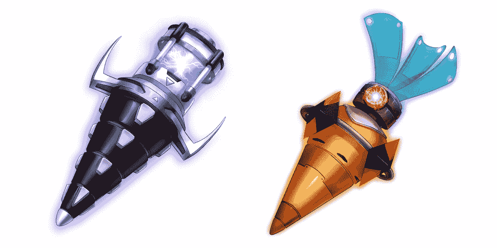
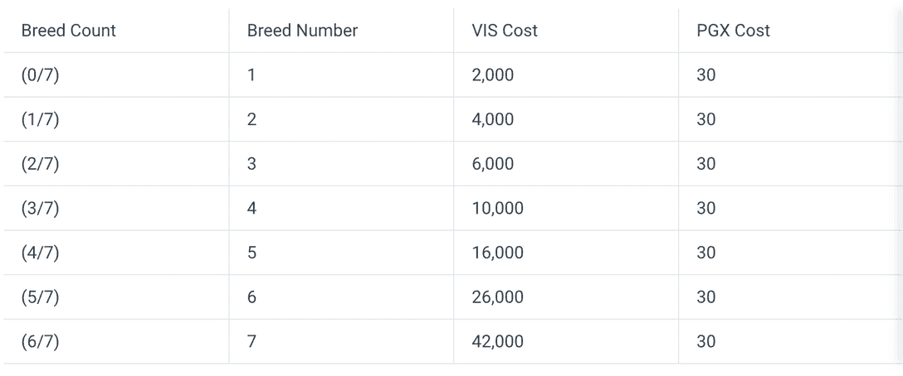
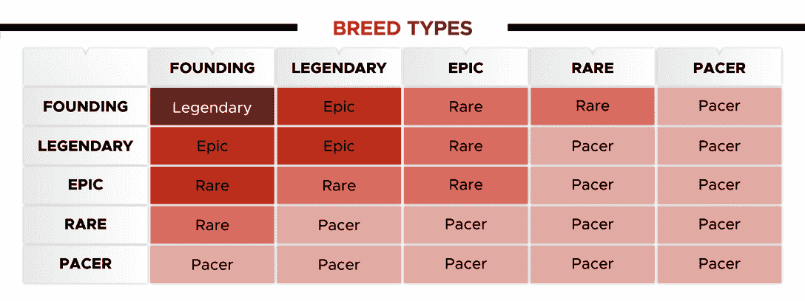
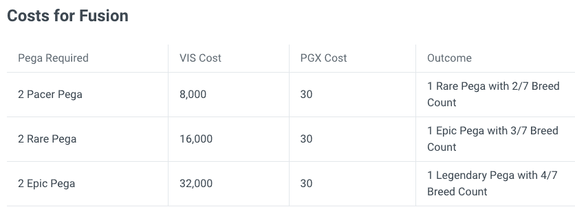

# 如何玩和赢:Pegaxy

> 原文：<https://web.archive.org/web/https://dappradar.com/blog/how-to-play-and-win-pegaxy>

## Pegaxy 本周在 DappRadar 的游戏排名中名列第 15 位

Pegaxy 于 2021 年 10 月推出，现在一直在 DappRadar 的游戏排名中名列前茅。如果你想赚钱的话，如何玩并赢得这场赛马 PvP 是至关重要的知识

**内容**

*   ***[什么是 Pegaxy？](https://web.archive.org/web/20220811211741/https://dappradar.com/blog/how-to-play-and-win-pegaxy/#what-is)***
*   ***[怎么玩 Pegaxy？](https://web.archive.org/web/20220811211741/https://dappradar.com/blog/how-to-play-and-win-pegaxy/#how-play)***
*   ***[玩家能赢什么？](https://web.archive.org/web/20220811211741/https://dappradar.com/blog/how-to-play-and-win-pegaxy/#what-win)***

*   ***[PGX、VIS 和传说中的代币是什么？](https://web.archive.org/web/20220811211741/https://dappradar.com/blog/how-to-play-and-win-pegaxy/#pgx-vis)***
*   ***[Pegaxy 有哪些 NFT？](https://web.archive.org/web/20220811211741/https://dappradar.com/blog/how-to-play-and-win-pegaxy/#pegaxy-nfts)***
*   ***[Pegaxy 的育种工作如何进行？](https://web.archive.org/web/20220811211741/https://dappradar.com/blog/how-to-play-and-win-pegaxy/#breeding-pegaxy)***
*   ***[游戏有租借系统吗？](https://web.archive.org/web/20220811211741/https://dappradar.com/blog/how-to-play-and-win-pegaxy/#rental-system)***
*   ***[什么是 Pegaxy 中的聚变？](https://web.archive.org/web/20220811211741/https://dappradar.com/blog/how-to-play-and-win-pegaxy/#pegaxy-fusion)***
*   ***[赛道对比赛结果有什么影响？](https://web.archive.org/web/20220811211741/https://dappradar.com/blog/how-to-play-and-win-pegaxy/#tracks-races)***
*   ***[有用链接](https://web.archive.org/web/20220811211741/https://dappradar.com/blog/how-to-play-and-win-pegaxy/#useful-links)***

在过去，已经有超过 20，000 个不同的活动钱包连接到 Pegaxy dapp。通过该平台的智能合约交易的金额不到 4 万美元，市场上有成千上万的 Pegas 供人们购买。

找出如何玩本周的一周游戏需要时间和努力。我们已经搜索了互联网，并将所有内容浓缩到一个指南中，因此您可以从今天开始玩游戏并赢取奖金。

## Pegaxy 是什么？

Pegaxy 是一款赛马游戏。玩家与其他 14 名选手竞争，他们都试图获得前三名。只有获得第一、第二或第三名的人才能获得奖励。其他人一无所获。

每场比赛都有额外的惊喜。风、水、火或速度中的一个作为随机变量加到每个竞赛中。它们影响一匹马的表现，不同的马有不同的能力和力量。

Mirai 未来组合实验室是这款游戏的幕后团队，自称是“元宇宙的赛车之乡”。游戏是建立在多边形网络上的，因此它受益于快速交易时间和低费用。

2021 年 10 月首次售出 5000 匹 Pega(可玩马 NFTs)。这些被称为创始 Pega，是 Pegaxy 开发团队创造的唯一马匹。从那时起，每一只 Pega 都是由用户通过育种计划制造出来的。

## Pegaxy 怎么玩？

首先，你需要[去 Pegaxy dapp](https://web.archive.org/web/20220811211741/https://dappradar.com/deeplink/11026) ，在那里你需要连接你的 [web3 钱包](https://web.archive.org/web/20220811211741/https://dappradar.com/blog/best-cryptocurrency-wallets-for-2022/)。那你需要给自己买个 Pega。你可以从[游戏市场](https://web.archive.org/web/20220811211741/https://marketplace.pegaxy.io/)购买或租赁其中一个。

一旦你有了 Pega，你就可以参加比赛。所有的比赛都是免费的，没有持续的费用或隐藏的费用。你需要在 MATIC 支付一点汽油费才能进入比赛大厅。

要让您的 Pega 参加比赛，您需要选择“比赛”,然后进入大厅。一旦大厅满员，比赛倒计时将开始。你需要做的就是等待。

Screenshot from a Pegaxy race

就目前情况来看，比赛结果有相当高的随机性。一个随机数生成器在最终排名中有很大的发言权。也就是说，Pega 的特征决定了它比赛的好坏，赛道的类型也影响着谁会赢。

开发团队正致力于引入更多玩家控制的因素来决定速度和技能。这将意味着在游戏中投入更多时间和精力的玩家将有更大的胜算。

如果你的 Pega 的相关元素——速度、水、风、火——与赛道类型相吻合，这将增加你获得荣誉和奖励的机会。

## 玩家能赢什么？

在 Pegaxy 有大量的代币提供给任何想要投入时间和精力的人。用户每天最多可以比赛 25 次，有 20%的几率赢得比赛。所以你平均每天可以赢五场比赛。如果你幸运的话，你甚至可能赢得更多。

奖金取决于你的 Pega 的品种类型。种类越少，奖品越好:

Pegaxy race purses

这些奖金可能会随着开发团队的策略上下波动。

您可以使用我们的令牌浏览器查看 VIS 的当前价格。目前远低于 2022 年 2 月达到的 0.25 美元的历史高点。

## 在 Pegaxy 赢钱的最好方法

由于 Pegaxy 比赛通常是一场碰运气的游戏，没有很多方法可以确保你经常赢得比赛。但是还有其他方法来玩这个游戏，让它在经济上值得你去做。

*   繁殖哈巴狗——两只哈巴狗可以产生新的后代。这需要一些代币，但你可以在比赛中使用你的新马，也可以卖掉它。

*   出租您的 Pega——将您的 Pega 放入租赁系统。有人会直接付钱来租它。或者他们可以为你比赛，你可以分享利润。

*   拥有一个体育场——你可以在 Pegaxy 买一个体育场。每次它举办比赛，你都会得到奖励。

*   装备装备和喂你的猎犬食物——这两件事都会让你的猎犬有更好的机会赢得比赛。

*   参加 Grand Dash 锦标赛——这项赛事每年 12 月举行，一年中最优秀的赛车手将争夺冠军。大奖罐是附在大短跑上的。

## 什么是 PGX、VIS 和传说中的代币？

### 前列腺素 x

peg xy 石头，或 PGX，是游戏中的 peg xy 治理令牌。和游戏本身一样，这些都是建立在多边形第二层网络上的。

目前在游戏中赢得他们的机会非常有限，但有计划在未来改变这一点。

General PGX information

Pegaxy 将在未来的某个时候引入社区资金储备功能。这将使用户能够赚取 PGX 锁定他们的令牌。

在 Pegaxy 游戏中，已经有或将会有 PGX 的一些用例:

*   饲养费用(稍后将详细介绍)
*   在市场上购买 Pega
*   红星
*   大型锦标赛奖励

### 活力

VI 是 Vigorus 的简称，VI 是 Pegaxy 的主要实用令牌。当玩家赢得比赛时铸造 VIS，当玩家繁殖马匹时燃烧 VIS。

General VIS information

繁殖一匹新的 Pega 所需的 VIS 玩家数量取决于特定马的品种数量。它们繁殖的次数越多，你就越需要再次繁殖。

玩家还可以在融合上花费 VIS。我们将在本文后面更详细地讨论融合。简单来说，这是一种升级你的 Pega 的方式。

### 虚构的代币

传说中的令牌很少，但是很强大。玩家可以使用它们将他们的佩格进化成一个加冕的佩格。皇冠 Pega 是 Pegaxy 生态系统中最稀有的物品，已经成为收藏家的物品。

玩家需要五个传说中的代币来试图将他们的 Pega 变成皇冠。甚至获得单冠佩加的几率也只有 25%。

Probability for producing Crowned Pegas

传说中的代币是多边形链上的 ERC-20 代币，人们通过向 Pegaxy 推荐朋友来获得它们。这位朋友必须加入游戏并购买一个 Pega，以便您获得传说中的令牌。

一旦你有了五个，你就可以试着给你的 Pega 加冕了。

## Pegaxy 有哪些 NFT？

Pegaxy 中的主要 NFT 是 Pegas。这些是动画，神话般的马，骑到荣耀，为他们的主人赢得金钱。

A prancing Pegaxy

除了 Pegas，没有其他游戏内的 NFT。但是游戏中有两种资产可以用来提高你的赛马。第一个是齿轮。装备物品可以对你的宠物属性产生积极和消极的影响。

Pegaxy Gear

食物是游戏中的另一项资产。这些是一次性用品，Pega 的主人可以用来喂马。有一个长长的食物清单，就像装备一样，它们会对宠物产生积极或消极的影响。

Pegaxy Food

## Pegaxy 的育种工作如何进行？

繁育在 Pegaxy 有两个作用。它发展了整个生态系统，并为世界带来了更多的 Pegas。玩家可以饲养它们并进行比赛，也可以出售它们来获利。繁殖的第二个作用是燃烧 VIS 令牌，稳定 Pegaxy 经济。

在繁殖你的哈巴狗之前，有几件事你需要考虑。首先，你需要知道饲养的成本。正如我们之前所说，你的 Pega 繁殖的次数越多，成本就越高。

Breeding costs

由于 Pega 是金属机器，没有限制哪些马可以互相繁殖。所以孩子和父母可以结合产生另一个 Pega。

### 血统

血统在 Pegaxy 也很重要。其中有四种，按最不稀有到最稀有的顺序排列:赞、窑、坎波那和霍兹。当两匹马一起繁殖时，最不稀有的血统占优势。这意味着你需要两只 Hoz Pega，最稀有的，才能繁育出新的 Hoz。

Pegaxy bloodlines

### 品种体型

除了血统，佩加斯还有一个品种类型。其中有五种，按稀有程度排列:创始、传奇、史诗、稀有和步行者。新繁殖的哈巴狗总是比最稀有的父母少一个品种。

创始 Pegas 是最初的 5000 只，是由 Pegaxy 开发人员创造的，所以不能再繁殖了。你会在下表中注意到，繁殖两只创始犬会产生一只传奇犬。

Pegaxy Breed Types

血统很重要，因为它们减少了繁殖之间的冷却时间。所以血统越稀有，你就越能定期繁殖新的哈巴狗。新生的佩加斯在比赛前也有一个冷却期。血统越稀有，这个时期就越短。

品种类型决定了一只猎犬的属性。更稀有的品种更强壮，速度更快，赢得比赛的几率也更高。说到这里，我们不能肯定地说品种类型对胜利概率的贡献有多大。

正如我们在文章前面所看到的，稀有品种会赢得更大的奖金。Pegaxy 的马会和相似品种的马进行比赛。

请记住，所有的佩加斯，无论他们的品种类型或血统，在繁殖后有 96 小时的冷却期，他们不能比赛。

## 游戏有租借系统吗？

Pegaxy 有一套完善的租赁系统，有两种使用方式。玩家可以付费租出一个 Pega，然后把赢来的钱留给自己。或者，他们可以免费租一个出来，作为一个学者，和主人平分赢来的钱。

Pegaxy 租赁页面易于导航，并为希望以较小预算进入游戏的玩家提供大量优惠。

## Pegaxy 中的融合是什么？

融合是 Pegaxy 中具有多种功能的另一个特性。这是玩家升级 Pega 的一种方式，同时通过燃烧 VIS，PGX 和 Pega 也有助于游戏内的经济。

融合背后的想法相当简单:你可以将同一品种类型的两只哈巴狗融合在一起，产生一只比两只未融合的哈巴狗稀有程度高一级的哈巴狗。

举个例子，如果你融合两个史诗级的 Pegas，你会得到一个传奇级的。融合短腿马要花费 100 维斯或 PGX .

Fusion costs

融合使玩家能够获得更高水平的品种类型，并开始进入更有利可图的比赛。

## 赛道对比赛结果有什么影响？

每条赛道都有一个显著的特征:速度、水、风和火。每一个血统都对应其中一个:

*   **Zan** 是**风**的哈巴狗
*   **Klin** 是**水**的 Pega
*   **坎波纳**是**火**的哈巴狗
*   **Hoz** 是**速度**的 Pega

如果你的 Pega 的先天元素属性与 Track 的元素一致，你获胜的机会就会增加。

在销售期间，玩家也可以购买包含赛道的体育场。一旦你拥有了一个体育场，你就可以在每次举办比赛时获得代币。Pegaxy 开发团队正在不断升级体育场，使其独一无二、引人注目。

An upgraded Stadium, called a Stadion

## 有用的链接

[转到 peg xy dapp](https://web.archive.org/web/20220811211741/https://dappradar.com/deeplink/11026)

[DappRadar 用于 Pegaxy 的单个 dapp 页面](https://web.archive.org/web/20220811211741/https://dappradar.com/polygon/games/pegaxy)

[DappRadar 关于 Pegaxy 的文章](https://web.archive.org/web/20220811211741/https://dappradar.com/blog/search/?q=pegaxy)

[十大最值得玩的区块链游戏，赢取加密代币](https://web.archive.org/web/20220811211741/https://dappradar.com/blog/top-10-blockchain-games-to-play-and-earn-crypto-tokens/)

[PGX 在 Coingecko 上的价格](https://web.archive.org/web/20220811211741/https://www.coingecko.com/en/coins/pegaxy-stone)