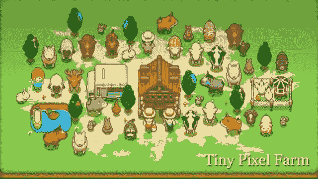

# 如何玩和赢:像素

> 原文：<https://web.archive.org/web/https://dappradar.com/blog/how-to-play-and-win-pixels>

## 农业游戏有助于建立一个分散的元宇宙

Pixels 是一款 Web3 农业游戏，拥有强大而忠诚的社区。游戏的目标很简单:种植作物，收集资源，建立你的权力。在游戏中前进依赖于努力、技巧和关系。你在这个世界上呆的时间越长，你就越成为这个世界的一部分。

**内容**

*   *[什么是像素？](https://web.archive.org/web/20221229175713/https://dappradar.com/blog/how-to-play-and-win-pixels/#what-is)*
*   *[像素如何入门](https://web.archive.org/web/20221229175713/https://dappradar.com/blog/how-to-play-and-win-pixels/#get-started)*
*   *[是什么让像素创新？](https://web.archive.org/web/20221229175713/https://dappradar.com/blog/how-to-play-and-win-pixels/#pixels-innovative)*
    *   *[陆地](https://web.archive.org/web/20221229175713/https://dappradar.com/blog/how-to-play-and-win-pixels/#land)*
    *   *[资源](https://web.archive.org/web/20221229175713/https://dappradar.com/blog/how-to-play-and-win-pixels/#resources)*
    *   *[令牌](https://web.archive.org/web/20221229175713/https://dappradar.com/blog/how-to-play-and-win-pixels/#tokens)*
*   *[如何玩赢像素](https://web.archive.org/web/20221229175713/https://dappradar.com/blog/how-to-play-and-win-pixels/#play-and-win)*
*   *[游戏的下一步是什么？](https://web.archive.org/web/20221229175713/https://dappradar.com/blog/how-to-play-and-win-pixels/#what-next)*
*   *[有用链接](https://web.archive.org/web/20221229175713/https://dappradar.com/blog/how-to-play-and-win-pixels/#useful-links)*

Pixels 是一款农业游戏，但它只是 Pixels Universe 想要实现的目标的一部分。他们的最终目标是一个可互操作的、玩家所有的、公平的虚拟世界，推动元宇宙的发展。Pixels farming 游戏是用户进入 Web3 世界的第一个入口。

[https://web.archive.org/web/20221229175713if_/https://www.youtube.com/embed/G1r8q0tq1_0?feature=oembed](https://web.archive.org/web/20221229175713if_/https://www.youtube.com/embed/G1r8q0tq1_0?feature=oembed)

What is the metaverse?

[Explore Pixels Data](https://web.archive.org/web/20221229175713/https://dappradar.com/ethereum/games/farm-land-by-pixels)

## 什么是像素？

Pixels 是一个“有趣第一”的 MMO 农场，围绕分权、所有权和社区的原则建立。虚拟世界由 5000 块土地组成，所有者需要管理、定制和维护这些土地。为了提高像素，玩家必须收集资源，建立他们的帝国。

Pixels 建立在以太坊区块链的基础上，于 2021 年末推出。最初，用户可以为 0.06 ETH 铸造新土地。从那时起，土地价值已经上升，目前楼面价约为 0.36 ETH。在二级市场上，人们已经交易了价值超过 6200[ETH](https://web.archive.org/web/20221229175713/https://dappradar.com/hub/token/eth/ETH)的像素土地。

## 如何开始使用像素

### 1.获取元掩码

首先，你需要一个 Metamask Web3 钱包。[阅读 DappRadar 的元蒙版深度指南](https://web.archive.org/web/20221229175713/https://dappradar.com/blog/what-is-metamask)了解如何获得一个元蒙版。一旦你下载了它，使用它登录到像素和保存你的进展。

### 2.你不需要一个游戏中的 NFT 就可以开始玩

从二级市场购买像素土地将开放游戏的全部功能。但是即使没有也可以玩。登录后点击“继续作为客人”并按照说明操作即可。

### 3.四处走动很容易

使用 **WASD** 穿越像素世界。箭头键和点击运动将在未来可用。

### 4.开始你的任务

去泰拉别墅找戴夫市长。如果你想开始你的冒险，就和他谈谈。

## 是什么让像素具有创新性？

### 陆地

虚拟土地的情节是像素游戏的关键。它们以 NFT 的形式出现，这意味着用户对它们拥有完全的所有权和控制权。它不能从你身上拿走，你可以在二级市场上以真金白银的价格出售。

Land plot in Pixels

像素中有三种土地类型:

*   **自由地块**–也称为斑点，这些是最基本的土地单位。他们允许玩家开始玩游戏，但不提供巨额回报。他们是一个很好的切入点。

*   租借的土地——这些给了玩家自由和更好的收益。但是你需要和你的房东分享利润。在潜在购买自己的土地之前，这些都是积累经验和资本的好方法。

*   **自有地块**–有大小两种，用户可以完全控制像素世界的一部分。管理资源，收获奖励，出租给佃农，赚取代币。

### 资源

资源来自土地，资源生成是像素的主要龙头。在 Web3 中，水龙头是向用户释放加密资产和令牌的方法。资源包括木材、农作物、动物和其他你能在农场找到的物品。

Resources in Pixels

像素的进展依赖于收集越来越稀少和难以获得的资源。玩家需要时间和经验来获得最好的资产。为了有利于经济，中央像素团队将调整在给定时间内可以产生多少资源。

### 代币

Pixels 的经济依赖于一个双令牌系统:

*   浆果——游戏中的主要货币，对核心“游戏循环”至关重要。玩家可以在游戏内商店消费浆果，并在出售资源时获得代币。当玩家购买物品来推进故事时，贝里就会被烧掉。

*   **PIXEL**-游戏货币中的高级像素。玩家用它来购买核心游戏之外的物品、升级和装饰。与 BERRY 不同，像素供应受到严格控制。每天将铸造 100，000 个新像素，并分发给活跃的玩家。

## 如何玩赢像素

玩像素不是一个输赢的案例。玩家前进没有终点。因此，虽然没有获得胜利的秘诀，但你可以做一些事情来帮助你在游戏中前进:

1.  **缩小地图**以便更快播种和收获。这听起来很简单，但是拥有整个农场的视图可以让你更快地点击屏幕。这节省了时间，使整个过程不那么复杂。这也将确保您不会错过任何可能产生资源的地块。

2.  **通过更改网址找到您的第二个农场**。URL 中应该有一个数字。农场 101 和 102 是同一个农场。您可以通过将该数字更改为 103、104 或 105 来找到您的第二个农场。您还可以在此服务器场中生成资源。

3.  刷新你的浏览器，你的庄稼会长得更快。这听起来不应该起作用，但它确实起作用了。就像关掉某些东西，然后再打开，刷新你的浏览器加速作物生长。

4.  **不要总是买最便宜或者最贵的地**。根据土地的特性选择土地。做你的研究，找到哪个农场将产生最多的资源，如果你能负担得起，就买下那块土地。请记住，价格并不总是基于质量，总会找到便宜货。

## 游戏的下一步是什么？

### 2022 年第四季度

Pixels 的路线图在 202 年底有一些激动人心的进展。该团队将创建并启动自己的分散自治组织(DAO)。这与 Pixels 宣称的“逐步去中心化”的目标是一致的。

> 彻底的权力下放是最终目标。但是，一种创新的、经过深思熟虑的理想主义分权方法是必要的……我们设想并正在建立允许分权国库管理、经济规划等的系统。
> 
> Pixels team

Pixels 还在游戏中集成了 1000 个新的 NFT。这意味着一个新的游戏内物品和资产的集合，玩家可以使用它们来完成他们的农业冒险。

## 有用的链接

*   [像素单个 Dapp 页面](https://web.archive.org/web/20221229175713/https://dappradar.com/ethereum/games/farm-land-by-pixels)
*   [以太网价格](https://web.archive.org/web/20221229175713/https://dappradar.com/hub/tokens/ethereum/all/)
*   [像素网](https://web.archive.org/web/20221229175713/https://pixels.online/?utm_source=DappRadar&utm_medium=deeplink&utm_campaign=visit-website) [年代](https://web.archive.org/web/20221229175713/https://pixels.online/?utm_source=DappRadar&utm_medium=deeplink&utm_campaign=visit-website) [老五](https://web.archive.org/web/20221229175713/https://pixels.online/?utm_source=DappRadar&utm_medium=deeplink&utm_campaign=visit-website)
*   [元掩码指南](https://web.archive.org/web/20221229175713/https://dappradar.com/blog/what-is-metamask)

## 随身携带您的 Web3 之旅

使用 DappRadar 移动应用程序，再也不会错过 Web3。查看最受欢迎的 dapps 的性能，并关注您投资组合中的 NFT。您在 DappRadar 上的帐户会与我们的移动应用程序同步，这样您很快就可以选择实时接收提醒。

[Download the DappRadar app now](https://web.archive.org/web/20221229175713/https://dappradar.app.link/blog)[<picture></picture>](https://web.archive.org/web/20221229175713/https://play.google.com/store/apps/details?id=com.portfolio.dappradar)