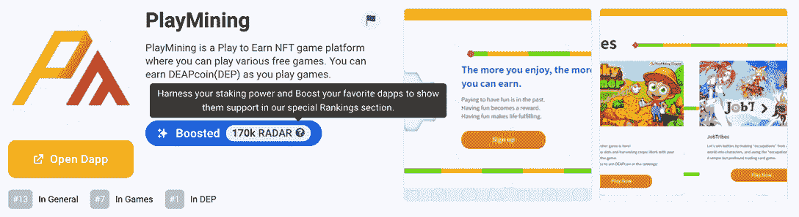
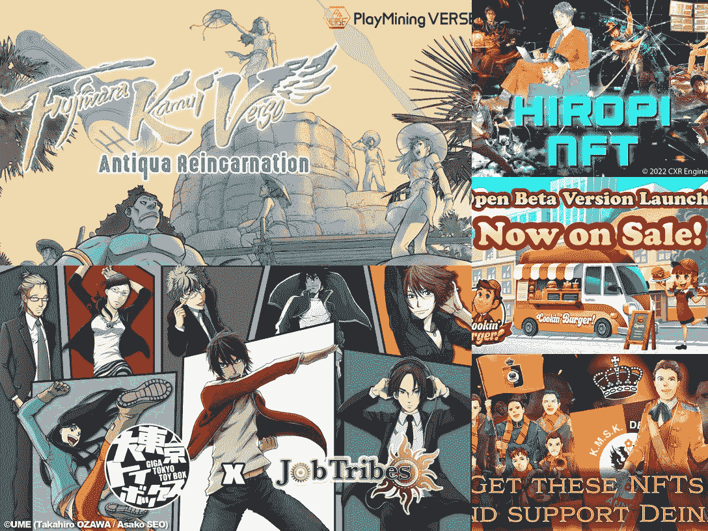
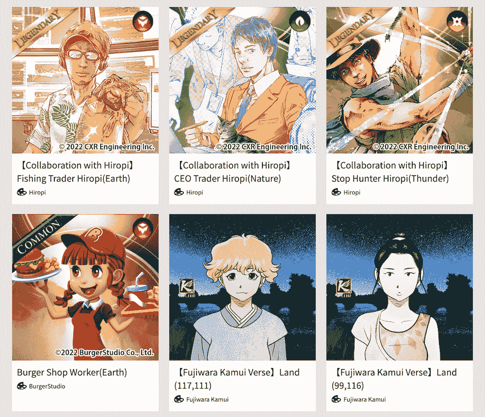
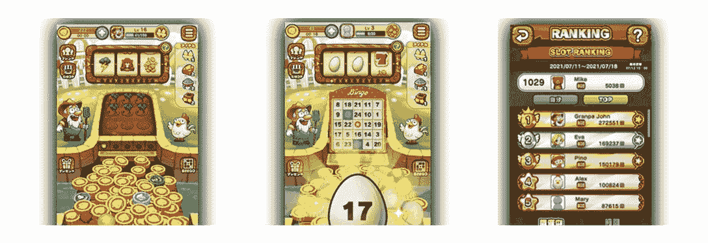

# 如何玩和赢:游戏采矿

> 原文：<https://web.archive.org/web/https://dappradar.com/blog/how-to-play-and-win-playmining>

## 学习你需要知道的关于 PlayMining 的一切

PlayMining 团队致力于创建一个多功能的 NFT 游戏平台，以推动全球 GameFi 趋势。该平台现在拥有来自 100 个国家的 200 多万玩家。今天的本周游戏将解释如何在游戏中玩和赢。

**概要:**

*   [什么是 PlayMining？](https://web.archive.org/web/20221208104658/https://dappradar.com/blog/how-to-play-and-win-playmining/#what-is)
*   游戏平台是如何工作的？
    *   [PlayMining 游戏](https://web.archive.org/web/20221208104658/https://dappradar.com/blog/how-to-play-and-win-playmining/#games) [s](https://web.archive.org/web/20221208104658/https://docs.google.com/document/d/1-6k8O-aTe0TP9TPzFQXS4n5uPFtFlgQXWwHs8AxewmY/edit#heading=h.e20htuii389g)
    *   [PlayMining NFTs](https://web.archive.org/web/20221208104658/https://dappradar.com/blog/how-to-play-and-win-playmining/#nfts)
    *   [保险库服务](https://web.archive.org/web/20221208104658/https://dappradar.com/blog/how-to-play-and-win-playmining/#vault)
*   [游戏内的货币是什么？](https://web.archive.org/web/20221208104658/https://dappradar.com/blog/how-to-play-and-win-playmining/#currency)
*   玩 PlayMining 怎么赚钱？
    *   [游戏奖励](https://web.archive.org/web/20221208104658/https://dappradar.com/blog/how-to-play-and-win-playmining/#gameplay)
    *   [打桩](https://web.archive.org/web/20221208104658/https://dappradar.com/blog/how-to-play-and-win-playmining/#staking)
    *   [赠款](https://web.archive.org/web/20221208104658/https://dappradar.com/blog/how-to-play-and-win-playmining/#grants)
*   [有用的链接](https://web.archive.org/web/20221208104658/https://dappradar.com/blog/how-to-play-and-win-playmining/#links)

[PlayMining](https://web.archive.org/web/20221208104658/https://dappradar.com/dep/games/playmining) 是一个充满日本漫画元素的游戏平台。然而，这款 dapp 令人印象深刻的是其稳定出色的数据性能。根据 DappRadar 的单个 dapp 页面跟踪，自 2022 年以来，PlayMining 每天记录的活跃用户数超过 2 万。

这个数字充分证明了该平台对用户的吸引力。此外，我们已经观察到 PlayMining 是从用户那里获得最多助力的 dapps 之一，迄今为止已经获得了 170，000 次助力。

Boost Power 是 DappRadar 最近推出的一项新功能。已经下注[雷达令牌](https://web.archive.org/web/20221208104658/https://dappradar.com/token/overview)的用户可以获得 Boost Power，这是一种提升他们最喜爱的 dapps 受欢迎程度的超能力。在未来，提供增强功能的用户和获得这种支持的 dapps 可能会享受到一些令人惊讶的额外待遇。

阅读文章，了解雷达令牌还能提供哪些好处。

## 什么是 PlayMining？

PlayMining 是由数字娱乐资产公司(DEA)创建的游戏平台。它允许玩家赚取一种被称为 DEAPcoin 的加密货币，简称 DEP。此外，它利用 NFTs 的力量来建立一个保护全球创造者的权利和利益的系统。

自 2018 年以来，该平台已成功支持 100 多名创作者，包括一些日本最著名的漫画艺术家，推出他们的 NFT 项目。由于 PlayMining，这些艺术家可以有一种新的方式来货币化他们的内容。

在 2020 年 4 月至 2021 年 12 月期间，创作者通过 PlayMining 的商业模式赚了超过 10 亿日元，进一步释放了他们在为用户创造娱乐内容方面的创新。

PlayMining 通过精心设计的循环经济赋予创造者权力，并使玩家受益，其中本土令牌 DEP 扮演了重要角色。DEP 是一个 ERC-20 实用令牌，它促进了 PlayMining 平台的“玩到赚”(P2E)机制。

## 游戏平台是如何工作的？

PlayMining 拥有一个三支柱驱动的生态系统，它们是 PlayMining 游戏、PlayMining NFTs 和 Vault。

### PlayMining 游戏

PlayMining 团队试图建立一个开放的协作平台，允许任何开发者推出他们的游戏并将其货币化。到目前为止，用户可以在平台上享受六款基于 HTML5 浏览器的游戏。值得注意的是，这些游戏都是 NFT 驱动的，并支持游戏赚取机制。

PlayMining 上的游戏有:

*   工作部落
*   游戏挖掘难题
*   幸运的农民
*   库克的市民！
*   涂鸦赛车
*   藤原·神威诗句

### 游戏挖掘 NFTs

NFT 在 PlayMining 生态系统中有多种用途。例如，玩家可以使用 NFT 作为角色化身，解锁背景音乐，升级游戏进度，等等。

此外，PlayMining 提供了一个 NFT 市场来支持游戏中物品的交易。目前，该市场提供日本流行文化顶级艺术家的各种独家数字内容。值得注意的是，来自更广泛的全球艺术家的更多独特的艺术品也在筹备中。

### 保险库服务

金库在 PlayMining 的激励结构中发挥着重要作用。具体来说，它向为 PlayMining 的经济做出贡献的用户授予 dep 和 NFT。从 Vault 中获益的方法之一是下注 DEP 代币并赢取奖励。为了让 PlayMining 的经济对用户更有吸引力，团队计划在金库激励结构中增加更多功能。

## 游戏内货币是什么？

DEP 是 PlayMining 的生态系统标志，带有各种实用工具。例如，玩家可以使用 DEP 在 NFT 市场上购买 NFT。由于 PlayMining 平台正在快速扩张，该团队将很快增加几种新的方式来满足用户不同的消费欲望。这将包括购买游戏中的物品和土地的费用。

用户可以通过不同的方式获得 DEP。首先，在 PlayMining 平台上玩游戏可以为用户赢得 DEP 代币。此外，用户可以直接从集中交易所和分散交易所购买，如 OKX、MEXC、XT.COM、Bitrue 和 Gate io。

## 玩 PlayMining 怎么赚钱？

PlayMining 为用户提供了许多机制，让他们在享受游戏乐趣的同时获得奖励。以下三种方式是基本的。

*   PlayMining 游戏奖励
*   保险库服务
*   PlayMining 经济赠款(包括开发商赠款)

### PlayMining 游戏奖励

如上所述，PlayMining 是一个动态的游戏赚取平台，用户可以通过参与其上的游戏来获得 DEP 代币。值得注意的是，每个游戏都有独特的玩法和 P2E 规则。确保[在比赛开始前充分了解他们的游戏方式](https://web.archive.org/web/20221208104658/https://playmining.gitbook.io/whitepaper/platform-overview-shan-tian/game-overview)。

但是让我们以一个游戏“幸运农夫”为例来理解它到底是如何运作的。

幸运的农民是一个经典街机游戏硬币推进器的移动版本。玩家收集从顶部掉落的硬币，并争夺更高的排名。等级越高，玩家从游戏中获得的 DEP 代币就越多。有了挣得的 dep，玩家可以从 PlayMining 市场获得 NFT。此外，这些 NFT 对持有者来说是有价值的，因为它们有助于提高奖励。

### 红星

目前，DEP 赌注是参加跳马奖励计划的唯一方式。对于非游戏玩家的用户来说，这是参与 PlayMining 充满活力的 P2E 生态系统的最佳方式。它允许用户在 PlayMining 平台上下注他们的 DEP 代币来赚取额外的 DEP，并且他们不需要玩任何游戏。

### PlayMining 经济补助金

PlayMining 希望建立一个开放和协作的游戏平台，吸引全球开发者将他们的创新变为现实。为此，PlayMining 将推出一系列资助，以激励开发者、艺术家和内容创作者。这一举措还旨在不断为用户带来高质量的游戏和内容，进一步推动平台的可持续发展。

### 有用的链接

*   进入 [PlayMining single dapp 页面](https://web.archive.org/web/20221208104658/https://dappradar.com/dep/games/playmining)，进入平台
*   关于 PlayMining 和 DEP 的文章
*   [DEP 代币价格](https://web.archive.org/web/20221208104658/https://dappradar.com/hub/token/eth/DEP/ETH?from=0x1a3496c18d558bd9c6c8f609e1b129f67ab08163)
*   [用 DappRadar 令牌浏览器交换 DEP 令牌](https://web.archive.org/web/20221208104658/https://dappradar.com/hub/token/eth/DEP/ETH?from=0x1a3496c18d558bd9c6c8f609e1b129f67ab08163)
*   [PlayMining 官网](https://web.archive.org/web/20221208104658/https://playmining.com/)

DappRadar 为用户提供了对当前 GameFi 和 P2E 形势的全面和最新的理解。通过我们的游戏周系列，用户可以了解更多关于当今最受欢迎的 NFT 游戏。最重要的是，如何像职业选手一样打球和赢球！

立即退房:

*   [轴无穷大](https://web.archive.org/web/20221208104658/https://dappradar.com/blog/tag/play-to-earn)
*   [外星世界](https://web.archive.org/web/20221208104658/https://dappradar.com/blog/how-to-play-alien-worlds-like-a-pro/)
*   [高地](https://web.archive.org/web/20221208104658/https://dappradar.com/blog/how-to-play-and-win-upland)
*   [孤独闪电](https://web.archive.org/web/20221208104658/https://dappradar.com/blog/over-140000-users-are-playing-joyrides-solitaire-blitz-to-earn-real-money-rewards)
*   [采矿网](https://web.archive.org/web/20221208104658/https://dappradar.com/blog/the-miningnetwork-game-on-wax-attracted-more-than-800k-users-within-30-days)
*   [Gameta](https://web.archive.org/web/20221208104658/https://dappradar.com/blog/what-is-gameta-and-how-to-use-it)
*   [peg xy](https://web.archive.org/web/20221208104658/https://dappradar.com/blog/how-to-play-and-win-pegaxy)
*   [Arc8](https://web.archive.org/web/20221208104658/https://dappradar.com/blog/how-to-play-and-win-arc8-2)

DappRadar 将继续关注 PlayMining 的最新发展，以及 [play-to-earn。](https://web.archive.org/web/20221208104658/https://dappradar.com/blog/tag/play-to-earn)在 [Twitter](https://web.archive.org/web/20221208104658/https://twitter.com/dappradar) 、 [Discord](https://web.archive.org/web/20221208104658/https://discord.gg/4ybbssrHkm) 和 [Youtube](https://web.archive.org/web/20221208104658/https://www.youtube.com/c/DappRadar) 上关注我们，跟上区块链世界的动态。