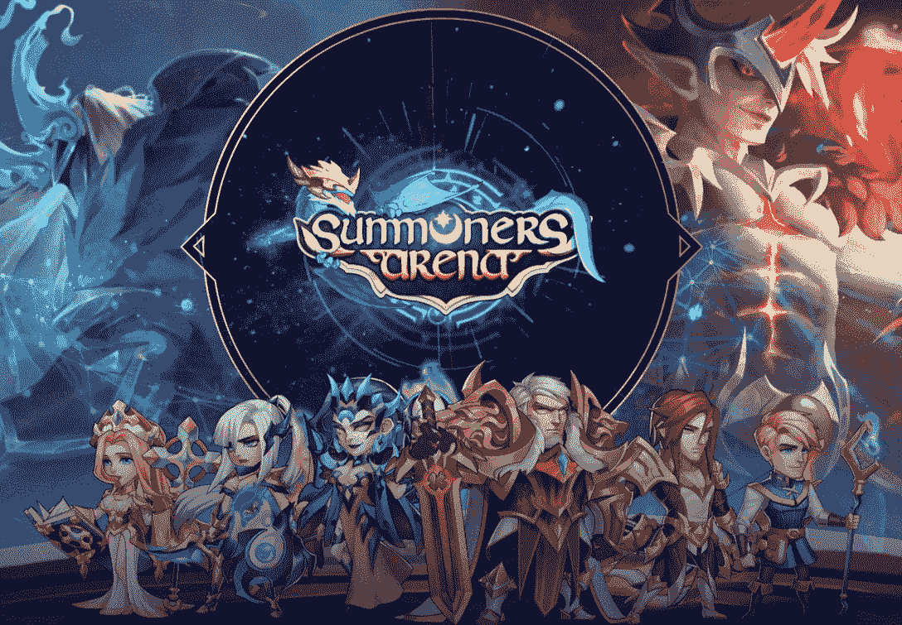
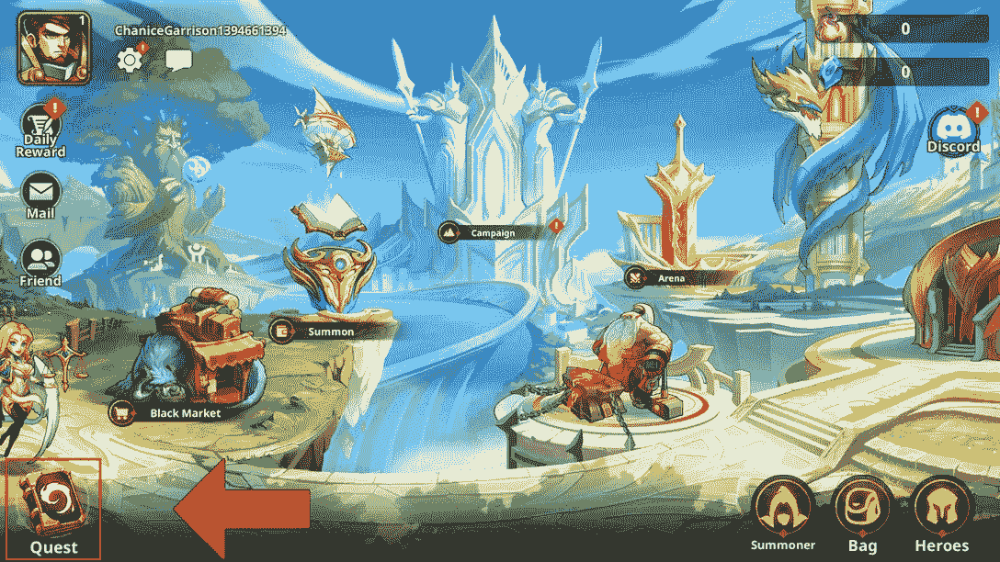
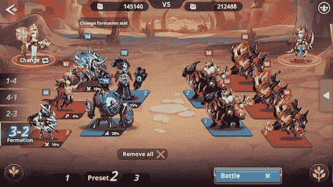
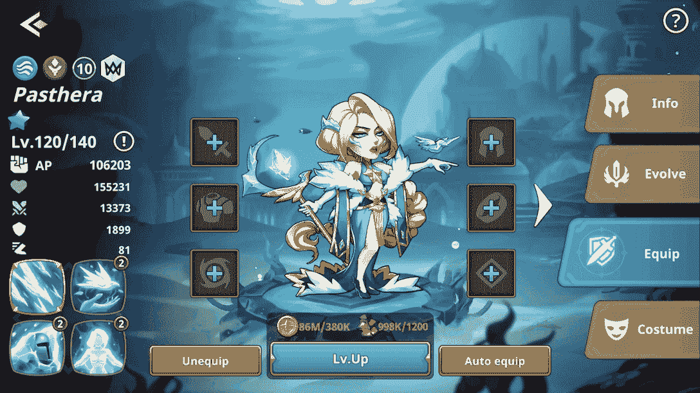
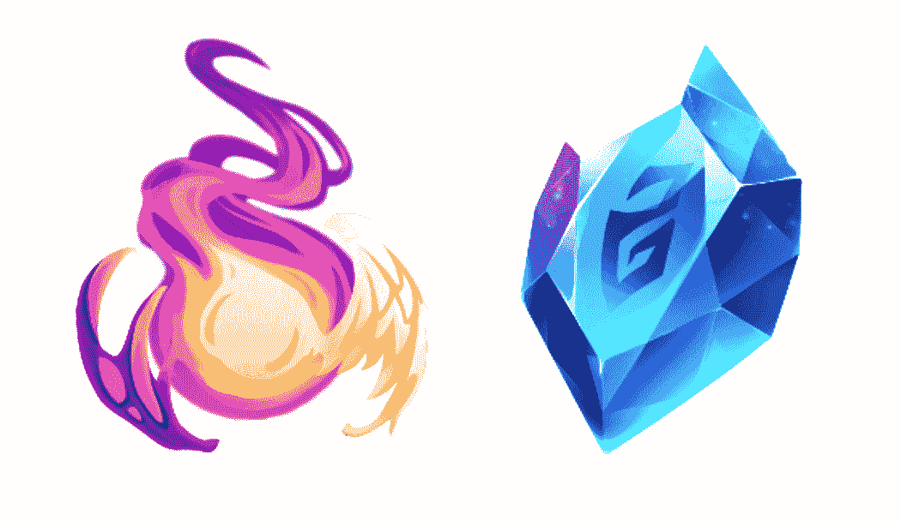

# 如何玩和赢:召唤师竞技场

> 原文：<https://web.archive.org/web/https://dappradar.com/blog/how-to-play-and-win-summoners-arena>

## 探索为什么召唤师竞技场在泰国、越南和菲律宾拥有庞大的玩家基础。

今天的本周游戏将向你介绍召唤师竞技场，这是 BNB 链上一款创新的自动战斗机。召唤师竞技场要求玩家有策略地规划他们的角色、物品、首都和阵容，以最大化他们的收益。

**内容**

*   [什么是召唤师竞技场？](https://web.archive.org/web/20221130135619/https://dappradar.com/blog/how-to-play-and-win-summoners-arena/#what)
*   游戏机制是什么？
    *   [任务](https://web.archive.org/web/20221130135619/https://dappradar.com/blog/how-to-play-and-win-summoners-arena/#quest)
    *   [PvP:玩家对玩家](https://web.archive.org/web/20221130135619/https://dappradar.com/blog/how-to-play-and-win-summoners-arena/#pvp)
    *   [PvE:玩家对环境](https://web.archive.org/web/20221130135619/https://dappradar.com/blog/how-to-play-and-win-summoners-arena/#pve)
*   [召唤师竞技场有 NFT 吗？](https://web.archive.org/web/20221130135619/https://dappradar.com/blog/how-to-play-and-win-summoners-arena/#nfts)
*   [游戏有哪些代币？](https://web.archive.org/web/20221130135619/https://dappradar.com/blog/how-to-play-and-win-summoners-arena/#token)
*   [召唤师竞技场的玩法和取胜机制概述](https://web.archive.org/web/20221130135619/https://dappradar.com/blog/how-to-play-and-win-summoners-arena/#p2e)
*   [有用的链接](https://web.archive.org/web/20221130135619/https://dappradar.com/blog/how-to-play-and-win-summoners-arena/#links)

召唤师竞技场最近在 DappRadar 游戏排名上的突进令人印象深刻。该游戏每月活跃用户超过 14，000 人，在过去两周内保持相对稳定。此外，召唤师竞技场的交易数量大幅上升，在七天内产生了超过 6000 笔交易，表明用户参与度上升。

值得一提的是，这款游戏在东南亚很受欢迎，尤其受到泰国、菲律宾和越南用户的喜爱。最近，这种游戏逐渐在欧洲地区流行起来。

现在，事不宜迟，让我们深入了解这个游戏是怎么回事。

[Check out Summoners Arena](https://web.archive.org/web/20221130135619/https://dappradar.com/binance-smart-chain/games/summoners-arena)

## 什么是召唤师竞技场？

召唤师竞技场是 [BNB 链](https://web.archive.org/web/20221130135619/https://dappradar.com/rankings/protocol/binance-smart-chain/category/games)上的回合制自动对战游戏。它允许玩家收集、升级、进化英雄和锻造物品，以在不同的游戏模式中竞争。

Auto-battler 的游戏玩法通常比较同质化，重复玩同一个游戏很容易让玩家厌烦。然而，召唤师竞技场使用随机数使每个游戏都是独一无二的。因此，它迫使玩家玩不同的组合，尝试他们从未用过的物品。

通过这种方式，不同的角色和物品组合可以产生新的协同效应，让玩家保持参与。

最重要的是，召唤师竞技场将这款游戏设计成一种身临其境的体验，玩家可以从他们的参与中获得享受和奖励。为了实现这一点，召唤师竞技场采用了区块链和 cryptos，并将它们融入到游戏中。

[Summoners Arena Single Dapp Page](https://web.archive.org/web/20221130135619/https://dappradar.com/binance-smart-chain/games/summoners-arena)

## 游戏机制是什么？

Auto-battler 是一款需要各种策略、思维和技巧的战术游戏。召唤师竞技场准备了一系列精心设计的游戏，让玩家尽情享受这些元素。

### 探索

Quest 让玩家在完成任务后获得奖励。玩家可以通过点击游戏界面左下角的任务按钮找到自己需要完成的任务。这些包括欢迎任务，每日任务，每周客人，等等。完成所有任务后，用户可以返回 Quest，点击认领领取奖励。

### PvP:玩家对玩家

有两种 PVP 供玩家选择。在竞技场中，玩家需要一个防守阵容来抵御对手的攻击，也需要一个进攻阵容来挑战其他玩家。玩家需要英雄 NFT 来组成这些阵容。

另一个游戏模式是战场。它有着和竞技场几乎一样的机制，但是用户可以在 NFT 和非 NFT 英雄之间选择战斗。而且英雄的等级不会像竞技场那样被刷爆。

在这两种模式中，获胜会增加等级点数和代币奖励。失败会导致等级点数被扣除。

### PvE:玩家对环境

PvE 有三种模式，战役，地牢，龙塔。

有六个战役级别，包括数百个阶段，玩家挑战的难度越来越大。每完成一个阶段，玩家都会获得古代奖牌。下一个是地牢，一个特殊的游戏模式，玩家可以在其中检查他们每个英雄的真实力量。在地牢中，英雄必须独自战斗直到被击败。

PvE 类最后一个是龙塔。它允许玩家通过征服每一层的战斗来收集奖励。

## 召唤师竞技场有 NFT 吗？

NFT 在这场游戏中扮演着重要的角色。[召唤师竞技场](https://web.archive.org/web/20221130135619/https://dappradar.com/binance-smart-chain/games/summoners-arena)中，英雄帮助玩家完成任务，击倒对手，赢得战斗，其中有一部分是 NFT。这些 NFT 英雄被称为普通英雄，而其他的是特殊英雄或非 NFT 英雄。

英雄可以通过游戏中的召唤功能诞生。玩家召唤英雄时需要 1500 ASG，这是游戏内的代币。在下一章，我们将解释如何赚取这些代币。除了在游戏中创造一个英雄，用户还可以从游戏市场购买这些 NFT。

#### **游戏叫召唤师竞技场，那么召唤师怎么样？**

召唤师是账号原生单位，代表玩家在游戏中的头像。游戏中有 5 个召唤师，每个都有不同的技能组合。如下图所示，召唤师会和英雄并肩作战。

这些角色扮演着队长的角色，在战斗中发挥他们的技能并协助英雄们。

[Check out Summoners Arena](https://web.archive.org/web/20221130135619/https://dappradar.com/binance-smart-chain/games/summoners-arena)

#### **物品也是非功能性物品。**

物品是装备英雄以进一步增强他们的力量的非功能性物品，有三种类型的物品，装备，神器和石头，它们可以升级，直到他们达到一定的级别。值得注意的是，玩家需要完成不同的任务才能获得这些物品。例如，装备只能通过地牢奖励和土地税获得。

## 游戏有哪些代币？

召唤师竞技场有一个双重的游戏经济，ASG 和 SAE 促进了它的生态系统。

SAE 是一个功能性的多用途令牌，用作游戏参与者之间的交换媒介。玩家只有冲到竞技场排行榜前 5000 名才能获得 SAE。

在召唤师竞技场的后期，SAE 将有可能为用户带来投票或赌注奖励等治理功能。

ASG 是召唤师竞技场的游戏货币，并提供了广泛的功能。玩家可以花费 ASG 来召唤、进化、升级英雄、锻造物品等等。在游戏中，ASG 只能通过参与竞技场使用 NFT 英雄来收集。此外，玩家可以通过赢得每日比赛或赛季末奖励来获得 ASG。

助理秘书长是具有现实价值的象征。用户可以每隔 15 天从钱包中取出 ASG，用它来兑换 BUSD，这是 BNB 连锁店生态系统中最稳定的货币。

[Popular Games on BNB Chain](https://web.archive.org/web/20221130135619/https://dappradar.com/rankings/protocol/binance-smart-chain/category/games)

## 召唤师竞技场的游戏和胜利机制简单来说

由于其不可预测性和即时满足感，自动战斗机最近获得了很大的吸引力。召唤师竞技场就是这样一款游戏，它将技巧和策略与一丝好运结合在一起，让你通过关卡并赢得丰厚的奖励。

这款游戏充满了错综复杂的玩法等待用户去探索。关于玩和赢的部分，有两种方法。一个是让你的 NFT 升级并在市场上溢价出售。另一种是获得尽可能多的 ASG 代币，然后在交易所将其转换为稳定价值的代币，即 BUSD。

还值得一提的是，ASG 是一个功能强大的令牌。有助于玩家在游戏中提升战斗力。因此，玩家必须谨慎考虑消费或提现，以实现利润最大化。

## 有用的链接

*   去召唤师竞技场[单人 dapp 页面](https://web.archive.org/web/20221130135619/https://dappradar.com/binance-smart-chain/games/summoners-arena)，在那里你可以进入平台
*   探索[热门游戏](https://web.archive.org/web/20221130135619/https://dappradar.com/rankings/category/games/1)
*   发现[最热的 NFT](https://web.archive.org/web/20221130135619/https://dappradar.com/hub/nft-explorer)
*   [管理和跟踪您的代币资产](https://web.archive.org/web/20221130135619/https://dappradar.com/hub/wallet)
*   召唤师竞技场的[官网](https://web.archive.org/web/20221130135619/https://summonersarena.io/index.html)

DappRadar 为用户提供了对当前 GameFi 和 P2E 形势的全面和最新的理解。通过我们的游戏周系列，用户可以了解更多关于当今最受欢迎的 NFT 游戏。最重要的是，如何像职业选手一样打球和赢球！

立即退房:

*   [Axie Infinity](https://web.archive.org/web/20221130135619/https://dappradar.com/blog/what-is-axie-infinity-and-how-does-it-work/) | [单个 Dapp 页面](/web/20221130135619/https://dappradar.com/blog/what-is-axie-infinity-and-how-does-it-work/)
*   [外星世界](https://web.archive.org/web/20221130135619/https://dappradar.com/blog/how-to-play-alien-worlds-like-a-pro/) | [单人 Dapp 页面](https://web.archive.org/web/20221130135619/https://dappradar.com/multichain/games/alien-worlds)
*   [Gameta](https://web.archive.org/web/20221130135619/https://dappradar.com/blog/what-is-gameta-and-how-to-use-it/) | [单人 Dapp 页面](https://web.archive.org/web/20221130135619/https://dappradar.com/multichain/games/gameta)
*   [X 世界](https://web.archive.org/web/20221130135619/https://dappradar.com/blog/how-to-play-and-win-x-world-games/) | [单人 Dapp 页面](https://web.archive.org/web/20221130135619/https://dappradar.com/binance-smart-chain/games/x-world-games)
*   [纪元 7](https://web.archive.org/web/20221130135619/https://dappradar.com/blog/how-to-play-and-win-era7-game-of-truth/) | [单个 Dapp 页面](https://web.archive.org/web/20221130135619/https://dappradar.com/binance-smart-chain/games/era7-game-of-truth)
*   [九历记](https://web.archive.org/web/20221130135619/https://dappradar.com/blog/how-to-play-and-win-nine-chronicles/) | [单人 Dapp 页面](https://web.archive.org/web/20221130135619/https://dappradar.com/other/games/nine-chronicles)

DappRadar 将继续关注召唤师竞技场和[即玩即赚的最新进展。](https://web.archive.org/web/20221130135619/https://dappradar.com/blog/tag/play-to-earn)在 [Twitter](https://web.archive.org/web/20221130135619/https://twitter.com/dappradar) 、 [Discord](https://web.archive.org/web/20221130135619/https://discord.gg/4ybbssrHkm) 和 [Youtube](https://web.archive.org/web/20221130135619/https://www.youtube.com/c/DappRadar) 上关注我们，跟上区块链世界的动态。

## 随身携带您的 Web3 之旅

使用 DappRadar 移动应用程序，再也不会错过 Web3。查看最受欢迎的 dapps 的性能，并关注您投资组合中的 NFT。您在 DappRadar 上的帐户会与我们的移动应用程序同步，这样您很快就可以选择实时接收提醒。

[Download the DappRadar app now](https://web.archive.org/web/20221130135619/https://dappradar.app.link/blog)[<picture></picture>](https://web.archive.org/web/20221130135619/https://play.google.com/store/apps/details?id=com.portfolio.dappradar)