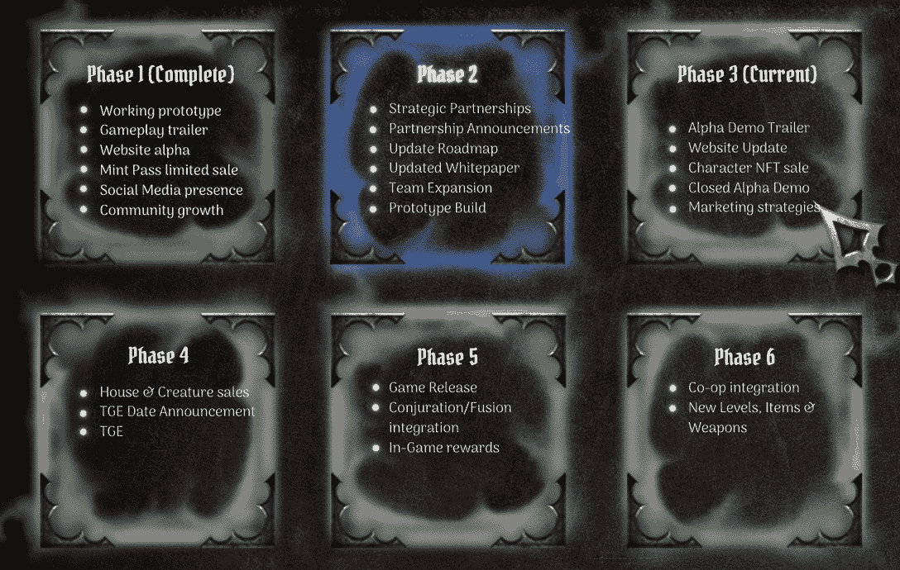

# 如何玩和赢:寓言

> 原文：<https://web.archive.org/web/https://dappradar.com/blog/how-to-play-and-win-the-fabled>

## 幻想区块链游戏吸引球迷到它的阿尔法

传说中的是一个幻想 RPG，是网络游戏中 Web3 革命的一部分。2023 年看起来将是这些游戏从简单的耕作、收集和制作游戏转向全速、开放世界的娱乐盛会的一年。你可以在一个演示版本中加入到这个游戏中来。

**内容**

*   *[什么是传说中的？](https://web.archive.org/web/20230123215914/https://dappradar.com/blog/how-to-play-and-win-the-fabled/#what-is)*
*   *[如何玩赢传说中的？](https://web.archive.org/web/20230123215914/https://dappradar.com/blog/how-to-play-and-win-the-fabled/#play-and-win)*
*   *[是什么让游戏具有创新性？](https://web.archive.org/web/20230123215914/https://dappradar.com/blog/how-to-play-and-win-the-fabled/#innovative)*
    *   *[令牌](https://web.archive.org/web/20230123215914/https://dappradar.com/blog/how-to-play-and-win-the-fabled/#tokens)*
    *   *[NFTs](https://web.archive.org/web/20230123215914/https://dappradar.com/blog/how-to-play-and-win-the-fabled/#nfts)*

    *   *[租房](https://web.archive.org/web/20230123215914/https://dappradar.com/blog/how-to-play-and-win-the-fabled/#renting)*
*   *[传说中的阿尔法和敏特基](https://web.archive.org/web/20230123215914/https://dappradar.com/blog/how-to-play-and-win-the-fabled/#alpha-mintkey)*
*   *[传说中的路线图是什么？](https://web.archive.org/web/20230123215914/https://dappradar.com/blog/how-to-play-and-win-the-fabled/#fabled-roadmap)*
*   *[有用链接](https://web.archive.org/web/20230123215914/https://dappradar.com/blog/how-to-play-and-win-the-fabled/#useful-links)*

随着 12 月 27 日 alpha 版本的发布，这款传说中的游戏朝着开发和发布完整游戏迈出了一大步。为了进入当前的 alpha，粉丝需要购买 mintkeys 或 mintpasses，这将是他们进入平台的门票。任何人都可以在二级市场上买到钥匙和通行证。

[https://web.archive.org/web/20230123215914if_/https://www.youtube.com/embed/YDbx9bo0_WY?feature=oembed](https://web.archive.org/web/20230123215914if_/https://www.youtube.com/embed/YDbx9bo0_WY?feature=oembed)

The Fabled gameplay

[The Fabled Data](https://web.archive.org/web/20230123215914/https://dappradar.com/ethereum/games/the-fabled/)

## 传说中的是什么？

传说中的是一个免费的动作 RPG 游戏，设定在一个通往深渊的入口已经打开的世界。当你引导你的角色通过不同的关卡时，你将会面对一系列的挑战和敌人。

深渊是一种神秘而危险的力量，它腐蚀所有接触到的东西，到目前为止，没有人能够发现谁打开了传送门，或者它们是如何被创造的。然而，来自王国各个角落的勇敢的英雄们冒险进入深渊寻找答案。

这个虚构的游戏是由 Octavian Studios 使用多链聚合器 Xenum 构建的，该团队已经花了三年多的时间来构建这个游戏。如果你对知识和任务感兴趣，那么这就是适合你的游戏。但是你需要一个很高的技能上限来获得胜利。

[Explore Ethereum Games](https://web.archive.org/web/20230123215914/https://dappradar.com/rankings/protocol/ethereum/category/games)

## 你怎么玩并赢得传说中的？

玩这个游戏有两种主要方式:徒步和空中:

*   步行时，玩家可以选择不同的角色类别，如骑士、法师、神和恶魔，并使用一系列武器，如剑、弓和魔法来击败敌人。
*   或者，玩家可以骑上龙坐骑，使用龙息攻击从上方攻击敌人，龙息攻击本质上是一个巨型喷火器。

在游戏中，你可以收集稀有武器，文物，并在游戏中提升你的角色。如果您选择，您可以使用 ABYS 令牌将这些资产铸造到区块链上。玩家可以和其他玩家交易、出售、购买或租借它们。

通过使用$ABYS 令牌，你还可以提升你的角色的能力，给他们灌输深渊的力量。因此 ABYS 也给你机会在游戏中赚钱。

## 是什么让游戏具有创新性？

### 代币

传说中使用两种货币来促进交易:一种在链上，一种在链外:

离链令牌名为灰烬，玩家可以通过在游戏中击败敌人来获得。骨灰可以用来购买游戏内供应商的软薄荷项目和药剂。骨灰容易膨胀，使用时会被“烧掉”。

链上的货币被称为 ABYS，它允许玩家将物品硬铸造到区块链上。ABYS 也可能因为击败老板而获得奖励，这是租赁、召唤和其他市场交易的主要奖励形式。ABYS 也可以押上定期奖励。

### WindowsNT 文件系统（NTFileSystem 的缩写）

你可以和游戏中的其他玩家一起购买、出售、交易、创造和租赁数字资产。要玩这个游戏，你必须至少有一个虚构的角色。这些人物有一系列的外貌，属于不同的阶层。

有三个主要类别:

*   诸神
*   恶魔
*   战士

每个主类都有自己的一组子类。每个角色也有适合他们设计的特殊能力和优势。例如，属于战士子类的游侠角色可能拥有对射箭特别有用的能力。

由玩家决定哪一个职业最适合他们的游戏风格。随着玩家在深渊中的前进，他们将有机会升级他们的传说中的角色并提高他们的能力。

### 红星

玩家可以通过一个称为赌注的过程选择锁定他们的 ABYS 令牌一段特定的时间来获得奖励。下注的代币越多，玩家获得的奖励等级就越高。

*   第 1 级–药剂、食物和其他消耗品。
*   第二层-戒指，护身符和第一层。
*   第三层——武器和上面的所有东西。
*   第 4 层–字符+第 1-3 层。
*   第 5 层——地/生物和之前各层的所有东西。

### 出租

租借可以让更多的玩家通过租借公会或其他玩家的角色或物品来访问传说中的游戏并分享奖励。这个功能允许你在购买前尝试不同的建造或武器。

像 Xenum 这样的平台使玩家能够将他们的资产添加到池中，其他玩家可以在一定时间内租用这些资产。公会也可以把自己的资产贡献给租池，让学者和公会更容易分享奖励。

Xenum 的界面允许公会和其他玩家看到其他租户的排名，因此收入最高的人会被突出显示，公会可以定制他们的资产池，以吸引最优秀的学者和玩家。

租赁的报酬分配和成本由租赁者和提供者共同决定，创造了一个开放和竞争的市场。

## 传说中的阿尔法和敏特基

传说中的阿尔法版本于 12 月 27 日推出。只有持有他们的 mintkey 和 mintpass 的人才能玩这个游戏。这导致了这两种商品的价格飙升。

> 𝔸𝕃ℙℍ𝔸 𝔻𝔼𝕄𝕆
> 传奇性的 Alpha 演示在 Mintpass 上直播&敏特基·holders⚔️
> 转发这个有机会加入白名单！
> 
> 加入我们的不和谐&成为我们不断发展的社区的一部分+赢取专属奖品！生物中的
> 
> 链接[# web 3](https://web.archive.org/web/20230123215914/https://twitter.com/hashtag/web3?src=hash&ref_src=twsrc%5Etfw)[# gamefi](https://web.archive.org/web/20230123215914/https://twitter.com/hashtag/gamefi?src=hash&ref_src=twsrc%5Etfw)[# gaming](https://web.archive.org/web/20230123215914/https://twitter.com/hashtag/gaming?src=hash&ref_src=twsrc%5Etfw)[pic.twitter.com/m0KuiE8wVB](https://web.archive.org/web/20230123215914/https://t.co/m0KuiE8wVB)
> 
> — The Fabled (@TheFabled) [December 27, 2022](https://web.archive.org/web/20230123215914/https://twitter.com/TheFabled/status/1607836257161478146?ref_src=twsrc%5Etfw)

The Fabled launches its alpha version

如果我们看一下二级市场上传说中的 NFTs，我们可以看到 12 月 21 日出现了一个大的价格高峰，当时平均销售价格超过了 0.6 ETH。12 月 24 日，平均销售价格再次飙升，超过 0.5 ETH。

虽然销量不多，但价格的上涨确实显示出这个传说中的产品拥有一批忠实的追随者。对 mintkeys 和 mintpasses 的需求增加意味着很多人想玩游戏的 alpha 版本。

[The Fabled NFT Data](https://web.archive.org/web/20230123215914/https://dappradar.com/ethereum/games/the-fabled/nfts)

## 传说中的路线图上有什么？

Fabled 目前处于 alpha 阶段，玩家可以玩游戏的演示版本，开发者可以识别错误和问题。根据传说中的自己的路线图，他们目前处于第三阶段。

The Fabled roadmap

正如我们所看到的，路线图中还有很多阶段，所以粉丝们应该对 2023 年及以后的游戏有更多的期待。

## 有用的链接

*   [传说中的数据](https://web.archive.org/web/20230123215914/https://dappradar.com/ethereum/games/the-fabled)
*   [探索 Web3 游戏](https://web.archive.org/web/20230123215914/https://dappradar.com/rankings/category/games)
*   [查看 NFT 信息](https://web.archive.org/web/20230123215914/https://dappradar.com/nft)
*   [游戏信息](https://web.archive.org/web/20230123215914/https://dappradar.com/topic/games)

## 随身携带您的 Web3 之旅

使用 DappRadar 移动应用程序，再也不会错过 Web3。查看最受欢迎的 dapps 的性能，并关注您投资组合中的 NFT。您在 DappRadar 上的帐户会与我们的移动应用程序同步，这样您很快就可以选择实时接收提醒。

[Download the DappRadar app now](https://web.archive.org/web/20230123215914/https://dappradar.app.link/blog)[<picture></picture>](https://web.archive.org/web/20230123215914/https://play.google.com/store/apps/details?id=com.portfolio.dappradar)