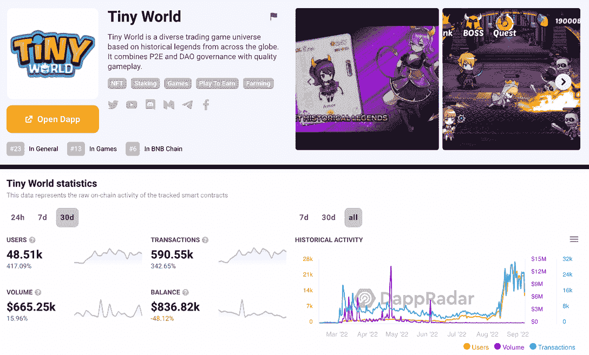
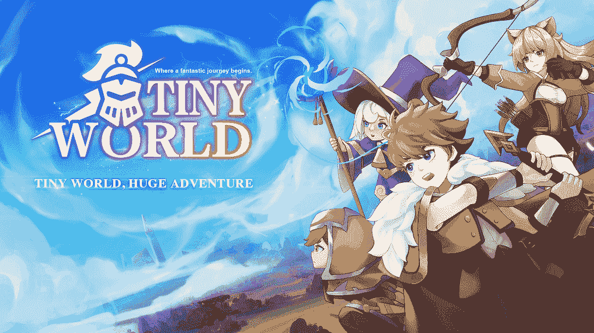
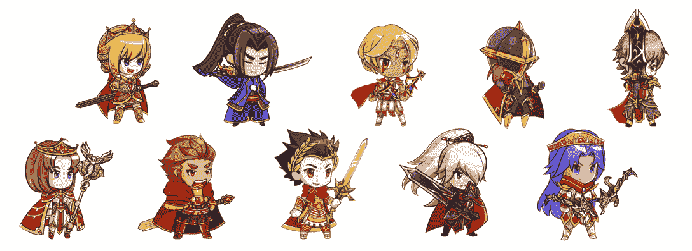
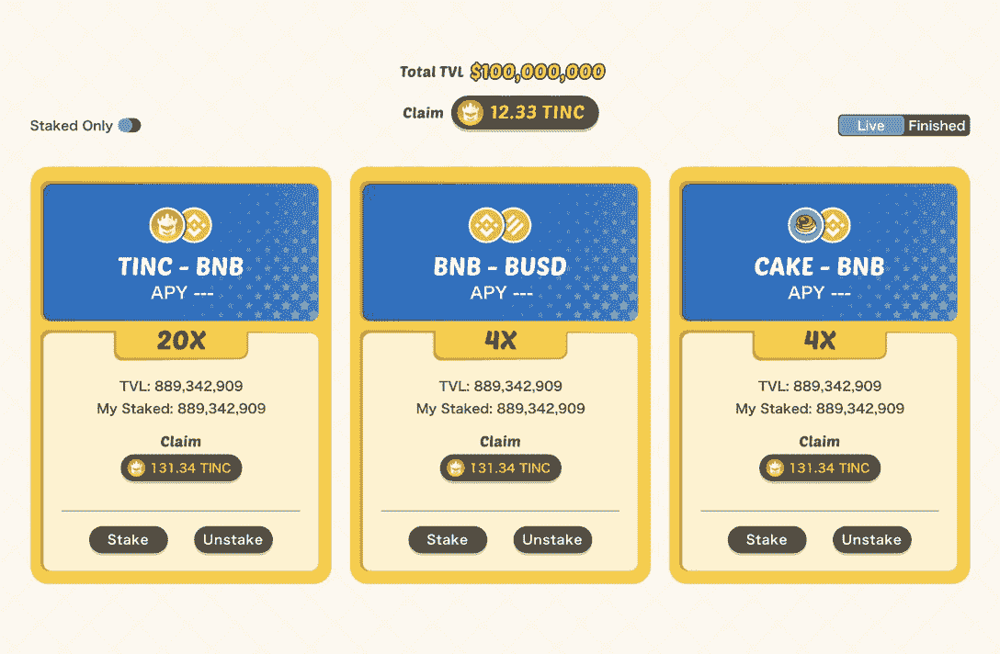
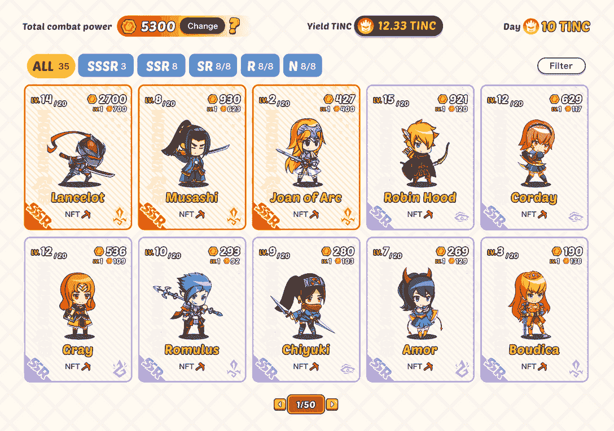
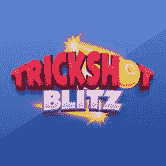
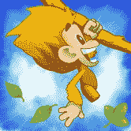

# 如何玩和赢:微小的世界

> 原文：<https://web.archive.org/web/https://dappradar.com/blog/how-to-play-and-win-tiny-world>

## 你可能错过了 BNB 链条上排名第三的游戏。

《小小世界》是一个 NFT 驱动的 GameFi 宇宙。它为用户提供了多种方式通过游戏赚取丰厚的奖励。微小世界背后的团队创造了一种结合 NFT、DeFi 和游戏的独特体验，玩家可以收集超过 100 个微小的英雄 NFT，将它们送上史诗旅程，并在战斗中战斗。

**内容**

*   [什么是微小世界？](https://web.archive.org/web/20220926151249/https://dappradar.com/blog/how-to-play-and-win-tiny-world/#what)
*   《微小世界》中的 NFT 有哪些，如何获取？
*   [游戏内的货币是什么？](https://web.archive.org/web/20220926151249/https://dappradar.com/blog/how-to-play-and-win-tiny-world/#token)
*   玩《小小世界》怎么赚钱？
    *   [小金库](https://web.archive.org/web/20220926151249/https://dappradar.com/blog/how-to-play-and-win-tiny-world/#tiny-vault)
    *   [NFT 高产农业](https://web.archive.org/web/20220926151249/https://dappradar.com/blog/how-to-play-and-win-tiny-world/#farming)
    *   [玩游戏](https://web.archive.org/web/20220926151249/https://dappradar.com/blog/how-to-play-and-win-tiny-world/#play)
*   [有用的链接](https://web.archive.org/web/20220926151249/https://dappradar.com/blog/how-to-play-and-win-tiny-world/#links)

随着“玩即赚”游戏越来越受欢迎，游戏开发商开始涉足不同的类型，尝试新颖的游戏来满足玩家不断增长的需求。显然，这个领域的竞争比以往更加激烈。

因此，对于用户来说，在游戏的海洋中找到最珍贵的东西可能是一个挑战，DappRadar 可以帮助你！通过 DappRadar 游戏排名，用户可以快速发现各种区块链网络中最受欢迎的游戏。我们还不时为读者带来这些游戏的深度指南。

上个月，我们在我们的[BNB 最热门游戏链文章](/web/20220926151249/https://dappradar.com/blog/the-5-hottest-games-on-bnb-chain-you-probably-missed/)中特别介绍了[小世界](https://web.archive.org/web/20220926151249/https://dappradar.com/binance-smart-chain/games/tiny-world)，一款玩赚游戏。从那以后，这款游戏一飞冲天，30 天内用户从 10000 增加到 48000。

如果你以前从未探索过这个游戏，或者正在寻找你的下一个 GameFi 机会，那么这个微型世界的终极指南就是为你准备的。

## 什么是微小的世界？

《小小世界》是一个区块链游戏世界，结合了 NFT、DeFi 和游戏，为用户提供独特的游戏体验。这款游戏有许多可爱的小角色，玩家可以在游戏中使用，并作为 NFT 拥有。再者，微小世界的产品矩阵由微小游戏和微小农场两部分组成。

目前，微小游戏下有两款游戏:微小王国和微小地下城。《小小王国》是一款闲置的交易游戏，玩家利用空闲时间进行战斗，从交易中获利。另一个叫做微型地下城，是一个带有塔防机制的模拟游戏。

除了游戏，《微小世界》还允许用户以《微小农场》的形式享受复杂的 DeFi 体验。它的 DeFi 机制包括产量聚集、流动性挖掘、赌注、农业等等。

## 《微小世界》中的 NFT 有哪些，如何获取？

小小英雄 NFT 是《小小世界》最关键的游戏之一。微小的英雄人物受到全球历史人物的影响。玩家可以在 DeFi 机制和游戏中使用这些 ERC-1155 NFT，例如战斗和地牢探索。

最初，玩家需要使用另一种类型的召唤符文来召唤小英雄。值得注意的是召唤符文不能在市场上交易。玩家需要从平台购买。

除了用召唤符文创造英雄之外，用户还可以直接从微小世界的市场获得它们。

## 游戏内货币是什么？

微小硬币(TINC)是微小世界玩家驱动经济的主要组成部分。它激励积极与游戏互动的玩家，奖励为生态系统发展做出贡献的开发者。

TINC 有多种用途。玩家可以用 TINC 购买召唤符文和小英雄等非战斗单位。而且很多微小的游戏场景都需要玩家花费 TINC，比如购买工具、扩充库存槽等。

但最重要的是，TINC 是让《微小世界》的游戏赚钱机制得以持续的载体。我们将在下一节讨论细节。

## 玩《小小世界》怎么赚钱？

TINC 有一个精心设计的循环经济模式。用户可以通过各种方式从中获得回报。

### 小金库

微小金库是一个收益率优化器，允许微小世界用户在币安智能链生态系统上获得最佳收益率。此外，用户可以在 Tiny Vault 智能合约中注入某些流动性提供商(LP)令牌，以开始获得奖励。

### NFT 高产农业

小农场为用户带来了一个独特的农业采矿池，用于货币化他们的小英雄 NFT。用户可以用他们的小英雄 NFT 组成一个探险队，并以此赢得 TINC。

重要的是要提醒玩家，小英雄有不同的稀有性和属性，影响他们的赚钱能力。稀有程度越高，英雄在采矿时就越强大。此外，玩家可以遵循特定的规则来升级他们的英雄，以提高他们的收入。

### 玩游戏

正如从玩到赚游戏所期望的那样，小游戏为用户在探索游戏的同时享受额外津贴提供了多种方式。例如，玩家可以加入微小王国战斗，爬上排行榜，赢得奖励。如果排名下降对你来说还不够刺激，去小小地牢建造你自己的黑暗世界吧。

在小地牢里，惊人的奖励会像雨点般降落在你的土地上，竞争会变得更加激烈！在地下城的世界里，丛林法则适用，玩家可以派遣他们的小队去掠夺其他地下城！

## 有用的链接

《小小世界》于 2022 年 3 月上市。令人印象深刻的是，由于其各种 DeFi-powered 功能和广阔的生态系统，它已经获得了大量的牵引力。如果你想了解更多关于《微小世界》的信息，去[它的单个 dapp 页面](https://web.archive.org/web/20220926151249/https://dappradar.com/binance-smart-chain/games/tiny-world)，你会在那里找到所有的数据驱动信息。

DappRadar 让用户对当前的 GameFi 和 P2E 局势有了全面和最新的了解。通过我们的游戏周系列，用户可以了解更多关于当今最受欢迎的 NFT 游戏。最重要的是，如何像职业选手一样打球和赢球！

立即退房:

*   [PlayMining](https://web.archive.org/web/20220926151249/https://dappradar.com/blog/how-to-play-and-win-playmining)
*   [特技闪电战](https://web.archive.org/web/20220926151249/https://dappradar.com/blog/how-to-play-trickshot-blitz)
*   [石基香蕉](https://web.archive.org/web/20220926151249/https://dappradar.com/blog/how-to-play-and-win-benji-bananas)

[<picture></picture>](https://web.archive.org/web/20220926151249/https://dappradar.com/dep/games/playmining)

PlayMining

[<picture></picture>](https://web.archive.org/web/20220926151249/https://dappradar.com/flow/games/trickshot-blitz)

Trickshot Blitz

[<picture></picture>](https://web.archive.org/web/20220926151249/https://dappradar.com/multichain/games/benji-bananas)

Benji Bananas

DappRadar 将继续关注《微小世界》的最新进展，并参与游戏赚钱。在 [Twitter](https://web.archive.org/web/20220926151249/https://twitter.com/dappradar) 、 [Discord](https://web.archive.org/web/20220926151249/https://discord.gg/4ybbssrHkm) 和 [Youtube](https://web.archive.org/web/20220926151249/https://www.youtube.com/c/DappRadar) 上关注我们，跟上区块链世界的动态。