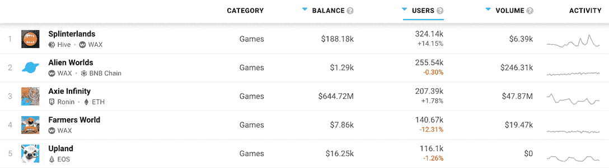

# 如何玩和赢:高地

> 原文：<https://web.archive.org/web/https://dappradar.com/blog/how-to-play-and-win-upland>

## Upland 本周在 DappRadar 的游戏排行榜上排名第五

**Upland 于 2018 年初推出，现已发展成为市场上最受欢迎的******游戏之一。如今，它平均每月吸引 5 万名用户。基于 EOS 区块链** **的** [**打造，游戏将繁华都市的活力带到我们的指尖。**](https://web.archive.org/web/20220817041643/https://dappradar.com/rankings/protocol/eos)**

 ****内容**

*   **[旱地有什么意思？](https://web.archive.org/web/20220817041643/https://dappradar.com/blog/how-to-play-and-win-upland/#what-is)**
*   **[游戏如何运作？](https://web.archive.org/web/20220817041643/https://dappradar.com/blog/how-to-play-and-win-upland/#how-does)**
*   **[用 Upland 赚钱最好的方法是什么？](https://web.archive.org/web/20220817041643/https://dappradar.com/blog/how-to-play-and-win-upland/#best-way)**
    *   **[获取财产](https://web.archive.org/web/20220817041643/https://dappradar.com/blog/how-to-play-and-win-upland/#acquire-property)**
    *   **[参观](https://web.archive.org/web/20220817041643/https://dappradar.com/blog/how-to-play-and-win-upland/#visits-upland)**
    *   **[租出火花](https://web.archive.org/web/20220817041643/https://dappradar.com/blog/how-to-play-and-win-upland/#rent-out)**
    *   **[操纵地板](https://web.archive.org/web/20220817041643/https://dappradar.com/blog/how-to-play-and-win-upland/#manipulate-floor)**
    *   **[寻宝](https://web.archive.org/web/20220817041643/https://dappradar.com/blog/how-to-play-and-win-upland/#treasure-hunting)**
*   **[如何加入并开始玩高地](https://web.archive.org/web/20220817041643/https://dappradar.com/blog/how-to-play-and-win-upland/#join-and-play)**
*   **[买哪个楼盘](https://web.archive.org/web/20220817041643/https://dappradar.com/blog/how-to-play-and-win-upland/#which-property)**

到目前为止，2022 年对 web3 来说可能是坎坷的一年，但[区块链游戏在充满挑战的条件下保持了自己的](https://web.archive.org/web/20220817041643/https://dappradar.com/blog/dappradar-crypto-games-report-5-blockchain-games-continue-to-defy-the-bear-market)。高地是最受欢迎和最成功的游戏之一。在过去动荡的几个月里，它帮助游戏业保持了自己的地位。

在 DappRadar 的区块链游戏排名中，Upland 在众多竞争者中排名第五。在它上面是这个领域的一些重量级人物，比如[splitterlands](https://web.archive.org/web/20220817041643/https://dappradar.com/multichain/games/splinterlands)和 [Axie Infinity](https://web.archive.org/web/20220817041643/https://dappradar.com/multichain/games/axie-infinity) 。

[Upland at number five in DappRadar’s rankings](https://web.archive.org/web/20220817041643/https://dappradar.com/rankings/category/games)

在了解如何玩高地游戏和一些最佳战术之前，我们需要首先了解游戏是什么。

## 什么是高地？

高地是一个虚拟世界，是蓬勃发展的元宇宙的一部分。玩家可以在模拟的土地上建造、购买和翻转数字房地产，这些土地是为反映真实城市而设计的。

除了成为虚拟房地产经纪人，高地玩家还可以收集游戏中的物品，拥有并驾驶汽车，参加音乐会，并开创自己的事业。

[https://web.archive.org/web/20220817041643if_/https://www.youtube.com/embed/ERNn35_iqtE?feature=oembed](https://web.archive.org/web/20220817041643if_/https://www.youtube.com/embed/ERNn35_iqtE?feature=oembed)

What is Upland?

高地模糊了电脑游戏和类似于真正可供选择的工作和社交空间之间的界限。高地的一切都始于地产，但这个平台不仅仅是区块链游戏化版的垄断。

随着元宇宙在互联网上的持续增长，Upland 的创造者们计划加入更新和更多的 web3 技术元素。从外部来看，玩家在游戏中可以做的事情的可能性将会继续扩大。

## 游戏是如何运作的？

正如我们所见，游戏的基础是数字房地产。买卖虚拟财产，以盈利为目的，才是最终目的。但是玩家可以做的远不止这些。

就像在现实世界中一样，玩家如何处理他们的财产由他们自己决定。有些人选择创业。这些可以是游戏中的企业，玩家在这里作为外部或内部设计师开店。其他用户建立了街区探索商店，玩家可以在那里交易游戏中的物品。

一些玩家还将他们的房产用作虚拟画廊，展示他们的数字或真实艺术品。然后，玩家可以使用加密货币或法定现金为这些艺术品付款。

人们还可以选择将他们的虚拟高地房产变成现实生活中的企业总部。他们可以给客户一个高地地址，然后在那里问候他们并讨论业务。随着元宇宙向未来发展，预计会有更多现实生活中的公司采用这种模式。

[https://web.archive.org/web/20220817041643if_/https://www.youtube.com/embed/5w7m24gADoo?start=12&feature=oembed](https://web.archive.org/web/20220817041643if_/https://www.youtube.com/embed/5w7m24gADoo?start=12&feature=oembed)

DappRadar Meets Upland

新玩家可以通过公平开始法案在游戏中获得更便宜的房产。玩家持有的任何财产每年将获得 14.7%的收益。持有多处房产的玩家可以将它们收集到一个投资组合中，获得更高的回报和一次性奖金。

赚取 10，000 UPX 的玩家将有资格获得 Uplander 身份。一旦这种情况发生，玩家可以开始赚取火花来建造结构 NFTs。这也允许他们开始在二级市场上交易游戏中的财产。

NFT 对美元的过程使玩家能够用法定货币买卖财产。该功能仅适用于 Uplander 身份的玩家。NFT 对美元只适用于网页版和移动网页版的游戏。

## 用 Upland 赚钱最好的方法是什么？

这是每个人都在问的问题。高地游戏是一个靠玩来赚钱的游戏，所以玩这个游戏的人自然想知道他们怎样才能拿到钱。

首先，你需要花时间玩高地游戏，并学习如何从中获益。和所有的游戏一样，积累经验和资产需要时间和努力。

为了节省你学习游戏的时间，我们列出了 5 种在游戏中赚钱的方法。

### 获得财产

首先，你需要用游戏中的货币 UPX 来购买。稍后，你将能够建造你自己的财产。财产是高地的建筑材料。没有它，你就赚不到。

根据高地公司未来的成功程度，你可以通过拥有一处房产并坐拥它来获得一些收益。你还可以从你的财产价值中获得一定比例的 UPX。所以只要什么都不做，你就能挣钱。

### 参观

当其他玩家访问玩家时，玩家获得 UPX。吸引观众有两种方式。让你的酒店成为人们想去参观的地方。人们想要娱乐、逗乐或快乐；你能做到这一点，群众就来了。

其次，使你的访问价格低。如果你让拜访你的费用变得微不足道，人们几乎不会知道他们花了钱。但对你来说，足够多的小额支付会变得相当有利可图。

### 出租火花

玩家需要火花来建造建筑。你可以把你自己的火花加入到别人的建造中来加速他们的建造时间。作为回报，你可以向他们收取帮助费。找出谁需要火花，并就价格达成一致的最佳方式是利用不和与有需要的人交谈。

参加社区聊天和迎合高地的世界需要一点时间和努力。但是一旦你做到了这一点，你就可以坐下来看着 UPX 堆积起来。

### 操纵地板

这是一种冒险的策略，在牛市中最有效。在高地社区，这也被称为抬高地板。为了做到这一点，你需要大量的一次性 UPX。而且，如果你运气不好，你可能会失去一些。

操纵或提高地板意味着找到一个高地社区与低物业地板价格。然后，你尽可能多地购买附近最便宜的房产。一旦你做到了这一点，你就可以提高你拥有的每一处房产的底价。

理论上，你仍将拥有附近最便宜的房产，但它们会比你当初购买时的价格更贵。

互联网上充斥着向你展示如何做的人，这可能是增加你收入的非常有效的方法。

### 寻宝

高地寻宝包括点击地图，试图找到宝藏。为了找到隐藏的奖励，在地图上旅行和参观建筑物需要花费少量的 UPX。

箭头显示你在狩猎中是变得更热还是更冷。但要小心，你可能找不到任何宝藏，留给你的将是枯竭的 UPX 股票。所以，在开始追寻之前，先研究一下最佳的搜寻策略。

宝藏并不总是以 UPX 的形式出现。有时，成功的猎人会得到火花作为奖励，这是游戏中最有价值的资产之一。

[https://web.archive.org/web/20220817041643if_/https://www.youtube.com/embed/iKF-Dpnhv8o?feature=oembed](https://web.archive.org/web/20220817041643if_/https://www.youtube.com/embed/iKF-Dpnhv8o?feature=oembed)

Treasure Hunting in Upland

## 如何加入并开始玩高地游戏

[打开高地 dapp](https://web.archive.org/web/20220817041643/https://dappradar.com/deeplink/3388) ，点击右上角的 Enter Upland。

[Upland.Me](https://web.archive.org/web/20220817041643/https://dappradar.com/deeplink/3388)

一旦你进入，你会发现一个简短的 KYC 过程，你选择一个用户名，输入你的电子邮件地址和密码。确认你的身份在电子邮件中，你会发现你的收件箱，在你知道它之前，你会在高地。

一旦你在那里，你会得到少量的免费 UPX 开始玩，并就如何做一些提示。一旦你进去了，你可以去你选择的任何一个城市看看。

## 买哪个楼盘

由于房地产是高地的基础，知道哪些是最好买的很重要。与现实世界一样，房地产价格因位置而异。一个地区的吸引力会随着你无法控制的因素而上下波动。

首先，选择合适的城市。纽约和芝加哥显然是最迷人的两个地方。但是他们也有最高的房地产价格。所以你需要在最好的位置和最有竞争力的价格之间找到一个平衡点。

要找到开始高地之旅的最佳地点，请前往 [Upland.me](https://web.archive.org/web/20220817041643/https://dappradar.com/deeplink/3388) 并在社区选项卡下找到市场分析页面。

去未出租的房产，那是给新玩家的。选择你的城市；虽然他们拥有最昂贵的房产，但拉斯维加斯、芝加哥和纽约等地是最佳去处。

使用 Unminted 工具，单击 true for FSA only 并查找您想购买的某处区域的最低房价。获取您想要购买的房产的地址，在地图中找到它并抢购该房产。

 NewsletterUnsubscribe at any time. [T&Cs](https://web.archive.org/web/20220817041643/https://dappradar.com/terms) and [Privacy Policy](https://web.archive.org/web/20220817041643/https://dappradar.com/privacy-policy)**