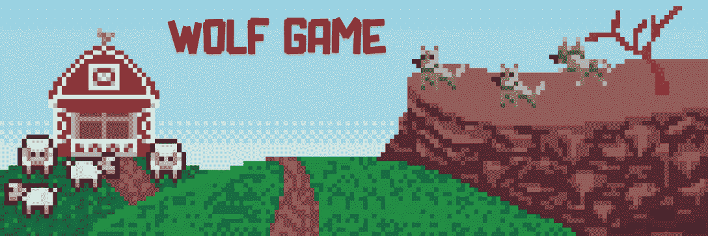
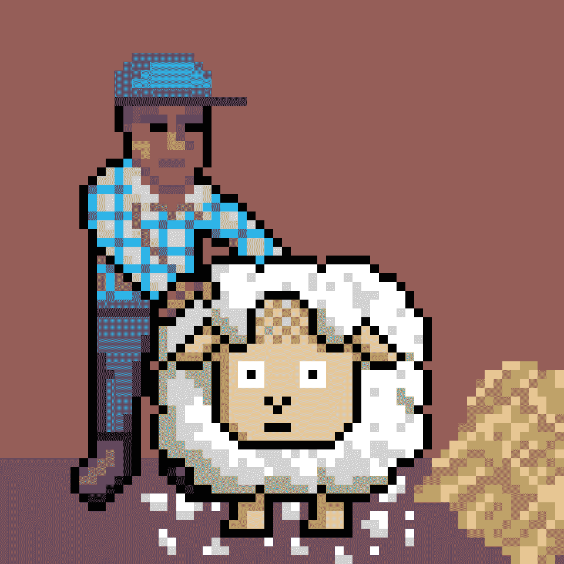
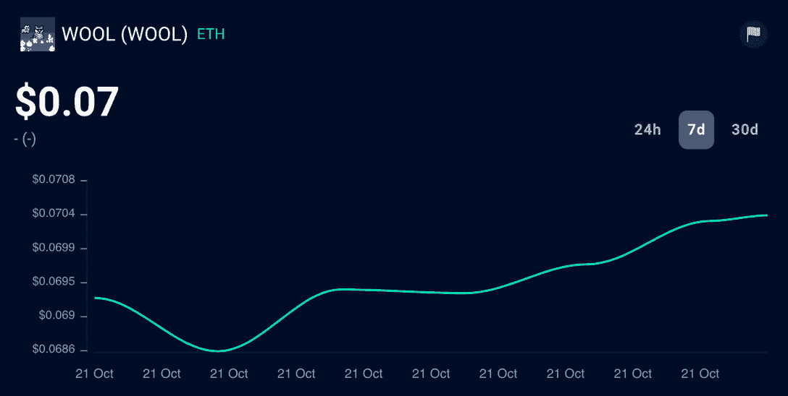
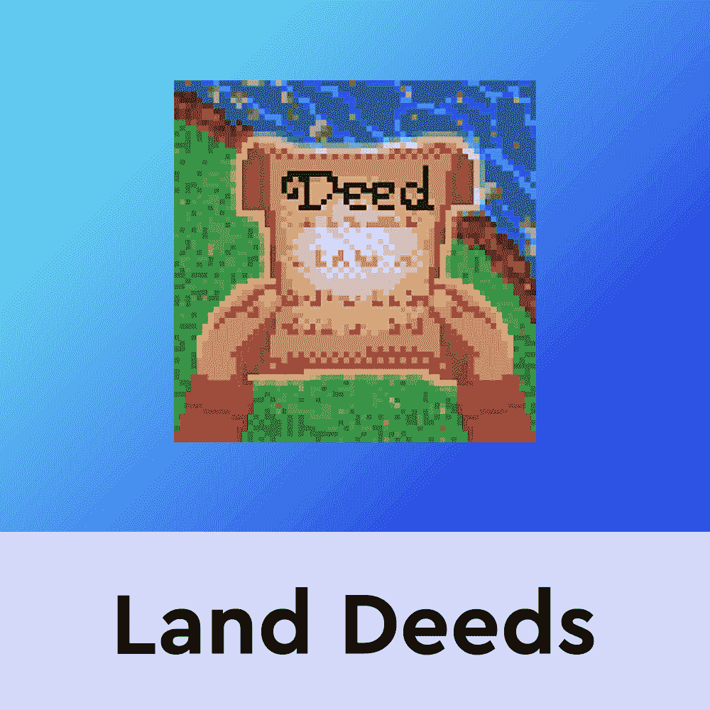
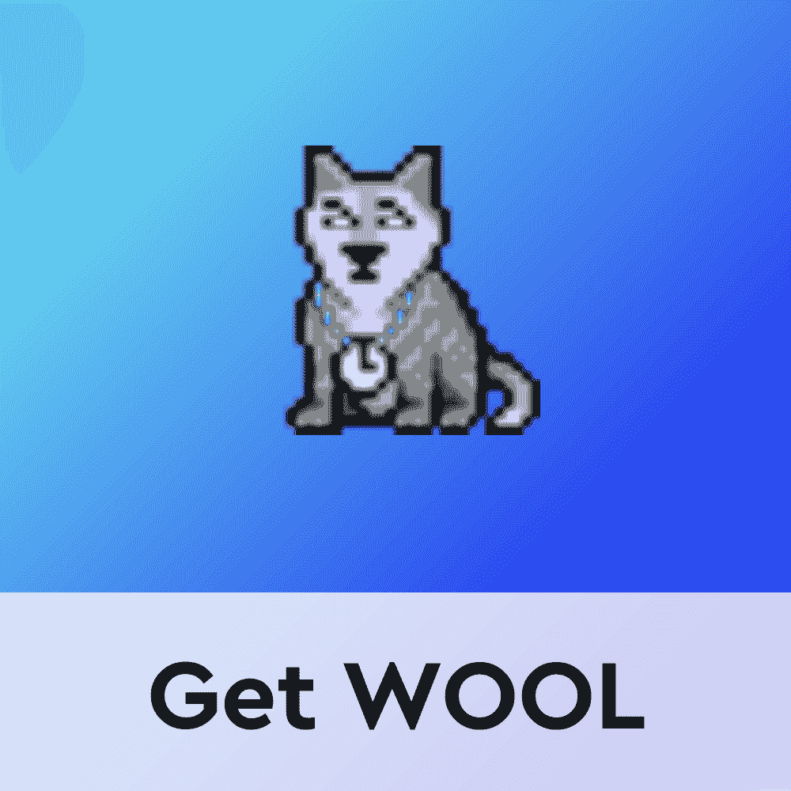

# 如何玩和赢:狼的游戏

> 原文：<https://web.archive.org/web/https://dappradar.com/blog/how-to-play-and-win-wolf-game>

## 随着游戏全面上市的临近，狼游戏 NFTs 底价在 30 天内上涨了 110%

**Wolf 游戏重新成为了游戏赚钱领域的热门话题。基于以太坊的游戏平台刚刚推出了羊毛事件#4，其市值在上个月增长了 54%。在此期间，狼游戏 NFTs，包括羊和狼，已经产生了超过 280 万美元的交易量。** **随着游戏的完整版本即将推出，你不会想错过这个。以下是开始玩狼游戏的方法。**

## 目录

*   [什么是狼性游戏？](https://web.archive.org/web/20230205025651/https://dappradar.com/blog/how-to-play-and-win-wolf-game/#What-is-Wolf-Game?)
*   [如何开始玩狼游戏](https://web.archive.org/web/20230205025651/https://dappradar.com/blog/how-to-play-and-win-wolf-game/#How-to-get-started-on-Wolf-Game)
*   [是什么让狼性游戏具有创新性？](https://web.archive.org/web/20230205025651/https://dappradar.com/blog/how-to-play-and-win-wolf-game/#What-makes-Wolf-Game-innovative?)
    *   [狼和羊](https://web.archive.org/web/20230205025651/https://dappradar.com/blog/how-to-play-and-win-wolf-game/#Wolves-and-Sheep)
    *   [土地和农民](https://web.archive.org/web/20230205025651/https://dappradar.com/blog/how-to-play-and-win-wolf-game/#Land-and-Farmers)
    *   [包:攻击和防御](https://web.archive.org/web/20230205025651/https://dappradar.com/blog/how-to-play-and-win-wolf-game/#Packs:-Attack-and-Fortify)
*   [什么是羊毛？](https://web.archive.org/web/20230205025651/https://dappradar.com/blog/how-to-play-and-win-wolf-game/#What-is-WOOL?)
*   [如何玩并赢得狼游戏](https://web.archive.org/web/20230205025651/https://dappradar.com/blog/how-to-play-and-win-wolf-game/#How-to-play-and-win-Wolf-Game)
*   [狼迄今为止的游戏轨迹](https://web.archive.org/web/20230205025651/https://dappradar.com/blog/how-to-play-and-win-wolf-game/#Wolf-Game-trajectory-to-date)
*   完整游戏什么时候推出？
*   [狼游戏牧羊人是谁？](https://web.archive.org/web/20230205025651/https://dappradar.com/blog/how-to-play-and-win-wolf-game/#Who-is-the-Wolf-Game-Shepherd?)
*   [了解最新最热门的区块链游戏](https://web.archive.org/web/20230205025651/https://dappradar.com/blog/how-to-play-and-win-wolf-game/#Keep-up-with-the-hottest-new-blockchain-games)
    *   [有用的链接](https://web.archive.org/web/20230205025651/https://dappradar.com/blog/how-to-play-and-win-wolf-game/#Useful-links)

## 什么是野狼游戏？

Wolf Game 是一款结合 NFTs 和 DeFi 机制的游戏，为玩家带来被动收入。这款游戏的一个重要特点是，它在决策过程中非常注重风险。

这也是 Wolf Game 从我们目前所看到的游戏赚取空间中脱颖而出的地方。玩家必须仔细计算风险的百分比。当然，风险越高，回报越高。

虽然它仍在开发中，但游戏经历了几个向公众开放的阶段，在那里它展示了与分散金融(DeFi)相关的创新游戏机制。

虽然完整的游戏还没有推出，但你可以享受游戏的 alpha 版本。在这个版本中，你需要使用基于以太坊的 NFTs 来升级你的农场，并获得更多游戏中的羊毛令牌——同时努力保持你的游戏资产安全。

## 是什么让狼性游戏具有创新性？

Wolf Game 将游戏化金融(通常缩写为 GameFi)带到了你在元宇宙的谷仓。在那里，你拥有你玩耍的土地，而绵羊生产羊毛代币，农民在土地上劳作，狼群包围着你的农场。

你的羊可以被饲养和拴起来，但是它们永远不会完全远离狼群。但是游戏的动态是你的 NFT 可以自己和游戏互动。

*   如果没有用木桩固定，狼可以从你的农场绑架羊；
*   你需要向狼群缴纳羊毛生产税；
*   羊毛袋以 ERC-20 代币的形式存在，随着时间的推移释放 NFTs。

虽然游戏内 NFT 的铸造过程已经结束，但你可以在 OpenSea 等二级市场上购买它们。了解每个游戏角色的更多信息:

### 狼和羊

狼和羊是游戏中的两个主角。羊和狼都是居住在区块链以太坊的可铸造的 ERC-721 NFT。这些 NFT 的铸造过程已经结束，同时也引入了风险的概念。为了造币，玩家需要羊毛代币。

本质上，羊在谷仓里快乐地生活，主人收集羊毛代币来标记他们的羊。

然而，就在谷仓外面，一群狼正在焦急地寻找接近羊群的方法。为了保护他们的羊，主人向狼缴纳羊毛税。狼得到了进入谷仓的全部羊毛收入的 30%。

Source: Wolf Game

但是有一个问题。狼喜欢偷东西。如果你有一只狼 NFT，你也会从你的狼为你偷一只羊 NFT 的可能性中受益。

在撰写本文时，二级市场上最便宜的羊是 **1.05 ETH** ，约合 1363 美元。狼的价格甚至更高，目前最便宜的售价为 **8 ETH** ，也就是 10390 美元。

[Check Wolf Game Sheep & Wolves NFT Data](https://web.archive.org/web/20230205025651/https://dappradar.com/hub/nft-explorer/collection/wolf-game)

### 土地和农民

为了跟上虚拟世界的最新趋势，Wolf Game 还推出了 land deed NFTs。这些行为对养羊人来说是一种激励。

20，000 份土地 NFT 中的每一份都是独一无二的，拥有不同的面积和能力，农民可以成倍增加——在撰写本文时，这也是一批底价为 **0.55 ETH** 或 714 美元的 NFT。

Source: Wolf Game

土地 NFT 允许玩家培养资产并提高他们的表现。到目前为止，游戏中土地分配的方式是项目成功的重要部分。此外，一半的供应量是留给创世纪 NFT 持有者的。其中一份房契的底价目前是 0.41 ETH，大约 532 美元。

### 背包:攻击和防御

狼游戏的最新阶段，阿尔法游戏，引入了新的游戏方式，玩家可以使用他们的狼和羊来创建包。你可以把一个群体看做一个氏族或行会。目标是帮助你的包通过攻击其他包或防御你的防御工事和下注你的 NFT 积累尽可能多的点。

根据你的 NFT 的类型，如果它是一只羊或一只狼在一个特定的水平(欧米伽，德尔塔，贝塔和阿尔法)，赌注赚取你的包更多的点。你可以选择离开你的包，只要你不是它的阿尔法。

根据游戏的白皮书，*“游戏将在整个狼游戏开发期间进行，并在牧羊人决定时结束。”*

## 什么是羊毛？

羊毛是 ERC 的土产，象征着狼的游戏。在羊身上下注可以让持有者在羊毛上获得被动收入。

牵着一只狼，NFT 也从羊毛中获得了被动收入。在撰写本文时，一枚[羊毛币](https://web.archive.org/web/20230205025651/https://dappradar.com/hub/token/eth/WOOL?from=0x8355dbe8b0e275abad27eb843f3eaf3fc855e525)大约值**0.07 美元**。

在过去的 30 天里，羊毛价格上涨了 110%。

[<picture></picture>](https://web.archive.org/web/20230205025651/https://dappradar.com/hub/token/eth/WOOL?from=0x8355dbe8b0e275abad27eb843f3eaf3fc855e525)

您可以从玩狼游戏中赚取羊毛，并通过拥有和下注您的 NFT 和羊毛来增加您的收入。如果你想买羊毛，你可以在 Uniswap 这样的交易所或者通过 T2 DappRadar 自己的综合代币交易平台进行交易，这不需要额外的费用。

[Track WOOL with DappRadar’s Token Explorer](https://web.archive.org/web/20230205025651/https://dappradar.com/hub/token/eth/WOOL?from=0x8355dbe8b0e275abad27eb843f3eaf3fc855e525)

## 如何玩和赢得狼游戏

现在，你可以在阿尔法游戏中加入狼队，并成为 V2 狼队游戏开发的一部分，该游戏将于 2022 年底前全面推出。

本周，羊毛活动#4 开始，根据官方网站，您必须在 10 月 24 日美国东部时间晚上 11:59 之前参加。

> 随着建造季节稳步过渡到发射季节，狼群成员试图向它们的阿尔法狼表示忠诚，并利用羊毛为自己谋利。
> 
> 羊毛事件#4 现场直播。
> 
> 高达 5000 万羊毛危在旦夕:3000 万未加工羊毛，2000 万袋装羊毛。
> 下面的
> 规则。
> 
> –牧羊人
> 
> 1/7[pic.twitter.com/vepHE118WJ](https://web.archive.org/web/20230205025651/https://t.co/vepHE118WJ)
> 
> — Wolf Game (@wolfdotgame) [October 18, 2022](https://web.archive.org/web/20230205025651/https://twitter.com/wolfdotgame/status/1582196693499801600?ref_src=twsrc%5Etfw)

开始玩 Wolf Game 需要做的事情如下:

1.  学习游戏的历史和机制。加入他们的社区，了解更多信息；
2.  访问[游戏官网](https://web.archive.org/web/20230205025651/https://wolf.game/)，连接你的元面具；
3.  让自己做好战斗准备:根据自己的策略在 [OpenSea](https://web.archive.org/web/20230205025651/https://opensea.io/collection/wolf-game) 上研究购买羊和狼；
4.  将羊毛代币添加到您的钱包中——您可以在 Uniswap 上进行交易；
5.  选择并加入 14 个包中的一个开始玩；
6.  下注你的 NFT。

确保选择好你的 NFTs，以及你的背包。正如你所知道的，不同的 NFT 有不同的特性，在攻击和防御你的防御工事时可以给你更高的分数。

在这次活动中，你有机会用你的背包赢得袋装羊毛，用你自己的表演赢得生羊毛。

## 迄今为止的狼游戏轨迹

自 2021 年 11 月发布第一个版本以来，Wolf Game 在不同阶段为 GameFi 格局带来了几个创新元素。

你现在知道如何开始玩狼游戏的最新版本，但游戏经历了很长的路要走。看看这几个月来它是如何演变的。

### 狼游戏 V1:2021 年 11 月 18 日至 21 日

该游戏的原始版本首次向玩家提供了 10，000 只由 ETH 铸造的 0 代狼和羊 NFT。然后，你可以把狼和羊放在谷仓里，通过剪羊毛来积累羊毛——这是游戏的标志——并且必须向狼缴纳羊毛税。

正是在这个版本中，这款游戏大受欢迎，吸引了超过 1000 万美元的总交易量。

> 你可能相信你在自己的土地上是安全的，但是狼群会四处游荡。
> 
> ——pic.twitter.com/JVMJC8x8h2 牧羊人
> 
> — Wolf Game (@wolfdotgame) [December 19, 2021](https://web.archive.org/web/20230205025651/https://twitter.com/wolfdotgame/status/1472392982204665859?ref_src=twsrc%5Etfw)

[<picture></picture>](https://web.archive.org/web/20230205025651/https://dappradar.com/ethereum/collectibles/wolf-game-land)[<picture></picture>](https://web.archive.org/web/20230205025651/https://dappradar.com/hub/token/eth/WOOL?from=0x8355dbe8b0e275abad27eb843f3eaf3fc855e525) NewsletterUnsubscribe at any time. [T&Cs](https://web.archive.org/web/20230205025651/https://dappradar.com/terms) and [Privacy Policy](https://web.archive.org/web/20230205025651/https://dappradar.com/privacy-policy)