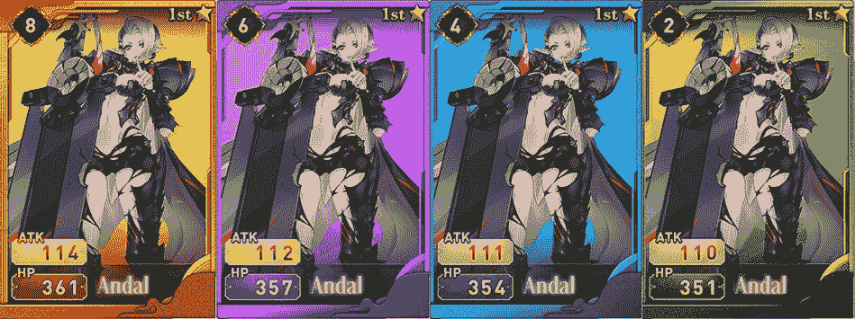

# 如何玩和赢:X 世界游戏

> 原文：<https://web.archive.org/web/https://dappradar.com/blog/how-to-play-and-win-x-world-games>

## x 世界游戏公司本周在 DappRadar 的游戏排行榜上名列第 16 位

X 世界游戏公司创造了一个游戏平台来吸引 Web2 的玩家到 Web3。他们提供许多传统用户熟悉的卡片收集和战斗游戏。但他们在游戏中加入了赌注、产量农业、非功能性交易和游戏内代币。请阅读下面的内容，了解如何玩并赢得 X 世界游戏，并从今天开始赢取奖金。

**内容**

*   ***[什么是 X 世界运动会？](https://web.archive.org/web/20221207022638/https://dappradar.com/blog/how-to-play-and-win-x-world-games/#what-is)***
*   ***[你会玩什么游戏？](https://web.archive.org/web/20221207022638/https://dappradar.com/blog/how-to-play-and-win-x-world-games/#what-games)***
    *   ***[梦卡 V1](https://web.archive.org/web/20221207022638/https://dappradar.com/blog/how-to-play-and-win-x-world-games/#card-v1)***
    *   ***[梦卡 V2](https://web.archive.org/web/20221207022638/https://dappradar.com/blog/how-to-play-and-win-x-world-games/#card-v2)***
    *   ***[英雄卡](https://web.archive.org/web/20221207022638/https://dappradar.com/blog/how-to-play-and-win-x-world-games/#hero-card)***
*   ***[用 X 世界游戏怎么玩怎么赚？](https://web.archive.org/web/20221207022638/https://dappradar.com/blog/how-to-play-and-win-x-world-games/#how-do-you-play)***
*   ***[游戏有哪些代币？](https://web.archive.org/web/20221207022638/https://dappradar.com/blog/how-to-play-and-win-x-world-games/#what-tokens)***
    *   ***[XWG](https://web.archive.org/web/20221207022638/https://dappradar.com/blog/how-to-play-and-win-x-world-games/#xwg)***
    *   ***[卡 NFTs](https://web.archive.org/web/20221207022638/https://dappradar.com/blog/how-to-play-and-win-x-world-games/#nfts)***
    *   ***[其他 NFT](https://web.archive.org/web/20221207022638/https://dappradar.com/blog/how-to-play-and-win-x-world-games/#other-nfts)***
*   ***[有用链接](https://web.archive.org/web/20221207022638/https://dappradar.com/blog/how-to-play-and-win-x-world-games/#useful-links)***

在过去的七天里，X 世界游戏的用户数量上升了 2.5%。这并不是一个巨大的飞跃，但是世界范围的经济事件已经动摇了网络 3 产业。所以要增加玩家数量，在这种环境下，必须作为一场胜利走下去。

[XWG Single Dapp Page](https://web.archive.org/web/20221207022638/https://dappradar.com/binance-smart-chain/games/x-world-games)

[https://web.archive.org/web/20221207022638if_/https://www.youtube.com/embed/dY3GEeRKv-s?feature=oembed](https://web.archive.org/web/20221207022638if_/https://www.youtube.com/embed/dY3GEeRKv-s?feature=oembed)

X World Games trailer

## X 世界运动会是什么？

x 世界游戏是 BNB 链上的一个区块链游戏平台。它可以免费玩和赚，他们的目标是“建立一个多元化的游戏生态系统，将传统游戏玩家与区块链世界联系起来”。

x 世界游戏公司想让人们加入元宇宙娱乐公司。它通过向他们提供简单的基于浏览器的游戏来做到这一点，这些游戏类似于你在 Web2 中找到的游戏，但也有一个赚钱的机制。

X World Games 由联合创始人 Fernando 和 Edwin Liu 于 2018 年推出。该公司总部位于新加坡，他们的平台现在拥有超过 200 万注册用户。

## 你会玩什么游戏？

#### 梦卡 V1

V1 梦卡是一种收集卡片的游戏，玩家获得一副强大的卡片以击败他们的对手。受神奇宝贝的启发，获胜的战斗者将赢得 XWG 代币。

有 40 种不同的扑克牌可供选择，有策略地组合它们会给玩家最强的手牌。每张梦想卡都有技术、元素、品质、HP、atk、等级和其他赋予它们力量和独特性的特征。

在 PvP 模式下，玩家进入一个游戏室，并可以在游戏过程中加入战斗。有各种类型的游戏室，每一个都有不同的游戏规则。用户需要支付注册费才能进入游戏室，并从中获得奖金。

[https://web.archive.org/web/20221207022638if_/https://www.youtube.com/embed/MjjqQAPLaHM?feature=oembed](https://web.archive.org/web/20221207022638if_/https://www.youtube.com/embed/MjjqQAPLaHM?feature=oembed)

Dream Card V1: Official Trailer

#### 梦卡 V2

梦卡 V2 不仅仅是梦卡 V1 的升级。这两款游戏将同时推出，两者之间有很多不同之处。

这是一个多人角色扮演游戏，所以你的角色不是以卡片的形式出现，而是 3D 化身在你的屏幕上战斗。玩家仍然不能控制他们的角色。

有三种不同的游戏模式:

*   冒险模式-15 个章节和 150 个阶段的 PvE 战斗。
*   拯救世界模式——当你在冒险模式中到达第 5、8 和 10 章时，你可以进入的特殊任务和挑战。
*   恶魔封印模式——每 7 天，一个新的事件周期开始，玩家可以赢得 LUCID。

有 22 个新的 NFT 英雄供玩家获得并投入战斗。游戏资产可以在 V1 和 V2 的梦想卡之间转移。这款游戏目前在 Android 上以原生应用的形式提供，并将很快登陆 iOS。

[https://web.archive.org/web/20221207022638if_/https://www.youtube.com/embed/dXcvsYJGIr4?feature=oembed](https://web.archive.org/web/20221207022638if_/https://www.youtube.com/embed/dXcvsYJGIr4?feature=oembed)

Dream Card V2: Official Trailer

#### 英雄卡

X 世界游戏平台的最新成员，英雄卡的灵感来自传统的纸牌游戏拉米纸牌。这个游戏的目标是获得英雄卡，以进入特殊的 PvP 战斗。

一旦用户拥有五张英雄卡，他们就进入竞技场。其他八个对手一进入同一竞技场，战斗就开始了。最上面的玩家开始第一轮，下一个玩家顺时针旋转，下一个玩家开始。

玩家轮流与中间一堆人交换卡片。如果一个玩家最终拿到一对相同的牌，他们就赢了。

玩家可以在币安或游戏的本地市场获得扑克牌。英雄卡让用户可以选择结合两张来自 V1 和 V2 的低级卡片来创建一个更强大的英雄卡。

[https://web.archive.org/web/20221207022638if_/https://www.youtube.com/embed/X0cJNJezDpg?feature=oembed](https://web.archive.org/web/20221207022638if_/https://www.youtube.com/embed/X0cJNJezDpg?feature=oembed)

Hero Card: Official Trailer

## 用 X 世界游戏怎么玩怎么赚？

要开始玩 X 世界游戏，你首先需要一个 X 钱包或者第三方 Web3 钱包。目前，X 钱包只能在 Android 设备上下载。由于游戏是在 BNB 链上构建的，任何与该网络兼容的 Web3 钱包都将适用于 X World Games。

有了钱包后，用它连接到 dapp 并创建一个帐户。一旦你在游戏中，你要求你的自由 NFT 英雄。通过神秘盒子和市场获得 NFT 资产。

有卡的时候可以用物品和 XWG 升级。在玩游戏模式时，需要支付少量的汽油费。现在只需按照游戏中的说明来玩 V1，V2 或者英雄卡。

在 X 世界游戏中赚取代币就是挑选正确的牌来赢得战斗。所以策略起着很大的作用。玩游戏和获得经验是开始赢的最好方法。但是这里有四个建议可以帮助你:

*   选择稀有和史诗卡。它们可能会更贵，但是如果你持有它们，你会更快地赢得战斗和代币。星级越高越好。
*   如果你买得起，就买一张创世卡。你可以用创世卡获得额外的奖励。
*   纸牌赌博是赢取奖励的好方法。它不涉及游戏性，但它是一个伟大的挣钱者。
*   完成日常任务。他们每天都在更新，是极限世界游戏中一个很好的帮手。

## 随身携带您的 Web3 之旅

使用 DappRadar 移动应用程序，再也不会错过 Web3。查看最受欢迎的 dapps 的性能，并关注您投资组合中的 NFT。您在 DappRadar 上的帐户会与我们的移动应用程序同步，这样您很快就可以选择实时接收提醒。

[Download the DappRadar app now](https://web.archive.org/web/20221207022638/https://dappradar.app.link/blog)[<picture></picture>](https://web.archive.org/web/20221207022638/https://play.google.com/store/apps/details?id=com.portfolio.dappradar)

## 游戏有哪些代币？

#### XWG

XWG 是 X 世界游戏的游戏内货币。这是玩家花费和赚取的硬币，它使游戏的经济保持运转。

玩家需要花费 XWG 来进入战斗，他们可以用它在市场上购买卡片 NFT。x 世界游戏也有一个 DeFi 平台，玩家可以在这里下注 XWG，提供流动性并获得奖励。

治理也是 XWG 的一个关键特性。令牌的持有者可以用它来对提案进行投票，并对游戏平台如何决策和未来的发展产生直接影响。

它建立在 BEP-20 标准的 BNB 链上，可从许多第三方集中式和分散式交换中获得。 [PancakeSwap](https://web.archive.org/web/20221207022638/https://dappradar.com/binance-smart-chain/defi/pancakeswap) ，KuCoin 和 Bitrue 这几个地方是可以得到 XWG 的。

[Check XWG Price](https://web.archive.org/web/20221207022638/https://dappradar.com/hub/token/bsc/XWG?from=0x6b23c89196deb721e6fd9726e6c76e4810a464bc)

#### 卡片 NFTs

卡片是极限运动的非功能性物品。玩家可以赚取、赢得、交易和交换它们。他们是建立在 BNB 链上的，谁拥有他们就拥有完全的所有权。

它们是按照 BEP-721 标准建造的，每一个都有自己特殊的品质、特征和力量。他们可以在二级市场上购买，比如 BinanceNFT、 [OpenSea](https://web.archive.org/web/20221207022638/https://dappradar.com/multichain/marketplaces/opensea) 、 [Mintverse](https://web.archive.org/web/20221207022638/https://dappradar.com/multichain/marketplaces/mintverse) 等等。

X World Games Cards

#### 其他非功能性食物

*   这将成为 X 世界游戏的主要游戏赚取奖励。它是根据 BEP-1155 令牌标准构建的，结合了 BEP-20 的可替代性和 BEP-721 标准的不可替代性。LUCID 可以提高 XWG 的收益并提升梦想卡的稀有度。它正在取代 XWG 成为主要的游戏赚取奖励，因为 XWG 正朝着成为唯一的治理令牌的方向发展。
*   碎片–这些将是清醒之箱的主要奖励资产，对于想要使用梦想卡融合机制的玩家来说非常重要。
*   融合和进化——这两种游戏内的资产都是玩家升级他们的卡所必需的。

## 有用的链接

*   [X 世界运动会单人 Dapp 页面](https://web.archive.org/web/20221207022638/https://dappradar.com/binance-smart-chain/games/x-world-games)
*   [XWG 令牌价格](https://web.archive.org/web/20221207022638/https://dappradar.com/hub/token/bsc/XWG?from=0x6b23c89196deb721e6fd9726e6c76e4810a464bc)
*   [X 世界运动会网站](https://web.archive.org/web/20221207022638/https://dappradar.com/deeplink/7071)
*   [X 世界运动会专题文章](https://web.archive.org/web/20221207022638/https://dappradar.com/blog/search/?q=x%20world%20games)