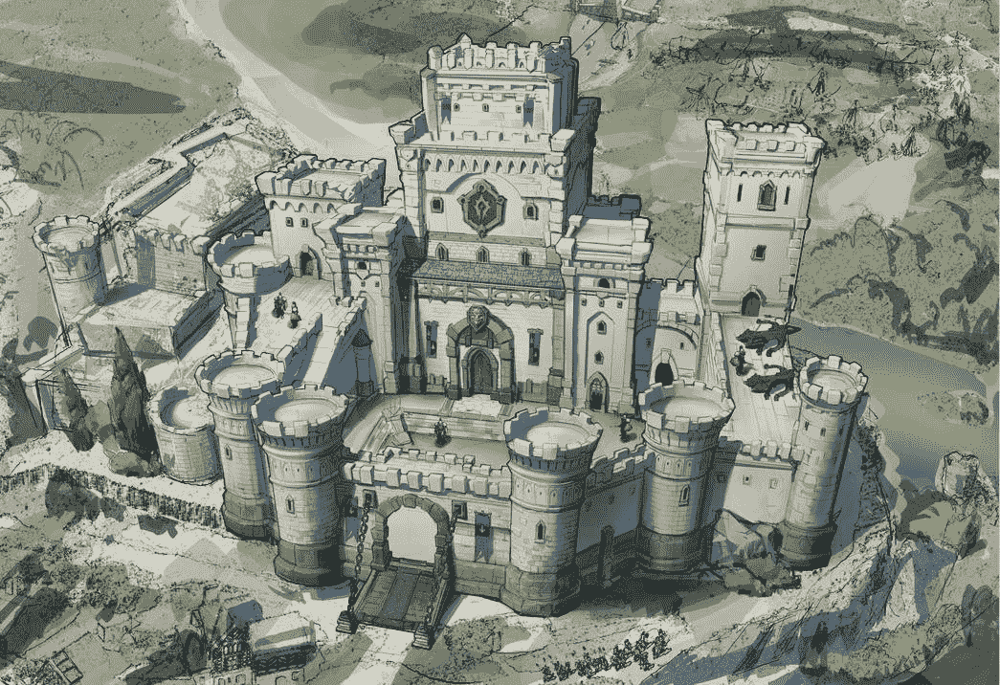
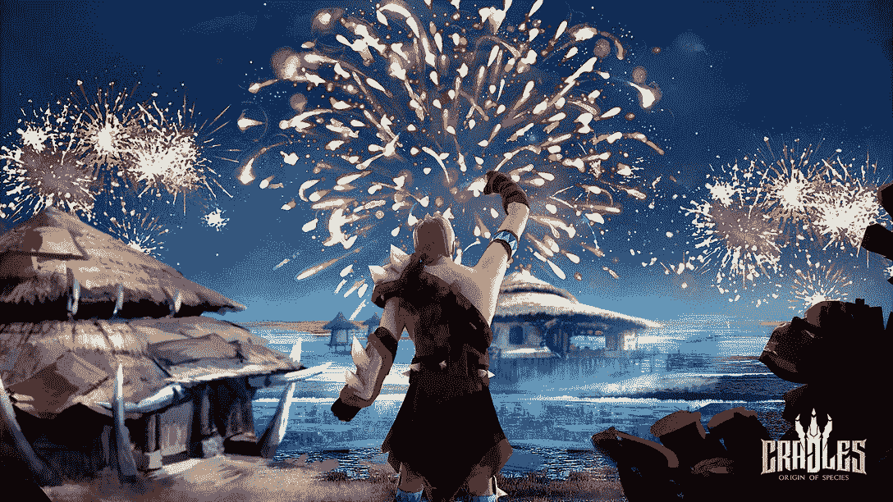
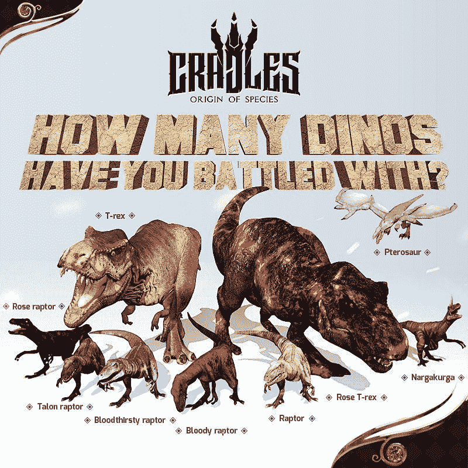

# 如何玩和赢:摇篮:物种起源

> 原文：<https://web.archive.org/web/https://dappradar.com/blog/how-to-play-cradles-origin-of-species-blockchain-game>

## 时间是主要资源的尖端 MMORPG

《摇篮:物种起源》将开放世界的游戏概念推向了一个新的高度。自由、玩家贡献和创新是这个基于社区的项目的主要目标。摇篮背后的开发团队正在思考超越线性的故事情节和严格的指导方针。在这个游戏里，连时间都不是走直线的。

**内容**

*   *[什么是摇篮？](https://web.archive.org/web/20230207174821/https://dappradar.com/blog/how-to-play-cradles-origin-of-species-blockchain-game/#what-is)*
*   *[游戏如何入门](https://web.archive.org/web/20230207174821/https://dappradar.com/blog/how-to-play-cradles-origin-of-species-blockchain-game/#get-started)*
*   *[如何玩赢摇篮](https://web.archive.org/web/20230207174821/https://dappradar.com/blog/how-to-play-cradles-origin-of-species-blockchain-game/#play-and-win)*
    *   *[作为游戏玩家](https://web.archive.org/web/20230207174821/https://dappradar.com/blog/how-to-play-cradles-origin-of-species-blockchain-game/#gamer)*

*   *[游戏中的创新](https://web.archive.org/web/20230207174821/https://dappradar.com/blog/how-to-play-cradles-origin-of-species-blockchain-game/#innovations)*
    *   *[令牌](https://web.archive.org/web/20230207174821/https://dappradar.com/blog/how-to-play-cradles-origin-of-species-blockchain-game/#tokens)*
    *   *[ERC-3664 令牌标准](https://web.archive.org/web/20230207174821/https://dappradar.com/blog/how-to-play-cradles-origin-of-species-blockchain-game/#erc3664)*
    *   *[治理](https://web.archive.org/web/20230207174821/https://dappradar.com/blog/how-to-play-cradles-origin-of-species-blockchain-game/#governance)*
    *   *[AI 技术](https://web.archive.org/web/20230207174821/https://dappradar.com/blog/how-to-play-cradles-origin-of-species-blockchain-game/#AI-Technology)*
*   *[有用链接](https://web.archive.org/web/20230207174821/https://dappradar.com/blog/how-to-play-cradles-origin-of-species-blockchain-game/#useful-links)*

摇篮中的世界:《物种起源》在很大程度上忘记了人类物种。时间已经从现在的时代过去了，是时候让玩家们建立一个新的家园和文明来保护地球前主人的后代了。

## 什么是摇篮:物种起源？

《摇篮:物种起源》是一款由 DRepublic 开发的区块链 MMORPG。故事发生在一个日益衰败的元宇宙，那里的环境和建筑随着时间的推移不断恶化，某些资产获得了额外的价值。

开放世界的元宇宙分为两个主要区域:主城区，一个供玩家茁壮成长和发展的安全区域，它进一步分为七个具有独特历史和传说的城市，以及冒险区，一个玩家可以遇到灭绝的捕食者的野外开放区域。

A fortified castle stuck in time

这款游戏是基于订阅的，这意味着玩家不需要购买 NFTs，而是可以购买每月游戏卡来玩。元宇宙境内的 P2P 交易不会产生任何交易费用，从而保持游戏内市场的活跃。

该游戏还提供了 NFTs (SIN)机制的股份，玩家可以在游戏中获得额外的奖励，直播流可以要求观众代表他们唱歌，以获得竞争优势。

## 如何在游戏中入门

1.  去[摇篮:物种起源网站](https://web.archive.org/web/20230207174821/https://www.cradles.io/)

看看这个平台，阅读他们最新的博客文章，看看与摇篮相关的最新消息。

2.  注册游戏

点击网站首页的注册按钮。你需要在注册前连接你的 Web3 钱包。选择您的用户名和密码。

3.  点击下载

点击下载，游戏会自动下载到你的电脑上。一旦你这样做了，打开游戏，按照指示开始玩。然而，游戏目前仍在开发中，因此服务器到摇篮不是一直开放的。

## 如何玩并赢得摇篮

### 作为游戏玩家

#### 新手任务

摇篮是一个游戏，首先向玩家介绍基本任务，并引导他们逐步完成这些任务。玩家可以选择他们的出生地，并在完成任务后获得奖励，如狩猎野兽和保护村庄。

随着玩家在游戏中的进步，他们将学习摇篮的基本知识，并能够自己狩猎和赚钱。然而，为了安全地探索野外，玩家需要在游戏商店购买武器和装备，并获得治疗药剂。新手装备只适合猎杀普通怪物，可能不足以探索野外。

摇篮鼓励玩家探索广阔的野生世界，发现隐藏的宝石、装备和其他在不同地点随机生成的材料。虽然主要目标不是赚取利润，但游戏确实为玩家提供了几种通过探索世界来赚取利润的方法。

#### 城市治理

游戏中的城市任务有多种形式，例如帮助猫从树上下来，寻找走失的狗，修复 NPC 的房屋，捉贼，修理电线。这些任务可以由官方机构、NPC 或其他玩家提供。

Everything is possible in Cradles

通过完成这些任务，玩家可以在城市中赚取大量的水晶。此外，由于玩家有助于维持所有主要城市治理指数的平衡，所有城市的总奖励将增加，作为对玩家努力的认可。

#### 生态系统治理

在游戏的狂野世界中，不同的生物之间存在着相互依存的关系。玩家可以访问生态系统功能来检查他们所在地区的健康状况，游戏将建议特定的物种进行狩猎，以保持生态系统的平衡。

通过猎杀这些物种，玩家可以改善游戏世界的生态平衡，并获得大量水晶作为奖励。

#### 聚乙烯吡咯烷酮 （Polyvinyl Pyrrolidone 的缩写）

摇篮的游戏世界充满了危险，玩家需要抵御野生动物，也要抵御其他玩家。在无法无天的荒野中，玩家可以互相攻击。

当一个玩家成功杀死另一个玩家时，他们的一部分水晶会随机掉落，并可以被胜利者捡起，增加他们的财富。

通缉指数是衡量玩家在野外成功的指标，胜利者的通缉指数也将增加，这使得他们成为其他玩家的目标，因为他们头上的赏金变得更有价值。玩家可以控制他们在游戏中所冒的风险。

#### 玩家与环境

玩家可以在野生世界中进行玩家对环境(PvE)游戏，在那里他们必须面对好斗和危险的物种。他们可以通过猎杀中性物种来赚取水晶，同时保持生态系统的平衡。

> 准备翻新了吗？很快，你就可以在摇篮里定制你的土地上的任何东西。[# PlayandEarn](https://web.archive.org/web/20230207174821/https://twitter.com/hashtag/PlayandEarn?src=hash&ref_src=twsrc%5Etfw)[# NFT](https://web.archive.org/web/20230207174821/https://twitter.com/hashtag/NFT?src=hash&ref_src=twsrc%5Etfw)[#元宇宙](https://web.archive.org/web/20230207174821/https://twitter.com/hashtag/Metaverse?src=hash&ref_src=twsrc%5Etfw)[# MMORPG](https://web.archive.org/web/20230207174821/https://twitter.com/hashtag/MMORPG?src=hash&ref_src=twsrc%5Etfw)[# web 3](https://web.archive.org/web/20230207174821/https://twitter.com/hashtag/Web3?src=hash&ref_src=twsrc%5Etfw)[pic.twitter.com/Y2lZKU0jLj](https://web.archive.org/web/20230207174821/https://t.co/Y2lZKU0jLj)
> 
> — Cradles (@cradlesio) [January 20, 2023](https://web.archive.org/web/20230207174821/https://twitter.com/cradlesio/status/1616369782999097345?ref_src=twsrc%5Etfw)

Cradles is customizable

然而，如果他们猎杀太多濒危物种，将会被悬赏捉拿。《摇篮》鼓励玩家猎杀各种物种，以维持生态平衡，并从狩猎活动中获得收入。

#### 国土保卫战

在摇篮的游戏世界中，玩家将面临挑战。通常，主城区和冒险区是分开的，野生动物和怪物不会对人类居住区构成威胁。

然而，当受到黑暗力量的影响时，一些生物可能会变得具有攻击性，并对城市发动攻击，造成破坏。在这些危机时刻，玩家必须保卫主城。

如果他们成功击退多波攻击，并且没有对城市造成任何伤害，他们将获得水晶和终极道具奖励。保卫家园对玩家来说是一个既赚钱又有声望的绝佳机会。

### 作为一个挣钱者

#### 进入非功能性交易(SIN)

罪恶机制允许玩家获得额外的游戏内货币和更大的奖励。直播彩带还将获得大量代币奖励。他们可以让观众代表他们下注，这给了他们竞争优势。

#### 成为有影响力的人

Cradles 计划开发一个影响者平台，组织或个人可以提交游戏内容添加到游戏中。一旦内容被游戏团队和社区认可，它将被添加到游戏中，并相应地分配利润。

摇篮团队将获得一小部分利润，而大部分利润将流向内容创作者。这个系统不仅允许使用角色和品牌产品，还允许创作者出售他们的内容并赚取利润，鼓励他们为摇篮的世界开发内容。

此外，影响者还可以通过流式传输游戏来参与该系统，粉丝可以从他们的渠道购买游戏道具。摇篮将只收取少量的服务费用。这种机制使摇篮能够聚集大量的 IP 和影响者，从而开创区块链游戏的新时代。

## 改革

### 代币

DRPC，德雷公共硬币，是德雷公共平台的货币。它可以用来购买摇篮游戏和其他游戏发行的门票。只有拥有入场券 NFT 的玩家才能进入游戏，平台货币通过拍卖和池产生。

[https://web.archive.org/web/20230207174821if_/https://www.youtube.com/embed/Fvn4PbUQj60?feature=oembed](https://web.archive.org/web/20230207174821if_/https://www.youtube.com/embed/Fvn4PbUQj60?feature=oembed)

“Leaked” footage of the game

持有 DRPC 的用户可以入股或提供流动性来赚取更多的硬币。平台币的 DeFi 机制可以为玩家带来可观的利润，提升游戏体验。

此外，DRPC 可以用来在 DRepublic 平台上购买实物纪念品 NFT，如史前生物和传奇武器的模型。每个实体纪念品都将附带额外的虚拟 NFT，以供游戏内娱乐。

### ERC-3664 令牌标准

这个令牌标准给了摇篮生态系统更多的灵活性，以便它可以继续发展到未来。行星和世界将按照 ERC-3664 标准开发，这意味着玩家需要共同努力来改变它们，并为摇篮生态系统带来秩序。

ERC-3664 扩展了 ERC-1155，将游戏 NFTs 的属性分为四类:

1.  一般可变属性:通常是攻击力、生命值等可以增减的基本属性。
2.  可转移属性:在破坏或其他情况下可以转移到其他非功能性测试的属性。
3.  可升级属性:可以付费升级的属性，可以提高等级和其他属性值。
4.  可演化属性:可以随时间自动演化的属性，模拟现实世界属性的时变特征。

### 管理

摇篮是一个基于社区的游戏，它鼓励玩家、开发者和设计师加入并贡献他们独特的想法和才能。为了促进这一进程，摇篮推出了两个社区治理提案，并为参与*摇篮一起*活动的开发者预留了 25%的代币权利。

这些活动包括设计、建模、CG 和游戏开发类别，随着游戏的进行，摇篮将选择最佳的社区合作伙伴来帮助建立摇篮的分散世界。

此外，游戏开发的参与者将有机会在游戏中包含“复活节彩蛋”，这些彩蛋将随着游戏的进行而逐渐被发现，为未来的玩家提供娱乐。

### 人工智能技术

该游戏以各种角色互动和战斗为特色，在其框架中利用了强化学习和人工智能。强化学习在游戏中尤为重要，因为生物必须不断学习如何在游戏世界中攻击和收集资源。

Time isn’t linear so prepare for dinosaurs

这项技术极大地增强了整体游戏体验。此外，社区和矿工可以通过为 AI 模型提供计算能力来获得奖励，充当游戏数据和通信节点。

摇篮不仅使用人工智能来增强游戏；它还赋予社区权力并提供额外的奖励。

## 有用的链接

*   [Web3 游戏排名](https://web.archive.org/web/20230207174821/https://dappradar.com/rankings/category/games)
*   [探索 NFT](https://web.archive.org/web/20230207174821/https://dappradar.com/nft)
*   [元宇宙十大最佳游戏世界](https://web.archive.org/web/20230207174821/https://dappradar.com/blog/best-metaverse-games-virtual-worlds)
*   [DappRadar 博客](https://web.archive.org/web/20230207174821/https://dappradar.com/blog/)