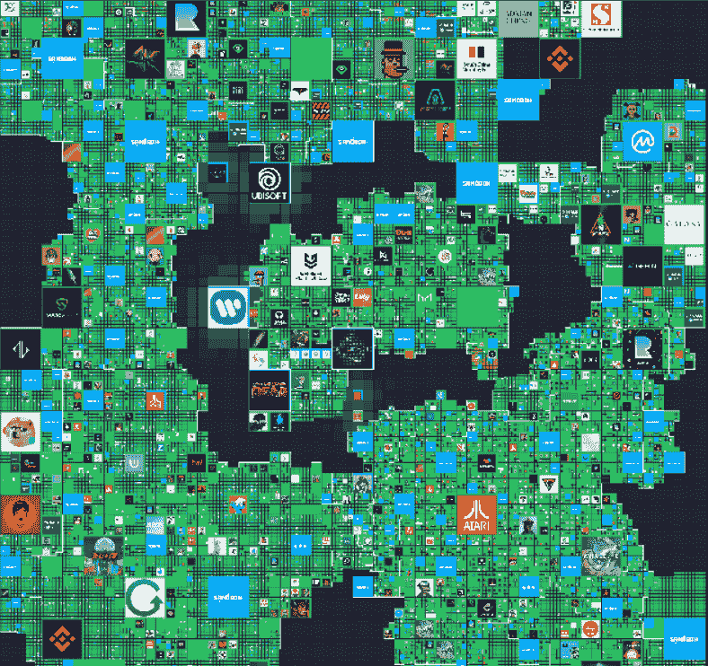
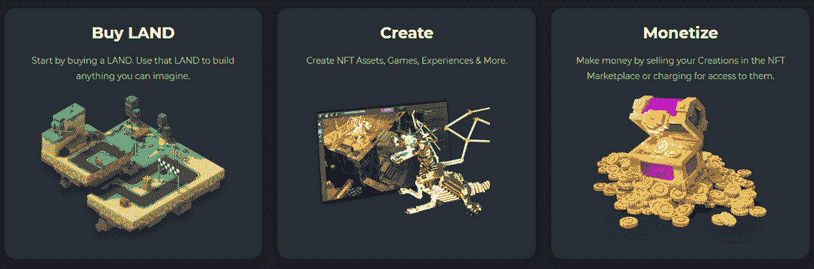
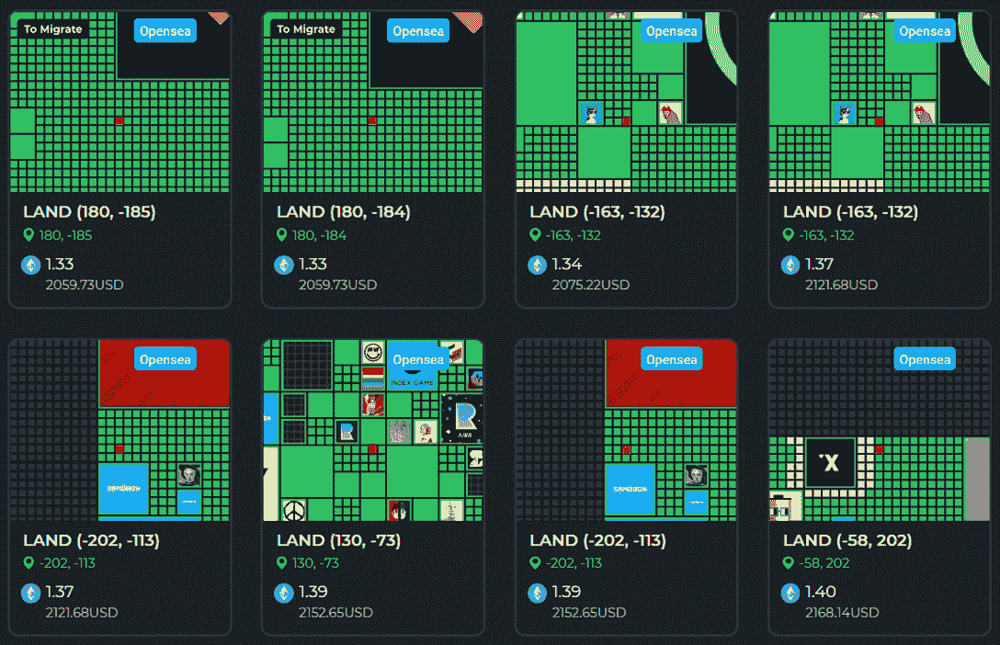
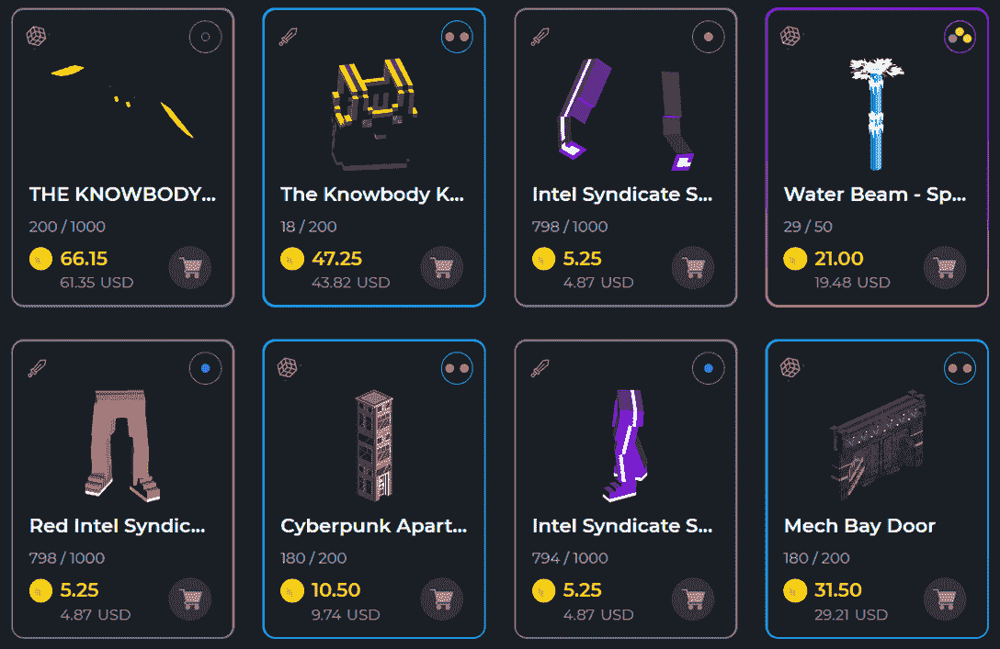
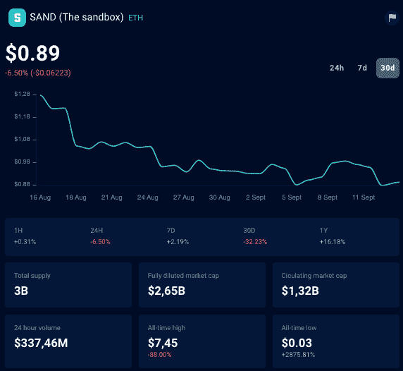
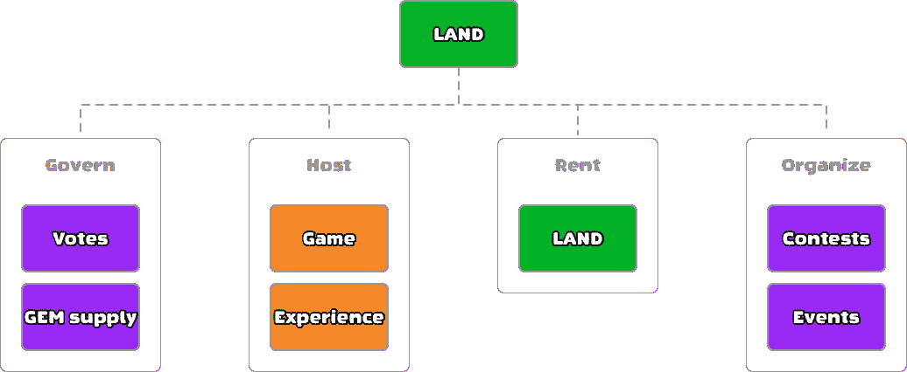

# 如何玩沙盒第三季

> 原文：<https://web.archive.org/web/https://dappradar.com/blog/how-to-play-the-sandbox-season-3>

## 走进最成功的元宇宙公开赛

**[沙箱](https://web.archive.org/web/20220925234445/https://dappradar.com/ethereum/games/the-sandbox)是一个由多边形区块链驱动的虚拟世界，在这里你可以创建、实验和玩 3D 体素资产。这款游戏允许完全的资产所有权，并通过其整合的市场实现货币化。** **我们很幸运地玩到了游戏的 Alpha 版本，这里是我们对这个著名但不断扩张的虚拟世界的印象和见解。**

本文由 Nicola Fraccaroli 和[unbounded](https://web.archive.org/web/20220925234445/http://www.unboundnation.io/)撰写。

**关键要点**

*   沙盒是一个沉浸式的数字世界，也是一个创作平台，用户可以在这里玩、创作、拥有和货币化他们的游戏资产和体验。
*   这款游戏目前处于 Alpha 阶段，但已经拥有 400 万独立玩家，并与 400 个主要品牌建立了合作关系，如阿迪达斯、行尸走肉、雅达利、帕丽斯希尔顿、T2、史努比狗狗和兔子。
*   该游戏采用区块链技术来奖励玩家、创作者和艺术家在平台上付出的努力和时间，并扩展游戏体验以包括外部游戏和品牌。它还代表了一个关于数字房地产所有权和交易的用例。

## 沙盒是什么？

> 沙盒直播特邀嘉宾:塞巴斯蒂安·博格特[https://t.co/MxRmtKffst](https://web.archive.org/web/20220925234445/https://t.co/MxRmtKffst)
> 
> — DappRadar (@DappRadar) [September 1, 2022](https://web.archive.org/web/20220925234445/https://twitter.com/DappRadar/status/1565369077195210752?ref_src=twsrc%5Etfw)

[沙盒](https://web.archive.org/web/20220925234445/https://dappradar.com/multichain/games/the-sandbox)最为人所知的是它的两部热门手机《沙盒》( 2011 年)和《沙盒进化》( 2016 年),这两部手机在 iOS 和 Android 平台上总共获得了 4000 万次下载。

从最简单的意义上来说，[沙盒是一个元宇宙](https://web.archive.org/web/20220925234445/https://dappradar.com/blog/what-is-the-sandbox-how-to-join-the-metaverse)，一个虚拟的游戏化世界，玩家可以在地图上移动他们的化身，完成任务，遇见其他玩家([或名人](https://web.archive.org/web/20220925234445/https://dappradar.com/blog/celebrity-wallets-a-dive-into-crypto-hollywood)，享受清晰的像素化图形。

## NFT 在沙箱中启用所有权

你游戏的场地，你互动的物品，你在游戏市场购买的物品，以及你在每个区域执行的任务，都是由其他玩家创造，拥有，甚至出售的。数字经济是通过实施 NFTs 来实现的。

沙盒实际上被设计成一个社区驱动的元宇宙，或者如首席运营官的塞巴斯蒂安·博格特所说的“一个开放的元宇宙平台”。

你创造的优质游戏资产(装备、经验、任务)和完成的任务越多，其他玩家或开发者给你的奖励就越多。

## 用户生成的内容和所有权推动了沙盒

当前玩家驱动的模式是沙盒的旧移动体验的演变，因为应用商店提供的限制，不允许活跃的玩家和创作者为创造自己的元宇宙体验而付出的努力获得奖励。

将用户生成的内容与所有权和真正的货币化相结合是这款游戏的转折点，这是一个信念和愿景的飞跃，使沙盒成为一个独特的冒险，迄今为止有 400 万用户和 400 个主要合作伙伴。

## 沙盒是什么样子的？

游戏地图现在扩展到 15，000 虚拟平方公里，使其成为现存最大的元宇宙房地产。

它由或大或小的正方形(总共 166，464 块土地)组成，每个正方形都可供玩家玩、购买或出租。这些方块中的每一个都被称为陆地。

## 地图和土地

游戏地图现在扩展到 15，000 虚拟平方公里，使其成为现存最大的元宇宙房地产。它由或大或小的正方形组成(总共 166，464 块土地)，每个正方形都可供玩家玩、购买或出租。这些方块中的每一个都被称为陆地。

你会认出非常熟悉的标识，它们属于各自的土地。那里的每个品牌都在打造自己的体验、使命、福利和表演。由玩家根据亲和力决定从哪一个开始，或者进入众多入口之一并加入“独立”体验。

[<picture></picture>](https://web.archive.org/web/20220925234445/https://dappradar.com/multichain/games/the-sandbox)

## 你能在沙盒里找到什么体验？

你将在每个游戏区域(体验)中进入的环境是非常不同的。我们发现自己在漂浮的钢琴键上跳跃，穿过 BAYC 博物馆，在遥远的西部的酒吧里放松，在闪亮的音乐俱乐部里等到下午 1 点开始每天的冒险。

[<picture></picture>](https://web.archive.org/web/20220925234445/https://dappradar.com/ethereum/marketplaces/the-sandbox-marketplace)

Source: The Sandbox

不同的土地也带来了不同的经历。在我们的游戏过程中，每隔 45 分钟左右，我们会玩不同的谜题和任务(寻找、杀死、解决、拜访)。动态性使游戏引人入胜，虽然不是每个人一开始都会习惯清晰而像素化的图形。

此外，鉴于许多经验和任务可能不是由专业游戏开发商完成的，预计其中一些会比预期的更难，或者不是完全经过深思熟虑的。

## 你是如何爬上游戏排行榜的？

你在每个区域完成任务越多越快，你在游戏排行榜上的位置就越高，游戏排行榜会奖励表现最好的玩家[$和](https://web.archive.org/web/20220925234445/https://dappradar.com/hub/token/eth/SAND?from=0x3845badade8e6dff049820680d1f14bd3903a5d0)(游戏内货币)，用于购买游戏资产、定制你的头像或玩特定的体验。

值得注意的是，每个区域的任务都必须在一次游戏中完成。否则，你必须重新启动它们，同时你可以重新播放它们以在排行榜上排名(在帐户验证后)。

此外，我们在沙盒上尝试的所有任务都是免费的，但个人创作者可以放置一个“付费墙”，以便能够在他们的土地上玩。

| **游戏资源**
[沙盒初学者指南](https://web.archive.org/web/20220925234445/https://www.youtube.com/watch?v=jKS40dguyuo) [土地简介](https://web.archive.org/web/20220925234445/https://sandboxgame.gitbook.io/the-sandbox/land/what-is-land) [沙盒简介](https://web.archive.org/web/20220925234445/https://dappradar.com/blog/explained-the-sandbox-sand-token/) |

## 游戏玩家如何在沙盒中创建资产？

[https://web.archive.org/web/20220925234445if_/https://www.youtube.com/embed/mxtxK3YFulY?feature=oembed](https://web.archive.org/web/20220925234445if_/https://www.youtube.com/embed/mxtxK3YFulY?feature=oembed)

毫无疑问，作为一个游戏玩家，对你来说最大的附加值是创作者部分。每个玩家都可以自己创造游戏资产:化身、物品和化妆品，这些都有可能被其他玩家购买并在游戏中使用。

基于体素的图形和工具允许无代码的构建体验，即使是初学者也能做出贡献并将其成果货币化。从这个意义上说，沙盒不仅拥抱了创造者经济，还分散了来自创造者经济的收入。

它奖励了在游戏中投入时间和精力的创作者和品牌。我们确实相信它在这方面是成功的，尤其是与其他主要的元诗相比。

有三个主要的工具来创建、销售和货币化游戏资产和体验:

### **附庸风雅**

这是一个 3D 建模和动画程序，旨在为沙箱创建基于体素的资产。它完全免费使用。玩家可以建模、制作动画、编辑和导出任何东西来构建自己的游戏体验或在市场上销售。

那些申请并获得沙盒创作者基金的人被赋予任务，并因制作非常高质量的基于体素艺术的资产而获得奖励，这些资产随后被发布在游戏市场上。

迄今为止，该基金已经资助了 100 多名艺术家。

### **游戏制作者**

这是一个简单易用的工具，允许您在沙盒的元宇宙中设计、测试和分享体验，如游戏。它提供了一个拖放界面，使您能够将不同的元素和对象放置到一个环境中，定义元素如何交互，并与社区共享它们。

通过游戏制作者基金，奖励和激励那些已经证明了游戏设计或数字世界设计技能的人，帮助他们制作和发布优秀的游戏和体验，供沙盒的玩家玩。

到目前为止，该基金已经资助了 18 个游戏。

### **市场**

这是将 VoxEdit 中创建的体素资产货币化的第一步，例如购买土地。它允许交易玩家拥有或创造的资产，这些资产在不同的游戏和不同的平台之间是可互操作的(例如，你可以通过 Snoop Dog、BAYC、Moonbirds 和许多其他平台购买头像)。

[<picture></picture>](https://web.archive.org/web/20220925234445/https://dappradar.com/ethereum/marketplaces/the-sandbox-marketplace)[<picture></picture>](https://web.archive.org/web/20220925234445/https://dappradar.com/ethereum/marketplaces/the-sandbox-marketplace)

Source: [The Sandbox Marketplace](https://web.archive.org/web/20220925234445/https://dappradar.com/ethereum/marketplaces/the-sandbox-marketplace)

你只想作为一个休闲玩家在沙盒中漫步完成任务？你可以这样做。相反，你希望使用你的创造技能，创造你想创造的任何东西，从非常简单的物体或整个建筑到动画龙或完整的游戏？这些工具使您能够做到这一点，无需任何代码经验。最后，你希望从你的作品中赚取 [$SAND](https://web.archive.org/web/20220925234445/https://dappradar.com/hub/token/eth/SAND?from=0x3845badade8e6dff049820680d1f14bd3903a5d0) 和现实世界的金钱，还是购买和其他知名名人或品牌的头像？市场允许你这样做。

鉴于创作者的重要性，沙盒开发团队在接下来的几个月中的主要任务之一将是相应地不断更新和完善创作者工具。

我们听说到今年年底，音乐会将被加入到游戏制造商的建设能力中..随便说说！

| **沙盒创作者资源**
[VoxEdit 学院](https://web.archive.org/web/20220925234445/https://sandboxgame.gitbook.io/the-voxedit-academy/voxedit/welcome-to-the-voxedit-academy) [游戏制作者学院](https://web.archive.org/web/20220925234445/https://sandboxgame.gitbook.io/the-game-maker-academy/)[沙盒市场](https://web.archive.org/web/20220925234445/https://www.sandbox.game/en/shop/) |

## 沙盒如何拥抱 Web3

哦，男孩，来了淘气的一部分…不是

沙盒可以作为一个成熟的元宇宙来玩，是免费的。它的游戏是令人愉快的和动态的，我们确实发现自己每次进入一个新的体验都很好奇，特别是如果来自一个我们总是听说的品牌或名人。

此外，想到我们看到的和与之互动的一切都是由工作室或其他玩家特别创造的(我们也可以很容易地做到这一点)，这就使它成为一个独特的世界，至少可以探索一次。

但鉴于沙盒从设计上来说是一个社区驱动的项目，这意味着玩家不再是被动的参与者，而是带来和扩展游戏边界的人。

除了上面概述的工具，在 Alpha 阶段，这些 Web3 元素到目前为止已经允许奖励玩家并刺激参与和增长:

### **$沙**

这是沙盒的生态系统货币，它还授予你与其他玩家和开发者一样，在游戏开发和演变的方式上的投票权(赌注)。

从[沙盒市场](https://web.archive.org/web/20220925234445/https://dappradar.com/ethereum/marketplaces/the-sandbox-marketplace)买卖可交易的游戏内物品，如土地和资产，也需要 [$SAND](https://web.archive.org/web/20220925234445/https://dappradar.com/hub/token/eth/SAND?from=0x3845badade8e6dff049820680d1f14bd3903a5d0) 。

你可以通过完成任务、社区活动和竞赛、成为游戏大使或者在外部交易中购买来获得它。美元沙子的总发行量为 30 亿单位。

### **着陆**

地图上可见的每块土地都是数字房地产的第一个使用案例，鉴于主要品牌和名人通过购买或出租它看到的机会，这被认为是一个价值 10 亿美元的市场，这是一种接触和娱乐年轻一代游戏玩家的创新方式。

例如，像 [Snoop Dog](https://web.archive.org/web/20220925234445/https://dappradar.com/hub/wallet/eth/0xce90a7949bb78892f159f428d0dc23a8e3584d75) 这样的名人在 2022 年初购买了沙盒上的土地( [Snoopverse](https://web.archive.org/web/20220925234445/https://dappradar.com/hub/assets/eth/0xc53dc593b69c67a209cf70d4172078c9125449bb/40969https://dappradar.com/hub/assets/eth/0xa342f5d851e866e18ff98f351f2c6637f4478db5/55464657044963196816950587289035428064568320970692304673817341489688277422080) )，以在那里举办他的一些节目，由于该地区的游戏玩家流量增加，邻近土地的价值增加到[每块 45 万美元](https://web.archive.org/web/20220925234445/https://fortune.com/2022/02/02/how-to-buy-metaverse-real-estate-snoop-dogg-celebrity-neighbor/)。

拥有土地也给了每个玩家或创作者很多机会，包括治理/投票权，当社区出现关于沙盒的小问题或关键问题时，你可以行使这些权利。允许土地所有者进一步货币化他们的地产是游戏路线图中最重要的优先事项之一。

[<picture></picture>](https://web.archive.org/web/20220925234445/https://dappradar.com/multichain/games/the-sandbox)

Source: The Sandbox

### 宝石

这些将定义资产的属性。您的资产拥有的属性越多，您就会发现它们在沙箱中越有用，从而增加它们的价值。它们是作为在土地上下注美元的奖励而给予的，尽管目前只对土地所有者进行分配。

### 催化剂

这些定义了你的资产所拥有的宝石插座的数量以及它们的稀缺性。它们将首先只分配给土地所有者。

Alpha Season 3 也是迈向互操作性的一大步，其中来自现有集合(如 BAYC)的 130，000 个认证化身已经在沙盒中活了过来。想象一下，一只无聊的猿与 T2、T4 和史蒂夫·青木互动，合并他们的土地，共同为他们的社区创造计划。最佳的互操作性！

| **令牌资源**
[沙盒知识库](https://web.archive.org/web/20220925234445/https://sandboxgame.gitbook.io/the-sandbox/) [沙盒中的土地如何估值？](https://web.archive.org/web/20220925234445/https://dappradar.com/blog/the-sandbox-land-valuation-report) |

## 沙盒怎么玩？

目前，该游戏处于开放 Alpha 阶段。阿尔法第三季刚刚开始，它的所有体验都是任何人都可以接触到的。然而，为了赚取$SAND，你需要一个 Alpha 通行证，可以通过 raffles 和沙盒官方渠道的竞赛获得。

这款游戏目前只在 Windows 和 MAC OSs 上可用，但移动已经在团队的路线图上，有不同的方法和解决方案。

## 结论

作为游戏玩家，我们发现沙盒 Alpha 不仅是一个吸引人的、多样的、不断发展的元宇宙体验，而且是一个我们可以扮演积极角色的平台，或者更好地说，是唯一重要的角色:内容消费者和创造者之一。我们发现有相当数量的知名品牌和游戏玩家相信这个项目并一直支持它。

使用区块链技术来增强游戏体验是游戏行业内的一个持续争论。归根结底，接受 web3 理念并实现其功能取决于开发者的眼光和各自游戏社区的反应。

像《我的世界》、堡垒之夜或 Roblox 这样的元宇宙平台采用了互操作性，作为一种基于玩家喜好来丰富游戏体验的方式，但它仍然受到限制，没有“真正”的溢出效应来具体奖励玩家。

另一方面，其他的元素，比如玩家驱动的经济，到目前为止还没有被这些主要的超级玩家接受。例如，可交易的游戏资产( [NFTs](https://web.archive.org/web/20220925234445/https://dappradar.com/nft) )已经被视为一种[排斥和投机](https://web.archive.org/web/20220925234445/https://www.minecraft.net/en-us/article/minecraft-and-nfts)的手段。

相反，沙盒将区块链技术视为用户生成内容的推动者，允许游戏基于创意和奖励无限扩展。它足够大胆，完全接受它作为一个关键的差异化因素和核心模式，按资产[交易量](https://web.archive.org/web/20220925234445/https://dappradar.com/rankings)排名前 2。

到目前为止，这一决定产生的品牌和创作者的相应飞轮初步验证了一个主要假设:游戏玩家首先是游戏玩家，但他们确实希望拥有资产，并因为他们在游戏中的努力而获得回报，如果开发者允许的话。

当然，数字经济作为一个整体也不能免于投机。正如我们在其他新兴游戏中看到的一样，如 [Big Time](https://web.archive.org/web/20220925234445/https://dappradar.com/blog/what-is-big-time-and-how-can-you-play-it) ，只要可交易的资产根深蒂固，并有助于更愉快的游戏体验，投机就被最小化，因为游戏玩家根据内在资产价值(物品、武器、化妆品)决定其市场价格。

沙盒中的元素，如每个体验中展示的令牌、土地或艺术，可能更容易受到投机的影响，这是真的，就像在现实世界中一样，但这只是经济的冰山一角，每个人都可以成为创作者，选择拥有或货币化他们的创作成果，并与开发者一起定义他们最喜爱的游戏的路线图。至少现在玩家可以做出真正的选择了。

开发团队还大胆地从一开始就采用了特定的术语，如 NFT、加密钱包、交换和玩赚，这些术语在更广泛的游戏社区中受到了不同的欢迎，尤其是在 2022 年。然而，由于主要合作伙伴和不断增长的用户群，它能够与理解 web3 带来的机会的玩家和品牌建立独立的体验，而不是奋起反抗。

游戏空间和沙盒发展得越多，纯粹的游戏体验和区块链所提供的功能之间的界限就变得越模糊。

不再需要特定的技术相关的游戏指南或术语，称 NFT 为 NFT，而不是可以拥有和出售的游戏资产。

我们期待看到社区将带领沙盒走向何方！

加入 DappRadar 社区，访问增强的区块链分析，并使用 [DappRadar 投资组合中心](https://web.archive.org/web/20220925234445/https://dappradar.com/hub/wallet/)控制自己的资产。不仅 DappRadar 给你更多的见解，而且每个成员都可以加入[我们每周的加密空投赠品](https://web.archive.org/web/20220925234445/https://dappradar.com/hub/airdrops)。