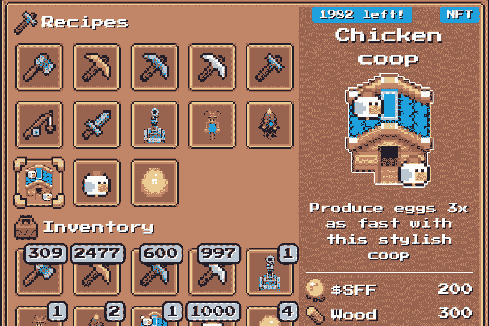
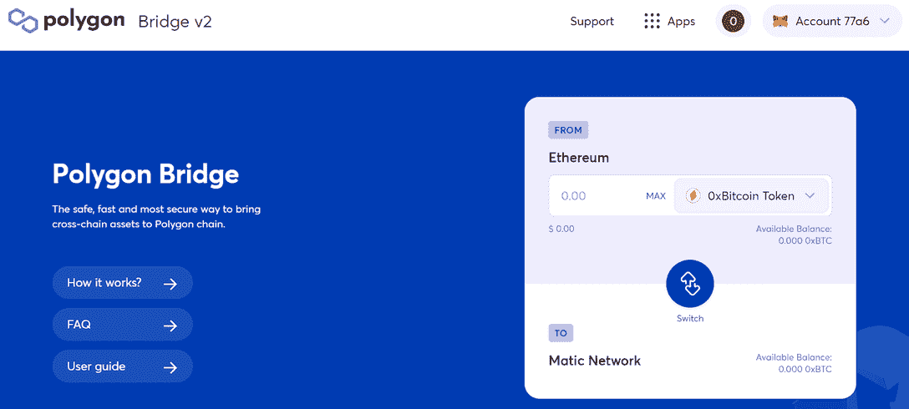
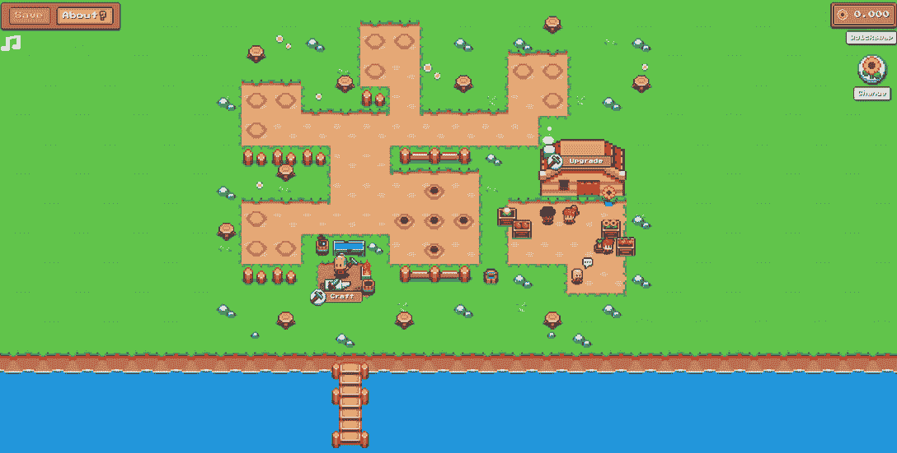
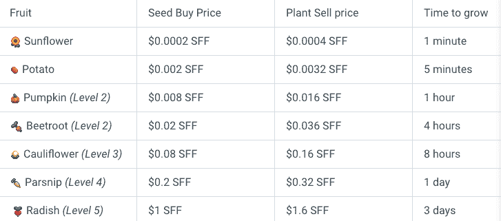
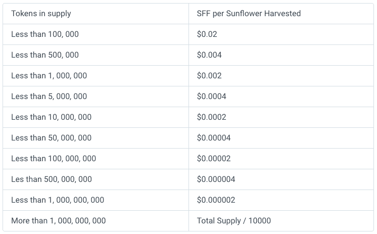

# 如何在向日葵农民上玩“从游戏中赚钱”

> 原文：<https://web.archive.org/web/https://dappradar.com/blog/how-to-play-to-earn-on-sunflower-farmers>

## 最新的逐级累积游戏

随着连接到 dapp 的钱包数量增长超过 15，000%,基于多边形的游戏赚取游戏向日葵农民本周以闪电般的速度攀升游戏排名。观察到的增长表明，一些有趣的事情正在发生，并引起了游戏化金融 dapp 寻求者的注意，值得进一步调查和解释如何开始。

游戏“从玩到赚”于 2021 年 9 月底推出，但向日葵农民直到 12 月份才受到关注。该项目没有参与 ICO 或向早期采用者预售 NFTs。通过这种方式，该平台希望让这款游戏真正成为“玩到赚到”的游戏，而不是“支付到赚到”的情况，这种情况可能是由于一款新游戏向早期采用者出售 NFT，然后以虚高的价格列出它们。这种做法从根本上排挤了新玩家。

## 这是什么？

《向日葵农民》是一款开源的游戏，玩家可以在游戏中种植、制作、采矿、砍柴、捕鱼、战斗等等，并建立起自己的农业帝国。大多数农民通过种植和收割来赚取向日葵代币。然而，随着玩家的进步，他们可以进行更有利可图的冒险，开始收集木材、石头、铁和其他有价值的材料。

每种资源都需要特定的工具来收集。这些工具是使用游戏中的各种其他资源制作的，并被设计为 ERC20 契约。如果你砍柴，你可以在农场之间或公开交易所自由交易。玩家对他们在游戏中收集的东西拥有完全的所有权。

## 如何连接

在做任何事情之前，你需要[有一个元蒙版账号](/web/20221206111917/https://dappradar.com/blog/explained-how-to-use-metamask-for-exchanging-tokens/)，并添加多边形网络。以下是将面网络添加到 Metamask 所需的自定义 RPC 详细信息。

注意:Polygon 的正式名称是 MATIC，在某些情况下，您仍然会看到它被这样称呼。至关重要的是，代币报价机仍然是自动的。

网络名称:Matic Mainnet

新的远程过程调用 URL:[https://polygon-rpc.com/](https://web.archive.org/web/20221206111917/https://polygon-rpc.com/)

链条编号:137

货币符号:MATIC

## 添加 SFF

向日葵农民中的游戏奖励是以 SFF 支付的，因此将 SFF 令牌添加到您的多边形 MetaMask 钱包中以跟踪您的收入也是有意义的。为此，您需要[将自定义令牌](https://web.archive.org/web/20221206111917/https://medium.com/publicaio/how-to-add-a-custom-token-to-metamask-b24b090f1550)添加到您的钱包中，并在下面输入 SFF 令牌合同地址。

##### SFF 合同地址:0 xdf 9 B4 b 57865 b 403 e08 c 85568442 f 95 c 26 b 7896 b 0

在玩之前，你必须确保你有一些 MATIC 来资助你的农场。如果您的 MetaMask 帐户中有一些以太坊或其他令牌，您可以使用 DappRadar 令牌交换购买 MATIC。然后[用多边形桥把它移到](https://web.archive.org/web/20221206111917/https://dappradar.com/blog/guide-on-how-to-move-assets-between-ethereum-bsc-and-polygon/#Ethereum-to-Polygon)你的元蒙版账户的多边形网络上。

## 采矿费用

由于这款游戏是由区块链技术驱动的，所以每次用户想要拯救区块链的农场时，都需要向矿工支付小额费用。这笔费用确保农场安全可靠。拯救区块链的一个农场大约需要 0.007 马提，约合 0.007 美元。

## 捐赠游戏

为了创建一个农场，向日葵农民要求用户向他们选择的慈善机构捐赠至少 0.1 马蒂奇美元。MATIC 将直接捐赠给慈善机构的区块链地址。您可以从以下慈善机构中选择:

*   [水项目](https://web.archive.org/web/20221206111917/https://thewaterproject.org/)
*   小母牛
*   [凉爽的地球](https://web.archive.org/web/20221206111917/https://www.coolearth.org/)

## 该玩了！

现在主循环已经跳过了，我们可以开始游戏和这里提供的内容了。为了清楚起见，我在这个上下文中相当自由地使用了术语游戏。从根本上来说，大多数先玩后赚的 dapps 目前都提供了参与游戏化投资的机会。少想 GTA 5，多想蛇梯。简单的游戏机制，最终导致玩家从他们所花的时间中获利。例如，以 0.001 SFF 的成本种植一棵向日葵，等待 1 分钟让它生长，收获它可以获得 0.002 SFF。当然，减去任何交易费用。

## 向日葵农民

游戏的起点是你的农场，里面有五棵准备收割的向日葵，用带黑点的米色圆圈表示。其他的米色圆环是一些小块土地，一旦你打开这些土地，就可以在那里种植向日葵。

点击这些黑点中的一个会显示一个信息，向日葵已经准备好收割了。收获向日葵会给你的余额增加一些 SFF，显示在右上角。

现在，你可以以 0.01 SFF 的成本在空洞里再种一棵向日葵。不要忘记点击屏幕左上方的“保存”来保存您的进度。如前所述，需要一笔小额费用来拯救你的农场，所以要确保这笔钱值得你去拯救。

在右上角的天平下，你可以看到一幅向日葵的图片。点击这个会显示出其他种子的列表，这些种子更贵但是产量更高。

现在应该很清楚了，游戏的设置是让人们从花费的时间中赚取 SFF 代币。种植向日葵可以让玩家的初始种子投资翻倍，而购买更多的外来种子将会带来更大的产量。通过这种方式，这款游戏仍然包含了从支付到赚取的机制。

## 工厂指南

下表显示了总供应量为 100 万时的作物价格。根据总的代币供应量，这些价格将会下降。这将在表征组学部分更详细地解释。

正如你所看到的，有一些有利可图的种子可供争夺。大多数都代表着一个让初始投资翻倍的机会。其他的，比如欧洲防风草，也可以给耐心的农民丰厚的回报。当然，SFF 代币可用的流动性深度将在这里发挥重要作用，因为玩家需要流动性来套现。

## 令牌组学

该游戏有一个内置的供求机制，控制着底层的令牌组学。这样做的目的是让农民尽早参与到游戏中来，并推动稀缺性。

随着越来越多的人务农，SFF 的总供应量增加，回报也会减少。这意味着与将来的玩家相比，早期玩家将获得更高的奖励。

你越早开始耕种，随着供应量的增加，你得到的回报就越多。下表列出了收获向日葵的奖励。当供应量少于 100，000 时，农民收获一棵向日葵可获得 0.01 美元。另一方面，当供应量在 100，000 到 500，000 之间时，农民在收获向日葵时只能获得 0.002 美元。

## 奖励

为了鼓励向日葵令牌持有者，游戏有一个独特的分布式奖励系统。它激励玩家建造他们的农场并投资游戏。每当代币被用于升级或制作时，它们都会进入游戏智能合约的奖励池。

每三天，你将有资格获得一些奖励。奖金的多少取决于你农场的大小。

## 哈尔文宁

正如所有敬业的农民和经济学学者所知，供给和需求可能是危险的事情。价格高的时候，就能发财。但是当价格低的时候，一生的土豆买卖可能会付之东流。当供应越来越接近临界点时，你会希望确保自己做好了准备。

当到达一个新的供应点时，所有游戏中的价格都会被细分。这使得在活动之前培养的所有代币比在供应变化之后培养的代币更有价值。下表显示了第一个转折点前后的价格范围。正如你所看到的，所有游戏中的价格都受到供应变化的影响。目的是保持所有价格的相对性，这样新玩家仍然可以享受平衡的游戏并改善他们的农场。

## 什么会出错？

玩家需要小心，不要在供应转移之前种植任何昂贵的植物，否则你可能会亏本出售植物。请参见下面的示例。

1.你种植一棵甜菜根的价格是 0.2 SFF(供应量是 499，900)
2。供应量增加到 500，100
3。你收获同样的甜菜根只需 0.1 瑞士法郎

在上面的例子中，你最终会损失 0.1 美元，因为甜菜根的供应量增加了，价格也相应下降了。所以，要盯紧货源。

 NewsletterUnsubscribe at any time. [T&Cs](https://web.archive.org/web/20221206111917/https://dappradar.com/terms) and [Privacy Policy](https://web.archive.org/web/20221206111917/https://dappradar.com/privacy-policy)

***以上不构成投资建议。此处给出的信息仅供参考。请行使尽职调查，做你的研究。作者持有 ETH，BTC，AGIX，HEX，LINK，GRT，CRO，OMI，不可变 X，ENS，GALA，AVASTR，GMEE，CUBE，RADAR，FLOW，FTM，BNB，SPS，WRLD，ADA。***