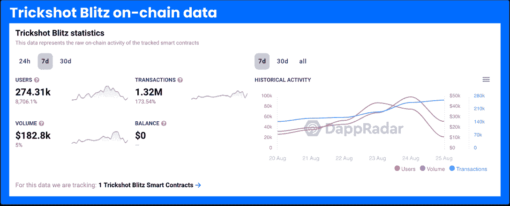

# 如何玩和赢:特技闪电战

> 原文：<https://web.archive.org/web/https://dappradar.com/blog/how-to-play-trickshot-blitz>

## Trickshot Blitz 本周在 DappRadar 的游戏排行榜上排名第四

Trickshot Blitz 本月才推出，但它已经在 DappRadar 的游戏排行榜上排名第四。这款基于泳池的休闲游戏仅在过去一周就吸引了约 275，000 名用户。这是一个超过 8700%的周环比增长。这是面向 web3 用户的经典手机游戏。

**内容**

*   ***[什么是 Trickshot 闪电战？](https://web.archive.org/web/20221202021451/https://dappradar.com/blog/how-to-play-trickshot-blitz/#what-is)***
*   ***[Trickshot 闪电战‘不可思议的增长](https://web.archive.org/web/20221202021451/https://dappradar.com/blog/how-to-play-trickshot-blitz/#incredible-growth)***
*   ***[特技闪电战有哪些游戏模式？](https://web.archive.org/web/20221202021451/https://dappradar.com/blog/how-to-play-trickshot-blitz/#game-modes)***
*   ***[游戏内的 RLY 令牌是什么？](https://web.archive.org/web/20221202021451/https://dappradar.com/blog/how-to-play-trickshot-blitz/#rly-token)***
*   ***[玩即赚在 Trickshot 闪电战中是如何工作的？](https://web.archive.org/web/20221202021451/https://dappradar.com/blog/how-to-play-trickshot-blitz/#play-to-earn)***
*   ***[如何跟踪 Trickshot Blitz 的链上数据？](https://web.archive.org/web/20221202021451/https://dappradar.com/blog/how-to-play-trickshot-blitz/#on-chain-data)***
*   ***[有用链接](https://web.archive.org/web/20221202021451/https://dappradar.com/blog/how-to-play-trickshot-blitz/#useful-links)***

Trickshot Blitz 是本周我们五大简单的游戏之一，该平台在短时间内吸引了数量惊人的粉丝。奖励结构不会让任何人很快成为百万富翁。但是，如果你是一个容易上瘾的手机游戏爱好者，这款游戏对你来说是完美的。

[See Trickshot Blitz Data](https://web.archive.org/web/20221202021451/https://dappradar.com/flow/games/trickshot-blitz)

## 什么是 Trickshot Blitz？

特技闪电战是工作室 Joyride 的最新游戏之一。正如其他 Joyride 标题，它是建立在流量区块链。这个游戏是一个简单的概念，非常适合吸引上瘾的观众。所有你需要做的是玩台球，执行 trickshots 和赚取奖励。

该公司宣布游戏将于 2022 年 8 月 15 日推出。就像 Joyride 的另一款热门游戏[纸牌闪电战](https://web.archive.org/web/20221202021451/https://dappradar.com/flow/games/solitaire-blitz)一样，Trickshot Blitz 已经迅速上升 [DappRadar 的游戏排名](https://web.archive.org/web/20221202021451/https://dappradar.com/rankings/category/games)接近榜首。

*[达普拉达纸牌闪电战指南](https://web.archive.org/web/20221202021451/https://dappradar.com/blog/over-140000-users-are-playing-joyrides-solitaire-blitz-to-earn-real-money-rewards)*

## 特技闪电战的惊人增长

自 10 天前推出以来，Trickshot Blitz 一直紧随其他基于 Flow 区块链构建的 dapps 的脚步。就像两年前的 NBA Top Shot 和今年早些时候的 Solitaire Blitz 一样，Trickshot Blitz 在短时间内吸引了数量惊人的粉丝。

[https://web.archive.org/web/20221202021451if_/https://www.youtube.com/embed/YwIus-8SsZk?feature=oembed](https://web.archive.org/web/20221202021451if_/https://www.youtube.com/embed/YwIus-8SsZk?feature=oembed)

The guys discuss Trickshot Blitz at 32:20

仅在本周，就有 273，850 个独特的活跃钱包与该游戏互动，用户在该平台上进行了超过 130 万次交易。这是另一个迹象，正如 DappRadar 最近报道的那样，区块链奥运会保持着强劲的表现，而 T2 奥运会和 T4 奥运会却在苦苦挣扎。

与所有简单和休闲的手机游戏一样，用户不需要一台功能强大的电脑和强大的互联网连接来玩 Trickshot Blitz。这使得所有国家的所有人都可以玩这个游戏。

## 特技射击闪电战有哪些游戏模式？

Joyride 保持了特技闪电战的简单玩法。用户玩撞球，对真正的对手或电脑。但是有一些不同的格式，让事情变得有趣。

#### 玩家对玩家

PvP 模式允许你和一个对手比赛。如果你进入操场，你可以看到一个选择列表的比赛进入。前往竞赛选项卡查看完整的花名册。

如果你和一个随机的对手比赛，电脑会让你和一个有相似经验的人比赛。也可以找玩 Trickshot Blitz 的朋友一起对战。

#### 锦标赛模式

多人锦标赛让你有机会击败一系列对手，登上山顶。锦标赛提供更丰厚的奖励。但是要注意，竞争更加激烈。

有些锦标赛不对玩家开放，直到他们达到一定的经验水平。目前，任何低于 5 级的人都不能访问每场比赛。

#### 挑战和日常奖励

挑战是一次性的考验，你唯一的对手是你自己。它们可能是困难的击球，或者是一系列的底池，你需要在有限的时间内完成。

对于每日奖励，您需要定期登录，继续连续得分并达到游戏里程碑。当您这样做时，您将获得额外的代币。

#### 实践模式

在这里，你可以与电脑对战来磨练你的技能，而不会有失去任何代币的压力。你可以在练习模式下玩，只要你想练习你的角度，击球和技巧。

## 游戏内 RLY 令牌是什么？

拉力赛，在股票代码上表示为 RLY，是 Joyride 生态系统的原生标志。这是以太坊为基础的，是保持集会网络中齿轮转动的油。Rally network 本身就是一个平台，创作者或开发者群体可以在这里推出自己的加密货币。

当他们最初推出时，想法是 RLY 将是“社交令牌”。他们能够访问独家内容、实物和数字商品。作为整个系统的货币，它们确保任何其他构建在该系统之上的开发者能够使用具有统一价值的单一货币进行交易。

RLY 可用于其他加密货币交易，或者您可以将其转换为法定货币并在现实世界中使用。你可以通过各种各种去中心化的交易所做到这一点:MEXC，Bitget，Kucoin，Huobi Global，Phemex。

这种代币在 2021 年 3 月达到了 1.40 美元的历史高点。从那以后，它一直呈下降趋势，目前没有恢复的迹象。找出今天 RLY 值多少钱以及你认为它是否会回到最高点附近。

## 在特技闪击闪电战中，从玩到赚是如何进行的？

你不一定要为你在特技闪击中赢得的每场比赛赢得早期代币。大多数比赛都是为了硬币。没有硬币，玩家就不能定期参加比赛来积累经验值。

玩家通过进入赛季和特殊活动赢得 RLY 代币。要参加这些比赛，你需要门票，你可以在季度和日常挑战中达到里程碑。助推器是你完成挑战和达到里程碑可以赢得的特殊奖励。他们帮助你获得经验值和硬币。

每场 PvP 比赛都有两分钟的时间限制。游戏是异步的，所以你不需要实时完成两分钟。最后得分最高的玩家获胜。

要击球，拖动手指将球杆拉回。在屏幕上移动手指，找到最佳角度。当你松开时，你的球杆也会松开。在一个完美的世界里，球会进口袋。

每个凹穴都有一组称为凹穴点的点数。当您将球击入每个袋中时，您将获得指定点数。如果你用小球击球，你将获得额外的 100 分。

任何玩家在剩余时间内清空整个牌桌都将获得额外的分数。袋点随着每个被装入的球绕着桌子旋转。

## 我如何跟踪 Trickshot Blitz 的链上活动？

DappRadar 是一个可以获得关于 Trickshot Blitz 的连锁信息的地方。您可以使用我们的游戏排名页面来查看它在每日、每周或每月的表现。重要的是，你可以看到它在所有的[游戏中，在所有的区块链](https://web.archive.org/web/20221202021451/https://dappradar.com/rankings/category/games)游戏中，或者在区块链的其他[游戏中的表现。](https://web.archive.org/web/20221202021451/https://dappradar.com/rankings/protocol/flow/category/games)

你也可以通过游戏的单个 dapp 页面更深入地跟踪 Trickshot Blitz 的链上数据。在这里，你将能够看到用户和交易数量，以及通过 dapp 的智能合约移动的加密货币的数量。你也可以看到 dapp 目前持有多少资金作为余额。

[DappRadar’s single dapp page for Trickshot Blitz](https://web.archive.org/web/20221202021451/https://dappradar.com/flow/games/trickshot-blitz)

## 有用的链接

*   [前往 Trickshot Blitz](https://web.archive.org/web/20221202021451/https://dappradar.com/deeplink/18031https://dappradar.com/deeplink/18031)
*   [Trickshot Blitz 单个 dapp 页面](https://web.archive.org/web/20221202021451/https://dappradar.com/flow/games/trickshot-blitz)
*   [区块链奥运会 DappRadar 排名](https://web.archive.org/web/20221202021451/https://dappradar.com/rankings)
*   [心流区块链运动会 DappRadar 排名](https://web.archive.org/web/20221202021451/https://dappradar.com/rankings/protocol/flow/category/games)
*   [早期代币价格](https://web.archive.org/web/20221202021451/https://www.coingecko.com/en/coins/rally)
*   [达普拉达纸牌闪电战指南](https://web.archive.org/web/20221202021451/https://dappradar.com/blog/over-140000-users-are-playing-joyrides-solitaire-blitz-to-earn-real-money-rewards)

 NewsletterUnsubscribe at any time. [T&Cs](https://web.archive.org/web/20221202021451/https://dappradar.com/terms) and [Privacy Policy](https://web.archive.org/web/20221202021451/https://dappradar.com/privacy-policy)