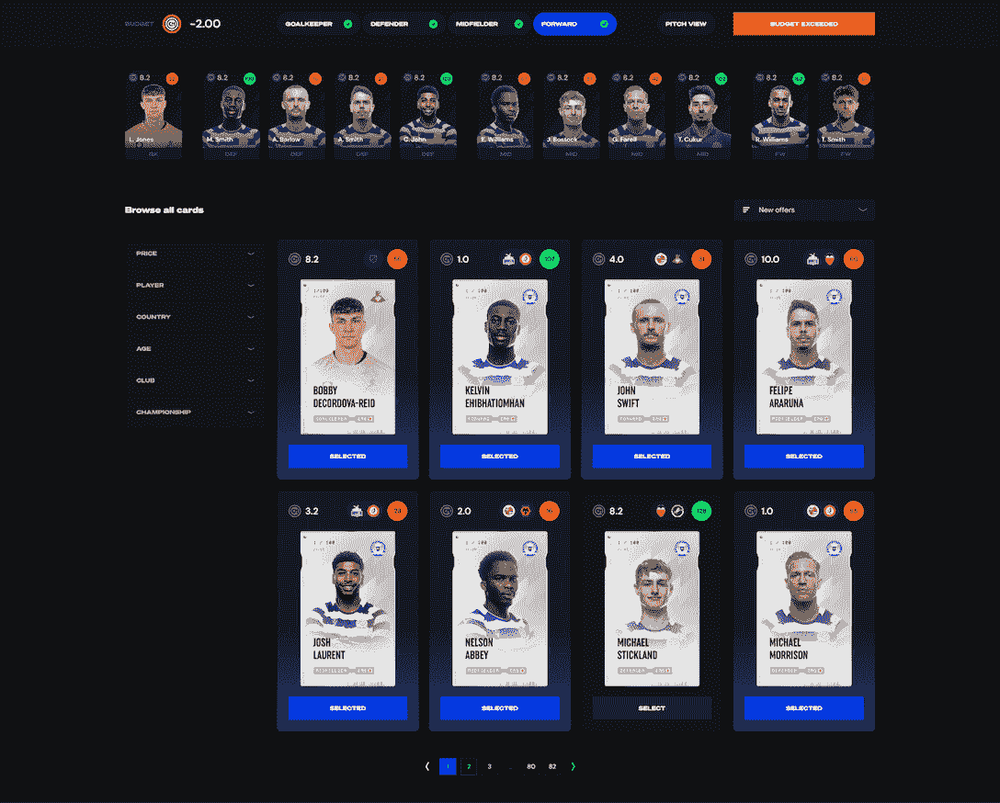
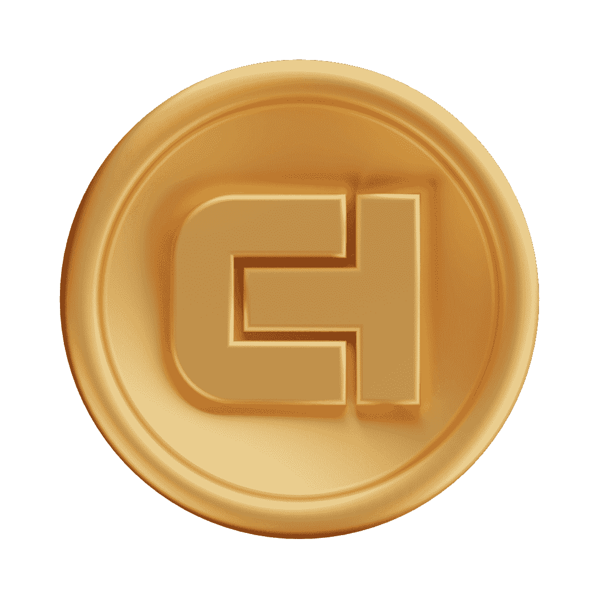

# 如何玩终极冠军和使用冠军代币

> 原文：<https://web.archive.org/web/https://dappradar.com/blog/how-to-play-ultimate-champions-and-use-champ-tokens>

## 成为终极冠军的终极指南

终极冠军是一款梦幻足球游戏，玩家通过挑选自己的球员卡来赢取积分。玩家可以收集卡片，赚取冠军代币和游戏内货币，同时与社区或他们自己的朋友一起玩。

最初终极冠军在多边形区块链推出，但后来在 2022 年第四季度迁移到 BNB 链。梦幻足球游戏让玩家使用数字收集卡进行竞争，以赢得更多的卡、代币和游戏内货币。然后，他们可以使用他们的奖励获得更多的卡或在市场上交易现有的卡。

终极冠军使用基于真实足球运动员的可收集卡片。该游戏允许玩家使用可收集的数字卡免费享受游戏，但普通卡不能在市场上出售。然而，玩家可以赢得游戏中的货币或购买卡包来获得 NFT 卡。一旦玩家开始收集 NFT，更多类型的锦标赛也会向他们开放。

## 终极冠军的游戏奖励

终极冠军允许玩家赢得各种奖励，取决于他们拥有的卡和他们已经在游戏上花费的时间或金钱。

*   CHAMP–一个加密令牌，用于从市场购买终极卡和卡。
*   MGC——你可以从玩游戏中获得的游戏内货币。不能交易。100 MGC 等于 1 美元。
*   普通卡——这些数字卡有无限的供应量，不能交易。
*   NFT 卡片——这些收藏品数量有限，可以交易。

## 如何入门终极冠军

你不需要投入任何资金来享受终极冠军。通过决心和聪明的举动，你可以赢得游戏中的货币和卡，以提高你的胜算。最终你可以赢得 NFT 卡和冠军代币。

以下是你开始玩终极冠军的方法:

1.  使用您的电子邮件地址为终极冠军创建一个帐户
2.  终极冠军将在后台创建一个钱包
3.  作为一名新经理，你收到一个虚构的预算，选择 11 张牌(1 名守门员，4 名后卫，4 名中场和 2 名前锋)。这些都是非 NFT 卡。
4.  现在进入联盟游戏模式，为即将到来的游戏周注册你的队伍。
5.  您将在每个游戏周赢取积分，解锁奖励。有好的结果也会给你奖励。赚取足够的积分，您将赢得 NFT 卡或冠军。
6.  一旦你拥有足够的 NFT 卡，你将解锁更多的 NFT 和加密价格的游戏模式。

[https://web.archive.org/web/20221210121036if_/https://www.youtube.com/embed/4SAC11J-o8M?feature=oembed](https://web.archive.org/web/20221210121036if_/https://www.youtube.com/embed/4SAC11J-o8M?feature=oembed)

## 冠军是什么？

你不需要冠军来玩终极冠军，但是代币可以让你购买更好更有价值的 NFT 卡。这些 NFT 卡给你更多的积分，打开更多的赚钱机会。此外，当你有足够的 NFT 卡，你将解锁更多的联赛和比赛加入。因此，冠军是终极冠军生态系统中的一个有用的标志。

任何人都可以通过游戏内的交换页面购买 CHAMP，当然你也可以使用 DappRadar 自己的代币交换。只要确保你在 DappRadar 和终极冠军中使用相同的钱包。

您可以在以下情况下使用 CHAMP:

*   冠军是对联赛，锦标赛和即将到来的游戏模式冲突中表现优异者的奖励。
*   玩家可以使用 CHAMP 从市场上购买高级包或其他卡。
*   在不久的将来，终极冠军将引入赌注机制，而赌注将提高游戏奖励。

[CHECK OUT ULTIMATE CHAMPIONS](https://web.archive.org/web/20221210121036/https://dappradar.com/multichain/games/ultimate-champions)

## 随身携带您的 Web3 之旅

使用 DappRadar 移动应用程序，再也不会错过 Web3。查看最受欢迎的 dapps 的性能，并关注您投资组合中的 NFT。您在 DappRadar 上的帐户会与我们的移动应用程序同步，这样您很快就可以选择实时接收提醒。

[Download the DappRadar app now](https://web.archive.org/web/20221210121036/https://dappradar.app.link/blog)[<picture></picture>](https://web.archive.org/web/20221210121036/https://play.google.com/store/apps/details?id=com.portfolio.dappradar) NewsletterUnsubscribe at any time. [T&Cs](https://web.archive.org/web/20221210121036/https://dappradar.com/terms) and [Privacy Policy](https://web.archive.org/web/20221210121036/https://dappradar.com/privacy-policy)