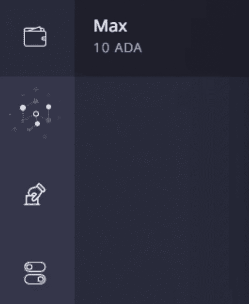

# 如何赌注卡达诺:初学者指南

> 原文：<https://web.archive.org/web/https://dappradar.com/blog/how-to-stake-cardano-beginners-guide>

## 关于在卡达诺区块链赌场下注和赢钱，你需要知道的一切

**卡尔达诺区块链有两种从下注中赢取奖励的方法。用户既可以下注他们的 ADA，也可以经营他们自己的 Cardano 赌注池。或者他们可以将这一责任委托给其他人，但仍然可以获得加密货币奖励。在这篇文章中，我们将告诉你如何做到这两点。**

**内容**

*   ***[赌九连环](https://web.archive.org/web/20221127193242/https://dappradar.com/blog/how-to-stake-cardano-beginners-guide/#staking-on)***
    *   ***[什么是九连环？](https://web.archive.org/web/20221127193242/https://dappradar.com/blog/how-to-stake-cardano-beginners-guide/#what-is-staking)***
    *   ***[你能期待什么回报？](https://web.archive.org/web/20221127193242/https://dappradar.com/blog/how-to-stake-cardano-beginners-guide/#what-returns-staking)***
*   ***[如何赌九连环](https://web.archive.org/web/20221127193242/https://dappradar.com/blog/how-to-stake-cardano-beginners-guide/#how-stake)***
*   ***[推让上卡丹诺](https://web.archive.org/web/20221127193242/https://dappradar.com/blog/how-to-stake-cardano-beginners-guide/#delegating-cardano)***
    *   ***[什么是推让？](https://web.archive.org/web/20221127193242/https://dappradar.com/blog/how-to-stake-cardano-beginners-guide/#what-is-delegating)***
    *   ***[你能期待什么回报？](https://web.archive.org/web/20221127193242/https://dappradar.com/blog/how-to-stake-cardano-beginners-guide/#what-returns-delegating)***
    *   ***[什么是最好的委派钱包？](https://web.archive.org/web/20221127193242/https://dappradar.com/blog/how-to-stake-cardano-beginners-guide/#wallet-delegating)***
*   ***[如何在卡丹诺](https://web.archive.org/web/20221127193242/https://dappradar.com/blog/how-to-stake-cardano-beginners-guide/#delegate-and-earn)*** 上授权和赚取

用 Cardano 下注的好处在于，你可以从你的 Web3 钱包里的代币中获得被动收入。你很快就可以开始赚钱了。大约需要 20 天才能看到你的第一次奖励。之后每隔五天，你会收到另一笔 ADA。

[Explore Cardano Dapps](https://web.archive.org/web/20221127193242/https://dappradar.com/rankings/protocol/cardano)

## 卡达诺星

#### 什么是卡尔达诺赌注？

Cardano 是一个利益攸关的网络，其全球分布的社区是那些保护网络安全免受黑客攻击的人。这种程度的权力下放对其职能至关重要。卡达诺和许多其他区块链就是通过赌注来确保分散安全的。

ADA 的持有者将他们的令牌锁在区块链上，以换取验证交易的权利。当一个赌注者这样做时，他们会在 ADA 中得到奖励。

[What is Cardano?](https://web.archive.org/web/20221127193242/https://dappradar.com/blog/what-is-cardano-a-simple-explanation)

从技术上讲，为了确认卡尔达诺区块链上的区块，标桩是建立你自己的节点的过程，由你控制。

在这一点上有一些事情需要注意。用于选择赌注者以验证交易的系统是一种彩票。你押的 ADA 越多，你被选中的几率就越高。这种随机性有助于保持网络安全。这意味着没有一个验证器可以控制区块链。

[https://web.archive.org/web/20221127193242if_/https://www.youtube.com/embed/ruAbDViKMNI?feature=oembed](https://web.archive.org/web/20221127193242if_/https://www.youtube.com/embed/ruAbDViKMNI?feature=oembed)

Cardano staking explained

#### 你能期待什么回报？

一般来说，任何直接经营自己的 Cardano staking pool 的人都可以预期年回报率在 5%到 14%之间。如果你一年下注 100 阿达，你将得到 5 到 14 阿达的奖励。

如果你经营一个游泳池，你可以收取设置和维护费用。你也可以或多或少地加入你自己的 ADA，因此回报会有差异。如果你委托你的代币，你的回报将会更少(更多在下面)。

## 如何在卡尔达诺身上下注

在卡尔达诺创建自己的赌注池需要专业技术。你需要在操作层面上理解区块链的工作，并知道如何编码。对于有这种理解水平的人来说，下面的视频告诉你如何去做。

[https://web.archive.org/web/20221127193242if_/https://www.youtube.com/embed/MpslXKOJduI?feature=oembed](https://web.archive.org/web/20221127193242if_/https://www.youtube.com/embed/MpslXKOJduI?feature=oembed)

## 委派卡尔达诺

#### 什么是授权？

委托类似于标桩，但不是建立自己的节点，而是将标桩权交给其他人，他们已经建立了自己的节点/标桩池。这给了赌注池更多的机会来验证下一组事务，并将下一个块添加到链中。

这是确保可持续被动收入的安全方式。值得注意的是，仅仅因为你已经“委托”了你的 ADA，这并不意味着你不能控制它。你可以在任何时候撤回它，没有罚款或影响。你所委派的只是你的认可力量。

#### 你能期待什么回报？

委托人预计年回报率可达 5.5%左右。通过一个集中的交易所来委托你的 ADA 会给你带来大约 3%的回报，但是很容易做到。直接进入赌注池，而不是通过中介，是通过授权获得 ADA 的最佳方式。

#### 委派任务最好的钱包是什么？

代达罗斯钱包通常被视为卡尔达诺授权的最佳选择。它是由区块链卡尔达诺公司开发的。所以它是由最了解网络的人建造的。它提供了进入卡尔达诺的最佳途径，也是市场上最安全的。

还有其他选择可以探索。Yoroi 钱包为用户提供了最好的浏览器扩展委托选项，而币安则提供了你能找到的一些最好的回报。Exodus wallet 给人们提供了授权的选择，而不仅仅是 Cardano，KuCoin 对有经验的交易者也有好处。

[Discover Cardano Wallets](https://web.archive.org/web/20221127193242/https://dappradar.com/blog/best-wallets-for-cardano)

## 如何在 Cardano 上授权和赚取

*   下载 Cardano Web3 钱包。[阅读我们的卡达诺钱包制作指南](https://web.archive.org/web/20221127193242/https://dappradar.com/blog/how-to-create-a-cardano-wallet-the-beginners-guide)。正如我们在上面学到的，代达罗斯钱包是用于授权的最佳选择。
*   转到[代达罗斯网站](https://web.archive.org/web/20221127193242/https://daedaluswallet.io/)，按照说明注册，记得记下您的恢复种子短语。
*   一旦你创建了一个帐户，代达罗斯将需要下载整个区块链分类帐，以便它完全是最新的。这需要几个小时。
*   您需要从交易所购买 ADA，然后将其转入您的代达罗斯钱包。
*   现在你有 ADA 要授权，转到主屏幕左侧的选项卡。点击向下第二个图标。

Second icon down for delegating

*   点击之后，你就可以进入下注池，选择将你的 ADA 分配到下注池。
*   赌注池用颜色编码，以表示它们是否饱和。饱和是 Cardano 嵌入到赌注池系统中的一种限制机制，因此没有单个池可以收集所有 ADA 并潜在地控制网络。一旦一个资金池达到饱和点，它的回报就不再随其规模成比例增加。
*   一旦你选择了你的池，点击委托给这个池，选择你要委托的金额，并确认。

或者，你可以在一个集中的交易所，如北海巨妖或比特币基地，设立一个账户，他们会为你做这件事。回报会更低，但你的努力程度也会更低。

## 随身携带您的 Web3 之旅

使用 DappRadar 移动应用程序，再也不会错过 Web3。查看最受欢迎的 dapps 的性能，并关注您投资组合中的 NFT。您在 DappRadar 上的帐户会与我们的移动应用程序同步，这样您很快就可以选择实时接收提醒。

[Download the DappRadar app now](https://web.archive.org/web/20221127193242/https://dappradar.app.link/blog)[<picture></picture>](https://web.archive.org/web/20221127193242/https://play.google.com/store/apps/details?id=com.portfolio.dappradar) NewsletterUnsubscribe at any time. [T&Cs](https://web.archive.org/web/20221127193242/https://dappradar.com/terms) and [Privacy Policy](https://web.archive.org/web/20221127193242/https://dappradar.com/privacy-policy)