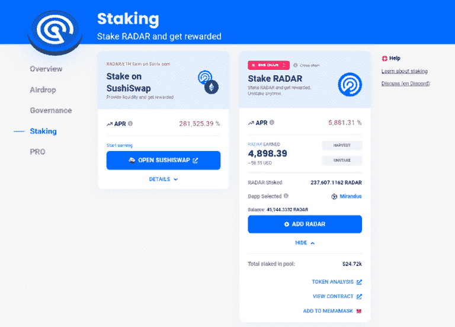
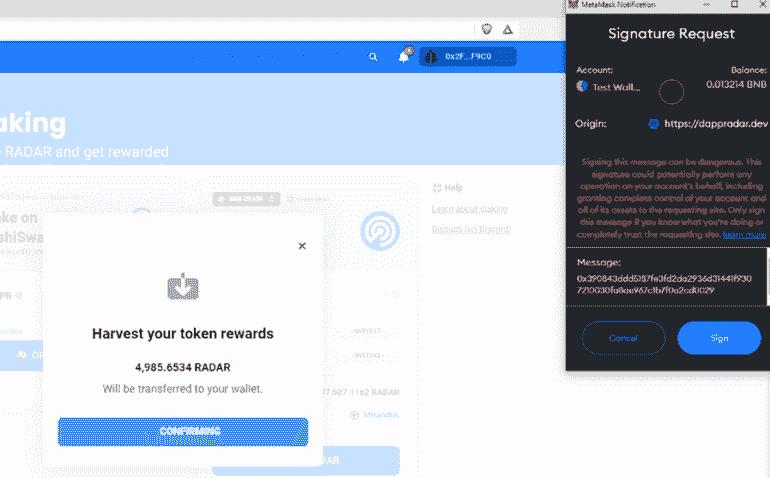

# 如何在另一个区块链上赌注雷达和收获奖励

> 原文：<https://web.archive.org/web/https://dappradar.com/blog/how-to-stake-radar-and-harvest-rewards-on-another-blockchain>

## 交叉链定位的逐步指南

DappRadar 允许社区成员将他们的雷达令牌放在一条链上，并在另一条链上领取奖励。例如，您可以将您的雷达代币押在以太坊区块链上，然后在 BNB 链上领取奖励。多边形和其他链将遵循相同的例子。这就是你开始的方式。

*2022 年 7 月 20 日更新——推出 V2 雷达跟踪服务，增加对硬件钱包的支持并改进跟踪流程。* *使用雷达的用户需要在 2022 年 8 月 2 日前迁移到 V2 雷达站。*

跨链赌注允许雷达令牌持有者下注他们的奖励，然后在任何区块链上要求奖励。最初，我们支持以太坊和 BNB 链，而多边形将很快跟上。从技术上讲，将来任何其他区块链都可以添加到该服务中。

在此页面上，您可以找到以下信息:

*   [如何加入 V2 雷达站](https://web.archive.org/web/20221004010209/https://dappradar.com/blog/how-to-stake-radar-and-harvest-rewards-on-another-blockchain/#stakingv2)(2022 年 8 月 2 日前完成)
*   [如何锁定雷达](https://web.archive.org/web/20221004010209/https://dappradar.com/blog/how-to-stake-radar-and-harvest-rewards-on-another-blockchain/#stake)
*   [如何获得或取消你的雷达奖励](https://web.archive.org/web/20221004010209/https://dappradar.com/blog/how-to-stake-radar-and-harvest-rewards-on-another-blockchain/#harvest)

## 如何锁定雷达

*   转到[www.dappradar.com](https://web.archive.org/web/20221004010209/http://www.dappradar.com/)然后点击[雷达标签](https://web.archive.org/web/20221004010209/https://dappradar.com/token/overview)。
*   点击“连接钱包”并批准签名交易，连接您的钱包。这不需要任何气费。
*   请记住:确保您选择了存储雷达令牌的同一个区块链网络。
*   交易完成后，您需要启用或允许您的 Web3 钱包(例如 Metamask)在 DappRadar 网站上使用您的雷达令牌。按“启用”。
*   然后，你的 Web3 钱包会弹出一个窗口，显示你需要支付交易费来批准使用代币的选项。请记住，这是一个链上批准，该交易将在每个链上花费一次交易费。
*   批准后，将出现“赌注”按钮。按下它。
*   在弹出窗口中，您需要说明您想要下注多少雷达。最大金额由您在连接的钱包中持有的雷达数量决定。
*   满意吗？按“确认”。
*   同样，将显示一个 Web3 钱包交易弹出窗口。批准交易，并等待区块链对此进行处理。同样，这是一个连锁行动，因此你需要支付一些汽油费。
*   一旦被确认，你就已经把你的雷达标记标好了。祝贺你，享受四月。

[https://web.archive.org/web/20221004010209if_/https://www.youtube.com/embed/pThbMD_ceXs?feature=oembed](https://web.archive.org/web/20221004010209if_/https://www.youtube.com/embed/pThbMD_ceXs?feature=oembed)

## 如何收集或拆卸雷达

现在您已经标记了您的雷达令牌，您将在仪表板中看到三个选项:

1.  **收获**——领取奖励。这需要交易，用户需要交燃气费。
2.  **取消下注**–从下注池中移除您持有的雷达币。这需要交易，用户需要交燃气费。
3.  **添加雷达**–向您的赌注存款中添加更多雷达代币。这需要交易，用户需要支付燃气费。

添加雷达和拆卸雷达都需要一个链上事务。这笔交易的成本取决于更广泛的区块链生态系统。例如，以太坊上的交易比 BNB 连锁店上的交易要贵得多。

DappRadar 跨链代币跑马圈地的创新在于收获你的雷达代币奖励。收割允许用户在任何链上技术上要求他们的雷达奖励。我们现在支持以太坊和 BNB 链，多边形也将很快推出。

### 让我们收获你的奖励吧

*   当你在以太坊下注，并想在 BNB 链上索赔时，请确保从粉红色的网络选择菜单按钮中选择“BNB 链”。
*   无论你选择哪条链，你都会看到你的钱包已经赢得了一些雷达。在右手边，有一个“收获”按钮。点击它。
*   确认现场弹出开始收割。点击“确认”
*   签署签名请求弹出窗口。这再次确认了收获是由正确的钱包发起的。按“签名”。

*   将出现另一个 web3 wallet 弹出窗口。这确认了交易。您需要支付汽油费才能获得雷达令牌奖励。按“确认”。
*   请稍等片刻。DappRadar 将确认您的交易处理已经开始。好的，很好。
*   申领您的雷达令牌奖励可能需要几分钟时间，具体取决于区块链。另一个弹出窗口将出现在现场，确认您已收到您的雷达奖励。

[https://web.archive.org/web/20221004010209if_/https://www.youtube.com/embed/CTUaFIPgSTE?feature=oembed](https://web.archive.org/web/20221004010209if_/https://www.youtube.com/embed/CTUaFIPgSTE?feature=oembed)

## 如何加入 V2 雷达站

通过雷达 Staking V2，智能合约不仅支持各种硬件钱包，包括 Trezor 和 Ledger，还改善了用户体验。用户不再需要在下注或索赔时处理警告消息，而是将体验到更友好的消息。然而，每个人都需要在 2022 年 8 月 2 日之前将他们的雷达从 V1 转移到 V2。这是怎么回事:

*   你会注意到 V1 的雷达锁定选项不再允许用户添加他们的雷达到池中。您只能按“拆卸和收获”。让我们认领你的雷达代币。
*   使用粉红色的区块链菜单选择您下注的筹码链。
*   然后按下“解散和收获”按钮，要求您对某一特定区块链的所有控股。您的 Web3 钱包将弹出一个确认交易的窗口。按确认。
*   请记住，很可能需要执行两次此操作，一次在以太坊，另一次在 BNB 链。以太坊的交易成本非常高。达普拉将支付从 V1 到 V2 的过渡费用。
*   启动流程后，您需要等待一段时间。尤其是在以太坊，申请过程可能需要 20 分钟。记住这一点。
*   拆分完成后，请刷新页面以更新所有值。现在是时候在新的雷达标桩 V2 合同中存放您的雷达了。([遵循本指南](https://web.archive.org/web/20221004010209/https://dappradar.com/blog/how-to-stake-radar-and-harvest-rewards-on-another-blockchain/#stake))
*   您将再次需要批准智能合同，这需要交易费。然后将您的雷达令牌发送到智能合约。同样，这里还有一笔交易费。

RADAR Staking V2 introduces a much better user experience

## 用你的赌注来提高你最喜欢的 dapps

拥有标桩雷达令牌的用户将获得助推力。这是对特定 dapps 的一种投票权。你的雷达越多，你的助推力就越大。你可以在下赌注后立即这样做，也可以以后再做。

提高 dapp 不需要任何区块链互动，你也不会失去你的股份。它允许用户对他们喜欢的 dapp 表示支持。用户一次只能提升一个 dapp。DappRadar 将在不久的将来扩展 boosting 功能，因为我们计划向 dapp 生态系统添加其他令人兴奋的功能。敬请关注更多内容！

现在你可以[在这里](https://web.archive.org/web/20221004010209/https://dappradar.com/hub/token/eth/RADAR/ETH?from=0x44709a920fccf795fbc57baa433cc3dd53c44dbe)得到雷达，然后[在这里](https://web.archive.org/web/20221004010209/https://dappradar.com/token/overview)享受跑马圈地的好处。