# 如何开始在 Solana 上使用 DeFi Dapps 和加密钱包

> 原文：<https://web.archive.org/web/https://dappradar.com/blog/how-to-start-using-defi-dapps-and-crypto-wallets-on-solana>

## 一切你需要知道开始对索拉纳区块链

在 Solana 上使用 DeFi dapps 和 crypto wallets 并不像听起来那么复杂。这也变得有趣多了。随着以太坊区块链的燃气费问题变得越来越明显，Solana 等其他协议与这个庞然大物竞争并解决这些问题。

Solana (SOL) 于 2020 年 3 月推出，是一个公共区块链平台，旨在为每个人提供可扩展且用户友好的 dApps。它已经成为 crypto 增长最快的生态系统之一，为其用户提供了大量内容。该协议的主要优势包括高网络速度，以及与 dApps 进行交易和交互的低成本。这使得它对普通用户非常有吸引力，甚至允许他们以比以太坊低得多的价格来制造 NFT。不仅如此，在网络高度拥塞的情况下，minting 也是可能的。

该平台采用历史证明共识，为交易提供时间戳，并按照提交的顺序进行处理以进行验证。这反过来阻止了其他用户从堆叠交易中获利。关于索拉纳的好处已经说得够多了。你如何开始利用索拉纳和它的 DeFi 生态系统为你带来好处？阅读我们的 Solana DeFi 指南，找出答案。

## 选择加密钱包

你需要做的第一件事是设置一个 Solana 加密钱包。如果你是这个领域的新手，加密钱包是一个用于发送、接收和跟踪加密货币所有权的应用程序。用户的加密钱包包含一组一个或多个密钥对:安全生成的私钥及其加密导出的公钥。

Solana 在其原生命令行应用程序中支持多种类型的钱包，以及第三方加密钱包。普通用户最好使用基于浏览器的用户友好型网络钱包或移动应用钱包。

### 基于浏览器的钱包

与 Solana 兼容的网络钱包有多种选择，其中最好的包括:

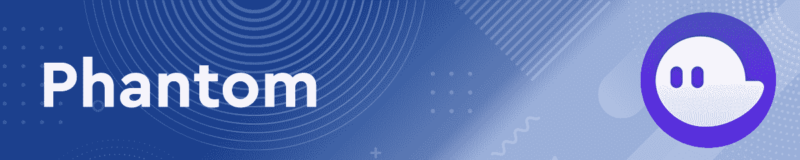

一个用户友好的非托管浏览器扩展， [Phantom](https://web.archive.org/web/20220929113831/https://phantom.app/) 支持安全和简单的令牌发送、接收、存储和交换。除了使用 Solana dApps，它还支持 NFTs 和 Ledger 硬件钱包。它可以在 Chrome、Firefox、Brave、Edge 和 Vivaldi 上使用。

Phantom 是 Solana dapps 上最受欢迎和集成的基于浏览器的钱包之一。它的影响力可以与以太坊区块链的超面具相提并论。

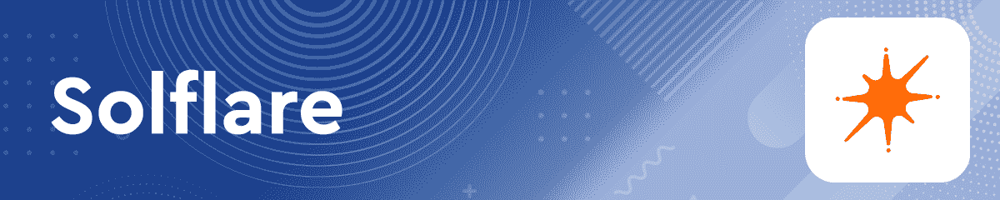

Solflare 是一款非托管网络钱包，旨在支持 Solana。像 Phantom 一样，它非常用户友好，可以在一系列浏览器上使用，包括 Chrome、Firefox、Brave、Edge 和 Opera。

它拥有大量的功能，例如连接到几乎任何 Solana dApp，交易模拟，深度赌注支持，全面的 NFT 功能，所有 Solana 令牌的钱包内交换(SPL)，以及对分类帐硬件钱包的支持。

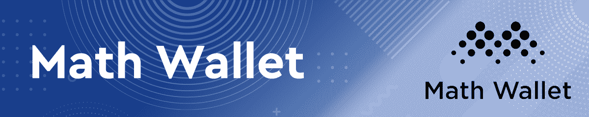

凭借其浏览器扩展和网络钱包接口，[数学钱包](https://web.archive.org/web/20220929113831/https://mathwallet.org/en-us/)是一个多平台、多链钱包，支持索尔和 SPL 代币的发送和接收。它有一个用于 iOS 和 Android 的应用程序，但它还不支持索尔和 SPL 令牌。

就像 Phantom 和 Solflare 一样，Math Wallet 允许用户连接到众多基于 Solana 的 dapps，并与协议自由交互。

### 基于手机的钱包

移动设备包括以下选项:

Solflare 的移动非托管钱包拥有移动应用和网络版本，支持发送索尔和 SPL 代币、赌注和全面的 NFT 管理。除了密码，Solflare 移动应用程序还支持生物识别保护。

[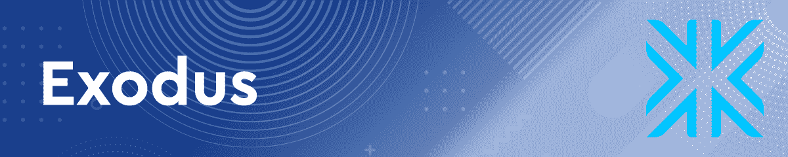](https://web.archive.org/web/20220929113831/https://www.exodus.com/)

一个基于移动的加密钱包，拥有内置的交换、实时图表和投资组合，以及 24/7 人工支持， [Exodus](https://web.archive.org/web/20220929113831/https://www.exodus.com/) 是初学者的理想选择。它提供了所有的基本功能——支持在领先的桌面、移动和硬件钱包上轻松发送、接收和交换加密货币。

[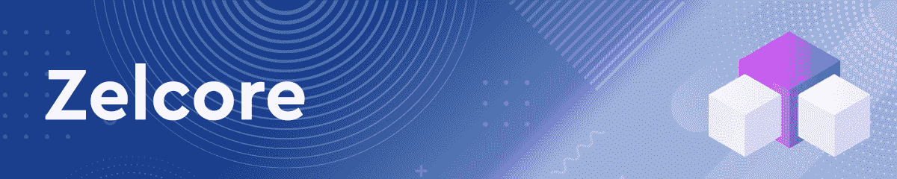](https://web.archive.org/web/20220929113831/https://zelcore.io/)

一个支持索尔和 SPL 代币的多币种钱包， [Zelcore](https://web.archive.org/web/20220929113831/https://zelcore.io/) 为每项资产提供三个独立的地址。它的移动应用程序允许存储、交易和使用 dapp。Zelcore 支持使用定制的基于 Sollet 的钱包适配器，该适配器在一个浏览器标签中连接到平台的所有 dApps。

## 索拉纳上的 DeFi dapps

一旦你建立了你的钱包，并转移了一些溶胶，你就可以开始探索索拉纳不断增长的 DeFi 生态系统。这些是索拉纳星球上的 DeFi dapps，你可以从这里开始。挑选你最喜欢的茄果类植物，潜入茄果类生态系统:

[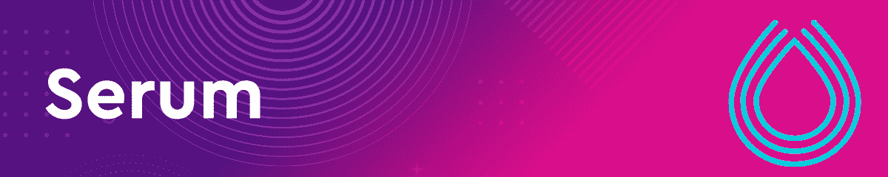](https://web.archive.org/web/20220929113831/https://dappradar.com/solana/defi/serum)

中央限价委托单簿(CLOB)分散交易所(DEX)， [Serum](https://web.archive.org/web/20220929113831/https://dappradar.com/solana/defi/serum) 促进了 Solana 生态系统中所有 DeFi dapps 的运行，允许它们中的任何一个共享 Serum 的流动性。Serum 不是使用流动性池来实现交易，而是像传统交易所一样匹配买方和卖方，从而降低滑点和价格波动。

[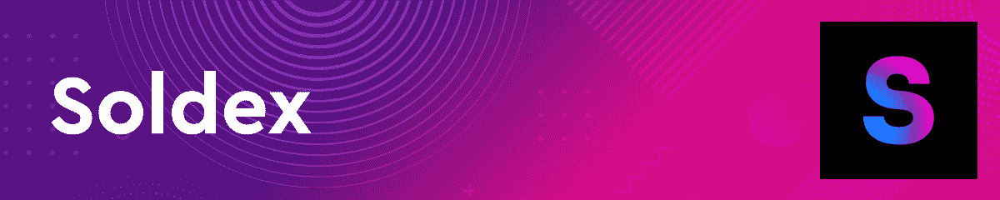](https://web.archive.org/web/20220929113831/https://dappradar.com/solana/exchanges/soldex)

另一个建立在 Solana 基础上的 DEX， [Soldex](https://web.archive.org/web/20220929113831/https://dappradar.com/solana/exchanges/soldex) 作为结算、流动性、托管和做市的基础层。它的最终目标是促进灵活的金融市场。通过这种方式，它旨在解决困扰 dex 和订单匹配集中交易所(CEXs)的无信任托管问题。

Soldex 和 Serum 远不是唯一建立在 Solana 基础上的加密货币交易所。Orca 专注于提供一种用户友好的方式，以最低的交易费用和低延迟来交换代币。它还支持流动性池。

[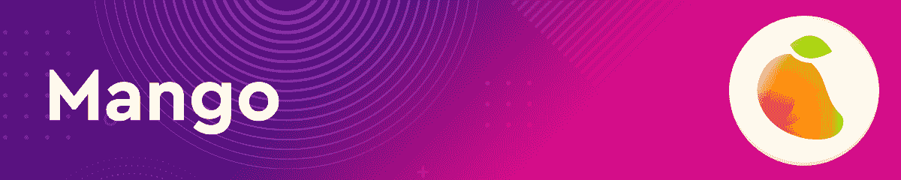](https://web.archive.org/web/20220929113831/https://www.mango.markets/)

对于那些寻求探索更高级交易选项的人来说，这里有快如闪电的芒果。它的用户界面很像 Serum，除了它还支持链上保证金交易和某些资产的永久合同。Mango 允许用户以高达 5 倍的杠杆进行交易，无论是做多还是做空。请记住，这种类型的交易伴随着高风险，应该只由有经验的交易者来做，他们能够承受损失。

[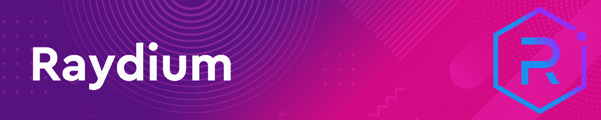](https://web.archive.org/web/20220929113831/https://dappradar.com/solana/defi/raydium)

第一个自动做市商(AMM)建立在 Solana 之上， [Raydium](https://web.archive.org/web/20220929113831/https://dappradar.com/solana/defi/raydium) 是最受欢迎的 dapps 之一。它是为 Serum DEX 创建的，利用了 Serum 的完全分散的中央限价指令簿以及 Raydium 自己的流动性池。这样，它可以找到最好的交易选择，最低的滑点。由于使用了流动性池，Raydium 还允许用户提供流动性并赚取利息。

[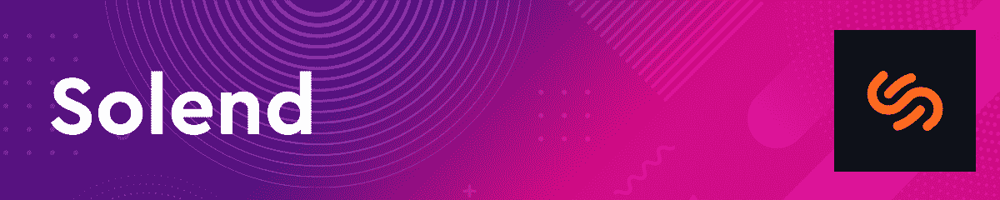](https://web.archive.org/web/20220929113831/https://dappradar.com/solana/defi/solend)

Solend 是一种算法化的分散借贷协议，就像一台自主的利率机器。它允许任何有网络连接的人通过借出他们的资产或用他们的存款作为抵押或借款来赚取利息。

[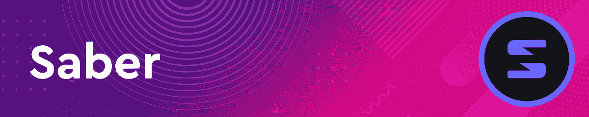](https://web.archive.org/web/20220929113831/https://dappradar.com/solana/defi/saber)

作为 Solana 上领先的跨链稳定币交易所， [Saber](https://web.archive.org/web/20220929113831/https://dappradar.com/solana/defi/saber) 为稳定币(其价值与另一种资产挂钩的加密货币)提供流动性基础。它支持在索拉纳和其他区块链之间转移资产。做市商可以将资产存入流动性池，并从交易费、代币激励和自动化 DeFi 策略中获得被动收入。

## 索拉纳是德菲的新国王吗？

尽管以太坊拥有先发优势和长期统治地位，索拉纳已经开始威胁占据头把交椅。原因显而易见。Solana 每秒支持数万次交易的能力让以太坊的 13 次输出相形见绌。此外，索拉纳的天然气费也低得多。

无论未来会怎样，我们希望我们的 Solana DeFi 小指南已经帮助您熟悉了这个创新的区块链，这样您就可以开始充分利用它。

要了解 Solana、Ethereum 和 DeFi 的最新消息，请在 Twitter 上关注 DappRadar。你也可以加入 [DappRadar PRO](https://web.archive.org/web/20220929113831/https://dappradar.com/token/pro) 社区，从独家 [Discord](https://web.archive.org/web/20220929113831/https://discord.gg/4ybbssrHkm) 讨论和最新的 DeFi 统计中受益。

 NewsletterUnsubscribe at any time. [T&Cs](https://web.archive.org/web/20220929113831/https://dappradar.com/terms) and [Privacy Policy](https://web.archive.org/web/20220929113831/https://dappradar.com/privacy-policy)