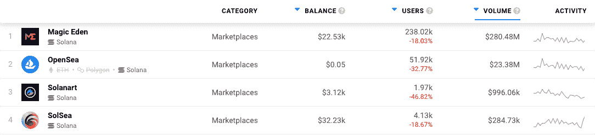
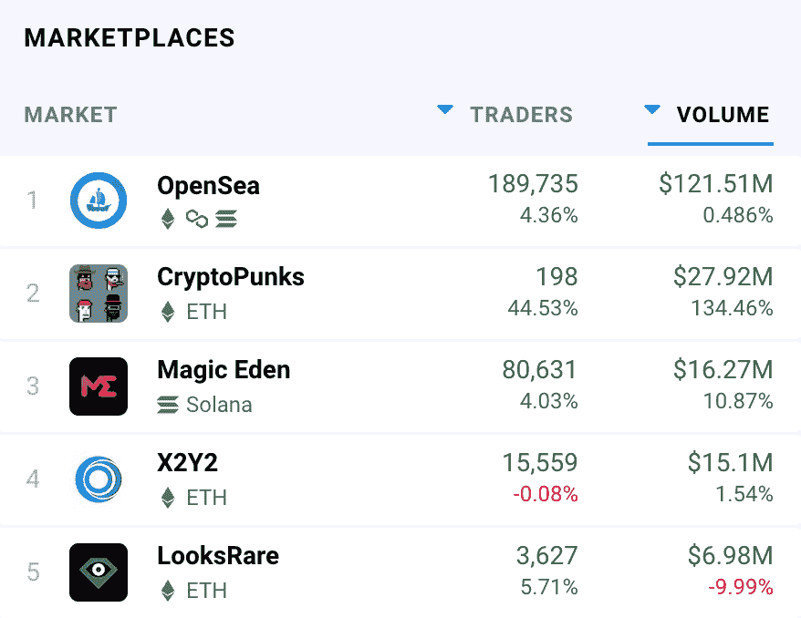
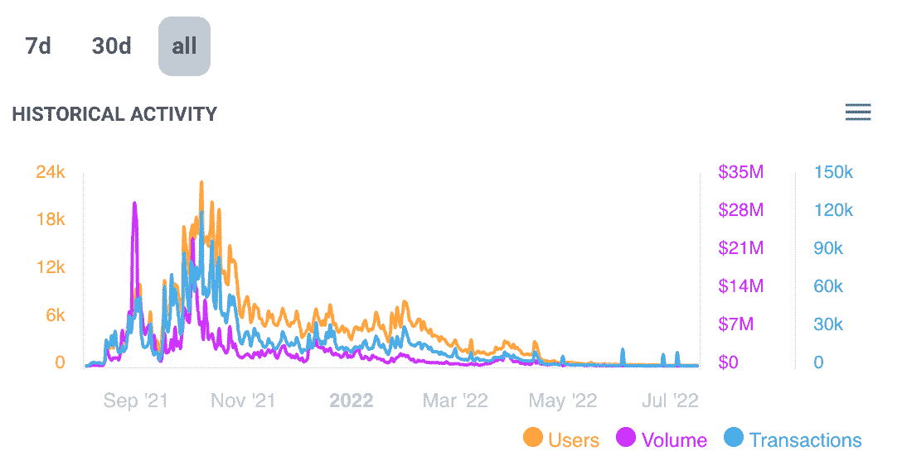

# 如何交易索拉纳 NFTs

> 原文：<https://web.archive.org/web/https://dappradar.com/blog/how-to-trade-solana-nfts>

## 索拉纳上的 NFT 和找到它们的最佳地点

***本文是上一篇*** [***的后续，上一篇 DappRadar 写于 2021 年 10 月 26 日***](https://web.archive.org/web/20220812003150/https://dappradar.com/blog/nft-marketplaces-on-solana-a-deeper-look/) ***。***

自从 2020 年 3 月成立以来，索拉纳区块链已经成长为 web3 世界中最大、最重要的网络之一。人们现在每天买卖****价值数百万美元的索拉纳 NFT。既然区块链已经确保了自己的顶级席位，人们正在询问他们如何才能参与进来，以及他们可以在哪里进行自己的交易。****

 ****总结**

*   ***索拉纳*** [***目前以 27.7 亿美元的总价值锁定***](https://web.archive.org/web/20220812003150/https://defillama.com/chains) ***位居第五。这背后是*** [***以太坊***](https://web.archive.org/web/20220812003150/https://dappradar.com/rankings/protocol/ethereum)*[***币安智能链条***](https://web.archive.org/web/20220812003150/https://dappradar.com/rankings/protocol/binance-smart-chain)*[***Tron***](https://web.archive.org/web/20220812003150/https://dappradar.com/rankings/protocol/tron)***和*** [***雪崩***](https://web.archive.org/web/20220812003150/https://dappradar.com/rankings/protocol/avalanche)**
*   **在过去的一年里，索拉纳 NFT 市场时好时坏。魔法伊甸园目前控制着这个领域，但这一切可能会在未来 12 个月内发生变化。**
*   **[***DappRadar 的 NFTs 终极指南***](https://web.archive.org/web/20220812003150/https://dappradar.com/blog/what-are-non-fungible-tokens-nfts) ***概述了你需要知道的关于交易、持有、交换和评估不可替代代币的一切。*****

 **DappRadar [是一个给用户很多东西](https://web.archive.org/web/20220812003150/https://dappradar.com/blog/things-you-can-do-with-dappradar)的工具。它可以帮助人们找到[最有价值的 NFT 收藏](https://web.archive.org/web/20220812003150/https://dappradar.com/hub/nft-explorer)。你可以找到哪些[NFT 刚刚卖到了最高价](https://web.archive.org/web/20220812003150/https://dappradar.com/nft/sales)。你甚至可以[将你的加密货币](https://web.archive.org/web/20220812003150/https://dappradar.com/token/staking)押在一条链上，然后[在另一条链上收获你的奖励](https://web.archive.org/web/20220812003150/https://www.youtube.com/watch?v=CTUaFIPgSTE)。

DappRadar 上另一个有用的工具是我们的[排名页面](https://web.archive.org/web/20220812003150/https://dappradar.com/rankings)。在这里，你可以在 40 多个区块链找到数以千计的 dapps。对于任何想在 T2 寻找最佳交易场所的人来说，这是一个好去处。

[DappRadar’s top four Solana marketplaces](https://web.archive.org/web/20220812003150/https://dappradar.com/rankings/protocol/solana/category/marketplaces)

正如我们在上面的列表中看到的，有四个 NFT 市场，用户在那里交易大量的索拉纳艺术品、收藏品和物品。每一种都提供不同级别的性能和用户体验。由于这个原因，一些人比其他人得到更多的顾客。

## 魔幻伊甸园

魔法伊甸园是在索拉纳建造的第一大交易网站。在每个指标和每个 NFT 项目中，它都是最大和最先进的。在这样一个竞争激烈的行业中做到最好令人印象深刻；2021 年 9 月推出的神奇伊甸园让这一成就更加引人注目。

在过去的 30 天里，市场上的交易员执行了超过 180 万笔交易。这相当于价值 2.8048 亿美元的非金融资产被买卖。

像互联网上大多数最好的产品一样，Magic Eden 对新用户来说很直观，也很容易交易。如果你确实觉得买卖有点棘手，DappRadar 已经[开发了一个方便的用户指南](https://web.archive.org/web/20220812003150/https://dappradar.com/blog/how-to-buy-and-sell-nfts-on-magic-eden)。

[启动魔法伊甸园 dapp](https://web.archive.org/web/20220812003150/https://dappradar.com/deeplink/10734)

## OpenSea

主要以以太坊 NFT 交易而闻名的 OpenSea T1 早在 2022 年 4 月就为 Solana T3 推出了一个 T2 市场。过去一周，用户日均交易量为 208，571 美元。

OpenSea 也为在多边形网和 T2 网上交易的人提供服务。尽管在索拉纳 NFT 交易方面，它可能远远落后于神奇伊甸园，但它是整个区块链最大的市场。

[DappRadar’s 7-day rankings for NFT marketplace trading volumes](https://web.archive.org/web/20220812003150/https://dappradar.com/nft/marketplaces)

上图显示了 NFT 过去七天的销售额。尽管人们在谈论加密冬天和不可替代代币的死亡，但价值 1.2151 亿美元的销售额似乎是一个相对健康的状况。

DappRadar 有一篇比较评论，概述了在 Magic Eden 和 OpenSea 上交易 Solana NFTs 的区别。

[启动 OpenSea dapp](https://web.archive.org/web/20220812003150/https://dappradar.com/deeplink/13)

## 索拉哈特

在 DappRadar 的索拉纳 NFT 市场排行榜上，第三名是 Solanart。该平台于 2020 年 3 月推出，是区块链的首要交易市场。

去年 10 月，该公司的周交易量达到 3000 万美元左右。从那以后，魔法伊甸园已经强行进入它的领地，偷走了它的大部分用户和他们的 SOL。现在，Solanart 的月交易额略低于 100 万美元。

[All-time activity on Solanart](https://web.archive.org/web/20220812003150/https://dappradar.com/solana/marketplaces/solanart)

我们或许可以将这部分归因于普遍的熊市下跌。但是，不幸的是，这个平台已经失去了市场份额，需要打一场硬仗来重新获得它。

[发布 solar art dapp](https://web.archive.org/web/20220812003150/https://dappradar.com/deeplink/10198)

## 索尔斯卡

SolSea 在我们的列表中排名第四，尽管它的月用户比 Solanart 多。这是因为这些用户交易的平均价值远低于其竞争对手。

该平台于 2021 年 8 月推出，这使得它比 Solanart 早了一个月。SolSea 是 Solana 上第一个集成铸币的 NFT 市场。它还为网络上的 NFT 引入了嵌入式许可证和稀有度排名。

在许多方面，它试图模仿与其同名的 OpenSea 的成功。开始时似乎进展顺利。去年 10 月，它在一周内吸引了超过 11，000 名访客，他们完成了超过 58，000 笔交易。

不幸的是，它无法保持其市场份额。这可能是其高于平均水平的费用和笨重的外观设计的结果。正如我们在《神奇伊甸园》中提到的，易用性和流畅的 UX 通常是一个成功的互联网产品的关键。

[启动 SolSea dapp](https://web.archive.org/web/20220812003150/https://dappradar.com/deeplink/10314)

 NewsletterUnsubscribe at any time. [T&Cs](https://web.archive.org/web/20220812003150/https://dappradar.com/terms) and [Privacy Policy](https://web.archive.org/web/20220812003150/https://dappradar.com/privacy-policy)****