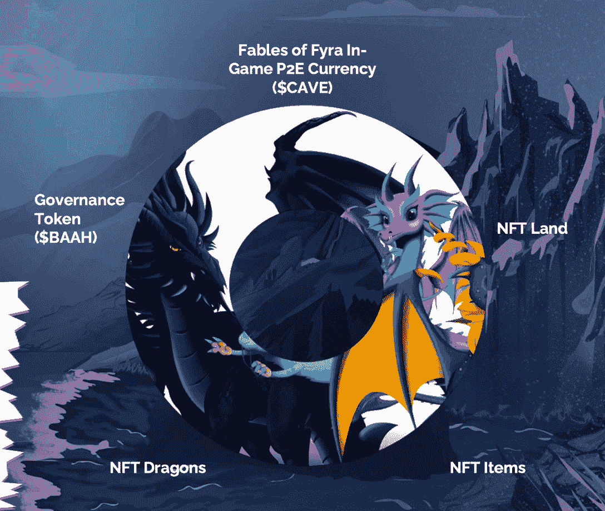

# 如何训练你的龙阅读费耶拉的寓言

> 原文：<https://web.archive.org/web/https://dappradar.com/blog/how-to-train-your-dragon-for-reward-reaping-with-fable-of-fyra>

## 欠银钥匙地将让玩家在觉醒的世界中领先一步

在“先玩后赚”的角色扮演生态系统游戏中，Fyra 游戏玩家使用他们的 NFT 龙来赚取奖励并进行史诗般的冒险。在这个生态系统的基础上，你会发现 Fyra 的旗舰游戏《觉醒，寓言》,它具有可爱的龙角色，精心设计的循环经济，以及迷人的开放世界环境。

**总结**

*   **游戏将在** [**多边形网络**](https://web.archive.org/web/20221127154653/https://dappradar.com/rankings/protocol/polygon) **上展开，但最终将来到** [**火神锻造的**](https://web.archive.org/web/20221127154653/https://dappradar.com/rankings/protocol/vulcanforged) **极乐世界。**
*   觉醒的生态系统有五个支柱:统治令牌 BAAH、P2E 货币洞穴、龙 NFT、土地 NFT 和游戏物品 NFT。
*   玩家可以在****或者** [**火神锻造市场**](https://web.archive.org/web/20221127154653/https://dappradar.com/vulcanforged/marketplaces/vulcan-market) **上交易游戏内的 NFT。****
*   ****关键的银色领地是帮助提升玩家收益的非战斗领地，目前售价为 495******。******

 ****区块链正在重新定义许多行业的范式，但或许它对游戏行业最具颠覆性。根据 Q1 2022 年的 DappRadar BGA 报告，区块链游戏公司在 3 月份有 122 万个独立的活跃钱包(UAW)与智能合约互动，占该行业活动的 52%。值得注意的是，与去年相比，这一数字增长了 2000%。

区块链博彩业的崛起似乎势不可挡。利用 NFT 和区块链的技术，次世代游戏可以授予用户对游戏内资产的所有权，并实现参与经济。Fyra 游戏生态系统的寓言拥有这样的属性，同时还允许用户将他们的数字资产迁移到不同的游戏和生态系统。因此，这创造了一个更加互联的体验。

## Fyra 的寓言是什么？

Fyra 的寓言是一个幻想的开放世界 RPG 生态系统，使用 NFTs 给玩家物品所有权。此外，游戏玩家会自动参与到游戏赚钱的经济中，在这种经济中，需求会影响公开市场的定价。Fyra 的寓言也是更广泛的 Fyra Oyer 生态系统的一部分，这是所有神秘故事情节展开的虚拟世界。这是一个让 Fyra 游戏的所有神话都能茁壮成长的地方。

[https://web.archive.org/web/20221127154653if_/https://www.youtube.com/embed/krh2OsGeQOs?feature=oembed](https://web.archive.org/web/20221127154653if_/https://www.youtube.com/embed/krh2OsGeQOs?feature=oembed)

随着《觉醒》, Fyra 生态系统的寓言有了它的旗舰标题，它以身临其境的故事情节和开放的世界环境为特色。在游戏中，玩家可以通过冒险来学习、建造、耕种、制作、探索和赚钱。

觉醒探险和生态系统由五大支柱组成:

1.  咩——治理令牌
2.  CAVE——即玩即赚的实用令牌
3.  龙 NFTs
4.  土地 NFTs
5.  游戏物品 NFTs

如果玩家想要掌握游戏并获得丰厚的利益，他们需要战略性地充分利用这些支柱。

## 觉醒游戏解释

管地养龙是《觉醒》的核心玩法。玩家可以使用免费的龙或者 NFT 龙来开始游戏。此外，玩家可以使用免费的土地来享受游戏。然而，要参与游戏的 P2E 方面，玩家必须从公海或瓦肯锻造市场获得 NFT 地。值得注意的是，只有 NFT 龙可以帮助玩家增加洞穴，P2E 令牌的收入。所以玩家需要一片土地和一只 NFT 龙来充分利用觉醒的游戏赚钱能力。

在《觉醒》中，玩家可以随心所欲地探索游戏，多条路径通向不同的结果。例如，一些玩家可能专注于手工制作、饲养动物或训练厨师烹饪美味有益的菜肴。其他人可能对故事更感兴趣，并希望追求多条主线。

这些游戏中的活动对玩家提高技能起着至关重要的作用。为什么这很重要？答案是，在各种技能领域获得足够经验的玩家可以制造高级 NFT 物品。这些物品可以使其他玩家受益，因此在市场上变得有价值。

## 令牌组学和 P2E 力学

双令牌经济促进了觉醒的游戏内生态系统，确保了游戏的可持续性和可玩性。玩家将不得不处理 BAAH 和洞穴令牌。

BAAH 是一个跨特许经营和长期存在的公用事业以及治理令牌，将在觉醒和未来的游戏中为持有者提供多种好处。BAAH 的持有者可以把它们和 CAVE 一起立桩来平整 NFT 的土地。因此，升级的土地将增加玩家的收入能力，并解锁进入奖金池。此外，特定的 BAAH 级别和持有期可以授予持有人在 Fyra Oyer 生态系统中的独特角色，从而带来更多特权和福利。

如前所述，要赢得 P2E 力学的命脉——洞穴，玩家必须拥有至少一片 NFT 土地。除此之外，用户必须玩并参与游戏。这使得玩家可以参与每日奖励池，并获得他们的“份额”。

别忘了提一下，增加你的‘股份’有很多方法。例如，拥有更多的 NFT 土地，分配 NFT 龙居住在 NFT 土地上，以及获得土地增强 NFT 可以帮助玩家实现这一目标。

最后但同样重要的是，生态系统中的所有 NFT 不仅可以提高玩家的收入能力，而且他们还可以在二级市场上交易这些产品，以潜在地获得一些利润。

## 获得银钥匙土地造币厂的领先优势

拥有 NFT 土地可以让玩家获得在 Fyra 寓言中开始 P2E 之旅的通行证。然而，持有银钥匙土地更好！《银钥匙》是一款限量版 NFT，为玩家提供探索费拉约耶特殊地区的特权。更重要的是，他们有独特的好处，如增强玩家的收入能力，并获得 BAAH 预售的白名单。只有 1000 个银钥地块可用。在卖完之前标记日期。

银钥匙造币快照:

*   价格:495 MATIC(或同等的 ETH，USDT，PYR)
*   白名单竞赛:2012 年 5 月 10 日–2012 年 5 月 15 日(太平洋标准时间午夜)
*   公开发布预售:2012 年 5 月 18 日
*   更多关于银钥匙造币厂的细节

《Fyra 的寓言》背后的团队与 DappRadar 一起度过了一个激动人心的 AMA。查看下面的视频记录:

[https://web.archive.org/web/20221127154653if_/https://www.youtube.com/embed/D_GKf7Umtew?feature=oembed](https://web.archive.org/web/20221127154653if_/https://www.youtube.com/embed/D_GKf7Umtew?feature=oembed)

了解更多关于 Fyra 的寓言:

[网站](https://web.archive.org/web/20221127154653/https://www.fablesoffyra.com/)

[推特](https://web.archive.org/web/20221127154653/https://twitter.com/Fables_of_Fyra)

[不和](https://web.archive.org/web/20221127154653/https://discord.com/channels/786093440001507378/786093928822734859)

[中等](https://web.archive.org/web/20221127154653/https://fablesoffyra.medium.com/)

**免责声明** —这是一篇赞助文章。DappRadar 不认可本页面上的任何内容或产品。DappRadar 旨在提供准确的信息，但读者应该在采取行动之前总是自己做研究。DappRadar 的文章不能被认为是投资建议。****