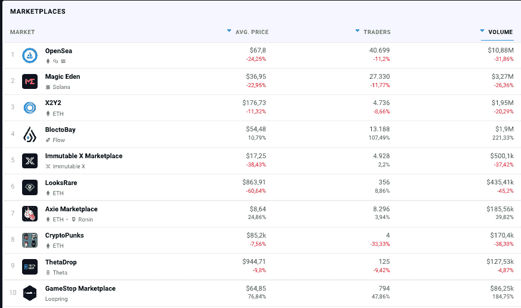

# 如何使用 GameStop NFT 市场？

> 原文：<https://web.archive.org/web/https://dappradar.com/blog/how-to-use-gamestop-nft-marketplace>

## 开始使用 GameStop NFT 市场所需的所有信息

**[**GameStop NFT 市场**](https://web.archive.org/web/20220925233452/https://dappradar.com/other/marketplaces/gamestop-nft) **使游戏玩家、创作者和充满热情的 NFT 收藏家能够购买、出售和交易数字收藏品。社区成员可以使用光滑的用户界面进行 NFT 交易，确保最佳的用户体验。但是它实际上是如何工作的呢？让我们深入研究一下。****

 **我们最近宣布将 GameStop NFT 市场整合到 DappRadar。本快速指南将带您浏览 GameStop 平台，并向您展示如何使用它。

[<picture></picture>](https://web.archive.org/web/20220925233452/https://dappradar.com/other/marketplaces/gamestop-nft)

## 什么是 GameStop NFT 市场？

[GameStop NFT 市场](https://web.archive.org/web/20220925233452/https://dappradar.com/other/marketplaces/gamestop-nft)是一个基于以太坊第二层的非托管市场，用户可以真正拥有自己的数字资产。

该市场于今年 7 月 11 日推出，利用了 NFT 的增长热潮，并与 OpenSea 等更成熟的市场竞争。

该平台提供了比其对手 OpenSea 更低的天然气费用，并为用户提供了一个更容易的转换漏斗，以建立一个由 Loopring 技术支持的钱包。

Loopring 是一个 zkRollup 第 2 层解决方案，它可以显著降低气体消耗，同时以分散的形式提供高级别的安全性。

*   [阅读更多关于第 2 层解决方案的信息](https://web.archive.org/web/20220925233452/https://dappradar.com/blog/what-are-layer-1-and-layer-2-blockchains)

[https://web.archive.org/web/20220925233452if_/https://www.youtube.com/embed/ZfkPFpUfbYU?feature=oembed](https://web.archive.org/web/20220925233452if_/https://www.youtube.com/embed/ZfkPFpUfbYU?feature=oembed)

## 你如何利用 NFT 市场？

如果你想在 GameStop NFT 市场购买很酷的艺术品，你可以直接联系卖家购买他们的作品。但在此之前，你需要遵循一些基本步骤。

[<picture></picture>](https://web.archive.org/web/20220925233452/https://dappradar.com/nft/marketplaces)

1.  **创建钱包**

在这里，您可以选择 GameStop 钱包、MetaMask 等浏览器钱包，或者通过 universal WalletConnect 技术选择任何其他钱包。

在使用 GameStop 钱包的情况下，你还必须将它作为已安装的扩展添加到 Chrome 中。

您还可以将您现有的钱包连接到 DappRadar，并通过其单独的 dapp 页面访问 GameStop 市场。

[https://web.archive.org/web/20220925233452if_/https://www.youtube.com/embed/woduDyWuKHY?feature=oembed](https://web.archive.org/web/20220925233452if_/https://www.youtube.com/embed/woduDyWuKHY?feature=oembed)

2.  **使用以太坊为钱包充值**

在这里，您可以遵循两条路径。第一种方法是从任何一个被认可的支付提供商那里直接购买 ETH 到你的链接钱包里。这样，ETH 将在第二层存入你的钱包，允许你购买 NFTs。是的，就是这么简单！

你可以遵循的另一条途径是从以太坊第一层的现有钱包中转移资金到连接到 GameStop NFT Marketpkace 的第二层账户。这样，当你在平台上购买 NFT 时，被压制到第 2 层的 ETH 将会平衡可用。

需要用其他令牌换 ETH？[使用我们的代币互换](https://web.archive.org/web/20220925233452/https://dappradar.com/hub/swap/eth)

[https://web.archive.org/web/20220925233452if_/https://www.youtube.com/embed/ZHiHfYvNjJU?feature=oembed](https://web.archive.org/web/20220925233452if_/https://www.youtube.com/embed/ZHiHfYvNjJU?feature=oembed)

3.  **装上你的 NFT**

一旦你选择了你理想的 NFT，点击“购买”按钮，从 NFT 的详细信息页面。确认交易，并获得你能找到的最热门的 NFT。

## 用 DappRadar 跟踪 NFT 市场

GameStop NFT 收藏的交易活动反映在我们的 [NFT 市场排名](https://web.archive.org/web/20220925233452/https://dappradar.com/nft/marketplaces)中，您可以使用 NFT 浏览器发现有前景的收藏，最后，您可以使用 DappRadar [投资组合跟踪器](https://web.archive.org/web/20220925233452/https://dappradar.com/hub/wallet/)跟踪活动并跟踪智能资金。

## 随身携带您的 Web3 之旅

有了 DappRadar 移动应用程序，再也不要错过 Web3。查看最受欢迎的 dapps 的性能，并关注您投资组合中的 NFT。您在 DappRadar 上的帐户与我们的移动应用程序同步，很快您就可以选择实时接收提醒！

[<picture></picture>](https://web.archive.org/web/20220925233452/https://play.google.com/store/apps/details?id=com.portfolio.dappradar)[Download for Android](https://web.archive.org/web/20220925233452/https://play.google.com/store/apps/details?id=com.portfolio.dappradar)**