# 如何评价志那都红豆？

> 原文：<https://web.archive.org/web/https://dappradar.com/blog/how-to-value-azuki-nft-collection>

## 志那都红豆·NFT 收藏的达普拉达估价报告

志那都红豆于 2022 年 1 月通过 1 ETH 的荷兰拍卖推出，迅速成为交易量最大的 NFT 藏品之一。在启动后的短短一个月内，它成为第十大交易量最大的 NFT 项目，在写作时产生了超过 105，000 ETH(3 亿美元)。

志那都红豆由 10，000 个动漫风格的 NFT 组成，允许进入社区拥有的虚拟空间花园。该系列将自己描绘成元宇宙的一个品牌，促进了该领域的媒体和身份认同。该项目如此流行，以至于围绕这个 NFT 利基市场掀起了一股炒作浪潮。

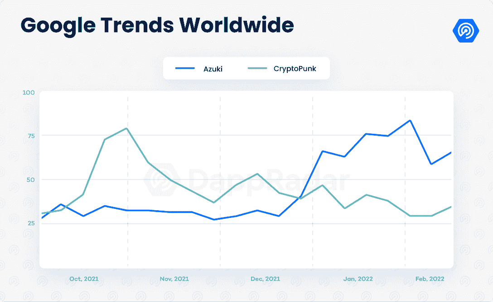

Source: [Google Trends](https://web.archive.org/web/20230112180717/https://trends.google.com/trends/explore?q=azuki,cryptopunk)

这份报告是评估志那都红豆收藏的指南。评估任何 NFT 藏品的过程都需要考虑几个因素。首先，我们对每件作品进行单独分析，关注其独特性和稀有性。由于艺术本身仍然是主观的，其他因素，包括效用和社会指标，也被用作评估项目强度的因素。

## 目录

*   [一个月内交易超过 3 亿美元](https://web.archive.org/web/20230112180717/https://dappradar.com/blog/how-to-value-azuki-nft-collection/#million)
*   [特质分析与 313 金小月](https://web.archive.org/web/20230112180717/https://dappradar.com/blog/how-to-value-azuki-nft-collection/#trait)
*   [元宇宙的一个品牌](https://web.archive.org/web/20230112180717/https://dappradar.com/blog/how-to-value-azuki-nft-collection/#brand)
*   [花园中的社区](https://web.archive.org/web/20230112180717/https://dappradar.com/blog/how-to-value-azuki-nft-collection/#community)
*   [结论](https://web.archive.org/web/20230112180717/https://dappradar.com/blog/how-to-value-azuki-nft-collection/#conclusion)

## 一个月内超过 3 亿美元的交易

志那都红豆是由 Chiru Labs 和两位公认的艺术家——Arnold Tsang(又名 steamboy33，Overwatch 的前艺术总监)和 Njoo——创建的，Chiru Labs 是一个结合了坚实的加密和技术背景的团队。代表该项目的红豆需求量很大，受日本动画系列《星际牛仔》启发的艺术成为该领域最受赞赏的艺术之一。这两个因素都是将该项目的价值提升到一个新水平的关键。

自推出以来的 40 天里，志那都红豆创造了超过 3 亿美元的交易量，成为整个 NFT 地区交易量第十大的收藏，同时超过了 Doodles、Cool Cats 和 CyberKongz 等相关项目。该系列的底价比原价上涨了至少 1000%，并在 10 ETH(ξ)以上盘整。

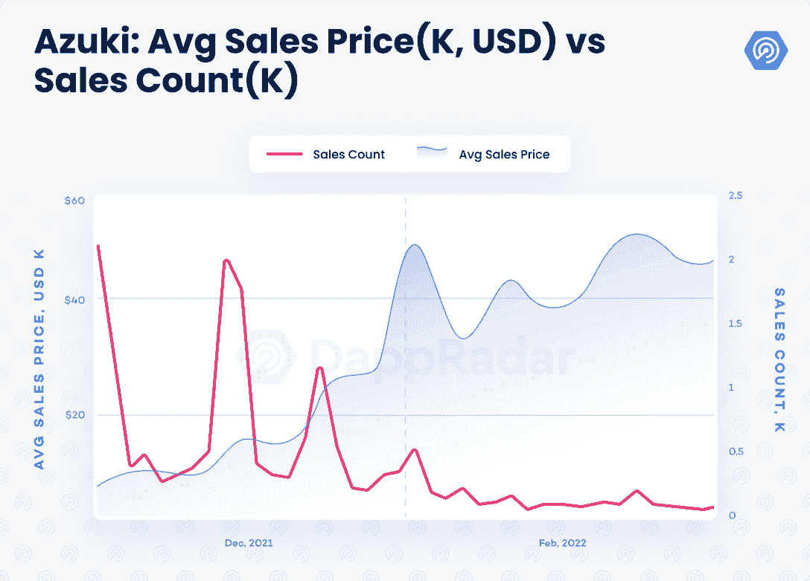

此外，志那都红豆是一个分布良好的集合。它拥有 5，422 个独特的所有者，并吸引了超过 10，900 个独特的交易者。整个收藏中只有 14%在 OpenSea 上列出。这些指标证实了项目正在享受的高需求。

志那都红豆的一个仍被忽视的方面是 ERC-721A 合同的实施。在有记载的历史上，ERC 标准第一次允许在一次交易中铸造多种物品，从而通过降低汽油费而使社区受益。该团队开源了智能合同标准，展示了它对社区的亲和力。

接下来，我们分析赋予志那都红豆独特风格的特质。

## 特质分析与 313 金小樽

每幅 NFT 作品的独特性或许是评估一件藏品价值的最重要因素。因此，有必要分析使这一系列与众不同的个人特征。几乎 12，000 个销售进行了以下特征分析。

志那都红豆由 12 个特征和 450 多个独特的属性组成，每个 NFT 属于四种类型之一。因此，类型特征与资产价格有很强的相关性。烈酒是志那都红豆最稀有的品种**(稀有度 0.97%)，平均售价为 60.6ξ(16.5 万美元)。其中只有 21 个在 OpenSea 上市，底价 80ξ。**

蓝色 **(4.44%)** 和红色 **(4.41%)** 品种的平均交易价格大幅下降，尽管仍然很少。人型 **(90.18%)** 是该系列中最常见的，因此最容易获得，平均售价为 7.86ξ(22，000 美元)。

除了类型，一组属性也强烈影响这些 NFT 的价格。这些是 313 小月遇到的黄金道具，脖子，衣服，副手属性。任何具有黄金属性的志那都红豆平均售价为 28.1ξ(7.6 万美元)，而没有黄金属性的 NFT 售价略高于 8ξ(2.4 万美元)。

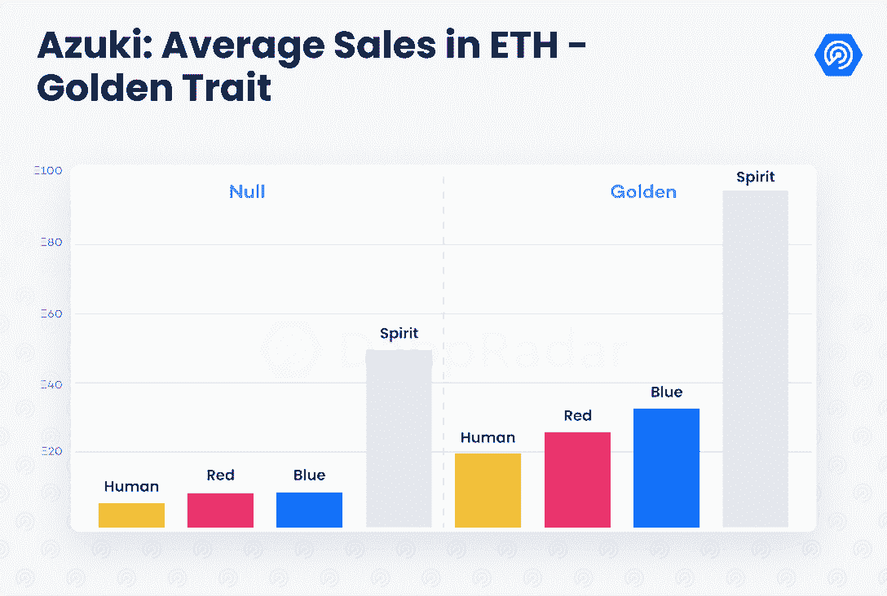

这种特质对每一款志那都红豆的价格也有很大的发言权。萤火虫 **(0.88%)** 和火 **(0.58%)** 特价最估价值。这两种类型的志那都红豆平均售价约为 30ξ(超过 80，000 美元)。虽然樱花 **(0.8%)** 、火狐 **(0.86%)** 、烟雾 **(0.81%)** 的平均售价位于 15ξ(4 万美元)大关，但它们的平均售价高于无特色的志那都红豆 NFTs**(93.71%)**，后者的平均售价为 7.92ξ(2.3 万美元)。

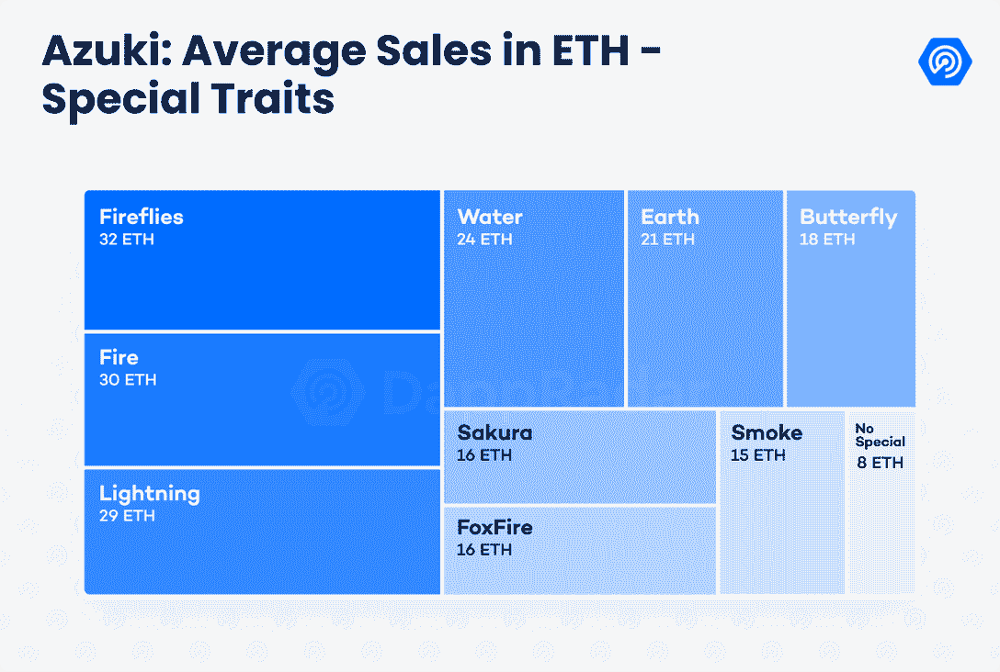

副手和服装属性也与价格有明显的相关性。然而，在副手的情况下，与价格的相互依赖主要是由于 19 个黄金副手属性，其中 9 个属性的平均销售价格高于 25ξ。水球 **(0.61%)** 是唯一一个没有黄金特质的副手，售价超过 20ξ。

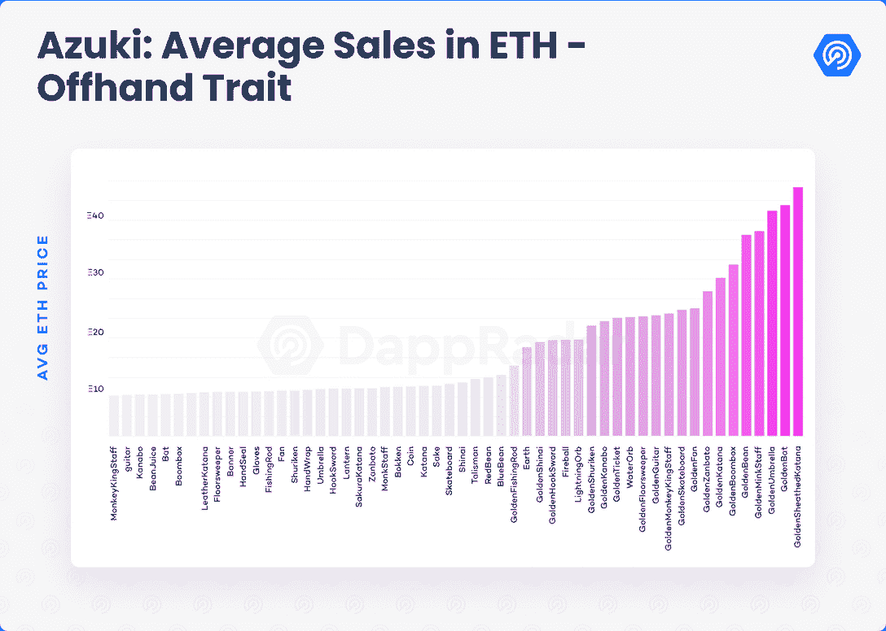

从 98 件衣服的属性来看，这四件金色衣服直接影响了 NFT 的价格。这些金色的 Kigurumis 属于最稀有的属性类型，其中猫 **(0.05%)** 最为稀有。无衣小月 **(0.05%)** 也是该系列最贵的单品之一，均价 78.66ξ(20.8 万美元)。

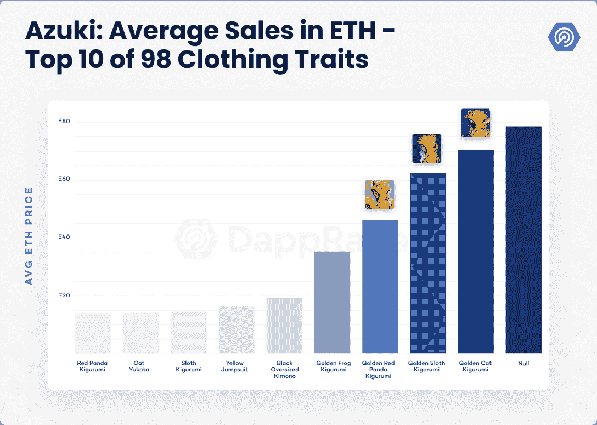

毛发特征遵循相似的模式。没有头发的小金人 **(0.08%)** 或者那些特定于一种精神类型的头发设计胜过其他人。没有头发的小月平均售价为 30.69ξ(8.2 万美元)，而灵毛的售价分别在 42.7ξ(11.6 万美元)和 76.5ξ(21 万美元)之间。火 **(0.22%)** 、水 **(0.21%)** 毛发净价 29ξ(7.7 万美元)。其余头发属性卖 3.2ξ(9000 美元)到 15.2ξ(4 万美元)之间。

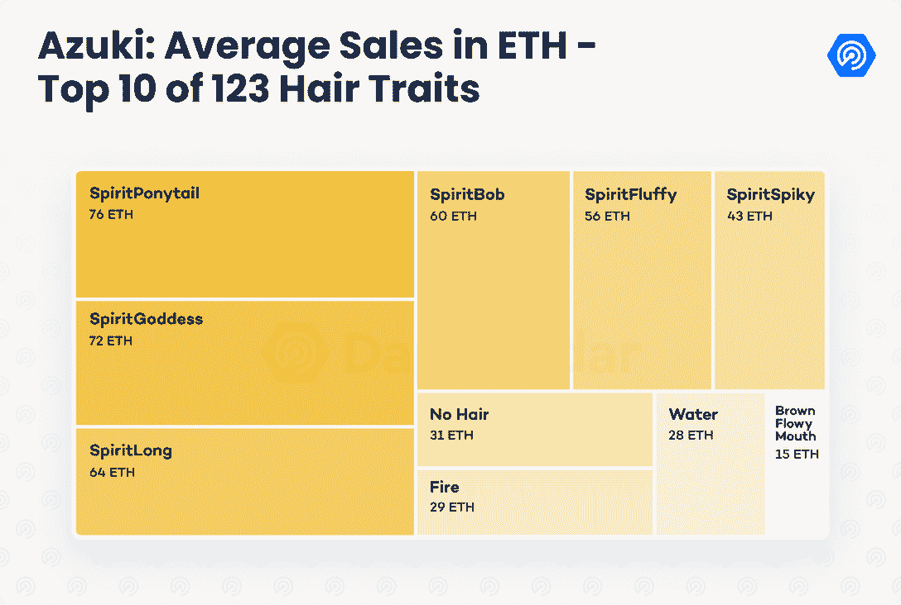

销售价格和志那都红豆的其他特征之间没有明显的相关性。但是，特定的属性会影响价格。红豆 **(0.4%)** ，例如**，**是与这个品牌的起源相关的穗部性状，平均净收益 27.2ξ(7.5 万美元)。其余穗部性状售价在 7.7ξ(2.2 万美元)至 15.3ξ(4.1 万美元)之间。

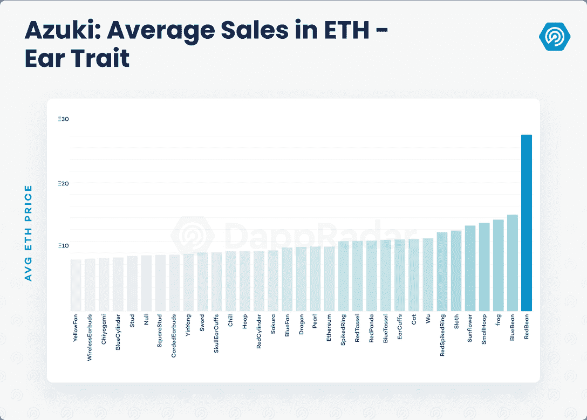

金色耳机 **(0.35%)** 的表现远远超过其他颈部属性，平均售价几乎为 40ξ(11 万美元)。相比之下，其余颈部属性的平均交易价格介于 7.65ξ(22，000 美元)和 16ξ(44，000 美元)之间。

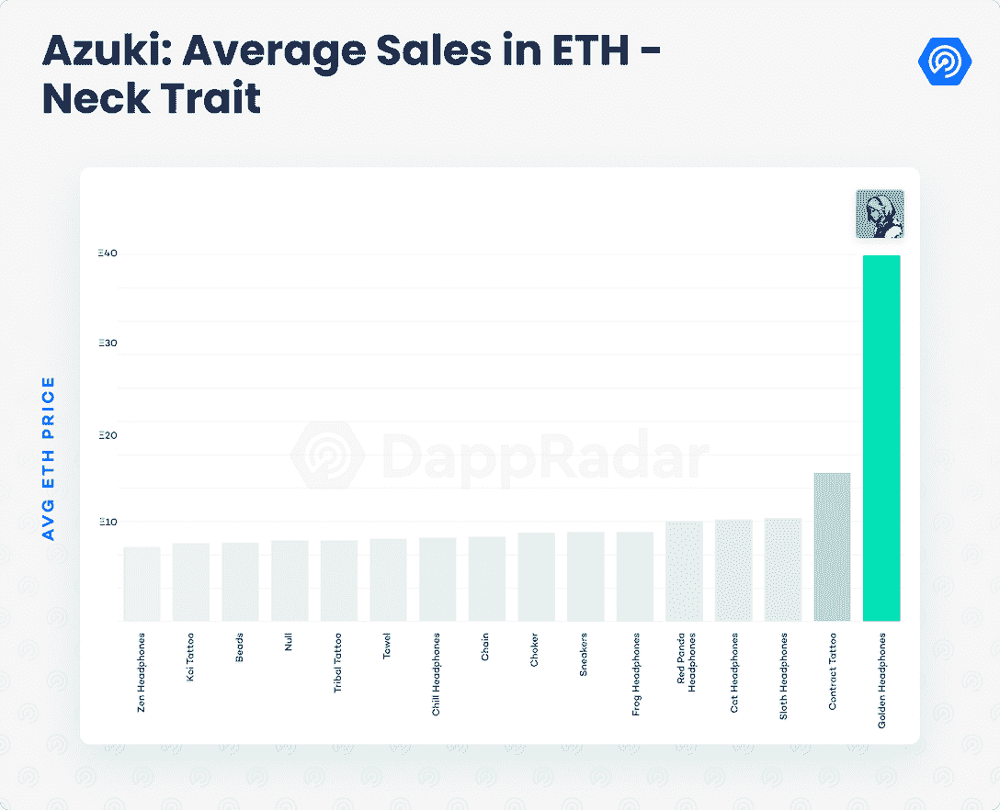

火焰 **(0.57%)** 、闪电 **(0.46%)** 、发光 **(0.78%)** 眼睛似乎也从其他眼睛属性中脱颖而出。这三种类型的眼睛平均售价超过 18.4ξ(5 万美元)，而其他眼睛特征的价格在 6.9ξ(2 万美元)至 12.4ξ(3.4 万美元)之间。

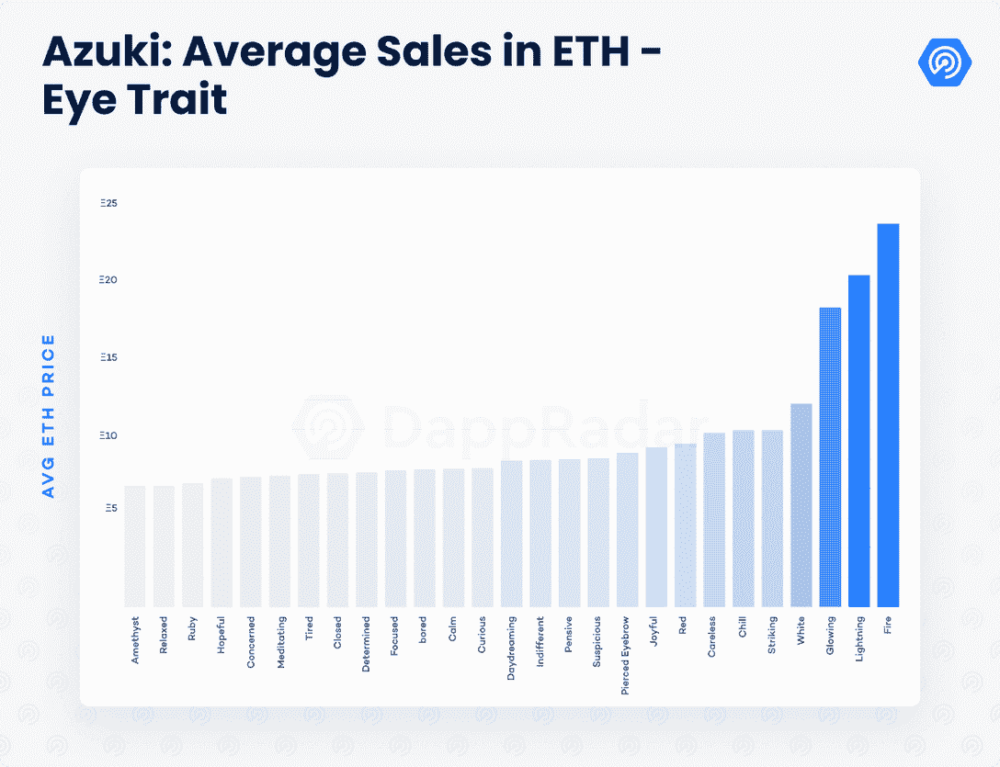

背景、嘴部、头饰和面部特征与志那都红豆的价格没有明显的相关性。

## 元宇宙的一个品牌

藏羚羊实验室已经表明了他们对志那都红豆的意图:在社区的帮助下成为一个元宇宙品牌。这种精神给了志那都红豆一个坚实的基础。在区块链工业中，各种元宇宙本土品牌已经崭露头角。想想幼虫实验室和他们的 CryptoPunks，Autoglyphs 和 Meebits 系列，还有宇迦实验室和无聊猿游艇俱乐部。在 CloneX 系列发布后，耐克收购了 NFT 时装公司 RTFKT，这不是没有原因的。这些元宇宙公司集流行文化、时尚和收藏品于一身。

Azuki’s mindmap; source: [Azuki](https://web.archive.org/web/20230112180717/https://www.azuki.com/mindmap)

在现实生活中，志那都红豆的效用将以街头服饰、收藏品和独家活动的形式出现。此外，每个志那都红豆所有者拥有的用户拥有的知识产权提供了广泛的可能性，包括漫画，视频游戏，甚至音乐标签。除了时尚方面，这些都是元宇宙故事的重要元素。

## 花园中的社区

根据藏羚羊实验室的说法，这个花园是互联网的一个角落，艺术、社区和文化在这里融合创造了奇迹。这个数字空间是为志那都红豆社区构建的，旨在托管一个由他们的本地 BEAN 令牌管理的 DAO。

该系列的社交指标非常可靠。志那都红豆在 Twitter 上有近 20 万名粉丝，8 万名 Discord 成员。这两个平台都是活跃且高效运行的。该项目的 Discord 服务器主持各种主题的对话，并通过防止诈骗和机器人活动的机制来保护。

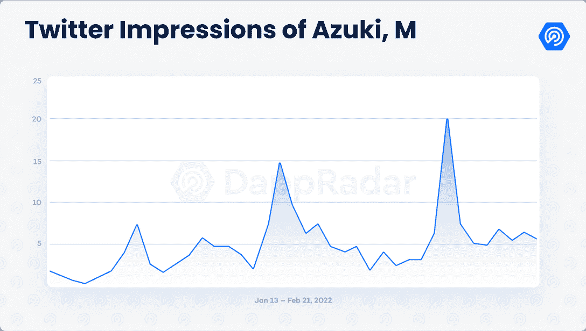

此外，志那都红豆是一个分布良好的收藏，拥有超过 5400 个不同的所有者。鲸因子也呈现出良好的分布，4.11%由前五大持有人持有(不考虑部署者合同)，6.8%由前 10 大钱包持有。

## 结论

志那都红豆很快成为 NFT 空间中最令人垂涎的收藏品之一，并被证明是一些人的明星收购。受动漫启发的滑板艺术风格引起了该项目的需求大幅飙升，在动漫 NFT 利基市场创造了一个迷你炒作周期。强大的财务指标与项目需求密切相关，并帮助底价巩固在 10ξ以上。

特征和稀有度的分布显示了艺术家在这些 NFT 中的细节水平，使得其中一些非常独特。志那都红豆 NFTs 的成交价超过 100ξ已成为常事，10 天前最高成交价为 204ξ或 59.6 万美元。

总的来说，这个项目似乎符合 NFT 成功项目的所有标准。尽管思维导图缺乏更多的具体信息，但感觉这个项目恰当地接近了元宇宙的叙述。时尚方面尤其诱人。虽然进入门槛已经很高，但这个花园已经准备好成为未来非物质文化遗产的相关空间。