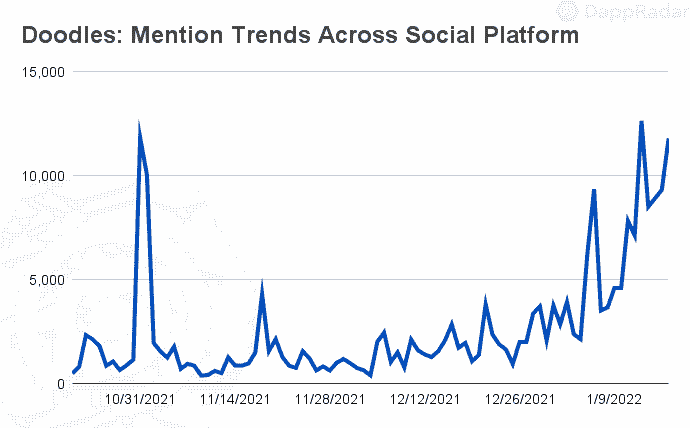
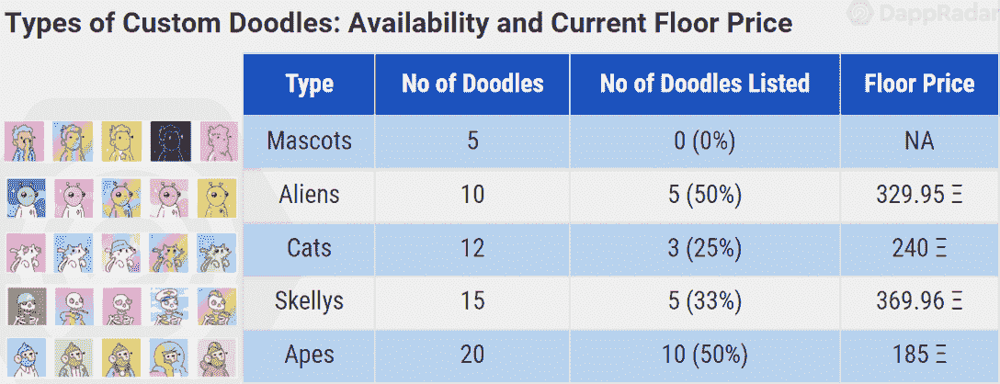
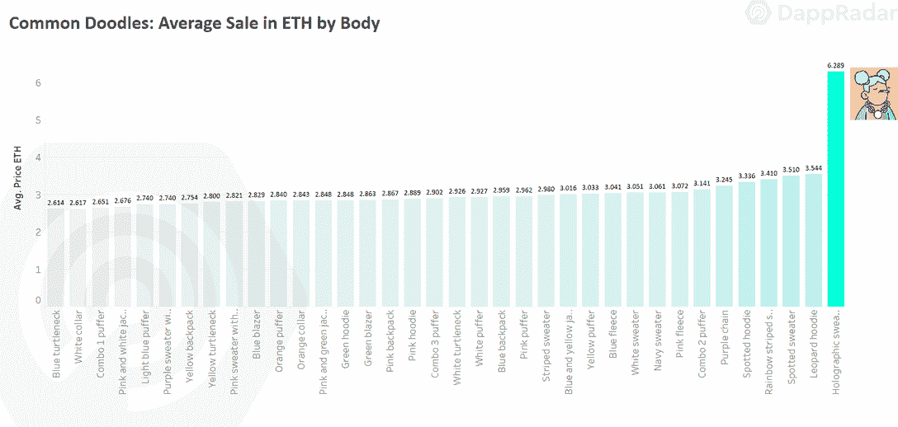
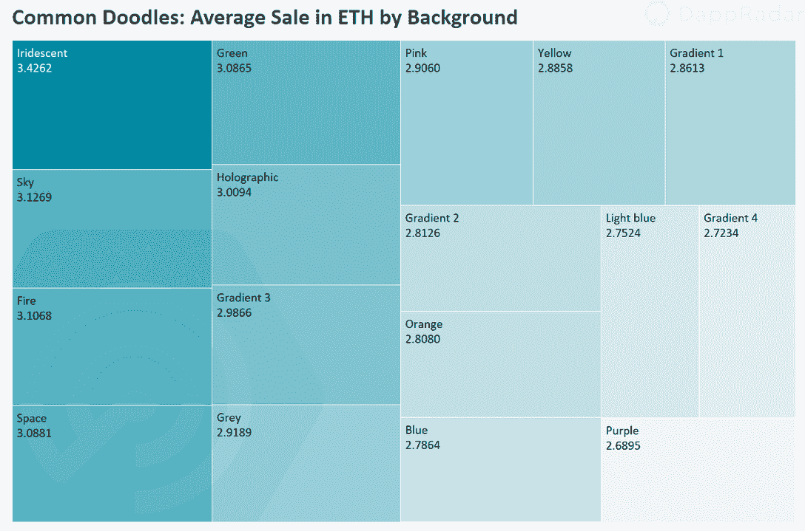
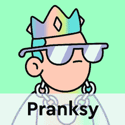
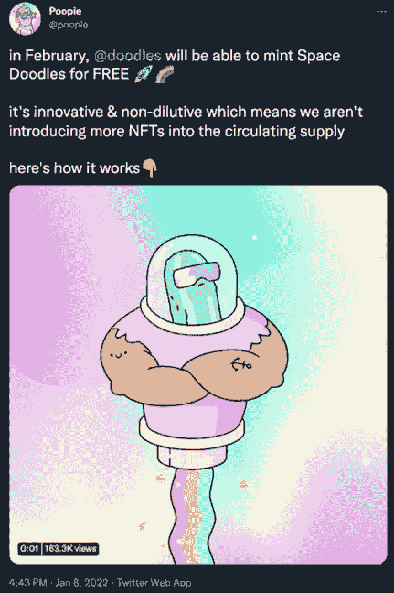

# 如何评价涂鸦 NFTs

> 原文：<https://web.archive.org/web/https://dappradar.com/blog/how-to-value-doodles-nfts>

## 杜德斯·NFT 系列的达普拉达估价报告

本报告旨在帮助您评估涂鸦 NFT 的价值，同时显示哪些元数据和特征是重要的。Doodles 于 2021 年 10 月推出，已成为 NFT 空间最受欢迎的收藏之一。名人和 NFT 有影响力的人如史蒂夫·青木、普朗西和加里·维都公开支持这个项目。

Doodles 是 10，000 个随机生成的头像 NFT 的集合。该系列依赖于用柔和而充满活力的痕迹代表的稀有特征的组合，赋予这些 NFT 独特的吸引力。这些涂鸦以 0.123 ETH(ξ)的价格向 mint 公开出售，并在几个小时内销售一空。

Source: [Meltwater](https://web.archive.org/web/20220929102701/https://www.meltwater.com/en)

这份报告为涂鸦系列的估价过程提供了指导。任何 NFT 收藏的估价过程都会带来几个修正因素。首先，我们对每件作品进行单独分析，关注其独特性和稀有性。尽管如此，由于艺术本身仍然是主观的，其他类型的元素被用作评估项目强度的因素。

## 目录

*   [涂鸦概述](https://web.archive.org/web/20220929102701/https://dappradar.com/blog/how-to-value-doodles-nfts/#overview)
*   [特征分析——定制、特殊和常见的涂鸦](https://web.archive.org/web/20220929102701/https://dappradar.com/blog/how-to-value-doodles-nfts/#traits)
*   [涂鸦社区](https://web.archive.org/web/20220929102701/https://dappradar.com/blog/how-to-value-doodles-nfts/#community)
*   [实用——空间涂鸦和更多](https://web.archive.org/web/20220929102701/https://dappradar.com/blog/how-to-value-doodles-nfts/#utility)
*   [结论](https://web.archive.org/web/20220929102701/https://dappradar.com/blog/how-to-value-doodles-nfts/#conclusion)

## 涂鸦概述

由埃文·凯斯特(又名郁金香、[、斯科特·马丁和](https://web.archive.org/web/20220929102701/https://twitter.com/burnttoast)[乔丹·卡斯楚(又名普皮)于 10 月在火热的 NFT 市场推出的系列创造。在 2021 年第四季度，该项目开始慢慢巩固为 NFT 顶级以太坊系列之一，其底价在去年年底轻松浮动在 3 ETH 以上。](https://web.archive.org/web/20220929102701/https://twitter.com/poopie_cat)

Doodles 团队将艺术技巧与 Web 3.0 经验和知识完美结合。Burnt Toast 是该项目的创作背后的艺术家，他是加拿大的插画师、设计师、动画师和壁画家，拥有令人印象深刻的专业背景，包括谷歌和 Snapchat 的项目。该系列包括 62 个由 Burnt Toast 亲自绘制的手绘设计。此外，他的动画技巧呈现了一个有趣的涂鸦场景。

Tulip 和 Poopie 在 NFT 和区块链都有丰富的经验，因为他们都参与了加拿大 Dapper Labs 组织的 CryptoKitties 和其他开发项目。

Source: [DappRadar](https://web.archive.org/web/20220929102701/https://dappradar.com/nft)

在撰写本文时，Doodles 是有史以来交易量第 23 大的 NFT 收藏，交易量超过 1.188 亿美元。该系列还在 23，500 个不同的交易者中获得了超过 12，000 个，反映了对该项目的需求。

涂鸦作品的底价飙升，目前在 11ξ上下浮动。但是是什么因素给了这些涂鸦如此高的价格呢？

## 特质分析

在对整个系列中的一件作品进行估价时，每件 NFT 作品的独特性可能是最重要的因素。因此，有必要分析使这一系列与众不同的个体特征。几乎 18，000 个销售进行了以下特征分析。

虽然涂鸦系列中没有等级，但具体的特征使一些作品非常独特，从 Burnt Toast 手绘的 62 个定制涂鸦开始。这些 NFT 不仅是收藏中最有价值的，也是整个空间中最有价值的。在撰写本文时，只有 23 件或 37%的定制涂鸦被挂牌出售，底价为 185ξ或 613，000 美元。

Source: [Cryptoslam](https://web.archive.org/web/20220929102701/https://www.cryptoslam.io/doodles)

有五种类型的自定义涂鸦。吉祥物嘟嘟是最稀有的。在这个创世纪系列中，将只有五个吉祥物涂鸦 **(0.05%稀有度)**。目前，没有吉祥物涂鸦上市出售。

Source: [GuyIncognito](https://web.archive.org/web/20220929102701/https://cdn-longterm.mee6.xyz/plugins/commands/images/870127360127696896/e7087ad6bb00bd7e07c574693a30b6697bba24239312fed09687f67ff8a84bd7.png)

外星人涂鸦是这个系列中第二稀有的 **(0.1%)** NFT，只有一半挂牌出售，底价 330ξ。猫 **(0.12%)** 、斯凯利斯 **(0.15%)** 、猿 **(0.2%)** 完成烤焦吐司的定制 NFTs。

除了 62 个自定义涂鸦之外，该团队还设计了 333 个具有独特头部和面部的特殊 NFT，就稀有程度而言，它们可以被视为第二层。其中，107 个被列为最低限额为 48ξ。

鲸鱼 **(0.04%)** 是最稀有的，甚至超过了这些特殊涂鸦中的吉祥物。这些涂鸦是最贵的，平均售价为 27.67ξ，其次是恐龙**(0.11%)**21.12ξ，气球**(0.31%)**16.81ξ。咖啡和鲜花是特别涂鸦中最容易买到的作品，平均售价分别为 5.32ξ和 6.04ξ。

Source: [Cryptoslam](https://web.archive.org/web/20220929102701/https://www.cryptoslam.io/doodles)

对于所有其他涂鸦来说，特定“类型”提供的稀有性和更高的价格之间没有明显的相关性。然而，至少有五个属性对涂鸦的价格产生了积极的影响。

首先，全息毛衣**(0.4%)–**一个平均得分为 6.29ξ的身体特征。其余身体性状在 3.54ξ-2.61ξ之间出售。

Source: [Cryptoslam](https://web.archive.org/web/20220929102701/https://www.cryptoslam.io/doodles)

从脸型特质来看，彩虹吐 **(1.18%)** 属性脱颖而出。平均价格为 6.87ξ，这张脸无疑是需求最多的，其次是流行的蓝色支票 **(1.23%)** ，平均销售价格为 4.91ξ。其余面部属性平均卖在 3.40ξ-2.44ξ之间。

Source: [Cryptoslam](https://web.archive.org/web/20220929102701/https://www.cryptoslam.io/doodles)

头发也有几个突出的属性。带全息角的皇冠 **(0.17%)** 是常见特征中最贵的，均价 10.76ξ，其次是全息皇冠 **(0.33%)** 平均售价 10.40ξ。

Source: [Cryptoslam](https://web.archive.org/web/20220929102701/https://www.cryptoslam.io/doodles)

其余的属性对涂鸦的价格没有任何明显的影响。例如，除了定制和特殊的 NFT，背景从 3.42ξ的彩虹色 **(4.36%)** 到紫色**(6.92%)**2.67ξ。

Source: [Cryptoslam](https://web.archive.org/web/20220929102701/https://www.cryptoslam.io/doodles)

头部特征的价格数据对于普通涂鸦来说也是紧凑的。平均价格从 2.75ξ到 3.16ξ。

Source: [Cryptoslam](https://web.archive.org/web/20220929102701/https://www.cryptoslam.io/doodles)

最后，在定制和特殊涂鸦中不存在的刺穿特性并不显示任何特定的价格行为。Airpods 特征 **(5.15%)** 平均售价 3.26ξ，而箍环特征 **(10.45%)** 是最便宜的穿孔，平均售价 2.79ξ。

Source: [Cryptoslam](https://web.archive.org/web/20220929102701/https://www.cryptoslam.io/doodles)

## 涂鸦社区

涂鸦被认为是一个社区驱动的项目；因此，将社会因素视为一种优势并不奇怪。社区金库，或 Doodlebank，被塑造成一个 DAO，涂鸦所有者在这里投票决定项目的未来。

凭借其强大的社区，Doodles 的社交指标脱颖而出。Twitter 上超过 158，000 名关注者和 Discord 上近 30，000 名成员为该项目提供了可靠的社会指标。可以肯定的是，涂鸦在社交媒体上拥有大量追随者。

Source: [Meltwater](https://web.archive.org/web/20220929102701/https://www.meltwater.com/en)

名人因素加强了该项目的社会影响力。名人由于其社会影响和影响力在太空中发挥着至关重要的作用，艺术家和名人帮助 NFTs 成为主流。著名的持有人包括史蒂夫·青木、加里·维、Loopify、Pranksy 和 NBA 名人安德烈·伊戈达拉，这种情况是在玩涂鸦。

*Steve Aoki’s Doodle collection;* source: [DappRadar](https://web.archive.org/web/20220929102701/https://dappradar.com/hub/wallet/eth/0xe4bbcbff51e61d0d95fcc5016609ac8354b177c4/nfts)

尽管著名的 NFT 鲸和收藏家们在这个项目中有所建树，但 Doodles 是一个分布良好的收藏。5772 个独特的所有者至少持有一个涂鸦。鲸鱼因子也呈现出良好的分布，前 5 大鲸鱼拥有 5.02%，前 10 大拥有 7.93%。

作为 NFT 在太空中的主要角色之一，普朗斯基支持这个项目。Pransky 是涂鸦数量第三多的人，他从一开始就对这个项目直言不讳，目前拥有 109 幅涂鸦，自去年 12 月以来增加了 50 多幅。

[<picture></picture>](https://web.archive.org/web/20220929102701/https://dappradar.com/hub/wallet/eth/0xd387a6e4e84a6c86bd90c158c6028a58cc8ac459)[<picture></picture>](https://web.archive.org/web/20220929102701/https://dappradar.com/hub/wallet/eth/0xe4bbcbff51e61d0d95fcc5016609ac8354b177c4)

## 效用-空间涂鸦和更多…

这些涂鸦将遵循一种成功的方法来奖励所有者。持有涂鸦 NFT 的人将被允许创造空间涂鸦，只收取汽油费。太空涂鸦的一个有趣的方面是，即将到来的系列预计不会扩大现有的涂鸦供应，使其在这个过程中更加独特。

Source: [Twitter](https://web.archive.org/web/20220929102701/https://twitter.com/poopie/status/1479841292200857607)

该项目与其他 NFT 项目合作，如酷猫和 Ghxsts，以扩大该系列的实用窗口。另外，Doodlebank 给了项目未来更大的发展空间。

## 结论

毫无疑问，涂鸦已经迅速成为 NFT 空间中一个有影响力的项目。自定义涂鸦代表了以太坊上一些最独特的 NFT，而特殊涂鸦获得了可观的价值。。总的来说，涂鸦已经成为表现最好的 NFT 收藏之一。

该项目会选中所有复选框。某些作品的稀有性和独特性得以清晰呈现。该团队拥有丰富的太空经验，Burnt Toast 是公认的太空天才艺术家。社交方面也是一个优势，不仅因为其庞大的社区，还因为来自名人和 NFT 影响者的巨大支持。因此，根据可用的预算，你可以考虑拥有一段 NFT 历史。

 NewsletterUnsubscribe at any time. [T&Cs](https://web.archive.org/web/20220929102701/https://dappradar.com/terms) and [Privacy Policy](https://web.archive.org/web/20220929102701/https://dappradar.com/privacy-policy)