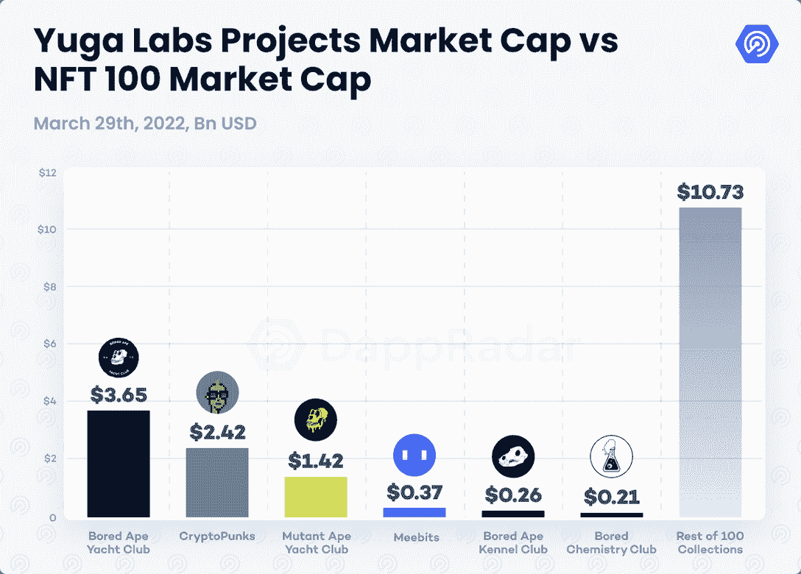
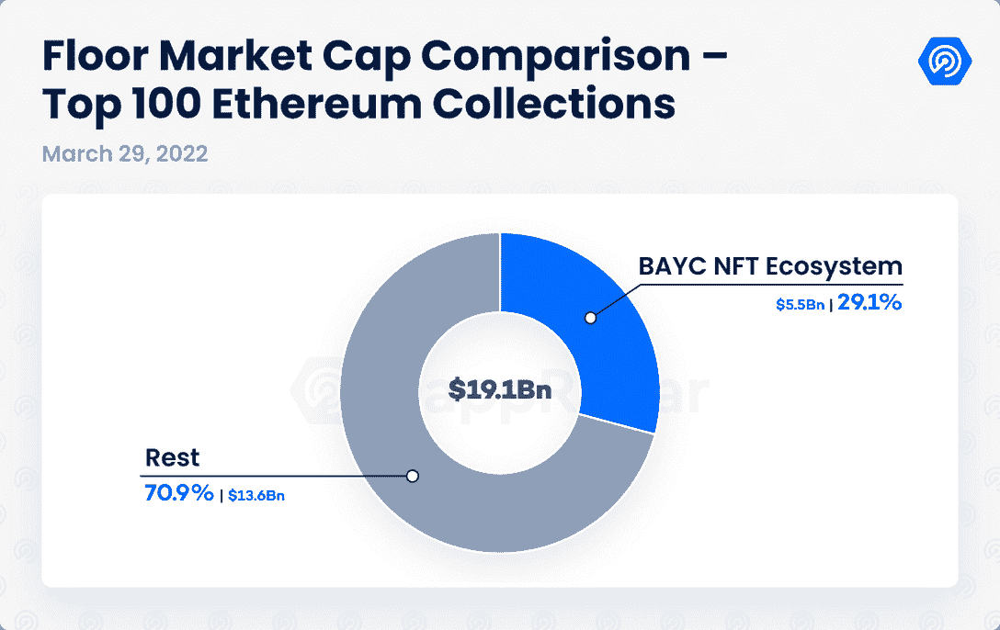
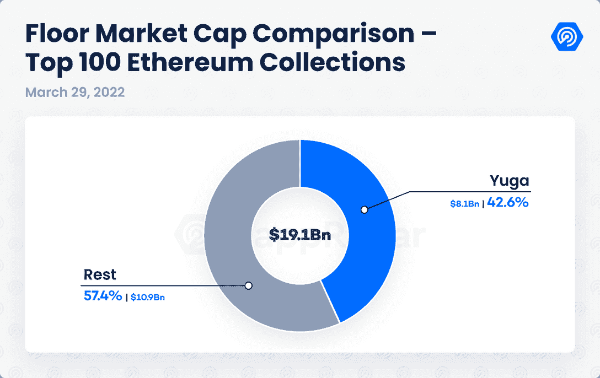
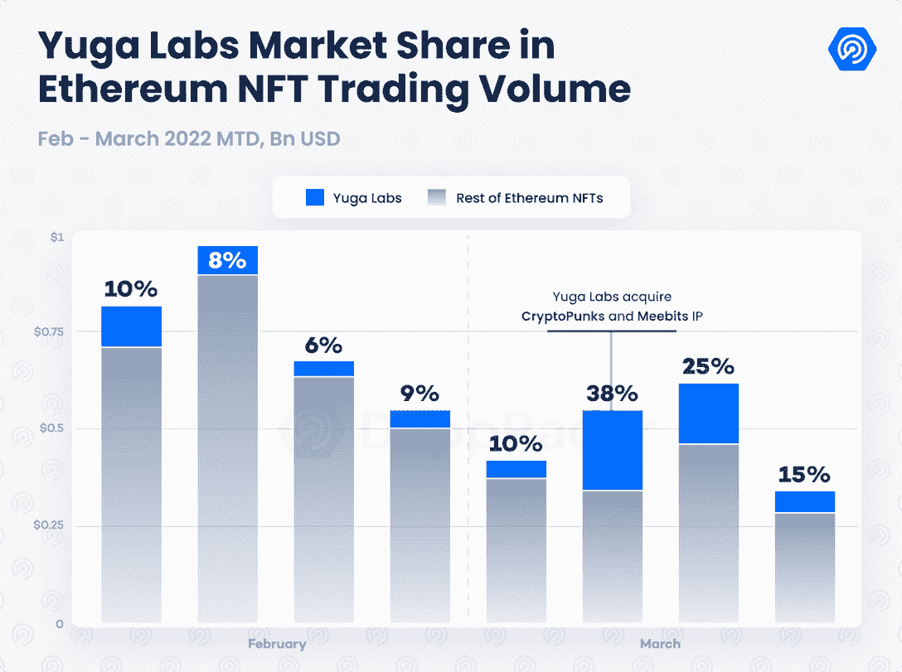
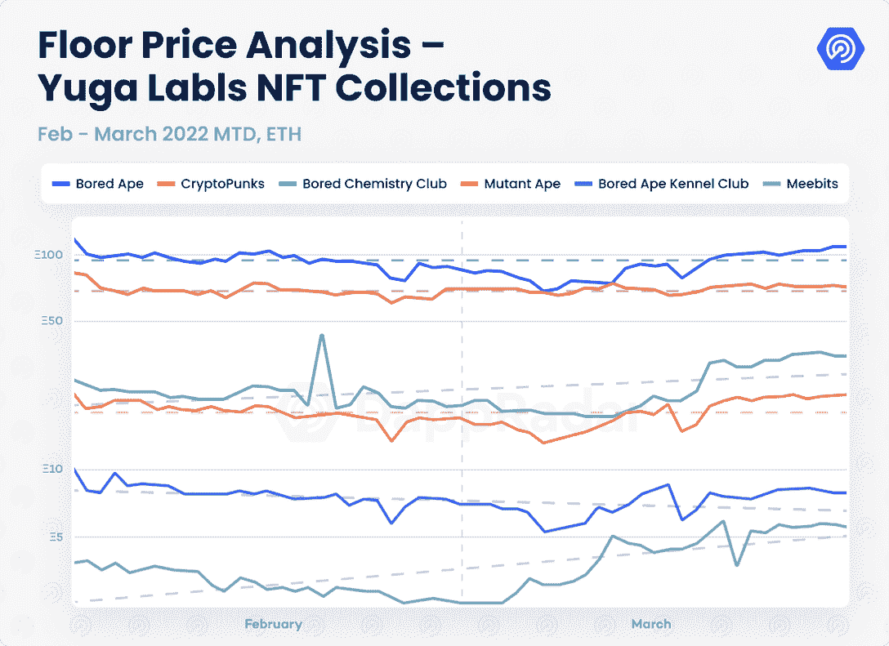
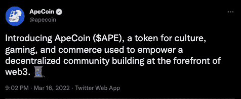
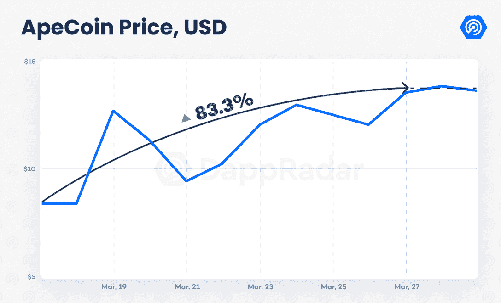
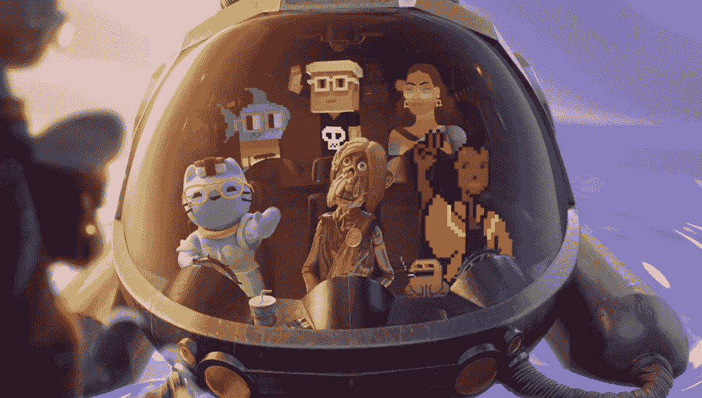

# 宇迦实验室 NFTs 如何成为市值 81 亿美元的主导力量

> 原文：<https://web.archive.org/web/https://dappradar.com/blog/how-yuga-labs-nfts-became-a-dominant-force-with-an-8-1b-market-cap>

## 宇迦实验室的六个 NFT 收藏占以太坊 NFT 市值的 43%

不到一年前，2021 年 4 月 28 日，宇迦实验室推出了 NFTs 历史上最有影响力的项目之一 [Bored Ape 游艇俱乐部](https://web.archive.org/web/20221127163819/https://dappradar.com/ethereum/collectibles/bored-ape-yacht-club) (BAYC)。与 [CryptoPunks](https://web.archive.org/web/20221127163819/https://dappradar.com/ethereum/collectibles/cryptopunks) 一起，它引领了 NFT 的大肆宣传，在 2021 年见证了创纪录的交易量。这两个项目的重要性可以说超越了区块链空间，达到了一种文化现象的地位。隐朋克和无聊猿通过知名拍卖行佳士得和苏富比成为主流，并成为社交媒体上数十位名人的头像。因此，当宇迦实验室宣布获得 CryptoPunks 和 Meebits 的知识产权时，整个密码社区陷入了狂热。

几天后，宇迦实验室在披露其元宇宙计划后再次成为头条新闻。包括备受期待的 ApeCoin，另一边是元宇宙的 BAYC 生态系统项目。宇迦实验室从推出面值 0.08 ETH 或 210 美元的 NFT 系列，发展成为领先的 Web3.0 (Web3)品牌。它目前的估值为 40 亿美元，正在构建一个充满活力的元宇宙生态系统。本报告从不同角度涵盖了宇迦实验室公告的影响。它还解释了最近这些行动对 Web3 和元宇宙前景的影响。

## 关键要点

*   宇迦实验室以 81 亿美元的总价值成为 Web3 领域的主导力量，占以太坊 100 强 NFT 收藏市值的 43%。
*   ApeCoin 通过授予 23 亿美元的市值加强了其品牌定位。
*   由安德森·霍洛维茨和 Animoca Brands 牵头的 4.5 亿美元投资以 40 亿美元的估值进一步推动了宇迦实验室的元宇宙计划。

## 目录

*   [宇迦实验室 NFT 持有 43%的 NFT 地板市值](https://web.archive.org/web/20221127163819/https://dappradar.com/blog/how-yuga-labs-nfts-became-a-dominant-force-with-an-8-1b-market-cap/#yuga)
*   [收购后 Meebits、crypto 朋克的底价上涨](https://web.archive.org/web/20221127163819/https://dappradar.com/blog/how-yuga-labs-nfts-became-a-dominant-force-with-an-8-1b-market-cap/#meebits)
*   [ApeCoin，BAYC 的经济引擎，市值接近 23 亿美元](https://web.archive.org/web/20221127163819/https://dappradar.com/blog/how-yuga-labs-nfts-became-a-dominant-force-with-an-8-1b-market-cap/#apecoin)
*   4.5 亿美元的投资提振了 BAYC 元宇宙
*   [对 Web3 空间的影响](https://web.archive.org/web/20221127163819/https://dappradar.com/blog/how-yuga-labs-nfts-became-a-dominant-force-with-an-8-1b-market-cap/#implications)

## 宇迦实验室 NFT 持有 43%的 NFT 地板市值*

在获得 CryptoPunks 和 Meebits 的知识产权之前，幼虫实验室曾拥有这些知识产权，宇迦实验室控制着整个加密领域最有影响力的名字之一:无聊猿游艇俱乐部(BAYC)。BAYC 由 10，000 名 NFT 组成，与 NFT 化身运动同义。该项目受到 NFT 社区的广泛欢迎，并很快被著名的 NFT 收藏家发现。最重要的是好莱坞、体育界和音乐界的名人。名人的高度参与赋予该系列一种类似于现实世界中奢侈品牌的独特感。

除了 10，000 只无聊的猿类，宇迦实验室的 BAYC 生态系统还包括另外三个 NFT 项目:

*   无聊的猿舍(BAKC)
*   变异猿游艇俱乐部(MAYC)
*   无聊猿化学俱乐部(BACC)

这些集合展示了宇迦实验室实现的高效用。无聊的猿猴主人免费得到了 1 万个 BAKC 和另外 1 万个变异血清(BACC)，比例为 1:1(外加汽油)。

BAYC 生态系统是整个 NFT 空间中最强大的群体之一。根据 DappRadar NFT 价值评估工具，这四件 NFT 藏品的估计市值为 55 亿美元。这一数额占前 100 名以太坊 NFT 收藏馆最低市值的 29%。

在获得了 CryptoPunks 和 Meebits 的知识产权后，宇迦实验室在 NFT 的足迹成为了主导力量。根据 [same 估值工具](https://web.archive.org/web/20221127163819/https://dappradar.com/hub/nft-value-estimator)，CryptoPunks 和 Meebits 的估计市值分别为 24.2 亿美元和 3.7 亿美元。将这两个系列纳入宇迦实验室，将该品牌 NFTs 的估计市值提升至 81 亿美元。这占以太坊 100 大 NFT 藏品 191 亿美元市值的 42.6%。

## 收购后 Meebits，CryptoPunks 的底价上涨

宇迦实验室的收购积极影响了对密码朋克和密比特的需求。在宣布收购的第二天，这两个系列的交易量[飙升了 1000%](https://web.archive.org/web/20221127163819/https://dappradar.com/blog/yuga-labs-takeover-pushes-cryptopunk-meebit-sales-1000)。

ApeCoin 的披露进一步推动了 BAYC NFTs 的市场。重要的是，空投的回报与属于该品牌的 NFT 的持有量成比例。在声明发布的那一周，宇迦实验室的 NFTs 产生了以太坊上 38%的 NFT 交易量。该项目的需求在接下来的一周仍然很高(25%)，尽管在最后几天开始降温。

同样，这些藏品的底价也经历了一段时间的波动。这两种幼虫实验室创造的价格效应是积极的，特别是对 Meebits。后者的最低售价较 2 月底上涨了 114%，目前为 5.47 ETH。CryptoPunks 的底价同期小幅上涨 3%，目前位于 71 ETH。这两个增量表明，NFT 市场认为宇迦实验室是一个品牌，能够增加更多的价值和信任的几个已经领先的集合。

BAYC NFTs 没有从宇迦实验室的收购中获得特别的好处，尽管 MAYC 看到了价值的上升。MAYC 的底价达到了 22.45 瑞士法郎，比上月上涨了 28%。MAYC 曾经是 BAYC 生态系统的较低入口点。现在这个头衔属于狗舍。

## ApeCoin 是 BAYC 的经济引擎，市值接近 23 亿美元

为了给高度宣传的 NFT 收购案增加更多的宣传，宇迦实验室透露了它的元宇宙计划。这包括推出备受期待的 ApeCoin (APE)。APE 是一个 ERC-20 令牌，将作为 BAYC 生态系统的本地公用事业和治理货币——宇迦实验室元宇宙路线图的支柱。

**Source**: [Twitter](https://web.archive.org/web/20221127163819/https://twitter.com/apecoin/status/1504201556165644298])

APE 将推动 BAYC 元宇宙内的所有经济活动，预计包括游戏、体验和可穿戴设备。此外，ApeCoin 将被整合到其他平台，如 Animoca Brands 开发的游戏“Benji Bananas”和另一个游戏平台 nWayPlay。甚至现实生活中的企业也已经[将 ApeCoin 整合到他们的支付模式中](https://web.archive.org/web/20221127163819/https://twitter.com/SaltWaterBrewer/status/1504219856391991298)，鼓励使用这种货币。

值得注意的是，宇迦实验室并不监督 APE。相反，ApeCoin DAO 管理这种加密货币。这是一个由 Ape 基金会支持的分权实体，Ape 基金会是宇迦实验室位于开曼群岛的法律实体。

APE 将允许令牌持有者对治理事件进行投票，以塑造生态系统的未来。此外，根据 ApeCoin DAO 的说法，该令牌有望获得进一步的效用。这些措施包括授予访问独家 BAYC 元宇宙的经验或额外的空投。

截至发稿时， [90%的猿类已被符合条件的钱包认领。自上市以来，APE 的价格上涨了约 83%，市值达到 25 亿美元。因此，它成为排名第 62 位的最大加密货币。](https://web.archive.org/web/20221127163819/https://dune.xyz/hildobby/APE-Airdrop)

## 4.5 亿美元的投资促进了元宇宙湾泳滩的发展

3 月 22 日，宇迦实验室的计划锦上添花。该团队宣布由 a16z 牵头的 4.5 亿美元投资，使宇迦的估值达到 40 亿美元。这项投资还带来了与 Web3 领域知名企业的重要伙伴关系和合作。这些品牌包括 Animoca Brands、沙盒、FTX 和比特币基地。BAYC 背后的团队将依靠更多的资本继续建设彼岸——其雄心勃勃的互操作元宇宙项目。Otherside 预计将涉及游戏赚取，时尚计划和媒体平台。

预计《彼岸》将会有一个虚拟世界。虽然该团队尚未透露具体的计划，但预计将有大约 100，000 个虚拟包裹。大约 40%将空投给任何 BAYC 生态系统 NFT 的持有者。其余的将向公众开放。硬币将会推动这个元宇宙，所有迹象都指向这种货币成为购买这些土地的手段。

此外，宇迦实验室的虚拟世界戏弄了互操作性，来自不同项目的图像，如 Cool Cats，WoW，CrypToadz，以及在看起来像是穿过另一边的宇宙飞船中看到的名词。如果 Otherside 有效地启动，BAYC 社区将进一步扩大。

此外，值得注意的是，Animoca Brands 正在支持宇迦实验室开展一项了解你的客户(KYC)进程，这是人们加入元宇宙项目所必需的。随着加密领域对法规的需求与日俱增，有趣的是看到两个最著名的品牌在这种性质的过程中合作。

总而言之，虚拟土地在彼岸的价值还远未确立。然而，如果 1 ETH mint 的价格被公众确认，宇迦实验室将为他们已经垂涎的资产群增加一个 3 亿美元的虚拟世界。

## 元宇宙/Web3 地景中的地震含义

宇迦实验室成功地将自己定位为本土 Web3 品牌之一，在新生的加密行业中处于领先地位。从 NFT 的角度来看，收购 cyrtop 朋克和 Meebits IP 确保了他们作为该领域顶级项目的地位，该领域目前占据以太坊前 100 大系列 191 亿美元市值的 43%。没有其他球队或品牌接近这一水平。

他们的战略路线图包含雄心勃勃的元宇宙计划，并确认该团队了解分散化、互操作性、文化、社区和收入流的需求。Otherside 预计将成为一个可互操作的游戏元宇宙平台，能够托管一个由 ape 驱动的底层经济的整体景观。

此外，由 a16z 牵头的投资，涉及其他领先品牌，如 Animoca Brands、沙盒和 FTX，为宇迦实验室元宇宙和整个区块链空间描绘了一个乐观的场景。自诞生以来，BAYC 已经成为一种文化现象，吸引了许多名人，如内马尔、T2、帕丽斯·希尔顿和 T4·贾斯汀比伯，甚至出现在滚石乐队的封面上。另一方面，宇迦实验室将为密码社区提供另一个机会，成为他们梦寐以求的生态系统的一部分。这一场景可能有助于弥合主流和网络 3 元宇宙之间的差距。

**以太坊 NFT 系列 100 强的场内市值*

 NewsletterUnsubscribe at any time. [T&Cs](https://web.archive.org/web/20221127163819/https://dappradar.com/terms) and [Privacy Policy](https://web.archive.org/web/20221127163819/https://dappradar.com/privacy-policy)