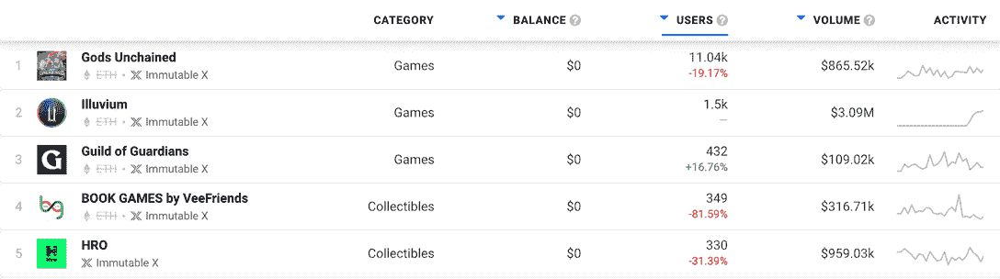
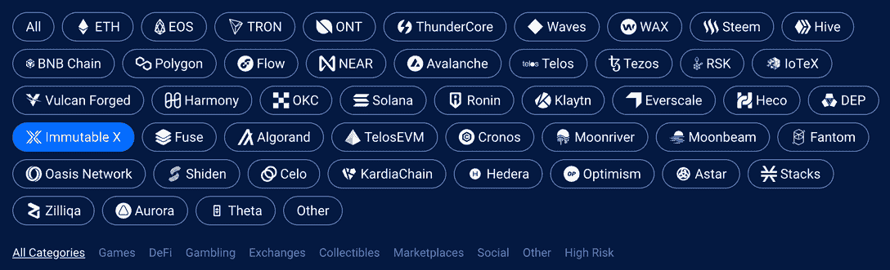

# Immutable X 计划为 NFTs 和游戏开发商投资 5 亿美元

> 原文：<https://web.archive.org/web/https://dappradar.com/blog/immutable-x-plans-500-million-fund-for-nfts-and-game-developers>

## 不可变的 X 旨在吸引更多的构建者到它的平台上

第二层解决方案 Immutable X 背后的公司 Immutable，上周宣布为开发者提供 5 亿美元的新基金。总部位于澳大利亚的 web3 游戏公司上周告诉世界，它希望成为区块链游戏革命的中心。为此，它将与游戏和 NFT 开发商合作，在未来两到四年内投入 5 亿美元资金。

*   这个 5 亿美元的基金旨在促进开发者对网络的采用，并为已经在使用它的优秀游戏和平台增添新的内容。
*   [***不可变 X 是一个 2 层缩放方案***](https://web.archive.org/web/20221208103024/https://dappradar.com/rankings/protocol/immutablex) ***为以太坊，托管游戏如*** [***诸神被解放***](https://web.archive.org/web/20221208103024/https://dappradar.com/immutablex/games/gods-unchained)*[***淤积***](https://web.archive.org/web/20221208103024/https://dappradar.com/immutablex/games/illuvium) ***和*** [***守护者公会***](https://web.archive.org/web/20221208103024/https://dappradar.com/immutablex/games/guild-of-guardians)*

 *在熊市中建仓。俗话就是这么说的。Immutable X 似乎坚持这一准则，因为它最近宣布了一项 5 亿美元的基金计划。

该基金旨在支持区块链的游戏和非功能性游戏的发展。你可以使用 DappRadar 的 dapp 排名页面查看哪些游戏和 NFT 使用了[不可变 X 网络。](https://web.archive.org/web/20221208103024/https://dappradar.com/rankings/protocol/immutablex)

## 不可改变的 5 亿美元发展基金

不可变 X 层扩展解决方案背后的公司 Immutable 上周宣布，它计划创建开发基金。目标是用资源和建议支持 web3 开发者的成长。

最终，Immutable 希望工作室和创作者在 Immutable X 上开发他们的内容。但是，即使通过支持那些没有与网络形成终身合作关系的开发者，Immutable 也会通过帮助整个游戏行业的发展而受益。

Immutable Ventures 的联合创始人兼总裁 Robbie Ferguson 说:“Immutable Ventures 将瞄准致力于我们不断增长的数字生态系统的 NFT 项目，因为我们知道这一领域的巨大潜力才刚刚开始。”。

弗格森预计，游戏产业在几年内将保持这样的增长速度，假设电影、电视节目和音乐与游戏平台相结合，它的价值可能超过 1 万亿美元。

这听起来像是元宇宙模式，尽管目前密码价格下降，但这种模式仍在获得牵引力。

总的潜在市场将是巨大的，远远超过今天的游戏——仅游戏内物品一项就有 1000 亿美元的产业。

参与该基金的其他公司包括:Animoca Brands、BITKRAFT Ventures、T2、GameStop、AirTree、Arrington Capital、Double Peak 和 King River Capital。

## 不可变 X 的 DappRadar 排序

为了亲自了解游戏和平台在不变的 X 上的表现， [DappRadar 的排名页面](https://web.archive.org/web/20221208103024/https://dappradar.com/rankings/protocol/immutablex)显示了用户数量和通过 dapps 智能合约流动的资金数量。

查看 30 天的视图可以了解有多少人访问这些 dapps，以及他们在上面花了多少钱。所以我们已经可以看到，不可变 X 是一个严肃的玩家，有一个很大的社区。

[DappRadar’s rankings for dapps on Immutable X over 30 days](https://web.archive.org/web/20221208103024/https://dappradar.com/rankings/protocol/immutablex)

[Illuvium](https://web.archive.org/web/20221208103024/https://dappradar.com/immutablex/games/illuvium) 是一款收集和战斗游戏，于 2021 年第三季度从以太坊主网转移到不可变 X。在过去的 30 天里，通过该游戏的智能合约进行的交易总额达到了 309 万美元。

另一款热门游戏《被解放的神》在过去一个月吸引了超过 11，000 名用户，并在此期间通过其智能合同处理了 865，520 美元。

DappRadar 拥有信息的不仅仅是不可变的 X 网络。我们收集了 40 多种区块链和第 2 层解决方案的链上数据。总之，我们已经在我们的平台上集成了 11，357 个 dapps。

[DappRadar’s data can be broken down by individual blockchain](https://web.archive.org/web/20221208103024/https://dappradar.com/rankings)

每天，我们都在为用户添加更多的 dapps、更多的数据和更多的实用程序。今天你就可以成为 DappRadar PRO 的会员，这样你就可以使用更详细的搜索选项、过滤器和数据点。您还可以阅读来自我们研究团队的独家分析报告，并通过我们的 [Discord](https://web.archive.org/web/20221208103024/https://discord.com/invite/4ybbssrHkm) 频道访问每个 DappRadar 信号。

在我们的 DappRadar 文档中阅读更多关于 DappRadar PRO 的信息。*