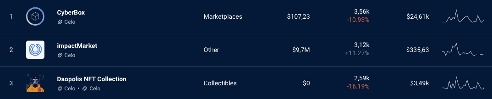
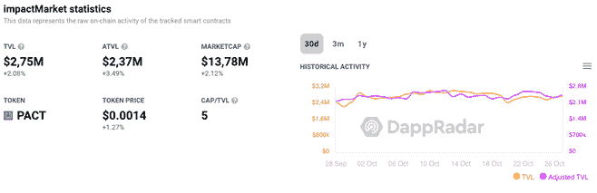
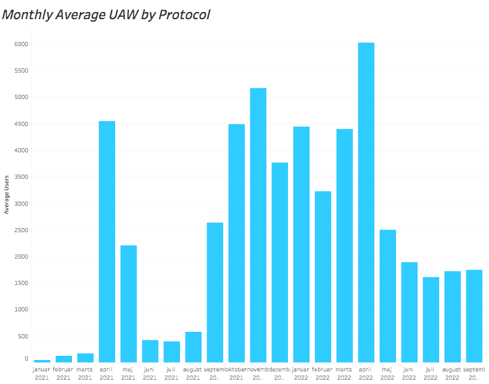

# ImpactMarket UBI 平台使 ATVL 增加了 200 多万美元

> 原文：<https://web.archive.org/web/https://dappradar.com/blog/impactmarket-ubi-platform-increases-atvl-by-over-2-million>

## ImpactMarket 是 Celo 的主要慈善平台之一

**领先的 Celo Network dapp ImpactMarket 在过去 7 天内为其平台吸引了 11.27 %的独立活跃钱包。DeFi UBI dapp 正在争夺第一名** **CyberBox，大提琴 NFT 市场** **。它还将道波利斯 NFT 系列挤到了第三位。但是是什么推动了这种激增呢？让我们揭开数据背后的故事。**

## 内容

*   [什么是 ImpactMarket？](https://web.archive.org/web/20221210121036/https://dappradar.com/blog/impactmarket-ubi-platform-increases-atvl-by-over-2-million/#What-is-ImpactMarket?-)
*   [为什么要使用 ImpactMarket，它是如何工作的？](https://web.archive.org/web/20221210121036/https://dappradar.com/blog/impactmarket-ubi-platform-increases-atvl-by-over-2-million/#Why-use-ImpactMarket-and-how-does-it-work?-)
*   [钱从哪里来？](https://web.archive.org/web/20221210121036/https://dappradar.com/blog/impactmarket-ubi-platform-increases-atvl-by-over-2-million/#Where-does-the-money-come-from?)
*   Celo 有什么特别之处？
*   是什么推动了冲击市场的激增？

## 什么是 ImpactMarket？

ImpactMarket 是 Celo 的主要慈善平台之一，为 Celo 的 stablecoin 在现实世界中提供了更多的使用案例。人道主义区块链充当这个 dapp 的支付基础设施。

[Check ImpactMarket](https://web.archive.org/web/20221210121036/https://dappradar.com/celo/other/impactmarket)

这是一个开放、免费的众筹基础设施，由社区驱动，通过 DeFi 采用自下而上的经济发展促进社会变革和金融包容性，从而帮助当地贫困社区。

使用 DappRadar 的排名工具，我们可以看到，这个基于 Celo 的 dapp 在过去 7 天内吸引了 11.27 %的独特活跃钱包到其平台，并在过去一个月内增加了超过 2%的 TVL(锁定的总价值)。

[Check Dapps on Celo](https://web.archive.org/web/20221210121036/https://dappradar.com/rankings/protocol/celo)

## 为什么要使用 ImpactMarket，它是如何工作的？

该项目旨在帮助 Covid19 后处于极端贫困中的弱势人群，以便没有人被落下，任何受影响的社区都可以获得资金并拥有自己的无条件基本收入(UBI)。

有了 UBI，每一个受益人都会经常收到一笔固定金额的钱，以便在恶劣的条件下生存下来并提高自己。它与以太坊和 Fuse 区块链上另一个流行的 dapp 有着共同的特征: [GoodDollar](https://web.archive.org/web/20221210121036/https://dappradar.com/multichain/defi/gooddollar-1) 。

在 ImpactMarket 生态系统中有 4 个基本角色，它们相互支持以推动项目的成功:

### 社区经理

这是提交和管理社区及其受益人的人。

### 受益人

这些是将访问 UBI 的社区成员。

### 捐赠者

这些人推动了 ImpactMarket 的发展，帮助有需要的社区。

### 商人

向社区受益人出售基本商品和服务以换取 cUSD，Celo s stablecoin 的企业。

## 钱从哪里来？

ImpactMarket 背后的团队提供有影响力的解决方案，如无条件基本收入(UBI)和治理 DAO token: PACT，推动对技术和基本需求的获取。

这些资金来自各种慈善基金会和赠款、支持可持续发展目标的公司、使命一致的 Web3 合作伙伴、非政府组织以及个人捐赠和众筹活动。

## Celo 有什么特别之处？

Celo 旨在为发展中国家的手机用户提供加密支付服务。Celo 背后的团队旨在成为 DeFi 的 WhatsApp，为所有人开启繁荣，并让许多被金融排斥的个人加入进来。

ImpactMarket 是 Celo 的主要慈善平台之一，为 Celo 的 stablecoin 在现实世界中提供了更多的使用案例。人道主义的区块链充当支付基础设施。

仅仅四年时间，Celo 已经在加密领域掀起了波澜。尽管在 TVL 和交易量方面落后于竞争对手，但它有效地稳步吸引了用户。

下图显示了 Celo 在过去三个月中累计 5065 次 UAW 连接到其智能合约。

相比之下，Celo 去年同期累计 UAW 数量为 3064 辆。

## 是什么推动了冲击市场的激增？

ImpactMarket 通过在巴西、委内瑞拉、巴拉圭、乌拉圭和尼日利亚等不同大洲开展有影响力的社区项目，稳步扩大了用户群。

最近，该团队在尼日利亚加倍努力，扩大合作伙伴关系，并以无条件基本收入(UBI)支持马里的 6 个新社区。此外，这种 dapp 的增长也与 Celo 的扩张有关。

我们还可以预计，移动设备用户数量越多，Celo 的成功率就可能越高。例如，根据西非国家通信委员会(NCC)的数据，截至 2022 年 3 月，尼日利亚拥有 1.996 亿移动连接。预计到 2025 年，这一数字将大幅增长。

## 随身携带您的 Web3 之旅

使用 DappRadar 移动应用程序，再也不会错过 Web3。查看最受欢迎的 dapps 的性能，并关注您投资组合中的 NFT。您在 DappRadar 上的帐户会与我们的移动应用程序同步，这样您很快就可以选择实时接收提醒。

[Download the DappRadar app now](https://web.archive.org/web/20221210121036/https://dappradar.app.link/blog)[<picture></picture>](https://web.archive.org/web/20221210121036/https://play.google.com/store/apps/details?id=com.portfolio.dappradar)