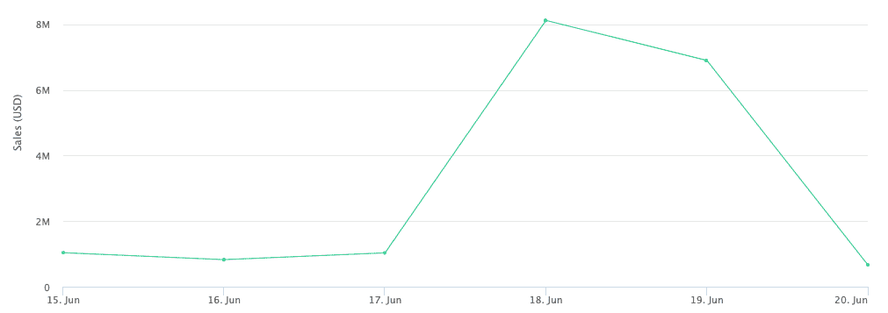

# CryptoPunks 的内幕交易？

> 原文：<https://web.archive.org/web/https://dappradar.com/blog/insider-trading-at-cryptopunks>

## 就在重大消息发布前，销量飙升了 779%

在宇迦实验室宣布任命 Noah Davis 为 NFT 系列品牌负责人的前一天，CryptoPunks 的交易量一夜之间飙升了 779%。戴维斯从佳士得加入该项目，自 2020 年以来，他一直是该拍卖行的数字销售主管。

**总结**

*   6 月 18 日，***[crypto 朋克](https://web.archive.org/web/20220705004116/https://dappradar.com/ethereum/collectibles/cryptopunks)交易量增长了近 8 倍，达到 8120614 美元。***
*   ***6 月 19 日晚些时候，前佳士得数字销售主管诺亚·戴维斯(Noah Davis)在推特上宣布，他将加入 CryptoPunks，担任品牌负责人。***
*   在对明目张胆但合法的内幕交易的指责中，人们想知道会出台什么样的法规来遏制那些利用互联网的人。

还有人注意到了周末期间加密朋克的交易量激增吗？如果你错过了新闻，这里有一个快速回顾:

*   密码朋克的交易量上升了 779%。

*   以美元计算，销售额从 6 月 17 日的 1，032，567 美元增长到 6 月 18 日的 8，120，614 美元。

*   同期，独立买家从 16 个增加到 72 个。

*   总交易量猛增了 619%，从 16 笔增加到 115 笔。

*在 DappRadar 的* [*NFT 探索者*](https://web.archive.org/web/20220705004116/https://dappradar.com/hub/nft-explorer) *上查看* [*隐朋克*](https://web.archive.org/web/20220705004116/https://dappradar.com/hub/nft-explorer/collection/cryptopunks) *，亲自看看该系列的表现如何。*

所有这些增长都发生在诺亚·戴维斯在推特上宣布他将离开佳士得拍卖行成为 CryptoPunks 的品牌领导者的 24 小时之前。

> 我很谦卑也很荣幸地宣布，我将于 7 月离开目前的职位，在 [@yugalabs](https://web.archive.org/web/20220705004116/https://twitter.com/yugalabs?ref_src=twsrc%5Etfw) 的保护伞下管理 CryptoPunks 作为品牌领导。在我说任何事情之前，重要的是确认我们不会做什么…简单地说:我不会和 Punks 打交道… 🧵👇🏻
> 
> — Noah (@NonFungibleNoah) [June 19, 2022](https://web.archive.org/web/20220705004116/https://twitter.com/NonFungibleNoah/status/1538584141419143168?ref_src=twsrc%5Etfw)

Source: Twitter

那么，谁知道宇迦实验室带来了一个新的品牌领导，并决定在新闻成为头条新闻之前囤积 NFTs 呢？其次，这是不是内幕交易，这不是违法的吗？

## 这算不算内幕交易？

6 月 18 日，CryptoPunks 迎来了 2022 年交易量最大的一天。价值 8,369 ETH(当时 8120615 美元)的密码朋克易手。这是一个重大的飞跃，尤其是在当前的熊市中。

Source: [Cryptoslam](https://web.archive.org/web/20220705004116/https://cryptoslam.io/cryptopunks/sales/summary/?month=2022-06)

除非这是一个巨大的巧合，似乎一些领先者在官方宣布之前就知道了戴维斯的行动。在任何其他行业，这都是内幕交易，美国证券交易委员会(sec)将对电子邮件、不和谐信息和私人信息进行彻底调查。

但是在 NFT 的世界里，政府监管者还没有完全弄清楚如何对区块链的资产进行分类，像 T2 的 crypto 朋克 T3 这样的集合基本上是不受监管的。

这意味着，当人们听到关于蓝筹股 NFT 集合品牌新负责人的传言时，没有法律禁止利用这一知识获利。

## 区块链侦探揭露密码朋克买家

Twitter 上的一名用户认为，尽管没有人做任何违法的事情，但应该曝光购买朋克的人。

首先， [Wazz Crypto](https://web.archive.org/web/20220705004116/https://twitter.com/WazzCrypto/status/1538674488283238405) 制作了一份 6 月 17 日至 6 月 19 日之间的顶级朋克买家名单。不出所料，[小混混场外](https://web.archive.org/web/20220705004116/https://twitter.com/punksOTC)名列榜首。朋克 OTC 是定期买卖朋克的交易台。

> 3/
> 从 6 月 17 日到 19 日，这些是顶级朋克买家
> 
> 第一地址是[@ punkstoc](https://web.archive.org/web/20220705004116/https://twitter.com/punksOTC?ref_src=twsrc%5Etfw)punkstoc . eth
> 出现在顶部是正常的，因为很多朋克显然是通过他们移动的
> 
> 0x83c8f 是 [@gemxyz](https://web.archive.org/web/20220705004116/https://twitter.com/gemxyz?ref_src=twsrc%5Etfw) 合同[pic.twitter.com/qMs53AAIq7](https://web.archive.org/web/20220705004116/https://t.co/qMs53AAIq7)
> 
> — Wazz (@WazzCrypto) [June 20, 2022](https://web.archive.org/web/20220705004116/https://twitter.com/WazzCrypto/status/1538674503294676992?ref_src=twsrc%5Etfw)