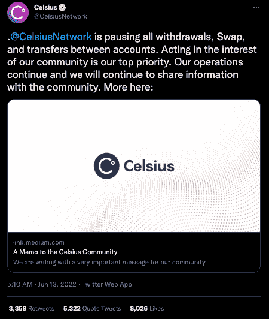
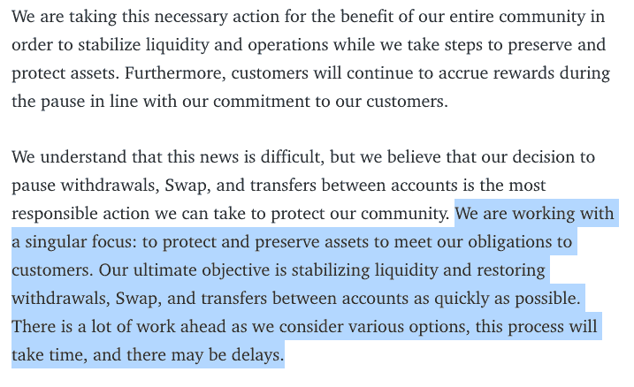
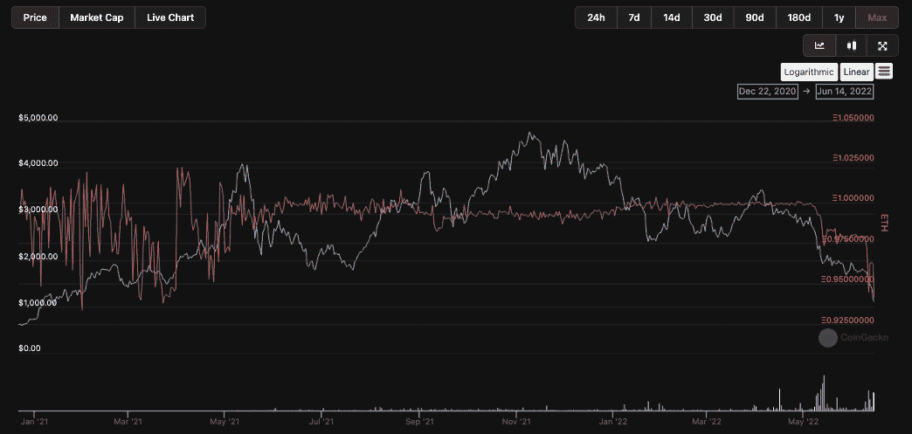
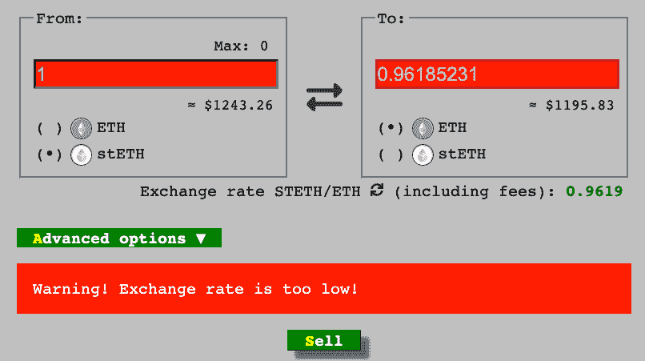
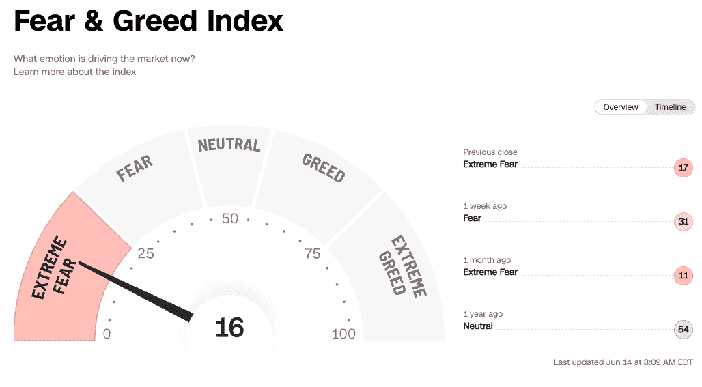
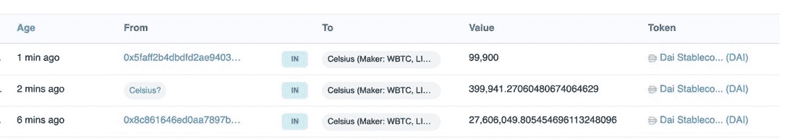

# 随着摄氏零度将顾客拒之门外，资不抵债迫在眉睫

> 原文：<https://web.archive.org/web/https://dappradar.com/blog/insolvency-looms-as-celsius-freezes-customers-out>

## 随着市场收缩，政府采取了严厉的措施

领先的加密交易所 Celsius 于 6 月 13 日暂停了其 DeFi 网络上的所有交易和取款，随着加密市场在上周末再次暴跌，锁定了约 120 亿美元的客户资金。有争议的是，Celsius 在其使用条款中触发了一项条款，允许这一过程无需任何客户咨询即可进行，并且没有给出重新激活的时间表。

此举正值过去几天来[秘密市场](https://web.archive.org/web/20220930133749/https://dappradar.com/hub/tokens/ethereum/all/1)进一步陷入萧条之际。在过去的七天里，ETH 下跌超过 36%,而 BTC 下跌了 28%。与此同时，其他资产，如无聊猿游艇俱乐部元宇宙的令牌，APECOIN，以及 DeFi 和贷款巨头 Aave 的 AAVE，在写作时都下降了 43%以上。另一方面，许多 [DeFi 和交易所 dapp](https://web.archive.org/web/20220930133749/https://dappradar.com/rankings/protocol/ethereum)增加了他们的用户数量，因为投资者开始在大甩卖中采取行动[。](/web/20220930133749/https://dappradar.com/blog/the-ultimate-crypto-bear-market-2022-survival-guide/)

*[使用令牌浏览器](https://web.archive.org/web/20220930133749/https://dappradar.com/hub/tokens/ethereum/all/1)* 探索加密市场

通过该平台的官方 Twitter 账户发布的一条推文宣布了这个坏消息，这从根本上使客户陷入困境，无法转移资金。这条推文的速度很快，评论并没有称赞这个筹集了 8.64 亿美元风险资本并一度为超过 100 万客户持有超过 280 亿美元资金的交易所。

## 什么是摄氏度？

Celsius 的运营方式类似于集中式金融巨头 Vanguard，因为它们提供交易所交易基金(ETF ),但提供分散式融资机会。Celsius 收取费用，为客户提供一篮子密码，而不会让用户面临自我保管的困难和风险。此外，Celsius 还为用户提供代币掉期和交易、稳定硬币和加密货币的高收益存款，以及[加密支持的贷款服务](/web/20220930133749/https://dappradar.com/blog/top-5-best-passive-income-opportunities-in-crypto/)。

与 ETF 提供商一样，Celsius 不提供基础头寸的直接敞口。他们承诺，如果用户想退出头寸，就可以提款，但 Celsius 最终代表投资者管理头寸。

## 摄氏温度出了什么问题？

给社区的官方信函在细节上相对较少。相反，它引用了困难的市场条件，并表示他们正在以用户的最佳利益和安全为主要驱动力，暂停所有取款、令牌交换和帐户之间的转账，没有重新激活的时间表。

从表面上看，Celsius 出售的是高收益的承诺，以及受监管的菲亚特 onramp 和针对富裕用户的奖金功能。类似于 Crypto.com 和 Nexo，这些服务正是新进入加密领域的人所寻找的，而 Celcius 也取得了成功。

## stETH 的问题

在最近的特拉 UST 大溃败之后，所有的目光都锁定在稳定的竞争上。当、戴和等领导人仍然保持强势并与美元挂钩时，其他人感受到了压力。Celsius 大量参与了由[利多金融](https://web.archive.org/web/20220930133749/https://dappradar.com/ethereum/defi/lido)为盯住 ETH 而建的创新型 stablecoin，称为 stETH。

Staked Ether 或 stETH 是一种以 1:1 的价值与 ETH 挂钩的加密货币。即，它们应该被钉在一起并且具有相似的一致值。偏离有[个看似合理的原因，但这些并不是常态。stETH 代表 Ethereum 2.0 信标链上锁定的 ETH，并作为抵押品在 DeFi 平台上借用更多 ETH。](https://web.archive.org/web/20220930133749/https://twitter.com/ChainLinkGod/status/1535486872004071424)

正如你在下面看到的，stETH 已经很久没有保持它的钉住汇率了，这是一个值得关注的原因。此外，stETH 的高收益也是有代价的。虽然它可以在公开市场上交易为 ETH，但它不能兑换为 ETH，直到 [beacon 链合并发生](/web/20220930133749/https://dappradar.com/blog/what-is-the-ethereum-merge/)并且以太坊经历一个硬分叉。Celsius 坐拥大量 stETH，至少在分叉后六个月才能赎回，[尚未发生](/web/20220930133749/https://dappradar.com/blog/what-is-the-ethereum-merge/)。一场完美的风暴正在酝酿，而 Celsius 需要行动了。

由于 stETH 的稳定性存在很大的疑问，Celsius 坐拥 stETH 的 44.5 万英镑，即超过 5 亿美元，这并不好，特别是因为 stETH/ETH 曲线池中只有 14.3 万英镑的 ETH 流动性。

另一个问题是，Celcius 通过像 [Aave](/web/20220930133749/https://dappradar.com/blog/aave-v3-wants-to-take-defi-mainstream/) 和 [Maker](/web/20220930133749/https://dappradar.com/blog/makerdao-an-introduction-and-how-it-works/) 这样的平台使用[链上杠杆](/web/20220930133749/https://dappradar.com/blog/what-is-defi-or-decentralized-finance/)向其客户提供丰厚的回报和低利率借款，而不会让他们面临同样的风险。为了做到这一点，Celsius 通过像 MakerDAO 和 Oasis 这样的无许可链上货币市场获得杠杆。这意味着将用户的存款存入像这样的资产中，然后把它们存起来，借出戴币。

[Maker 是一个抵押贷款协议](/web/20220930133749/https://dappradar.com/blog/makerdao-an-introduction-and-how-it-works/)或者用更通俗的语言来说。用户可以存入 1 美元像 ETH 这样的不稳定资产，并借一些 DAI stablecoin。如果抵押品的价值，在这种情况下，ETH，低于清算阈值，它将被清算以偿还贷款和防止坏账。如果 Celsius 的贷款抵押品贬值，那么 Celsius 客户的贷款抵押品也会贬值，因此他们需要清算客户的贷款并偿还自己的贷款。

简而言之，Celsius 发放了太多贷款，吸收了用户存款，并将其用于 stETH 交易。他们现在欠了一大笔钱，没有储备金支付，也不能兑现。Celsius 根本就资不抵债。

## 情况变得更糟了

Celsius 的客户现在面临着两个非常糟糕的选择。补足他们的抵押品，以挽救他们的贷款或被清算。与此同时，Celsius 在最近几天做出了决定，但他们没有偿还贷款，而是在 6 月 14 日开始补充抵押品。

Celsius 使用 Maker 作为他们的贷款人，其贷款抵押率最低为 150%。要借 1.00 美元，你必须抵押 1.50 美元。在这种情况下，Celsius 已经有大量未偿还贷款，他们可以简单地偿还，或者，第二种选择是增加抵押品，孤注一掷。

只有在贷款无法偿还的情况下，才应该采取第二种选择，因此【Celsius 选择这样做的原因。这类似于最后一次掷骰子，赌徒认为他们可以翻倍或者什么都不赌。简而言之，利用不属于他们的资金，这可能是一个非常愚蠢的举动。另一方面，它[可能被证明是天才的一笔](https://web.archive.org/web/20220930133749/https://twitter.com/hsakatrades/status/1536724496404684800?s=21&t=qBa7YjaeSeGzcUcGdWPQuQ)。

随着这一不寻常举动的消息传出，随着投资者和市场受到惊吓，ETH 和 BTC 的价格相应下跌。此外，BTC 和瑞士联邦理工学院不断下跌的价格意味着现在持有的资本更少了。[秃鹫很快与竞争对手平台 NEXO 和 Almeda Research 合作，提出收购资产，以挽救几个月后的另一场加密灾难。](https://web.archive.org/web/20220930133749/https://twitter.com/Nexo/status/1536256598993211393)

另据报道，Celsius 在冻结账户前几小时将价值 3 . 2 亿美元的密码转移到了 FTX 交易所。该小组从 Aave 拆分了数亿美元的密码，并将其转移到 FTX。在写作时，该项目还没有提供一个原因，但隐密体陪审团已经出来了。

链上数据显示，在过去的几天里，Celsius 向 FTX 发送了超过 10 万份 ETH，向 WBTC 发送了 9500 份 ETH。然而，赌注和贷款平台也向交易所转移了其他代币，包括 FTT、马蒂奇、尤尼、USDP 和 TUSD。总的来说，现在汇款总额约为 3.2 亿美元。

## 现在怎么办？

尽管采取了上述措施，但最新的进展是，在通过提高抵押品的流动性来赢得足够的时间后，Celsius 看起来最终将开始偿还债务。截至发稿时，超过 3000 万美元的贷款已经偿还，正如一位[推特观察员所说](https://web.archive.org/web/20220930133749/https://twitter.com/HsakaTrades/status/1536726309556178946)“当他们的偿付能力受到威胁时，Celsius 在工作中变得超高效，lmao。”随着事态的进一步发展，我们将继续关注并报道此事。

Celsius 是加密行业最大的贷方之一，拥有数十亿美元的资产。与此同时，在需求旺盛的强劲市场中，其商业模式运转良好。当价格急剧下跌时，整个系统变得不稳定，就像最近的情况一样。

 NewsletterUnsubscribe at any time. [T&Cs](https://web.archive.org/web/20220930133749/https://dappradar.com/terms) and [Privacy Policy](https://web.archive.org/web/20220930133749/https://dappradar.com/privacy-policy)

***以上不构成投资建议。此处给出的信息仅供参考。请行使尽职调查，做你的研究。作者持有多种加密货币的头寸，包括 BTC、瑞士法郎和雷达。***

[<picture></picture>](https://web.archive.org/web/20220930133749/https://dappradar.com/blog/what-is-a-dapp-on-the-blockchain)[<picture></picture>](https://web.archive.org/web/20220930133749/https://dappradar.com/blog/what-is-defi-or-decentralized-finance)[<picture></picture>](https://web.archive.org/web/20220930133749/https://dappradar.com/rankings)